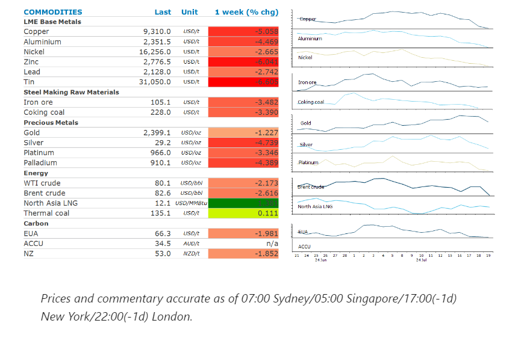
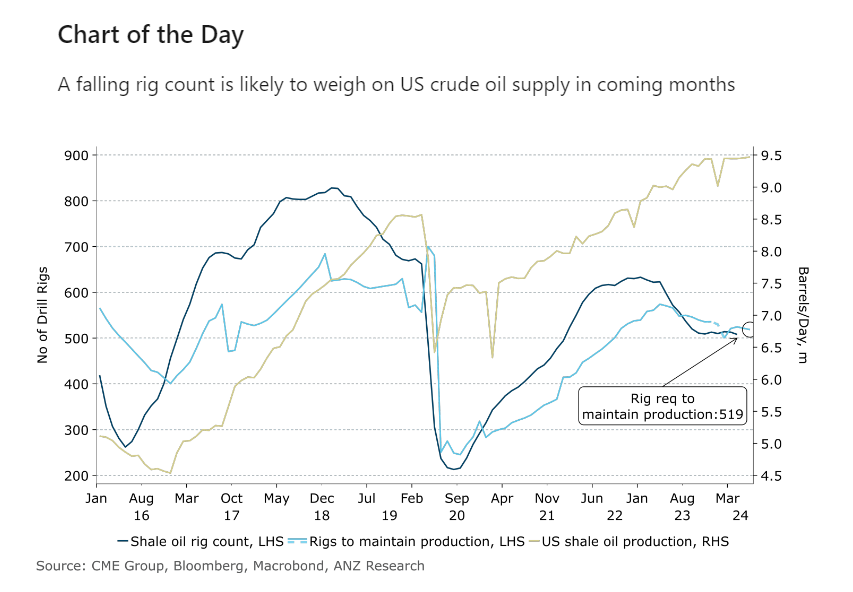

# Sentiment battered by uncertain economic backdrop

**Date:** July 22, 2024  
**Publisher:** Breakwave Advisors | **Category:** Market Insights  
**Original URL:** [https://www.breakwaveadvisors.com/insights/2024/7/22/sentiment-battered-by-uncertain-economic-backdrop](https://www.breakwaveadvisors.com/insights/2024/7/22/sentiment-battered-by-uncertain-economic-backdrop)  

---

A broader risk-off tone across markets weighed on sentiment, and was exacerbated by disappointing economic growth in China.

*By*[*Daniel Hynes*](https://www.linkedin.com/in/dahynes/)

> **Figure 1: Στιγμιότυπο Οθόνης 2024 07 22 102141**  
> **Interactive Data & Source:** [Linkedin](https://www.linkedin.com/newsletters/commodities-wrap-6692196755876012032/?fbclid=IwAR3kiXJqZdxmp9ZcRwBNI7FsBySI-XSC0pfPur1qzjt7OZp7PTE59Tsl1QI) | [Local Asset](file:///C:/Users/Dell/Github/Shipping/corpus/03-breakwave/insights/2024/assets/2024-07-22_sentiment-battered-by-uncertain-economic-backdrop_img_cea3cf84ceb9ceb3cebcceb9cf8ccf84cf85_c8018a0ac175.png)

### Market Commentary

**Copper**recorded its biggest weekly loss in two years after the market was disappointed by a lack of new policy measures in China. The Third Plenum brought together China’s leaders to map out the general direction of the country's long-term social and economic policies. But little was done to rectify weak economic growth. Sentiment hasn’t been helped by ballooning inventories. Stockpiles held in LME warehouses have more than doubled since mid-May. China’s unwrought copper exports hit a record for a second consecutive month, as weak domestic demand forces traders to rely on international markets.

**Lithium**prices in China gained amid renewed supply side issues. An earthquake struck Chile’s northern lithium mining region late Thursday, triggering power cuts, rockslides and injuries to personnel. The Latin American country holds the world's largest lithium reserves, 90% of which are in the Atacama Desert, close to the epicentre. That pared some losses earlier in the week as investors had raised bets that Trump will win the US election in November.

**Iron ore**was down 3% last week as China’s demand outlook weakened. However, this could be exacerbated by a pick-up in supply. Iron ore producers are overcoming recent supply side issues to boost exports. China continues to import large amounts of iron ore, contributing to the build-up of stocks.

**Gold**recorded its first weekly loss in a month, as investors locked-in gains following its strong run. The gold price surged to a record high of USD2,483/oz as investors ramped up bets on Fed rate cuts. This followed data showing inflation was falling faster than expected. However, ETFs backed by physical gold continue to see strong inflows, adding 87.7koz of gold to holdings on Friday alone.

**Crude oil**prices fell for a second consecutive week on a broad risk-off tone across markets. Nevertheless, short-term supply concerns minimised losses. Canadian wildfires are again threatening 400kb/d of oil production. Several major Russian commodity exporters say trade with China is increasingly difficult as direct payments made in CNY are being frozen or delayed. This comes ahead of a meeting of OPEC’s monitoring committee, which will review the progress of the supply agreement between it and OPEC allies made earlier this year. Russia is also yet to outline its plan to reduce output to make up for overproducing under the current agreement.

**European gas**prices pared some of the week’s gains as traders assessed the impact of supply risks. There are growing concerns about deliveries from the Freeport LNG export terminal as it struggles to restart following Hurricane Beryl. North Asia LNG prices remained elevated amid strong demand, as a heatwave boosts cooling requirements. Supply tightness is also evident. Egypt’s gas output has dropped to its lowest level in six years.

> **Figure 2: Cea3cf84ceb9ceb3cebcceb9cf8ccf84cf85**  
> **Interactive Data & Source:** [Linkedin](https://www.linkedin.com/newsletters/commodities-wrap-6692196755876012032/?fbclid=IwAR3kiXJqZdxmp9ZcRwBNI7FsBySI-XSC0pfPur1qzjt7OZp7PTE59Tsl1QI) | [Local Asset](file:///C:/Users/Dell/Github/Shipping/corpus/03-breakwave/insights/2024/assets/2024-07-22_sentiment-battered-by-uncertain-economic-backdrop_img_cea3cf84ceb9ceb3cebcceb9cf8ccf84cf85_5abed0bb83a2.png)

Data source:[Commodities Wrap](https://www.linkedin.com/newsletters/commodities-wrap-6692196755876012032/?fbclid=IwAR3kiXJqZdxmp9ZcRwBNI7FsBySI-XSC0pfPur1qzjt7OZp7PTE59Tsl1QI)

---

**Tags:** Commodities, Economy, Shipping  
