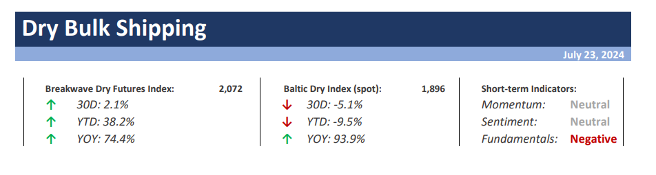
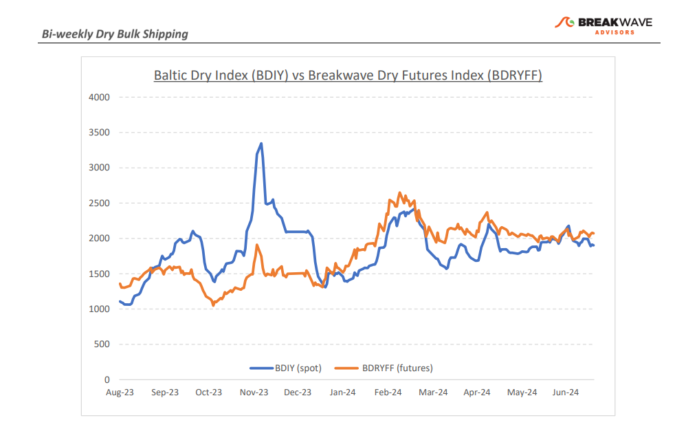
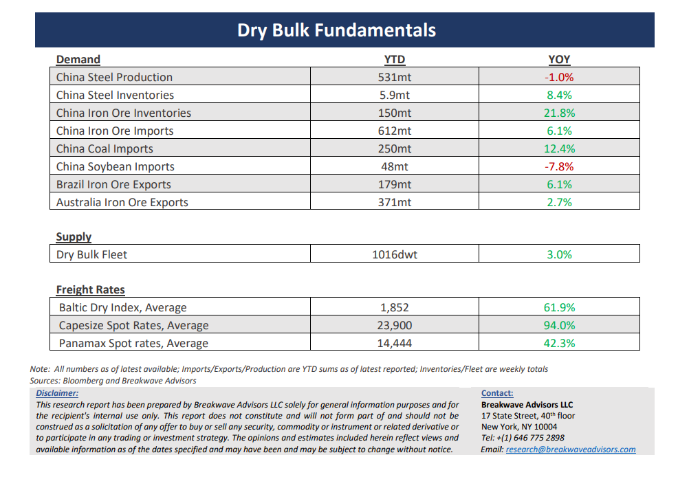

# Breakwave Bi-Weekly Dry Bulk Report - July 23, 2024

**Date:** July 23, 2024  
**Publisher:** Breakwave Advisors | **Category:** Market Insights  
**Original URL:** [https://www.breakwaveadvisors.com/insights/2024625dry-87w458](https://www.breakwaveadvisors.com/insights/2024625dry-87w458)  

---

> **Figure 1: Cea3cf84ceb9ceb3cebcceb9cf8ccf84cf85**  
> [Local Asset](file:///C:/Users/Dell/Github/Shipping/corpus/03-breakwave/insights/2024/assets/2024-07-23_2024625dry-87w458_img_cea3cf84ceb9ceb3cebcceb9cf8ccf84cf85_8270a4a8f315.png)

**·Freight Futures Volatility Collapses to Record Lows as Spot Rates Remain Rangebound**– The highly volatile dry bulk freight market has been in**a deep summer hibernation**for the past two months with freight futures volatility recently hitting record lows. It is highly unusual to experience such a rather**stable market**for dry bulk rates, a market that historically has demonstrated significant**idiosyncratic instability**reflecting the unique regional and temporary imbalances of supply and demand for vessels. And yet, for the past two months, both spot rates as well as freight futures have remained in a tight range with little indication of breaking out either way anytime soon. Although we suspect the**urgency**of charterers to secure tonnage due to high export volumes of iron ore has**diminished**quite bit, there has been no corresponding decline in freight prices, reflecting the very strong**psychological support**that the overall shipping market is currently experiencing due the ongoing**geopolitical turmoil**that is disrupting global trade. On the other hand, with iron ore prices once again declining towardsthe $100/ton mark, we expect further slowdown in iron ore activity as we head into the fall and winter months. Whether such a slowdown will translate into lower freight rates is yet to be seen, but traditionally such a**fundamental relationship**has been quite evident. Nevertheless, we still believe**a fourth quarter rally**for Capesize rates is in the cards, but the risk of a spot rate correction prior to that remains our base case scenario for the time being.

**· We Continue to see a Large Gap Between Demand and Supply of Iron Ore in China**– As Chinese domestic iron ore**inventories swell**and underlying**domestic demand growth remains highly negative**, we continue to believe that such an imbalance is unsustainable and sooner or later it will resolve with iron ore imports experiencing a significant slowdown in the second half of the year. Although**steel exports**have been the ultimate**solution**for Chinese steel mills that can redirect their excess production to the global steel markets, the increasing risk of**tariffs**around the world and the resulting**political friction**should limit the potential for further growth on steel exports. The**difference**between iron ore**imports**and implied iron ore**demand**in China has now reached**record high**levels for the past year, and despite the significant build up in portside inventories, the**“shadow” stocks**could very well explain the difference (although we suspect the underlying data might also be “missing” some steel production since import/export numbers are easier to verify compared to domestic reported production). Overall, the**steel complex**in China continues to be**under pressure**, with negative margins,**sizable supply**of iron ore and**tepid demand for steel**, all of which does not bode well for the near-term outlook of iron ore imports and thus dry bulk freight demand.

**· Our Long-term View –**The last few years have been characterized by increased geopolitical uncertainty. Going forward, we expect such events to continue to affect global trade and have a meaningful impact on effective vessel supply. Combined with the potential for a multi-year cyclical rebound in China’s economic activity following the recent economic turmoil, dry bulk shipping should experience higher volatility on top of a secular tightness driven by increasing bulk commodity demand and a slower fleet growth as a result of a relatively low orderbook.

> **Figure 2: Cea3cf84ceb9ceb3cebcceb9cf8ccf84cf85**  
> [Local Asset](file:///C:/Users/Dell/Github/Shipping/corpus/03-breakwave/insights/2024/assets/2024-07-23_2024625dry-87w458_img_cea3cf84ceb9ceb3cebcceb9cf8ccf84cf85_70de61e7719f.png)

> **Figure 3: Cea3cf84ceb9ceb3cebcceb9cf8ccf84cf85**  
> [Local Asset](file:///C:/Users/Dell/Github/Shipping/corpus/03-breakwave/insights/2024/assets/2024-07-23_2024625dry-87w458_img_cea3cf84ceb9ceb3cebcceb9cf8ccf84cf85_d60cb8f105a9.png)

### Subscribe:
