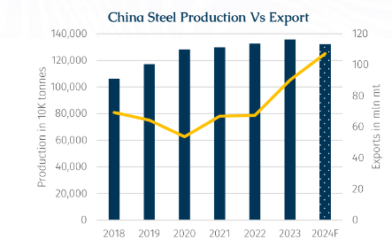
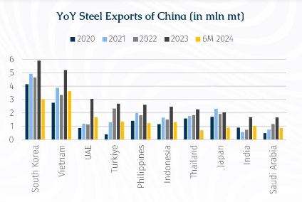
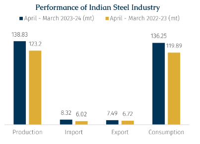
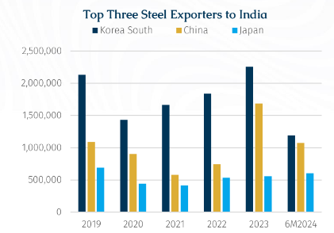
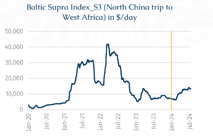

# Time to Turn the Tables

**Date:** July 23, 2024  
**Publisher:** Breakwave Advisors | **Category:** Market Insights  
**Original URL:** [https://www.breakwaveadvisors.com/insights/2024/7/23/xq6donyp418tqznltki3q6s7rmipfh](https://www.breakwaveadvisors.com/insights/2024/7/23/xq6donyp418tqznltki3q6s7rmipfh)  

---

> **Figure 1: Rgb Color Brs Shipbrokers Monogram L**  
> [Local Asset](file:///C:/Users/Dell/Github/Shipping/corpus/03-breakwave/insights/2024/assets/2024-07-23_xq6donyp418tqznltki3q6s7rmipfh_img_rgb-color-brs-shipbrokers-monogram-l_ee79606c8e74.png)

There is a potential wave of protectionism brewing that could reset trade flows on the seaborne steel trade as the second-largest economy navigates a complex terrain of economic challenges and reforms. With China being the world’s largest steel producer, and as it grapples with the cumulative consequences of a prolonged property slump and an evident lack of substantial stimulus to support its domestic consumption, it has started to export more. Therefore, in recent months, certain countries have started to take precautionary measures against China’s rising steel exports.

Indeed, the narrative of overproduction in China has moved to the forefront of the agenda among key steel players worldwide such as India, the US, and the EU as they are witnessing a tsunami of imports just as the latest GDP growth figures released by China falling short of economists’ expectations. (Refer to this week’s steel pointer on page # 7 for more details on the China steel market).

> **Figure 2: Στιγμιότυπο Οθόνης 2024 07 23 104829**  
> [Local Asset](file:///C:/Users/Dell/Github/Shipping/corpus/03-breakwave/insights/2024/assets/2024-07-23_xq6donyp418tqznltki3q6s7rmipfh_img_cea3cf84ceb9ceb3cebcceb9cf8ccf84cf85_6873756cbb8c.png)

According to Mysteel data, China's steel production was on a gradual upward trend until 2021 when growth started to decelerate in the wake of the Covid pandemic. Growth had witnessed a slowdown in 2021, after registering a 9.58% growth in 2020. As the persistent lockdowns in Chinese provinces weighed on industrial production, steel plants were forced to cut output significantly due to poor margins. Nevertheless, overall production volumes have continued to rise.

The sector is at a crossroads and is eagerly anticipating more economic stimulus which could be announced after China's Third Plenum meeting concludes on 18 July. Meanwhile, China may reduce its steel output by 2% this year, considering its production across the first six months of 2024 and an anticipated production cut in 4Q24. All told, the country is expected to produce about 1.33 billion tonnes of steel, which will be slightly lower than last year’s 1.36 billion tonnes. The reduced output is due to dampening demand both domestically and abroad.

Putting aside China’s recent strides in the production of electric vehicles, batteries, and solar panels, the strengthening of Chinese exports has, however, provided a necessary crutch to steel manufacturers. According to Mysteel data, China’s steel exports have grown significantly recently. Last year’s shipments totalled 90.26 mln mt, their highest level since 2016 when exports were recorded at 108.99 mln mt. If everything remains on track this year exports should surpass 100 mln mt mark. The record levels illustrate that in the last couple of years China has used exports as an escape valve to compensate for the overproduction.

> **Figure 3: Στιγμιότυπο Οθόνης 2024 07 23 104850**  
> [Local Asset](file:///C:/Users/Dell/Github/Shipping/corpus/03-breakwave/insights/2024/assets/2024-07-23_xq6donyp418tqznltki3q6s7rmipfh_img_cea3cf84ceb9ceb3cebcceb9cf8ccf84cf85_a2878302f866.png)

South Korea is the major destination for Chinese steel exports. In 2023, it accounted for 11% of China’s total seaborne exports followed by Vietnam (9%) and UAE (5%). High exports in 2023 were mainly driven by low steel prices (in China) and weak domestic demand. Southeast Asia and the Middle East became the preferred destination for seaborne exports due to the lack of trade barriers. This illustrates how a slowdown in China’s economy could reverberate across commodity and shipping markets.

> **Figure 4: Στιγμιότυπο Οθόνης 2024 07 23 104911**  
> [Local Asset](file:///C:/Users/Dell/Github/Shipping/corpus/03-breakwave/insights/2024/assets/2024-07-23_xq6donyp418tqznltki3q6s7rmipfh_img_cea3cf84ceb9ceb3cebcceb9cf8ccf84cf85_d6411454c3d9.png)

India is among the top ten destinations for Chinese steel exports which is proving to be a problem since it is the world’s second largest steel producer. Indeed, from a demand-side perspective, India remains a bright spot in the global steel industry as its consumption is growing strongly driven by government spending on infrastructure and housing, and amid a recovery in private investment under the ‘Make in India’ initiative.

According to Steel Ministry data India’s steel production and consumption have grown by 12.68% and 13.64%, respectively, thereby indicating demand resilience as the country marches towards achieving 300 mln mt of steel-making capacity by 2030.

Data suggest that exporters are utilizing India’s growth to support their production. As a result, the lucrative Indian market turned the country into a steel net importer in 2023. India imported 8.32 mln mt of steel, up 38% YoY for FY24, exceeding exports that stood at 7.49 mln mt (up by 12% yoy). Similarly, in April to Jun (1Q) of Financial year Apr’24-March’25 also followed suit and imports exceeded exports by 0.6 mln mt, provisional data from the Indian Steel Ministry shows.

This has seen a multitude of domestic steel market players suggest that the current situation is ‘worrisome’ and could hinder it from becoming self-sufficient.

> **Figure 5: Στιγμιότυπο Οθόνης 2024 07 23 104933**  
> [Local Asset](file:///C:/Users/Dell/Github/Shipping/corpus/03-breakwave/insights/2024/assets/2024-07-23_xq6donyp418tqznltki3q6s7rmipfh_img_cea3cf84ceb9ceb3cebcceb9cf8ccf84cf85_99ea6d8ec4a1.png)

According to AXS Marine data, South Korea is the biggest steel exporter to India, followed by China and Japan. The graph suggests that imports to India is growing from these countries y-o-y and India's steel mills have called for government interventions and safeguarding against this surge in imports. However, India's federal Ministry of Steel has so far resisted such calls, citing strong local demand.

Looking forward, huge scope for growth is offered by India's comparatively low per capita steel consumption which stood at 86.7 kgs in FY 2023, compared to the global average of approximately 233 kg. According to Indian government expectations, the country’s per capita steel consumption is expected to reach 93 kg in the 2025 fiscal year and 160 kg by the 2030 fiscal year fuelled by increased infrastructure and demand from the, construction, automobile, and real estate sectors.

China exports mostly cold-rolled coils (CRCs) to India and rising imports from it and other countries appear to be exerting downward pressure on domestic steel prices. As per BigMint data, Indian flat steel producers reduced prices of hot rolled coils (HRCs) by around $12-21/t starting July while the price reduction for CRCs is around $12-18/t. Furthermore, Indian cold rolled coils (CRCs) were offered to Europe when hovering in the $680–690/tonne range and, Chinese price quotations were in the $560/tonne range. Thus, it is not only imports but the changing environment in the export market also plays a vital role.

Indian exports have been declining due to the combination of improved domestic consumption, poor global demand, and competitive prices of Chinese products. Looking ahead, the outlook for India’s steel industry remains multifaceted and challenging. While the introduction of anti-dumping duties can provide a certain degree of protection, they only cover a specific segment of steel products such as steel wheels, hot rolled flat products, cold rolled flat products, and seamless tubes and pipes for now.

Meanwhile, China’s steel export reach has worked to the benefit of dry bulkers. The main destinations for Chinese steel exports are Japan, South Korea, and the Middle East. Accordingly, China has been engaging more geared bulkers in these regions and later engaging tonnages for a shorter back-haul trade.

> **Figure 6: Στιγμιότυπο Οθόνης 2024 07 23 104939**  
> [Local Asset](file:///C:/Users/Dell/Github/Shipping/corpus/03-breakwave/insights/2024/assets/2024-07-23_xq6donyp418tqznltki3q6s7rmipfh_img_cea3cf84ceb9ceb3cebcceb9cf8ccf84cf85_4a9226bbe313.png)

As shown in the graph above, the Baltic Index backhaul rates for the North China trip to West Africa for Supermaxes were elevated in 2021 due to container spillover effect to geared bulkers and continued in 2022 before a course correction in 2H2022. From beginning of 2024, S3 rates are popping up again. However, the uncertainty remains for the geared backhaul market from a trend reversal should countries reduce their steel imports from China.

Despite some apparent negatives, steel-related Chinese trade has also driven iron ore and coking coal shipments to China higher, thereby supporting gearless bulkers in the Asia Pacific region. The threat, however, remains of less demand for raw materials due to stock builds at ports and steel mills with the market having to wait for these to be run down before a call on ‘fresh’ demand.

---

**Tags:** Economy, Drybulk, Iron Ore  
