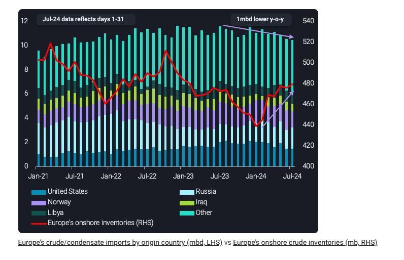
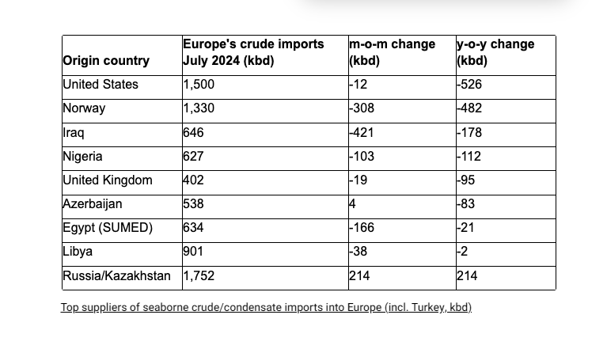

# Sluggish crude demand in Europe continues

**Date:** July 24, 2024  
**Publisher:** Breakwave Advisors | **Category:** Market Insights  
**Original URL:** [https://www.breakwaveadvisors.com/insights/2024/7/24/3mx1aze6ecix1v4e2irx11lyh4hj73](https://www.breakwaveadvisors.com/insights/2024/7/24/3mx1aze6ecix1v4e2irx11lyh4hj73)  

---

*By*[*Armen Azizian*](https://www.linkedin.com/in/armenazizian/)

As of 22nd July, Europe’s seaborne crude/condensate imports in July (days 1-31) are observed at 10.5mbd, the lowest level since October 2021. It represents a 100kbd m-o-m decline and 1mbd y-o-y decline. This decline in crude import demand comes at a time where imports would be expected to be higher in the year, given its the summer season (peak demand).

Europe averaged 11.3mbd in seaborne crude imports across July 2021, July 2022 and July 2023, highlighting that Europe’s current imports are 800kbd below that reference. One factor driving this decline could be weakness in diesel cracks compared to recent years, which were assessed at $15/bl as of 22nd July, $13/bl lower than the same point in 2023 and $7/bl lower than in 2022 (Argus Media). On the other hand, these cracks may have been higher as a result of sentiment of short-supply resulting from the EU-ban on Russian diesel, rather than market fundamentals. In the three years prior to the war (2019-2021), diesel cracks averaged $9/bl (Argus Media). Therefore, the current levels are still markedly above the pre-war average.

Another factor contributing to the weakness in Europe’s crude import demand could be Europe’s ample supplies in onshore inventories, which are 480mb in July. Although this is the highest level observed since February 2023, from a seasonal perspective, these levels are at the range expected at this time of year given refiners would be expected to produce more products (diesel, gasoline) for summer season. It’s 8mb higher than the same period last year but 10mb lower than levels observed in 2022, suggesting on average, European refiners have access to ample supplies to draw from, if needed.

> **Figure 1: Cea3cf84ceb9ceb3cebcceb9cf8ccf84cf85**  
> **Interactive Data & Source:** [Vortexa](https://www.vortexa.com//oil-gas-data-traders-analysts-data-scientists?gclid=Cj0KCQjw8_qRBhCXARIsAE2AtRZKOvMnbilZ_6_91d7huSFFy71pWLrnPwGwOHVzXsmsG-1a1mZnQw8aAt89EALw_wcB&hsa_acc=1782073842&hsa_ad=548425387665&hsa_cam=14746637662&hsa_grp=125038601902&hsa_kw=&hsa_mt=&hsa_net=adwords&hsa_src=g&hsa_tgt=dsa-1431852288425&hsa_ver=3&utm_campaign=%5BCD%5D%20-%20DSA%20-%20EMEA&utm_medium=cpc&utm_medium=ppc&utm_source=google&utm_source=adwords&utm_term=) | [Local Asset](file:///C:/Users/Dell/Github/Shipping/corpus/03-breakwave/insights/2024/assets/2024-07-24_3mx1aze6ecix1v4e2irx11lyh4hj73_img_cea3cf84ceb9ceb3cebcceb9cf8ccf84cf85_5b18e242d1fc.png)

## Europe’s Imports of Us Crude Over 500kbd Lower Y-O-Y

The decline in Europe’s crude imports is driven by a cut of over 500kbd in crude imports from the US, which has become one of the largest suppliers to Europe over the last 12 months. This decline results in Europe’s lowest crude imports from the US since December 2022, when Europe officially shifted away from Urals and needed alternatives. One reason for this could be the increase in WTI prices, reflected in the Brent-WTI spread assessed at $2.6/bl as of 22nd July, which has narrowed from the $4.8/bl observed on the 28th June (Argus Media). European refiners have access to ample supplies in inventories, so with marked weakness in demand, they don’t need to purchase if prices aren’t favorable.

There has also been a 480kbd decline from Norway y-o-y (Johan Sverdrup and Gullfaks Blend), with other declines including Iraq and Nigeria.

> **Figure 2: Στιγμιότυπο Οθόνης 2024 07 24 102601**  
> **Interactive Data & Source:** [Vortexa](https://www.vortexa.com//oil-gas-data-traders-analysts-data-scientists?gclid=Cj0KCQjw8_qRBhCXARIsAE2AtRZKOvMnbilZ_6_91d7huSFFy71pWLrnPwGwOHVzXsmsG-1a1mZnQw8aAt89EALw_wcB&hsa_acc=1782073842&hsa_ad=548425387665&hsa_cam=14746637662&hsa_grp=125038601902&hsa_kw=&hsa_mt=&hsa_net=adwords&hsa_src=g&hsa_tgt=dsa-1431852288425&hsa_ver=3&utm_campaign=%5BCD%5D%20-%20DSA%20-%20EMEA&utm_medium=cpc&utm_medium=ppc&utm_source=google&utm_source=adwords&utm_term=) | [Local Asset](file:///C:/Users/Dell/Github/Shipping/corpus/03-breakwave/insights/2024/assets/2024-07-24_3mx1aze6ecix1v4e2irx11lyh4hj73_img_cea3cf84ceb9ceb3cebcceb9cf8ccf84cf85_e83fb8d1a613.png)

## Outlook for Crude Market Up in the Air

Europe’s lacklustre crude import demand mirrors a global slowdown in oil demand momentum. However, it is not a given that crude markets will weaken in this environment as seaborne crude supply has shown a strong decline over Q2, keeping global crude in the supply chain (onshore stocks and oil at sea) close to the seasonal lows observed over the last five years. Ultimately, the global crude market has been and remains dependent on output discipline in the OPEC+ group, which has recently been strong. The announced output path up to September 2025 is however clearly challenged by current market conditions.

Data Source:[Vortexa](https://www.vortexa.com//oil-gas-data-traders-analysts-data-scientists?gclid=Cj0KCQjw8_qRBhCXARIsAE2AtRZKOvMnbilZ_6_91d7huSFFy71pWLrnPwGwOHVzXsmsG-1a1mZnQw8aAt89EALw_wcB&hsa_acc=1782073842&hsa_ad=548425387665&hsa_cam=14746637662&hsa_grp=125038601902&hsa_kw=&hsa_mt=&hsa_net=adwords&hsa_src=g&hsa_tgt=dsa-1431852288425&hsa_ver=3&utm_campaign=%5BCD%5D%20-%20DSA%20-%20EMEA&utm_medium=cpc&utm_medium=ppc&utm_source=google&utm_source=adwords&utm_term=)

---

**Tags:** Tankers, Crude, Shipping  
