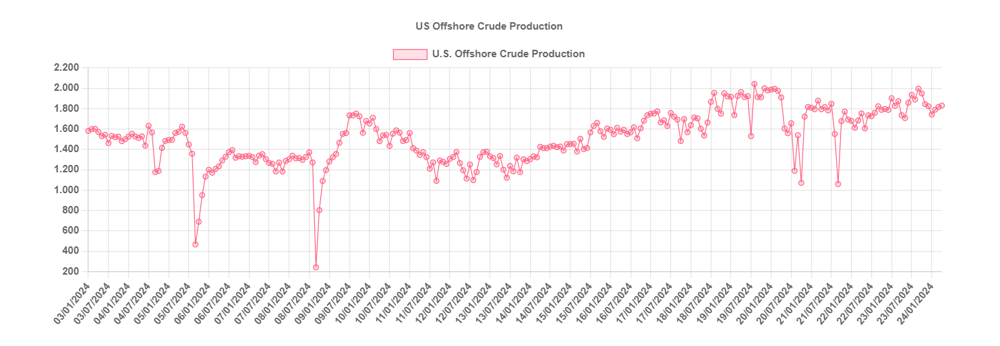

# Humbled by Hurricanes

**Date:** July 24, 2024  
**Publisher:** Breakwave Advisors | **Category:** Market Insights  
**Original URL:** [https://www.breakwaveadvisors.com/insights/2024/7/24/humbled-by-hurricanes](https://www.breakwaveadvisors.com/insights/2024/7/24/humbled-by-hurricanes)  

---

> **Figure 1: VLCC Sunset**  
> **Interactive Data & Source:** [Gibsons Co](https://www.gibsons.co.uk/market-reports) | [Local Asset](file:///C:/Users/Dell/Github/Shipping/corpus/03-breakwave/insights/2024/assets/2024-07-24_humbled-by-hurricanes_img_vlcc-sunset_7309e8085037.jpg)

With Hurricane Beryl recently striking the Caribbean and United States, making headlines worldwide for being the earliest category 5 Hurricane in history, many clients have been asking us what impact Hurricanes have on the tanker markets. The NOAA predicts a record number of tropical storms and hurricanes this year, expecting a quick transition to La Niña conditions following the recent El Niño. The administration forecasts between 17 and 25 named storms (up from an average of 15 since 1991), 8 to 13 hurricanes (above the average of 7 between 1991 and 2023), and 4 to 7 major hurricanes (compared to a historical average of 3). An active season points to broader risk for both the crude and clean markets, however, it is difficult to predict the overall impact.

The two key factors to watch are the path of the storm and its intensity. A major category 5 storm may cause devastation to whatever lays in its path, but provided oil infrastructure is avoided, then the impact is usually muted, aside from possible delays due to vessels re-routing to avoid the path of the storm. However, should the storm hit offshore oil production, causing any prolonged outage, then the impact will primarily be felt on crude tanker export demand from the United States and Caribbean. Combined, the US and Mexico produce 3.5 mbd offshore, much of which are sought after medium and heavy grades. In extreme cases, hurricanes may even support seaborne crude imports from further afield, if local sources of supply are taken off market for an extended period.

The other key impact concerns refineries. Refineries on the Texas and Louisiana coasts account for 48% of the overall US refining capacity. These facilities are critical for supplying US domestic markets, and exported 2.1 mbd overseas in 2023. Any disruption to refining operations is bearish for the clean tanker market in the US Gulf, with fewer barrels available for export. However, major refining outages in the US can also have a positive impact on clean tanker freight. The US Atlantic Coast in particular depends on pipeline flows from the Gulf to feed local demand. If flows up the Colonial pipeline dry up, then typically these barrels are replaced by cargoes from Europe, supporting MR rates on the UKC-USAC (TC2) route. Refinery closures in the US Gulf can also be supportive for local crude exports. If US refineries are unable to use domestic and regional grades, then additional volumes are likely to be made available for export. Other factors, such as a waiver of the Jones Act cabotage law can also positively benefit international tanker markets on a temporary basis.

Given that no two hurricanes are the same, it is difficult to predict what the impact might be specifically, other than heightened freight volatility, both up and down. Interestingly, US refiners have gotten better at recovering from storm damage. Back in 2005 when Hurricanes Katrina and Rita struck, it took about three months for Gulf Coast refineries to return to pre-storm levels. In 2017, following hurricanes Harvey and Irma, it took just 29 days. Yet, if the forecast for an active Hurricane season proves correct, with frequent back-to-back high intensity storms, then the ability of both refiners and crude producers to maintain output could be challenged.

> **Figure 2: Στιγμιότυπο Οθόνης 2024 07 24 103638**  
> **Interactive Data & Source:** [Gibsons Co](https://www.gibsons.co.uk/market-reports) | [Local Asset](file:///C:/Users/Dell/Github/Shipping/corpus/03-breakwave/insights/2024/assets/2024-07-24_humbled-by-hurricanes_img_cea3cf84ceb9ceb3cebcceb9cf8ccf84cf85_e901781d8b8a.png)

Data source:[Gibson Shipbrokers](https://www.gibsons.co.uk/market-reports)

---

**Tags:** Crudeoil, Tankers, Shipping  
