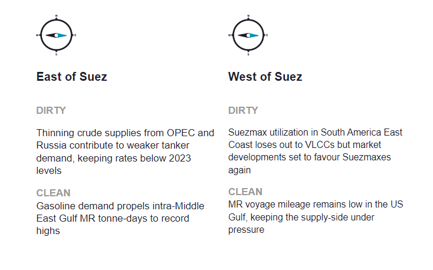
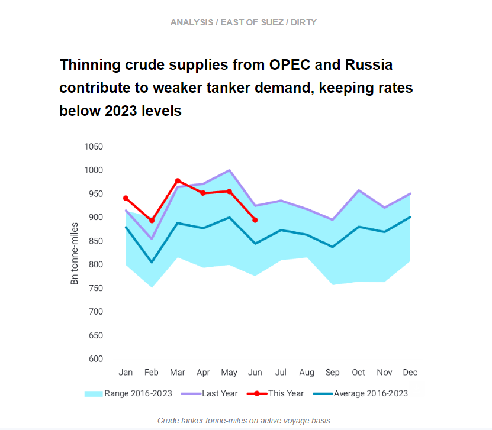
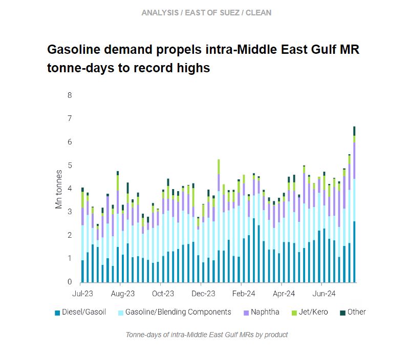
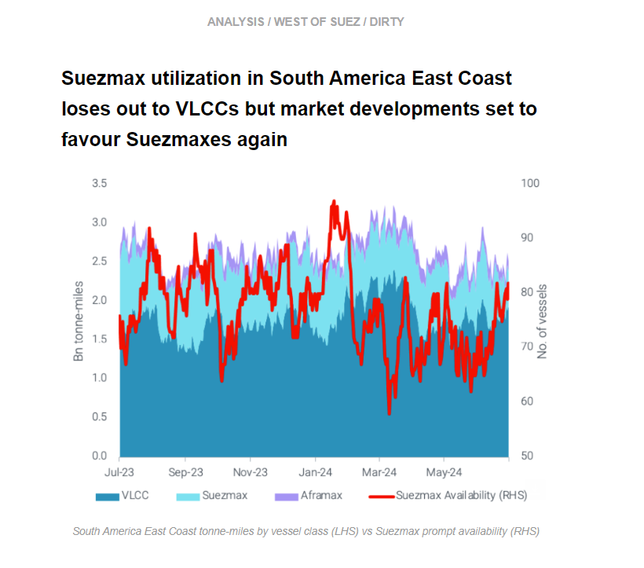
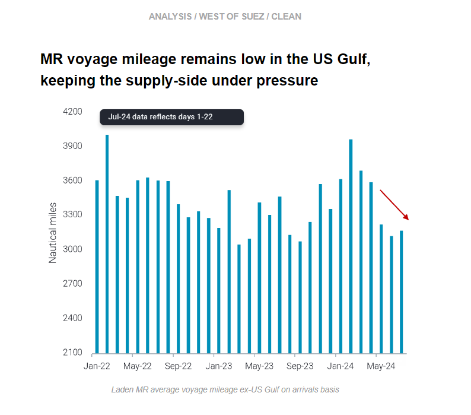

# Crude tanker rates below 2023 levels

**Date:** July 25, 2024  
**Publisher:** Breakwave Advisors | **Category:** Market Insights  
**Original URL:** [https://www.breakwaveadvisors.com/insights/2024/7/25/crude-tanker-rates-below-2023-levels](https://www.breakwaveadvisors.com/insights/2024/7/25/crude-tanker-rates-below-2023-levels)  

---

This week, we look at the overall trajectory for crude tanker rates so far in 2024, and we discuss high demand for intra-Middle East Gulf MR voyages. In the West, we explore Suezmax utilisation out of South America East Coast. On the clean side, we investigate low MR voyage mileage in the US Gulf and contextualise recent freight rate volatility.

*By*[*Mary Melton*](https://www.linkedin.com/search/results/all/?fetchDeterministicClustersOnly=true&heroEntityKey=urn%3Ali%3Afsd_profile%3AACoAABXVyecBtg-pRnIrZe0BoWk0ygPiUfbvhsw&keywords=mary%20melton&origin=RICH_QUERY_SUGGESTION&position=0&searchId=40e8d7d2-c4d0-4022-81e7-176f6eba418b&sid=H_Y&spellCorrectionEnabled=false)

> **Figure 1: Στιγμιότυπο Οθόνης 2024 07 25 143631**  
> **Interactive Data & Source:** [Marketingmail Vortexa](https://marketingmail.vortexa.com/ODM3LU1aRS01NzgAAAGUhEhlTIUC81B8KAV6z_LKkugit02p17J9do586E4j1yCQ-vwJIY_WeK9J8HReTADpOkx4TjA=) | [Local Asset](file:///C:/Users/Dell/Github/Shipping/corpus/03-breakwave/insights/2024/assets/2024-07-25_crude-tanker-rates-below-2023-levels_img_cea3cf84ceb9ceb3cebcceb9cf8ccf84cf85_a308121e881a.png)

> **Figure 2: Στιγμιότυπο Οθόνης 2024 07 25 143648**  
> **Interactive Data & Source:** [Marketingmail Vortexa](https://marketingmail.vortexa.com/ODM3LU1aRS01NzgAAAGUhEhlTIUC81B8KAV6z_LKkugit02p17J9do586E4j1yCQ-vwJIY_WeK9J8HReTADpOkx4TjA=) | [Local Asset](file:///C:/Users/Dell/Github/Shipping/corpus/03-breakwave/insights/2024/assets/2024-07-25_crude-tanker-rates-below-2023-levels_img_cea3cf84ceb9ceb3cebcceb9cf8ccf84cf85_92262bd0213d.png)

- From a long-term historical perspective, crude tanker freight rates remain at healthy levels. However, looking at more recent history (2023-onwards) freight rates for the main tanker classes (VLCC, Suezmax, Aframax) are following a downward trajectory with the two former ones hovering around 2024 lows.

- This is directly related to weaker crude demand from both a volume and mileage perspective.[Crude tanker tonne-miles](https://marketingmail.vortexa.com/ODM3LU1aRS01NzgAAAGUhEhlTIUC81B8KAV6z_LKkugit02p17J9do586E4j1yCQ-vwJIY_WeK9J8HReTADpOkx4TjA=)are below 2023 for the last three full months of 2024. On the volume side, VLCCs have been hit mainly from a decline in OPEC+ flows which has caused a dip in utilisation. Similarly, Suezmaxes have been affected by Atlantic Basin exports, which have plateaued since January, at a time when sluggish demand in Europe continues ([read more here](https://marketingmail.vortexa.com/ODM3LU1aRS01NzgAAAGUhEhlTaro_t9JDR-l_rgZ_8Lm3VyJBkKJbwE5QPP8CZXA3_8bep7joqj7zasRW99HJu2Ln4s=)).
- For Aframaxes,[thinning Russian crude exports](https://marketingmail.vortexa.com/ODM3LU1aRS01NzgAAAGUhEhlTOuTCRSLayi7l9BmKCUXnavcCwCsSvwt2opsqmq1I29fYTzvz58JWRSTZuiO82golI4=)and a continuing exodus of Western-operated vessels from the Russian trade has for one imposed lower voyage distances, but has also raised mainstream vessel supply for the segment, exerting downward pressure on rates.

> **Figure 3: Στιγμιότυπο Οθόνης 2024 07 25 143846**  
> **Interactive Data & Source:** [Marketingmail Vortexa](https://marketingmail.vortexa.com/ODM3LU1aRS01NzgAAAGUhEhlTKYQ5t8WbOct1icAShQ92LTaoyypUtGA5dGfZdgqQyYH_DzYBprpwFmJpu-N0N3Nfm8=) | [Local Asset](file:///C:/Users/Dell/Github/Shipping/corpus/03-breakwave/insights/2024/assets/2024-07-25_crude-tanker-rates-below-2023-levels_img_cea3cf84ceb9ceb3cebcceb9cf8ccf84cf85_b79374855e63.png)

- MR demand for intra-Middle East voyages is high, which[propelled tonne-days on the route to record highs](https://marketingmail.vortexa.com/ODM3LU1aRS01NzgAAAGUhEhlTKYQ5t8WbOct1icAShQ92LTaoyypUtGA5dGfZdgqQyYH_DzYBprpwFmJpu-N0N3Nfm8=). Apart from high intra-regional diesel voyages, another contributing factor has been the region’s high gasoline demand, resulting in high gasoline tonne-days since the start of July. This was preceded by an increase in naphtha tonne-days in H2 June (likely for gasoline blending). This increased demand has propelled[MR voyages on the intra-MEG route](https://marketingmail.vortexa.com/ODM3LU1aRS01NzgAAAGUhEhlTOZqffec7Vbudrwhs2M_O-SHWvpxxKBin4cBu8tK-d5ugBA42bMvwflefVeY-mg4txs=)to way above the seasonal range. Voyage counts over the last two weeks have been 50% higher than those at the start of the month.

- The region’s high gasoline demand is keeping the barrels in the Middle East, leading to a[decline in exports to East and South Africa](https://marketingmail.vortexa.com/ODM3LU1aRS01NzgAAAGUhEhlTR3hagz9jT-VPHfIaWmQw0b0S5KXEvmno8HXu1mIBSY7vZ-rGFFHEZWsW3kNDcdycGk=)and a decline in freight rates on the route (Argus).
- This increase in short-haul intra-MEG trade saw[average mileage for MRs operating in the Middle East Gulf drop by over 20%](https://marketingmail.vortexa.com/ODM3LU1aRS01NzgAAAGUhEhlTOCE3OiDeJc3aGf5QgGI4jgiHuTOrR1lkiSsGT4Agm2ORj7709bc4sf4DNK5GLmZSjQ=)in June and July compared to May levels. Additionally, this has coincided with a[gradual increase in vessel supply](https://marketingmail.vortexa.com/ODM3LU1aRS01NzgAAAGUhEhlTGTrKQ951k89Qo9vsEsn97RfwotRdGhRhzzLx4p9YPwWhYUSs8PDf13z9D5YEm9mOZg=)in the region as vessels repositioned due to low demand in APAC, which could cap earnings despite high intra-regional demand.

> **Figure 4: Στιγμιότυπο Οθόνης 2024 07 25 144139**  
> **Interactive Data & Source:** [Marketingmail Vortexa](https://marketingmail.vortexa.com/ODM3LU1aRS01NzgAAAGUhEhlTBq4xECOOBbpBmXGwCwx91x-zr39YeKabSDnRrC021JkL5KW1rtFeKNgR6tcvzzvt3Y=) | [Local Asset](file:///C:/Users/Dell/Github/Shipping/corpus/03-breakwave/insights/2024/assets/2024-07-25_crude-tanker-rates-below-2023-levels_img_cea3cf84ceb9ceb3cebcceb9cf8ccf84cf85_13e5a631d8ce.png)

- [Prompt Suezmax availability](https://marketingmail.vortexa.com/ODM3LU1aRS01NzgAAAGUhEhlTBq4xECOOBbpBmXGwCwx91x-zr39YeKabSDnRrC021JkL5KW1rtFeKNgR6tcvzzvt3Y=)in South America East coast is up in July while utilisation takes a hit. This development is occurring as[exports of crude and dirty products out of Brazil](https://marketingmail.vortexa.com/ODM3LU1aRS01NzgAAAGUhEhlTEjCPCoxK2uKVqpaLyzzpRR_-nZAFvClxUbKSq4AQbfXDvN1xCIn3XyRNBtyfHT9Bl8=)have decreased due to upstream issues and worker strikes.

- [VLCC demand](https://marketingmail.vortexa.com/ODM3LU1aRS01NzgAAAGUhEhlS5OpwxZb4DV47n3bYPLopBy7X0g4Wu8QebI4GTfSCOm5XwyWZTylUA-dxw5DlBrCA1Y=)for the South America-to-Europe route has picked up, pressuring Suezmaxes. Additionally, recently announced inhibitions on VLCC loadings by the Guyanese government (Argus) could limit VLCC utilisation.
- This development should bode well for Suezmaxes, especially as Guyanese offshore platforms come out of July maintenance with planned loadings set to ramp up in August and September. But slow demand in key markets such as Europe and weaker differentials may somewhat dampen these loadings.

> **Figure 5: Στιγμιότυπο Οθόνης 2024 07 25 144324**  
> **Interactive Data & Source:** [Marketingmail Vortexa](https://marketingmail.vortexa.com/ODM3LU1aRS01NzgAAAGUhEhlTEDkiVxavxG83FuQHQKFKU0XFSd0hYWwJ5ZAxMKTbRY3ZMOzbGrB5XX8ydQhyMVWhn0=) | [Local Asset](file:///C:/Users/Dell/Github/Shipping/corpus/03-breakwave/insights/2024/assets/2024-07-25_crude-tanker-rates-below-2023-levels_img_cea3cf84ceb9ceb3cebcceb9cf8ccf84cf85_b35d624e19a1.png)

- [Average voyage mileage for MRs departing from the US Gulf](https://marketingmail.vortexa.com/ODM3LU1aRS01NzgAAAGUhEhlTEDkiVxavxG83FuQHQKFKU0XFSd0hYWwJ5ZAxMKTbRY3ZMOzbGrB5XX8ydQhyMVWhn0=)has been significantly lower over the last few months. On average, voyage mileage in May-July (days 1-22) is 12% less than April mileage. This comes at a time when[CPP exports](https://marketingmail.vortexa.com/ODM3LU1aRS01NzgAAAGUhEhlTTblXQaLNXLELXsipALpkuxs_E59DP4Jj_23X0sXkGRip06e9rpyTzoK3u0JzfgIyno=)from the region were well above y-o-y levels in June and remain robust so far in July. Short-haul flows are driving this trend, especially to Mexico East Coast and the Caribbean. The volume of flows to Mexico have declined somewhat so far this month, but high volumes going to the Caribbean are keeping overall mileage down.

- Low demand in the US domestic market is pushing these barrels out, and refiners are incentivised to send CPP short-haul due to cost. As a result, high MR demand but short-haul employment is failing to clear much available tonnage in the region. At the same time, vessel supply is increasing as vessels[reposition](https://marketingmail.vortexa.com/ODM3LU1aRS01NzgAAAGUhEhlTAERoHABKLtjDiVnKgefLQ5VHzyR5H7FLzZ8hRsSFtrxPDuFQ0HfmZxx4L23iCimnxo=)to the region. This is leading to high levels of[volatility in freight rates](https://marketingmail.vortexa.com/ODM3LU1aRS01NzgAAAGUhEhlTO-rQoSm_eFYH0j0Sx9BBGpDBZ4-8h6vmdtZAh9DPseJrbcaButUN3Z0MawL2FhFbBM=)as supply-side pressure outweighs high demand.
- Disruption to USGC refineries from Hurricane Beryl was minimal, and PADD 3 refined product stocks rose according to the most recent data (EIA). As a result, CPP exports to short-haul destinations will most likely remain high, with volatility in rates likely to continue. An open arbitrage for diesel USGC-to-Med (Argus) is translating to a slight increase in departures to Europe, which could offer some supply-side relief.

Data Source:[Vortexa](https://www.vortexa.com//oil-gas-data-traders-analysts-data-scientists?gclid=Cj0KCQjw8_qRBhCXARIsAE2AtRZKOvMnbilZ_6_91d7huSFFy71pWLrnPwGwOHVzXsmsG-1a1mZnQw8aAt89EALw_wcB&hsa_acc=1782073842&hsa_ad=548425387665&hsa_cam=14746637662&hsa_grp=125038601902&hsa_kw=&hsa_mt=&hsa_net=adwords&hsa_src=g&hsa_tgt=dsa-1431852288425&hsa_ver=3&utm_campaign=%5BCD%5D%20-%20DSA%20-%20EMEA&utm_medium=cpc&utm_medium=ppc&utm_source=google&utm_source=adwords&utm_term=)

---

**Tags:** Shipping, Crude Oil, Tankers  
