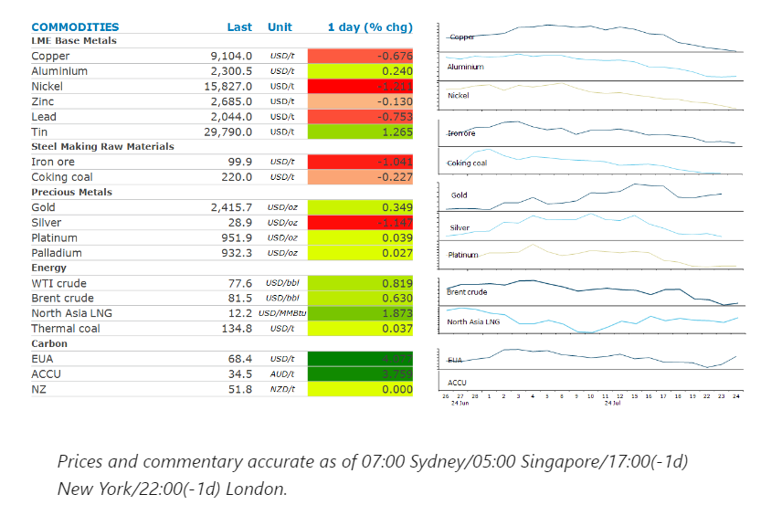
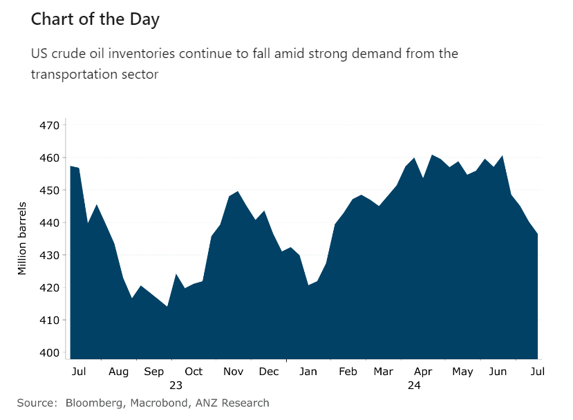

# Oil gains as inventories fall further in the US

**Date:** July 25, 2024  
**Publisher:** Breakwave Advisors | **Category:** Market Insights  
**Original URL:** [https://www.breakwaveadvisors.com/insights/2024/7/25/p0zw5kufu35sbekqkyt8u18mez1yz0](https://www.breakwaveadvisors.com/insights/2024/7/25/p0zw5kufu35sbekqkyt8u18mez1yz0)  

---

Heavy selling in equity markets triggered a risk-off tone across the commodity sector. Falling inventories helped limit the losses.

*By*[*Daniel Hynes*](https://www.linkedin.com/in/dahynes/)

> **Figure 1: Στιγμιότυπο Οθόνης 2024 07 25 124906**  
> **Interactive Data & Source:** [Linkedin](https://www.linkedin.com/newsletters/commodities-wrap-6692196755876012032/?fbclid=IwAR3kiXJqZdxmp9ZcRwBNI7FsBySI-XSC0pfPur1qzjt7OZp7PTE59Tsl1QI) | [Local Asset](file:///C:/Users/Dell/Github/Shipping/corpus/03-breakwave/insights/2024/assets/2024-07-25_p0zw5kufu35sbekqkyt8u18mez1yz0_img_cea3cf84ceb9ceb3cebcceb9cf8ccf84cf85_daf61f4856e1.png)

### Market Commentary

**Crude oil**rallied after a sharp fall in US inventories eased concerns about demand. The Energy Information Administration said US oil stockpiles were drawn down by 3.74mbbls last week. That was the fourth straight decline and brings total stockpiles down to the lowest level since February. More promising was the fall in US gasoline inventories, down 5,572kbbls. Part of this was driven by refineries still closed from Hurricane Beryl. However, a strong summer driving season is also playing its part. This saw implied demand in the US rise to 9.456mb/d. Sentiment was also boosted by reports that Russia is planning to make extra crude output cuts in October and November, and also between March and September next year. These are to compensate for overproduction earlier this year, according to the Energy Ministry. The market also remains on edge as wildfires in Alberta, Canada are still threatening more than 10% of the region’s oil production.

**Global gas**markets rallied as strong demand drags more buyers into the spot market. Hotter-than-average summer weather is boosting gas demand in Japan. Gas fired power generation in the Kansai region jumped 25% to 125GWh on Tuesday, the highest since April. Gas power in Tokyo rose 9.3%. Indian buyers were also active, with Indian Oil purchasing two LNG cargoes for delivery in late August and September. China’s gas use in 2024 will likely grow at a similar pace as last year on expectations of improving demand, the National Energy Administration said in its annual report. Demand is expected to rise 6.5-7.7% y/y to as much as 425bcm in 2024. This helped the market shrug off the continued restart of the Freeport LNG plant, which was curtailed by Hurricane Beryl.

A risk-off tone across markets triggered by heavy losses in equity markets saw**copper**lead the base metals sector lower. The red metal settled at its lowest level in more than three months as weakness in China’s economy fed expectations for a fall in demand. These concerns have been exacerbated by lack of further stimulus measures from Beijing. After the Third Plenum failed to reveal any policy response, the market is now looking ahead to the Politburo meeting next week for new measures that may support economic growth. Aluminium bucked the trend to end the session higher as the market weighs up the possibility that China’s new emissions reduction plan may trigger smelter capacity cuts. In a government plan issued Tuesday, smelter capacity is required to be below baseline efficiency levels. If not, they may need to be phased out by the end of 2025. New coal-fired power generators for aluminium smelters will also no longer be approved. To help the industry, Beijing will support producers that consume more renewable energy.

**Gold**erased earlier gains as bond yields advanced, making the non-yielding precious metal less attractive to investors. Sentiment was buoyed earlier in the session after former New York Fed President, William Dudley, called for the Fed to cut rates, preferably at next week’s meeting. Investors are now turning their attention to the personal consumption expenditures data due Thursday, which may shed some light on the path for rates.

> **Figure 2: Στιγμιότυπο Οθόνης 2024 07 25 125045**  
> **Interactive Data & Source:** [Linkedin](https://www.linkedin.com/newsletters/commodities-wrap-6692196755876012032/?fbclid=IwAR3kiXJqZdxmp9ZcRwBNI7FsBySI-XSC0pfPur1qzjt7OZp7PTE59Tsl1QI) | [Local Asset](file:///C:/Users/Dell/Github/Shipping/corpus/03-breakwave/insights/2024/assets/2024-07-25_p0zw5kufu35sbekqkyt8u18mez1yz0_img_cea3cf84ceb9ceb3cebcceb9cf8ccf84cf85_22a2e9bb2d0b.png)

Data source:[Commodities Wrap](https://www.linkedin.com/newsletters/commodities-wrap-6692196755876012032/?fbclid=IwAR3kiXJqZdxmp9ZcRwBNI7FsBySI-XSC0pfPur1qzjt7OZp7PTE59Tsl1QI)

---

**Tags:** Commodities, Economy, Shipping  
