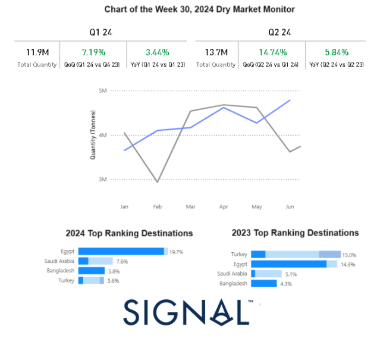
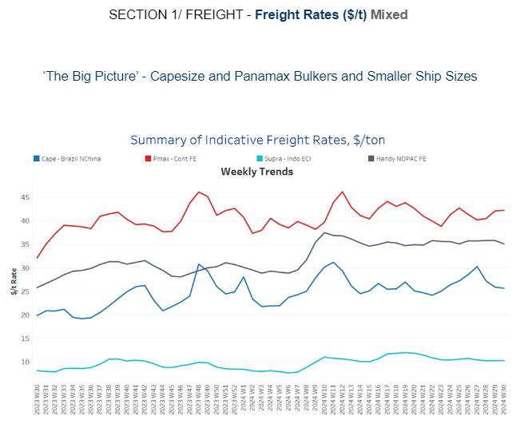
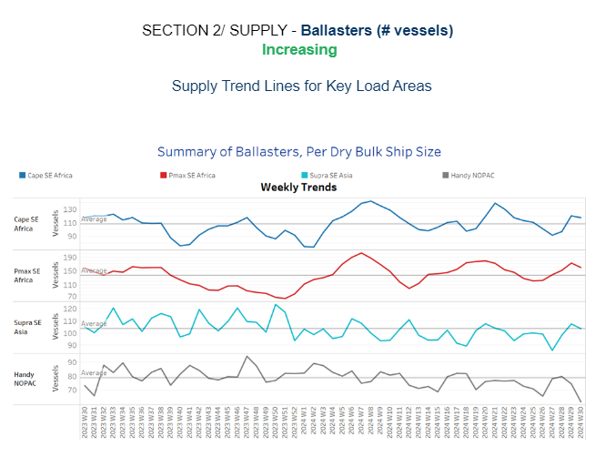
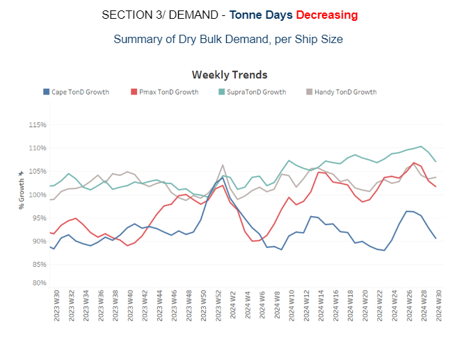
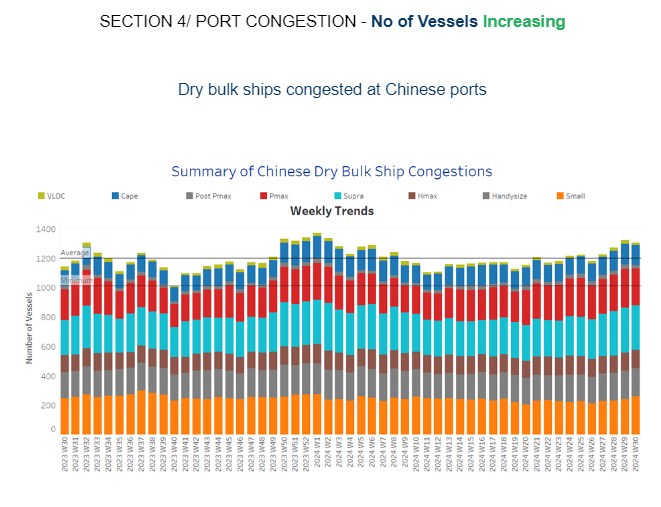

# Russian Grain Shipments to TOP Destinations

**Date:** July 25, 2024  
**Publisher:** Breakwave Advisors | **Category:** Market Insights  
**Original URL:** [https://www.breakwaveadvisors.com/insights/2024/7/25/russian-grain-shipments-to-top-destinations](https://www.breakwaveadvisors.com/insights/2024/7/25/russian-grain-shipments-to-top-destinations)  

---

**Dry Weekly Market Monitor - Week 30.2024**
Snapshot of Spot Freight Rates, Supply-Demand Trends, Port Congestions
July 25, 2024

*This week's chart highlights the notable increase in the monthly volume of Russian grain shipments during the first two quarters of this year. By the end of the second quarter, shipments had risen by 15% compared to the previous quarter. Notably, Egypt emerged as the leading destination for Russian grain, accounting for 20% of the total shipments this year. This marks a significant shift, as Turkey held the top spot last year with a 15% share. The shift in destination preferences underscores changing market dynamics and may reflect evolving trade relationships or demand patterns. In our previous*[*weekly market monitor*](https://go.signalocean.com/e/983831/ry-market-monitor-week-29-2024/2qdzbt/426211137/h/XTW8nKYxYqzXLC1DuNrGO3evTsJH-bZX7hky4DjGurw)*, we closely examined the increase in monthly Ukrainian grain shipments this year, highlighting Spain and China as the top destinations.*

> **Figure 1: Στιγμιότυπο Οθόνης 2024 07 25 145406**  
> **Interactive Data & Source:** [Signal Ocean Platform](https://go.signalocean.com/e/983831/hinas-plenum-fails-to-inspire-/2qdzc1/426211137/h/XTW8nKYxYqzXLC1DuNrGO3evTsJH-bZX7hky4DjGurw) | [Local Asset](file:///C:/Users/Dell/Github/Shipping/corpus/03-breakwave/insights/2024/assets/2024-07-25_russian-grain-shipments-to-top-destinations_img_cea3cf84ceb9ceb3cebcceb9cf8ccf84cf85_db02bc20d212.png)

The last week of July continued to reflect the weakening trend in Capesize rates from Brazil to North China. This decline was accompanied by a rise in the number of ballast vessels, exceeding the annual average, suggesting a potential oversupply scenario in the near future.

In the grain segment, recent data illustrates a robust uptrend in the monthly volume of Russian grain shipments, beginning at the end of the first quarter of this year. By the end of the second quarter, shipments had increased by 15% compared to the first quarter. Egypt has emerged as the leading destination for these shipments, capturing a 20% share of the total volume. This growth highlights the dynamic nature of the grain market and Russia's expanding influence within it.

In the[iron ore market,](https://go.signalocean.com/e/983831/hinas-plenum-fails-to-inspire-/2qdzc1/426211137/h/XTW8nKYxYqzXLC1DuNrGO3evTsJH-bZX7hky4DjGurw)at the opening of the week, iron ore prices fell below $100 per ton as a key policy meeting in China failed to deliver significant economic stimulus, while supply levels remained robust. The steelmaking material declined by as much as 3.5%, hitting $99.85 per ton in Singapore, with futures on track for a third consecutive day of losses.

The outcome of the Third Plenum, a twice-a-decade conclave of Communist Party officials held last week, disappointed investors. The meeting produced few measures to bolster metals demand or address the ongoing property crisis, contributing to the downward pressure on iron ore prices. This lack of decisive action from Chinese policymakers has exacerbated concerns about the strength of demand in the world's largest steel producer, highlighting the vulnerability of the market to shifts in Chinese economic policy.

> **Figure 2: Στιγμιότυπο Οθόνης 2024 07 25 145606**  
> **Interactive Data & Source:** [Signal Ocean Platform](https://www.thesignalgroup.com/signal-ocean-platform) | [Local Asset](file:///C:/Users/Dell/Github/Shipping/corpus/03-breakwave/insights/2024/assets/2024-07-25_russian-grain-shipments-to-top-destinations_img_cea3cf84ceb9ceb3cebcceb9cf8ccf84cf85_3b2217efdb85.png)

In the final week of July, the dry bulk freight market saw a continued decline in rates for Cape Brazil to North China routes, while Panamax rates for Continental Far East routes remained robust. Meanwhile, the smaller vessel size segments demonstrated resilience, indicating a stable outlook over the past month.

- **Capesize**vessel freight rates for shipments from Brazil to North China have decreased to $25 per ton. Despite this dip, rates remain 30% higher compared to the same week last year.
- **Panamax**vessel freight rates from the Continent to the Far East held levels around $43 per ton, 35% higher than those recorded a year ago.
- **Supramax**vessel freight rates on the Indo-ECI route remained steady at around $10 per ton, maintaining a consistent level since mid-June. These rates are still 30% higher compared to the same period last year.
- **Handysize**freight rates for the NOPAC Far East route have remained consistent over the past ten weeks, holding steady at approximately $36 per ton. This marks a notable 39% increase compared to rates observed one year ago.

> **Figure 3: Στιγμιότυπο Οθόνης 2024 07 25 145713**  
> **Interactive Data & Source:** [Signal Ocean Platform](https://www.thesignalgroup.com/signal-ocean-platform) | [Local Asset](file:///C:/Users/Dell/Github/Shipping/corpus/03-breakwave/insights/2024/assets/2024-07-25_russian-grain-shipments-to-top-destinations_img_cea3cf84ceb9ceb3cebcceb9cf8ccf84cf85_d91c58d3ffb7.png)

In the final days of July, the Cape and Panamax SE Africa markets saw an increase in the number of ballasters exceeding the annual average. Meanwhile, the Handy NOPAC market experienced a noticeable downward trend for over four consecutive weeks.

- **Capesize SE Africa**: The number of ballast ships increased to around 120, up approximately 30 from the low observed nearly four weeks ago.
- **Panamax SE Africa**: The number of ballast ships began to decline from the previous week's high of over 170, decreasing by approximately 20 vessels. Despite this drop, the number of ballast ships remains above the annual average.
- **Supramax SE Asia**: The count of ballast ships over the past two weeks has approached the annual average of 103, remaining consistent with the levels observed at the end of week 11.
- **Handysize****NOPAC**: The latest weekly estimates contradicted previous predictions of an increase, with the vessel count of ballasters falling to approximately 67. This represents a drop to the lowest level recorded since the end of week 26 and is 10 vessels below the annual average.

> **Figure 4: Στιγμιότυπο Οθόνης 2024 07 25 145839**  
> **Interactive Data & Source:** [Signal Ocean Platform](https://www.thesignalgroup.com/signal-ocean-platform) | [Local Asset](file:///C:/Users/Dell/Github/Shipping/corpus/03-breakwave/insights/2024/assets/2024-07-25_russian-grain-shipments-to-top-destinations_img_cea3cf84ceb9ceb3cebcceb9cf8ccf84cf85_a117a5a1546e.png)

In the final week of July, the outlook for dry tonne days continued to weaken, with the larger vessel size segments experiencing a sharp downward revision.

- **Capesize**: Recent estimates of tonne-day growth mirror the previous week's trend, still showing a decline from the peak observed in week 25. However, growth remains significantly higher than the low point recorded at the end of week 21.
- **Panamax**: Weekly percentage growth continues to decline with no signs of an upturn. However, the recent growth pace has not yet reached the lowest level observed since the last peak recorded four weeks ago.
- **Supramax**: Despite indications of an upward trend, the growth rate has shown a decline, with the latest weekly estimates recording a drop from the peak observed at the end of week 26.
- **Handysize**: Signs of an upward trend in the Handysize vessel segment remained unconfirmed at the end of July, as previous weekly estimates indicated a downward pace since the end of week 28.

> **Figure 5: Στιγμιότυπο Οθόνης 2024 07 25 145953**  
> **Interactive Data & Source:** [Signal Ocean Platform](https://www.thesignalgroup.com/signal-ocean-platform) | [Local Asset](file:///C:/Users/Dell/Github/Shipping/corpus/03-breakwave/insights/2024/assets/2024-07-25_russian-grain-shipments-to-top-destinations_img_cea3cf84ceb9ceb3cebcceb9cf8ccf84cf85_33bef848f3a7.png)

In the last days of July, Chinese dry bulk port congestion continued to rise, maintaining volumes nearly identical to those of the previous week.

- **Capesize**: Capesize ship congestion stayed around 140 vessels, marking a substantial increase of more than 20 ships compared to levels observed four weeks prior.
- **Panamax**: The number of Panamax vessels has reached approximately 260, an increase of nearly 14 compared to two weeks ago.
- **Supramax**: Congestion levels have remained around 300 over the past three weeks, representing an increase of 30 vessels compared to the week ending on the 26th.
- **Handysize**: Congestion levels held levels around 190, this marks an increase of nearly 10 compared to levels observed a week ago.

Data Source:[Signal Ocean Platform](https://www.thesignalgroup.com/signal-ocean-platform)

---

**Tags:** Drybulk, Shipping, Capesize  
