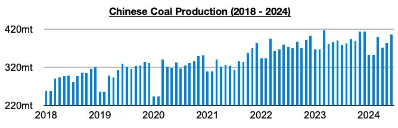
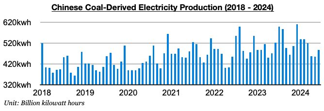

# Capesize Spot Market on More Fragile Ground

**Date:** July 26, 2024  
**Publisher:** Breakwave Advisors | **Category:** Market Insights  
**Original URL:** [https://www.breakwaveadvisors.com/insights/2024/7/26/capesize-spot-market-on-more-fragile-ground](https://www.breakwaveadvisors.com/insights/2024/7/26/capesize-spot-market-on-more-fragile-ground)  

---

*By*[*Jeffrey Landsberg*](https://www.linkedin.com/in/jeffrey-landsberg-70ab957/)

Overall dry bulk rates decreased last week, with the decline in capesize rates exceeding very small increases in the rest of the segments. Capesize rates ended last week at $24,652/day, which marked a week-on-week decline of $2,686 (-10%). Panamax rates ended at $15,427/day, which marked an increase of $321 (2%). Supramax rates ended at $15,117/day, which marked an increase of $113 (1%). Handysize rates ended at $13,543/day, which marked an increase of $204 (2%). Also of note is coastal coal freight rates in China came under renewed pressure last week.

Noteworthy is that Brazilian spot cargo volume jumped last week, but capesize rates nevertheless fell. As we discussed in Commodore Research's most recent Weekly Dry Bulk Report, capesize rates would have fared much more poorly last week if Brazilian spot iron ore cargo volume did not jump. Overall, we remain cautious for the near-term dry bulk market and remain concerned that the three new engines of demand-side growth that we have been highlighting this year could all soon become headwinds, as there remains a solid chance all will return to contraction. China’s coal production again faring better than coal-derived electricity generation in June has been the latest issue seen in the dry bulk market.

China’s coal production totaled 405.4 million tons in June. This is up month-on-month by 21.5 million tons (6%) and up year-on-year by 15.3 million tons (4%). Before last month, China’s coal output had contracted on a year-on-year basis for five straight months. Prior to those five months, the last time it had contracted on a year-on-year basis was in July 2021. The last time there were five straight months with a year-on-year contraction was in 2018.

> **Figure 1: Chart 1**  
> [Local Asset](file:///C:/Users/Dell/Github/Shipping/corpus/03-breakwave/insights/2024/assets/2024-07-26_capesize-spot-market-on-more-fragile-ground_img_chart1_600eecab5652.jpg)

China's coal-derived electricity generation, on the other hand, declined year-on-year last month by 7%. China's coal-derived electricity generation has now declined on a year-on-year basis for two straight months, as hydropower production has been surging from extremely robust rainfall in recent months.

> **Figure 2: Chart 2**  
> [Local Asset](file:///C:/Users/Dell/Github/Shipping/corpus/03-breakwave/insights/2024/assets/2024-07-26_capesize-spot-market-on-more-fragile-ground_img_chart2_01abe8671436.jpg)

---

**Tags:** China, Coal, Drybulk  
