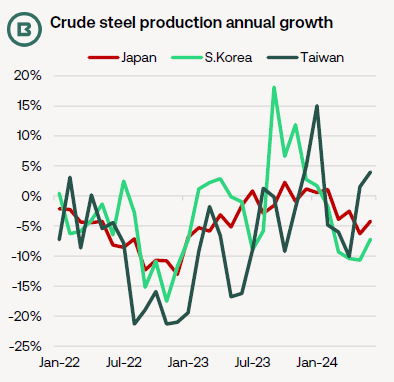
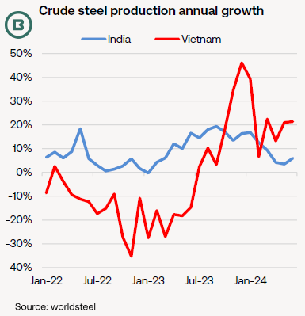
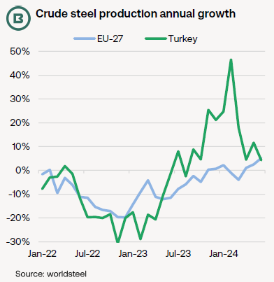

# The Big Picture: Massive contrasts in steel production trends in the 1H 2024

**Date:** July 26, 2024  
**Publisher:** Breakwave Advisors | **Category:** Market Insights  
**Original URL:** [https://www.breakwaveadvisors.com/insights/2024/7/26/opkxxsvz4942ihmm856nho7nv2uqn3](https://www.breakwaveadvisors.com/insights/2024/7/26/opkxxsvz4942ihmm856nho7nv2uqn3)  

---

- *At 954.6m tonnes, 1H 2024 global crude steel output was just 0.1m tonnes short of the year-ago total—but yearly growth was focused in the Q1, as the Q2 was down -1.0%, worldsteel data show.*

- *There were also some massive differences in performance by geography.*
- *With dry bulk import demand in mind, we have charted three separate growth trends in crude steel output outside of China: (1) Northeast Asia, (2) India and Vietnam and (3) the EU and Turkey.*

Combined,**Japan, South Korea and Taiwan**were on course to import around 93m tonnes of iron ore in the 1H 2024, plus 37m tonnes of coking coal, according to customs data. This represents a slight year-on-year fall.

The first chart displays a YoY contraction in steel output in both Japan and South Korea, with mills in Taiwan only recently seeing a return to growth.

By way of comparison, last month’s combined production in Japan, South Korea and Taiwan (at 13.7m tonnes) still lagged the levels of June 2021 (of 16.0m tonnes) by a sizeable margin.

Japan’s Ministry of Economy, Trade and Industry (METI) projected Q3 steel production to rise very slightly from the Q2, which would still be close to the low levels seen during the first wave of Covid in 2020. METI adds that construction, containers and shipbuilding are the only three sectors to enjoy demand growth on both quarterly and annual bases (these comprise 37% of domestic demand).

In complete contrast, the world’s second-largest steel producer,**India,**has enjoyed relatively consistent growth, as highlighted in the lower chart. In the last three years, June production has jumped from 9.4m tonnes to 12.3m tonnes.

Kallanish reported no major change to infrastructure spending in the first budget from India’s new coalition government. Heavy monsoonal rains are expected to keep near-term demand in check.

As the leading steel production expansion story in Southeast Asia,has resumed its growth after the demand slump of 2022-23, although domestic steel production remains below capacity at present.

> **Figure 1: Vietnam**  
> [Local Asset](file:///C:/Users/Dell/Github/Shipping/corpus/03-breakwave/insights/2024/assets/2024-07-26_opkxxsvz4942ihmm856nho7nv2uqn3_img_image0_55c2e95d2f23.png)

> **Figure 2: Market Chart 2**  
> [Local Asset](file:///C:/Users/Dell/Github/Shipping/corpus/03-breakwave/insights/2024/assets/2024-07-26_opkxxsvz4942ihmm856nho7nv2uqn3_img_image128129_fa550a66e1dc.png)

However, while Japan, South Korea and Taiwan imported in the region of 130m tonnes of iron ore and coking coal during the 1H 2024, the equivalent for India and Vietnam was estimated at 51-52m tonnes, thanks mainly to the availability of domestic ore in India.

Moreover, Vietnamese steelmakers (as with other regional steel mills) face ongoing competition from cheap imported steel products from China.

Our final chart compares crude steel production in the**EU-27**with that of**Turkey**, the world’s largest importer of ferrous scrap. When imports of coking coal, iron ore and steel scrap into the EU and Turkey are aggregated, the 1H 2024 total is more than 76m tonnes.

Following steep contraction in 2022-23, production in the EU-27 has made comparatively modest gains.

Steel association Eurofer underlined the weakness in European demand in their Q3 market outlook, which anticipates a drop of -1.6% in 2024 due to “the second recession in a row in the construction sector, persistent geopolitical tensions and the lagged impact of high interest rates on the overall manufacturing sector”.

Perhaps optimistically, Eurofer expects growth (of 2.3%) to resume in 2025.

The chart also shows that this year’s annual growth in Turkish crude steel production must be set against an extremely low base last year following February’s earthquake. At present the country’s steel sector faces weak demand in domestic and export markets.

> **Figure 3: Market Chart 3**  
> [Local Asset](file:///C:/Users/Dell/Github/Shipping/corpus/03-breakwave/insights/2024/assets/2024-07-26_opkxxsvz4942ihmm856nho7nv2uqn3_img_image2_4d7fadf0fcf9.png)

---

**Tags:** Drybulk, China, Iron Ore  
