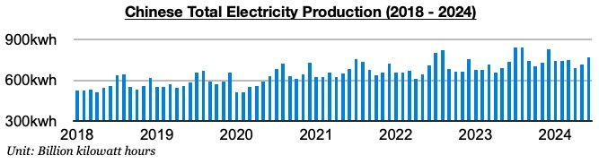
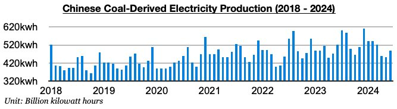
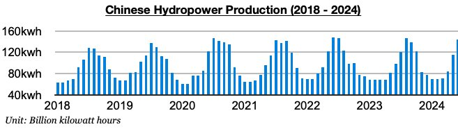
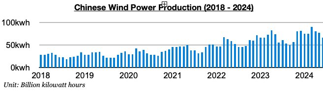
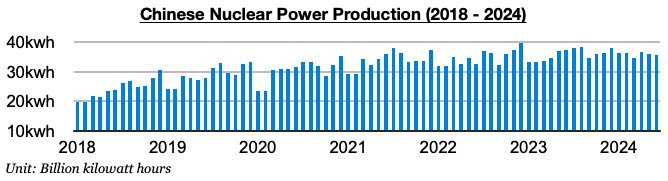
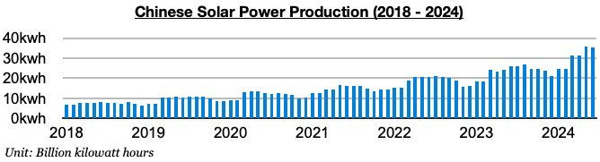

# Latest Chinese Electricity Production By Generation Type

**Date:** July 29, 2024  
**Publisher:** Breakwave Advisors | **Category:** Market Insights  
**Original URL:** [https://www.breakwaveadvisors.com/insights/2024/7/29/xb8c3fza1py905d1dvhu6x77yxp9pk](https://www.breakwaveadvisors.com/insights/2024/7/29/xb8c3fza1py905d1dvhu6x77yxp9pk)  

---

*By*[*Jeffrey Landsberg*](https://www.linkedin.com/in/jeffrey-landsberg-70ab957/)

China’s total electricity generation came in at 768.5 billion kilowatt hours last month. This has marked a month-on-month increase of 50.6 billion kilowatt hours (7%) and is up year-on-year by 28.6 billion kilowatt hours (4%).

> **Figure 1: Chart 1 (1)**  
> [Local Asset](file:///C:/Users/Dell/Github/Shipping/corpus/03-breakwave/insights/2024/assets/2024-07-29_xb8c3fza1py905d1dvhu6x77yxp9pk_img_chart128129_6fe996c56618.jpg)

Coal-derived electricity generation totaled 487 billion kilowatt hours. While this has marked a month-on-month increase of 33.2 billion kilowatt hours (7%), it is down year-on-year by 35.8 billion kilowatt hours (-7%). Coal-derived electricity generation has now contracted for two straight months.

> **Figure 2: Chart 2 (1)**  
> [Local Asset](file:///C:/Users/Dell/Github/Shipping/corpus/03-breakwave/insights/2024/assets/2024-07-29_xb8c3fza1py905d1dvhu6x77yxp9pk_img_chart228129_44099d2804d6.jpg)

Hydropower output totaled 143.8 billion kilowatt hours. This is up month-on-month by 28.8 billion kilowatt hours (25%) and is up year-on-year by 45.6 billion kilowatt hours (46%). Hydropower output has increased on a year-on-year basis for eleven straight months. As we discussed in Commodore Research's most recent Weekly Dry Bulk Report, last month’s growth set a ten-year record as rainfall in June was again much heavier than usual in southern China.

> **Figure 3: Chart 3**  
> [Local Asset](file:///C:/Users/Dell/Github/Shipping/corpus/03-breakwave/insights/2024/assets/2024-07-29_xb8c3fza1py905d1dvhu6x77yxp9pk_img_chart3_640d326db8c5.jpg)

Wind power production totaled 66.9 billion kilowatt hours. This has marked a month-on-month decline of 10.2 billion kilowatt hours (-13%) but is up year-on-year by 11.2 billion kilowatt hours (20%).

> **Figure 4: Chart 4**  
> [Local Asset](file:///C:/Users/Dell/Github/Shipping/corpus/03-breakwave/insights/2024/assets/2024-07-29_xb8c3fza1py905d1dvhu6x77yxp9pk_img_chart4_139e3f6fca78.jpg)

Nuclear power production totaled 35.7 billion kilowatt hours. This is down month-on-month by 300 million kilowatt hours (-1%) and is down year-on-year by 1.6 billion kilowatt hours (-4%).

> **Figure 5: Chart 5**  
> [Local Asset](file:///C:/Users/Dell/Github/Shipping/corpus/03-breakwave/insights/2024/assets/2024-07-29_xb8c3fza1py905d1dvhu6x77yxp9pk_img_chart5_f6679b9b817d.jpg)

Solar power production totaled 35.2 billion kilowatt hours. This is down month-on-month by 700 million kilowatt hours (-2%) but is up year-on-year by 9.3 billion kilowatt hours (36%).

> **Figure 6: Chart 6**  
> [Local Asset](file:///C:/Users/Dell/Github/Shipping/corpus/03-breakwave/insights/2024/assets/2024-07-29_xb8c3fza1py905d1dvhu6x77yxp9pk_img_chart6_291be7914f09.jpg)

---

**Tags:** China, Coal, Drybulk  
