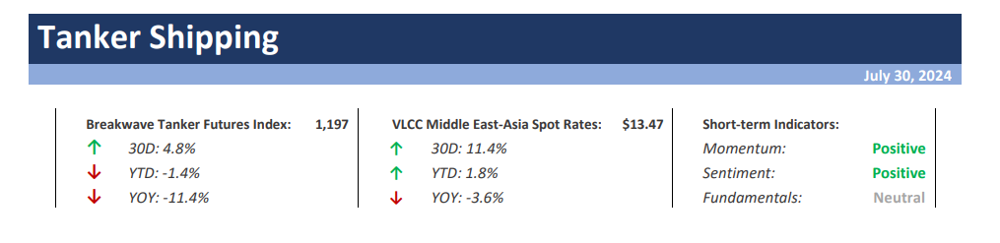
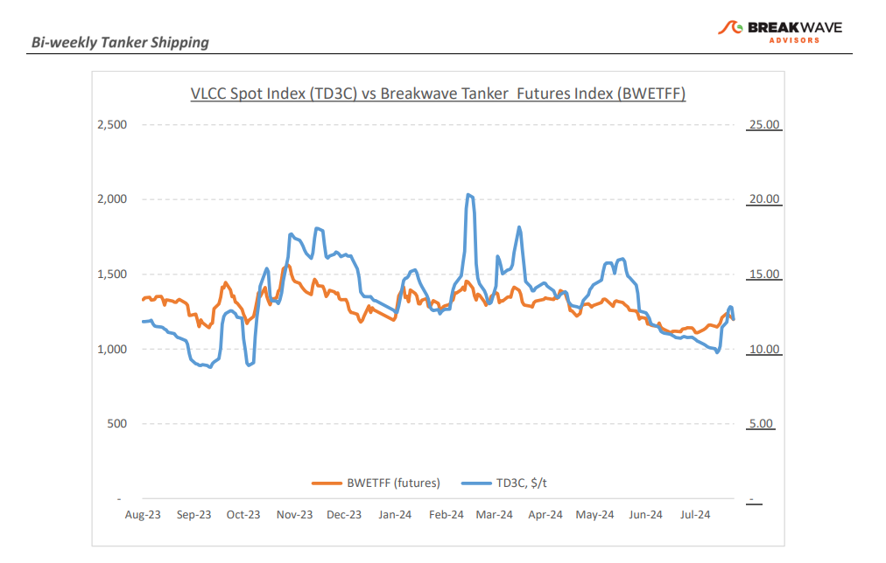
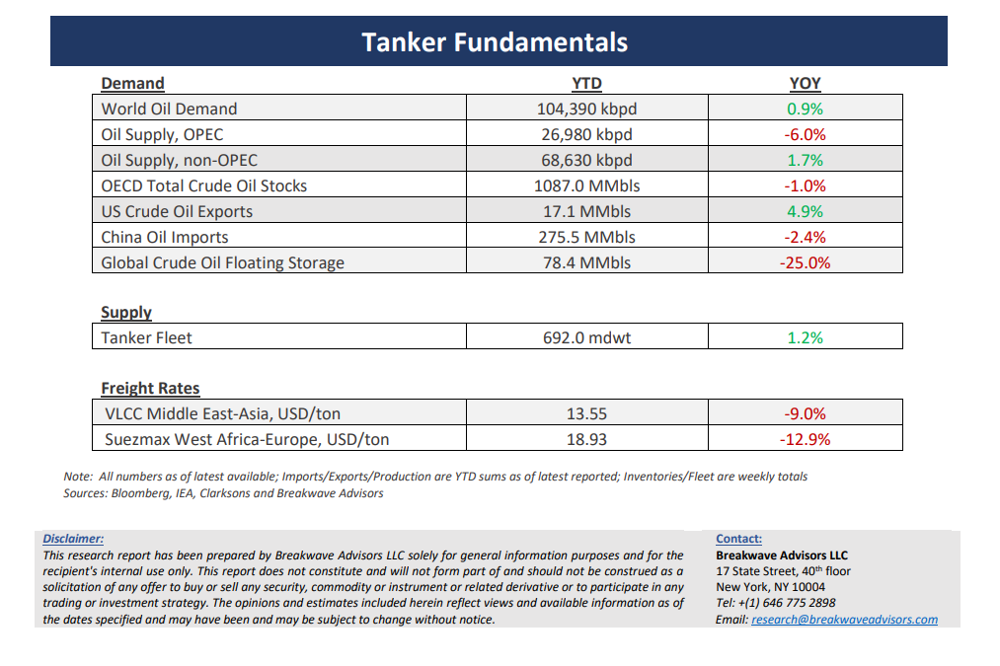

# Breakwave Bi-Weekly Tanker Report - July 30, 2024

**Date:** July 30, 2024  
**Publisher:** Breakwave Advisors | **Category:** Market Insights  
**Original URL:** [https://www.breakwaveadvisors.com/insights/2024730wet-87w332](https://www.breakwaveadvisors.com/insights/2024730wet-87w332)  

---

> **Figure 1: Cea3cf84ceb9ceb3cebcceb9cf8ccf84cf85**  
> [Local Asset](file:///C:/Users/Dell/Github/Shipping/corpus/03-breakwave/insights/2024/assets/2024-07-30_2024730wet-87w332_img_cea3cf84ceb9ceb3cebcceb9cf8ccf84cf85_519d53a8fc1d.png)

**· VLCC Market Sentiment Rebounds but Excitement Might Be Short Lived as Volumes Remain Subdued**– The second half of July proved to be a**sharp contrast**to the earlier month’s weakness, with the**final week bringing improved**market sentiment for the VLCC Middle East Gulf to China route and a firmer momentum in the Atlantic market. Initially, VLCC activity in the Arabian Gulf appeared sluggish. However, a**healthier tonnage list**bolstered market sentiment despite the initial lack of activity. As we approach the end of the month, VLCC MEG-China rates have recorded a 6% monthly increase and a 5% year-over-year rebound during a period of seasonally slow activity. In the Atlantic basin, earlier vessels secured bookings to minimize waiting times, and the shortage of ballasters from the East now suggests that**this market may continue**its upward trajectory in the near term. The latest positive shift is promising for both regions as we head into August. However, one should not forget that slow crude oil imports during the summer season could threaten the recent firmness in the crude freight market as**typically summer sees a dip in crude oil demand**due to reduced refinery activity and long maintenance periods. Furthermore, geopolitical factors and fluctuating oil prices can exacerbate the situation, leading to uncertainty and reduced chartering activity. If refineries delay purchases or scale back operations due to lower margins or economic concerns, the demand for crude transport will decline, putting additional pressure on freight rates. Nevertheless, it is always encouraging to see such a surge in demand during an otherwise slow period, which reflects**a tighter market for VLCCs**, something that is increasingly evident by the lack of new vessel supply.

**· China’s Oil Demand Remains the Main Concern When It Comes to the Oil Tanker Sector**– The**weakness in the Chinese oil**sector largely shapes the current crude oil**freight market sentiment**. Firstly, China’s economic growth has been slower than expected, impacting industrial activity and, consequently, oil consumption. Secondly, the Chinese government has been implementing policies to reduce carbon emissions and transition to cleaner energy sources. This**shift towards greener energy alternatives**has resulted in a strategic**reduction in****crude oil imports**, as China increases its investments in renewable energy and electric vehicles. Moreover, ongoing**struggles**within the**Chinese property sector,**a significant consumer of oil-related products, have further exacerbated the situation. The construction slowdown has led to decreased demand for diesel and other oil derivatives, indirectly affecting crude oil imports. Additionally,**high inventory levels**in China have also contributed to the weak market sentiment. With substantial stockpiles of crude oil and refined products, Chinese buyers have less urgency to procure new supplies, leading to fewer vessels being chartered.

**· Our Long-term View –**The tanker market is recovering from a long period of staggered rates as the growth in new vessel supply shrinks while oil demand is recovering in line with the global economy. A historically low orderbook combined with favorable demand fundamentals should continue to support increased spot rate volatility, which combined with the ongoing geopolitical turmoil, should support freight rates in the medium to long term.

> **Figure 2: Cea3cf84ceb9ceb3cebcceb9cf8ccf84cf85**  
> [Local Asset](file:///C:/Users/Dell/Github/Shipping/corpus/03-breakwave/insights/2024/assets/2024-07-30_2024730wet-87w332_img_cea3cf84ceb9ceb3cebcceb9cf8ccf84cf85_3d35b9acaed8.png)

> **Figure 3: Cea3cf84ceb9ceb3cebcceb9cf8ccf84cf85**  
> [Local Asset](file:///C:/Users/Dell/Github/Shipping/corpus/03-breakwave/insights/2024/assets/2024-07-30_2024730wet-87w332_img_cea3cf84ceb9ceb3cebcceb9cf8ccf84cf85_a0f09d4070a7.png)

### Subscribe:
