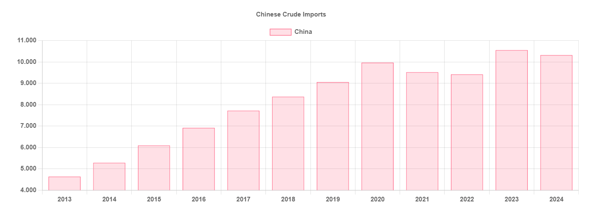

# Is China’s crude craze over?

**Date:** July 30, 2024  
**Publisher:** Breakwave Advisors | **Category:** Market Insights  
**Original URL:** [https://www.breakwaveadvisors.com/insights/2024/7/30/is-chinas-crude-craze-over](https://www.breakwaveadvisors.com/insights/2024/7/30/is-chinas-crude-craze-over)  

---

> **Figure 1: Crude Tanker**  
> **Interactive Data & Source:** [Gibsons Co](https://www.gibsons.co.uk/market-reports) | [Local Asset](file:///C:/Users/Dell/Github/Shipping/corpus/03-breakwave/insights/2024/assets/2024-07-30_is-chinas-crude-craze-over_img_crude-tanker_fb6f869b3cec.jpg)

China saw an impressive rebound in crude imports last year, driven by the country’s post-Covid economic recovery. However, the picture is different this year, with average crude shipments into the country somewhat slipping, down by 50 kbd during the 1st half of the year, compared to the same period in 2023.

Imports are sluggish in part due to heavy maintenance taking place in Q2 and weakening refining margins in Asia. As a result, China’s refinery output was down 3.7% year on year in June according to data from the Chinese National Bureau of Statistics, and Sinochem reportedly closed two refineries with a total capacity of 300 kbd in Shandong province for an unspecified period following the end of seasonal maintenance. Structurally, Chinese demand is also challenged, due to reduced factory strength as well as an ongoing housing crash. The construction sector is reeling from 12 consecutive months of drops in home sales, lowering consumption of plastics and refined products. Similarly, China’s official PPI numbers, which can be used as a proxy for factory strength, have been negative for 20 months. Another key factor behind demand weakness is the growing share of EVs in the Chinese vehicle fleet. China now accounts for over half of global EV sales, and 45% of cars sold this year in China will be electric, according to the IEA.

The above suggests that the strong growth in Chinese crude imports of the last two decades, with shipments growing on average by over 10% per annum between 2013 and 2020, is a thing of the past. Nevertheless, with 10.6 mbd of crude imports in 2023, China remains by far the largest single importer of crude globally, with India a distant second at 4.6 mbd.

Going forward, Chinese oil demand is still expected to increase, although at a considerably slower pace compared to an impressive 1.46 mbd gain in consumption seen last year. The IEA expects the country’s oil demand to increase by 510 kbd in 2024 and by a further 370 kbd in 2025.

As a result, refining runs are also expected to pick up later in the year and in 2025, supporting incremental crude imports. According to the IEA, crude throughput could increase by 500 kbd during the second half of 2024 versus the first half, as existing plants come out of maintenance. A further increase of 500 kbd (on an annual average basis) is projected in 2025, as the anticipated start-up of the 430 kbd Yulong refinery in Q4 2024 will help to lift processing runs. Continued stockpiling could also provide a short-term bolstering effect, as China reportedly has asked its state oil companies to add nearly 60 million barrels to the country’s emergency stockpiles by March 2025 to boost supply security.

The longer-term outlook, however, is more uncertain. Chinese oil demand is expected to plateau by the end of this decade, with EVs curtailing consumption of key transportation fuels. Yet, whilst growth in crude refining runs is expected to slow down drastically, the projected 500 kbd decline in China’s oil production could still see incremental imports, albeit at much slower pace relative to what has been seen in the past.

> **Figure 2: Στιγμιότυπο Οθόνης 2024 07 30 141427**  
> **Interactive Data & Source:** [Gibsons Co](https://www.gibsons.co.uk/market-reports) | [Local Asset](file:///C:/Users/Dell/Github/Shipping/corpus/03-breakwave/insights/2024/assets/2024-07-30_is-chinas-crude-craze-over_img_cea3cf84ceb9ceb3cebcceb9cf8ccf84cf85_c4768bba09c8.png)

Data source:[Gibson Shipbrokers](https://www.gibsons.co.uk/market-reports)

---

**Tags:** Crude, Tankers, Shipping  
