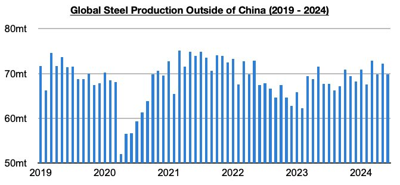
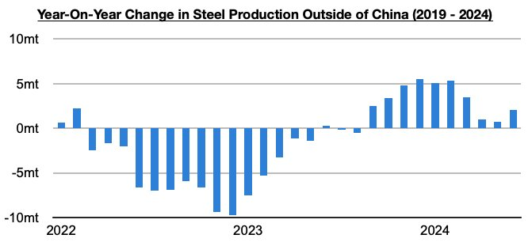
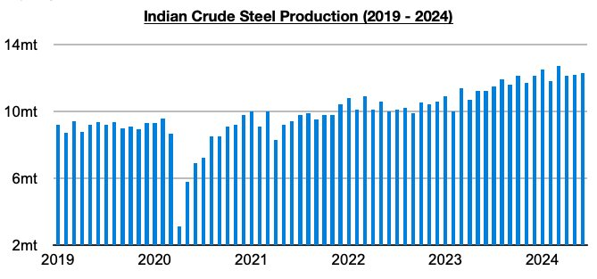
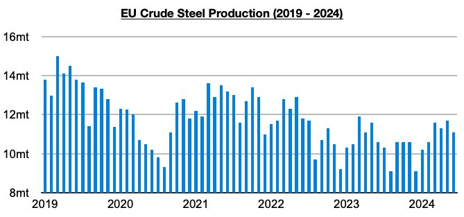

# Growth in Steel Output Outside of China

**Date:** August 01, 2024  
**Publisher:** Breakwave Advisors | **Category:** Market Insights  
**Original URL:** [https://www.breakwaveadvisors.com/insights/2024/8/1/growth-in-steel-output-outside-of-china](https://www.breakwaveadvisors.com/insights/2024/8/1/growth-in-steel-output-outside-of-china)  

---

*By*[*Jeffrey Landsberg*](https://www.linkedin.com/in/jeffrey-landsberg-70ab957/)

Global steel production totaled approximately 161.4 million tons in June. This is down month-on-month by 3.7 million tons (-2%) but is 2.6 million tons (2%) more than was reported last year for June 2023’s production. Steel production outside of China totaled approximately 69.8 million tons. This is down month-on-month by 2.4 million tons (-3%) but is 2.1 million tons (3%) more than was reported last year for June 2023’s production.

> **Figure 1: Chart 1**  
> [Local Asset](file:///C:/Users/Dell/Github/Shipping/corpus/03-breakwave/insights/2024/assets/2024-08-01_growth-in-steel-output-outside-of-china_img_chart1_cffb0d7200ea.jpg)

Steel production outside of China has now grown on a year-on-year basis for ten straight months. Very positive is that while it appeared that production would enter contraction soon, June saw a rebound in year-on-year growth. Year-on-year growth had been falling since March and came in at only 700,000 tons in May, but June enjoyed a jump. For now, growth remains sustained. Year-on-year growth experienced a particularly strong rebound in the European Union, and it has stayed robust in India.

> **Figure 2: Chart 2**  
> [Local Asset](file:///C:/Users/Dell/Github/Shipping/corpus/03-breakwave/insights/2024/assets/2024-08-01_growth-in-steel-output-outside-of-china_img_chart2_062d695e4437.jpg)

Indian steel production totaled 12.3 million tons. This is 100,000 tons (1%) more than was produced in May and is 1.1 million tons (10%) more than was reported last year for June 2023’s production. India’s production has now increased on a year-on-year basis for sixteen straight months.

> **Figure 3: Chart 3**  
> [Local Asset](file:///C:/Users/Dell/Github/Shipping/corpus/03-breakwave/insights/2024/assets/2024-08-01_growth-in-steel-output-outside-of-china_img_chart3_853f4292df80.jpg)

EU production totaled 11.1 million tons. This is 600,000 tons (-5%) less than was produced in May but is 500,000 tons (2%) more than was reported last year for June 2023’s production. Production has now grown on a year-on-year basis for three straight months. Before the last three months, EU production had fallen on a year-on-year basis during twenty-six of the previous twenty-eight months.

> **Figure 4: Chart 4**  
> [Local Asset](file:///C:/Users/Dell/Github/Shipping/corpus/03-breakwave/insights/2024/assets/2024-08-01_growth-in-steel-output-outside-of-china_img_chart4_3283ff6eeee4.jpg)

---

**Tags:** Drybulk, Ironore, Shipping  
