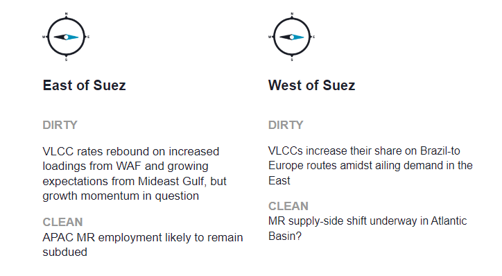
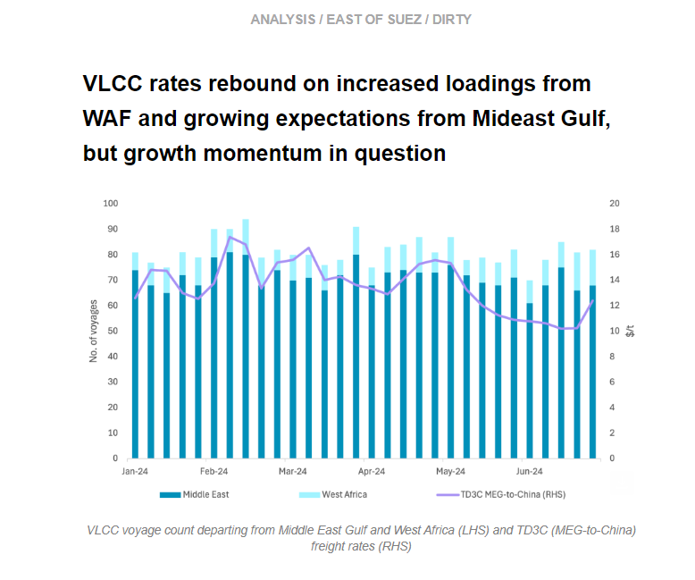
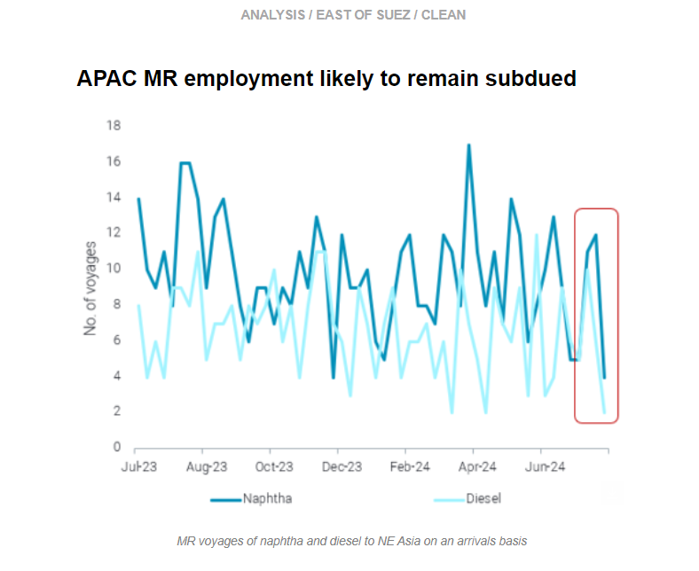
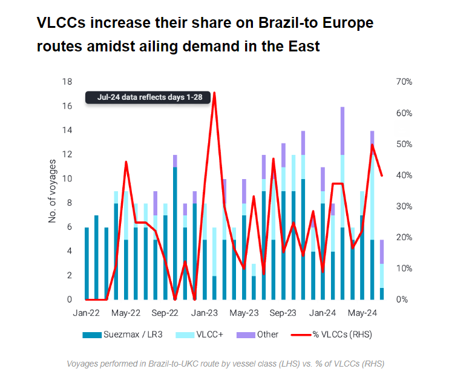
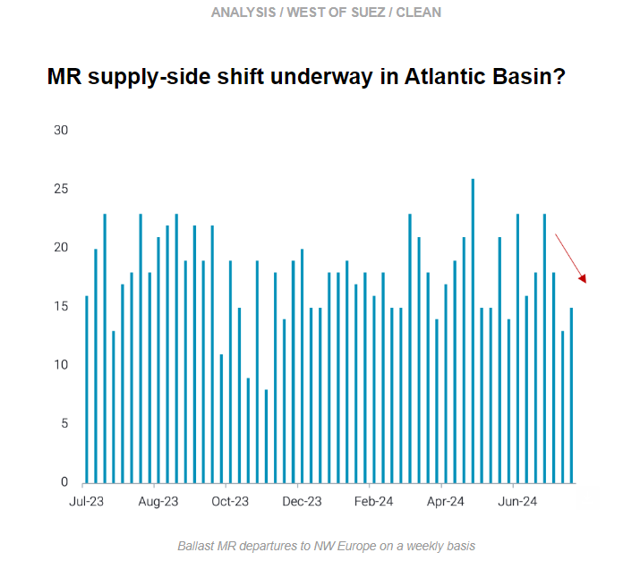

# VLCC rates in WAf and MEG rebound

**Date:** August 01, 2024  
**Publisher:** Breakwave Advisors | **Category:** Market Insights  
**Original URL:** [https://www.breakwaveadvisors.com/insights/2024/8/1/vlcc-rates-in-waf-and-meg-rebound](https://www.breakwaveadvisors.com/insights/2024/8/1/vlcc-rates-in-waf-and-meg-rebound)  

---

In this final issue of the Freight Newsletter in its current form, we contextualise the rebound in VLCC freight rates from WAf and the Middle East in terms of Asia’s crude demand. On the clean side, we discuss the prospect for APAC product demand and what this could mean for MRs. In the West, we explore the increasing exposure of VLCCs on the Brazil-to-Europe route, and we investigate a possible supply-side shift for Atlantic Basin MRs.

*By*[*Mary Melton*](https://www.linkedin.com/search/results/all/?fetchDeterministicClustersOnly=true&heroEntityKey=urn%3Ali%3Afsd_profile%3AACoAABXVyecBtg-pRnIrZe0BoWk0ygPiUfbvhsw&keywords=mary%20melton&origin=RICH_QUERY_SUGGESTION&position=0&searchId=40e8d7d2-c4d0-4022-81e7-176f6eba418b&sid=H_Y&spellCorrectionEnabled=false)

> **Figure 1: Στιγμιότυπο Οθόνης 2024 08 01 105201**  
> **Interactive Data & Source:** [Marketingmail Vortexa](https://marketingmail.vortexa.com/ODM3LU1aRS01NzgAAAGUqCvTsbIeh1TRYZcGPmSp_8dC-e_e8QmBezvlXf1AZOCf57j86n3mUf_eRm7WHXQE48sjlqw=) | [Local Asset](file:///C:/Users/Dell/Github/Shipping/corpus/03-breakwave/insights/2024/assets/2024-08-01_vlcc-rates-in-waf-and-meg-rebound_img_cea3cf84ceb9ceb3cebcceb9cf8ccf84cf85_4a83084d19d6.png)

> **Figure 2: Στιγμιότυπο Οθόνης 2024 08 01 105220**  
> **Interactive Data & Source:** [Marketingmail Vortexa](https://marketingmail.vortexa.com/ODM3LU1aRS01NzgAAAGUqCvTsbIeh1TRYZcGPmSp_8dC-e_e8QmBezvlXf1AZOCf57j86n3mUf_eRm7WHXQE48sjlqw=) | [Local Asset](file:///C:/Users/Dell/Github/Shipping/corpus/03-breakwave/insights/2024/assets/2024-08-01_vlcc-rates-in-waf-and-meg-rebound_img_cea3cf84ceb9ceb3cebcceb9cf8ccf84cf85_66f19421cbeb.png)

- [TD3C (MEG-China)](https://marketingmail.vortexa.com/ODM3LU1aRS01NzgAAAGUqCvTsbIeh1TRYZcGPmSp_8dC-e_e8QmBezvlXf1AZOCf57j86n3mUf_eRm7WHXQE48sjlqw=)and[TD15( WAf-to-China)](https://marketingmail.vortexa.com/ODM3LU1aRS01NzgAAAGUqCvTsYkxWoyxIOS-sMI2zbw5_anqiCDYqTD4GlKt2iTWMjuqi-mdUfP4lSeyNPviWyC8mjY=)freight rates rebounded last week after reaching their year-to-date lows in mid-July.

- [Increased VLCC loadings from West Africa in July](https://marketingmail.vortexa.com/ODM3LU1aRS01NzgAAAGUqCvTsdqgwh77-4oMUYDgmZPI2NJ5GBHba5jV-DozLVRuDLJ8NvBqqxxiO6RmUPjJOKvW9hs=), as well as expectations of higher loadings from Mideast Gulf in late July and August dates, have been the key drivers behind this rebound.
- The sustainability of this momentum however, remains in question, with multiple factors pointing towards continued weakness in Asia’s crude demand. China’s refinery margins continue to be mired by weak domestic consumption, whilst Indian refineries could slow crude purchases as multiple refineries enter planned maintenance in Q3. A closed US-Asia crude arbitrage has further shaved off hopes of a recovery in long-haul VLCC voyages, likely capping upsides on VLCC rates in the near-term.

> **Figure 3: Στιγμιότυπο Οθόνης 2024 08 01 105413**  
> **Interactive Data & Source:** [Marketingmail Vortexa](https://marketingmail.vortexa.com/ODM3LU1aRS01NzgAAAGUqCvTsXJ2VW_M69FiyfldMMTkYxObUSNlQf3Fgz3XP-0hkqafFgKwHdGDOn6-TDfRt1dhybI=) | [Local Asset](file:///C:/Users/Dell/Github/Shipping/corpus/03-breakwave/insights/2024/assets/2024-08-01_vlcc-rates-in-waf-and-meg-rebound_img_cea3cf84ceb9ceb3cebcceb9cf8ccf84cf85_7b3da6f8d47e.png)

- MR freight rates in APAC continue to decline as[prompt vessel availability](https://marketingmail.vortexa.com/ODM3LU1aRS01NzgAAAGUqCvTsXJ2VW_M69FiyfldMMTkYxObUSNlQf3Fgz3XP-0hkqafFgKwHdGDOn6-TDfRt1dhybI=)continues to increase, and overall MR supply in NE/SE Asia remains at high levels after a large increase in June.

- In the past week, arrivals of[naphtha](https://marketingmail.vortexa.com/ODM3LU1aRS01NzgAAAGUqCvTsW_SplneV4IzFufKWA1qChZOo06jxFnIuz_pd8ewHU-7Kl0Cgi-bggFu5Z0rCRaiHnc=)and[diesel](https://marketingmail.vortexa.com/ODM3LU1aRS01NzgAAAGUqCvTsdkkVTu8Cmi5kww5RhCYcR-6MkGuq9T_t6j52OEy7y0KDGglXRwrdXXKPzV4P2Y_3_Y=)into NE Asia have declined, and there are indications that the market might be saturated. Both light and middle distillate stocks in Singapore are rising, reaching a 7-week high and 3-month high respectively.
- Economic run cuts by Northeast Asia refiners are continuing, which will likely continue to limit MR employment in the region. However, support could come in the medium term as the Indian refinery maintenance season is underway, which might support product cracks in APAC and stimulate MR demand.

> **Figure 4: Στιγμιότυπο Οθόνης 2024 08 01 105521**  
> **Interactive Data & Source:** [Marketingmail Vortexa](https://marketingmail.vortexa.com/ODM3LU1aRS01NzgAAAGUqCvTsUlkNrbMS-jxkzmxNlt1YKamGcnpdJMeiW7vJBOs2Rh8kRku8Xg2oLxp3mZJc5k8O5M=) | [Local Asset](file:///C:/Users/Dell/Github/Shipping/corpus/03-breakwave/insights/2024/assets/2024-08-01_vlcc-rates-in-waf-and-meg-rebound_img_cea3cf84ceb9ceb3cebcceb9cf8ccf84cf85_e326b5c13e0c.png)

- A drop in VLCC rates combined with weak crude Chinese demand has triggered an increasing share of VLCC voyages in alternative trades.

- The premiums of Suezmaxes and VLCCs for the Brazilian-to-UKC routes reached a high of 10 $/t in June (Argus), prompting a higher number of loadings for the larger vessel segment because of financial appeal.[Around half of the voyages performing this transatlantic trade over the past two months were on VLCCs](https://marketingmail.vortexa.com/ODM3LU1aRS01NzgAAAGUqCvTsUlkNrbMS-jxkzmxNlt1YKamGcnpdJMeiW7vJBOs2Rh8kRku8Xg2oLxp3mZJc5k8O5M=), which is the biggest share for this vessel class since August 2023.
- Despite the recent mini-rallies on TD3C (MEG-to-East) as well as TD15 (WAf-to-East), TD22 (USG-to-East) freight rates are hovering around 2024-lows which might entice ballasters heading to the Atlantic to reposition to Brazil instead of the US Gulf. Having said that, as the Suezmax premiums over VLCCs are currently only around 2 $/t (Argus), additional demand for VLCC might be capped.

> **Figure 5: Στιγμιότυπο Οθόνης 2024 08 01 105621**  
> **Interactive Data & Source:** [Marketingmail Vortexa](https://marketingmail.vortexa.com/ODM3LU1aRS01NzgAAAGUqCvTsT-oq4uBm_P_oBqRiPcKa3y5XH9n-0ngoZ7cDD_oL5JV-9lbYyuI3zUBQ1FPfuy75Nw=) | [Local Asset](file:///C:/Users/Dell/Github/Shipping/corpus/03-breakwave/insights/2024/assets/2024-08-01_vlcc-rates-in-waf-and-meg-rebound_img_cea3cf84ceb9ceb3cebcceb9cf8ccf84cf85_f7321fb3ef73.png)

- US Gulf MR freight rates have recently been very volatile because the vessel supply-side has outmuscled the high demand for MRs as short-haul employment has failed to clear tonnage. (Read more[here](https://marketingmail.vortexa.com/ODM3LU1aRS01NzgAAAGUqCvTsT-oq4uBm_P_oBqRiPcKa3y5XH9n-0ngoZ7cDD_oL5JV-9lbYyuI3zUBQ1FPfuy75Nw=).)

- However, there are a few factors pointing to a possible shift in supply-side dynamics for MRs in the Atlantic Basin. The number of[ballast vessels departing for NW Europe](https://marketingmail.vortexa.com/ODM3LU1aRS01NzgAAAGUqCvTsSfUcf3JoCPRcVlKM6LaEGeHysfd0-SraakIezYL3ANzCVYmy9VqlnaJqkOnzmA6riQ=)has decreased over the past month, pointing to a likely tightening supply. Additionally, a softly but persistently open arbitrage for diesel US Gulf-to-Europe (Argus) has[increased transatlantic utilisation](https://marketingmail.vortexa.com/ODM3LU1aRS01NzgAAAGUqCvTsaMeXiQBmXNurWr3AA5usufvOXN3Thb9cqhafFfTNPotUASwxEHNFVr9eWyio3uHcAM=)over the past two weeks. Increasing earnings in Europe will likely entice these vessels carrying cargo to NW Europe, which could ease the tonnage imbalance in the US Gulf. Prompt vessel supply in NW Europe thinned during July, where[TC2](https://marketingmail.vortexa.com/ODM3LU1aRS01NzgAAAGUqCvTsalWh2crlSh6NW-xLQHwT4j6-vCsPAdzswpvKK-LEEhpo4u42vJRTVAtjycqUgpHQ2Q=)freight rates increased around 35% in the last month.
- It is very unlikely that the PADD 3 CPP export picture will change drastically. US CPP demand is likely to remain muted, giving us every indication that these barrels will continue to be absorbed in Mexico and the Caribbean and keeping MR demand at strong levels. This could only be tempered slightly in the very short-term by last week’s decline in PADD 3 refinery utilisation (EIA) due to outages affecting gasoline production units, which could translate into a slight decline in available exports.

Data Source:[Vortexa](https://www.vortexa.com//oil-gas-data-traders-analysts-data-scientists?gclid=Cj0KCQjw8_qRBhCXARIsAE2AtRZKOvMnbilZ_6_91d7huSFFy71pWLrnPwGwOHVzXsmsG-1a1mZnQw8aAt89EALw_wcB&hsa_acc=1782073842&hsa_ad=548425387665&hsa_cam=14746637662&hsa_grp=125038601902&hsa_kw=&hsa_mt=&hsa_net=adwords&hsa_src=g&hsa_tgt=dsa-1431852288425&hsa_ver=3&utm_campaign=%5BCD%5D%20-%20DSA%20-%20EMEA&utm_medium=cpc&utm_medium=ppc&utm_source=google&utm_source=adwords&utm_term=)

---

**Tags:** Shipping, Crude Oil, Tankers  
