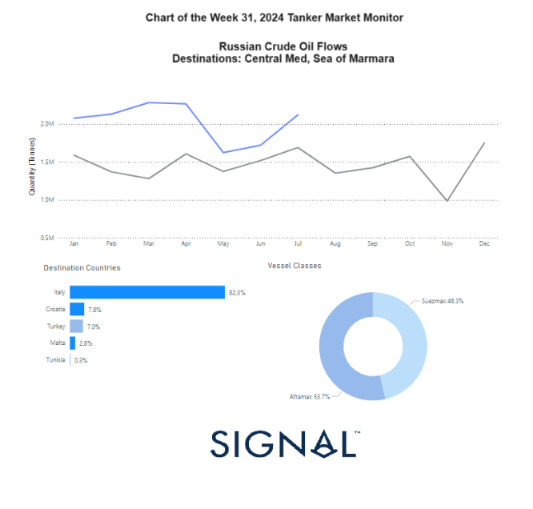
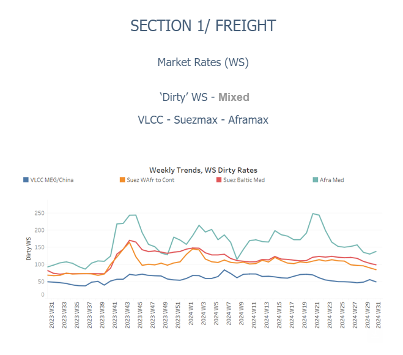
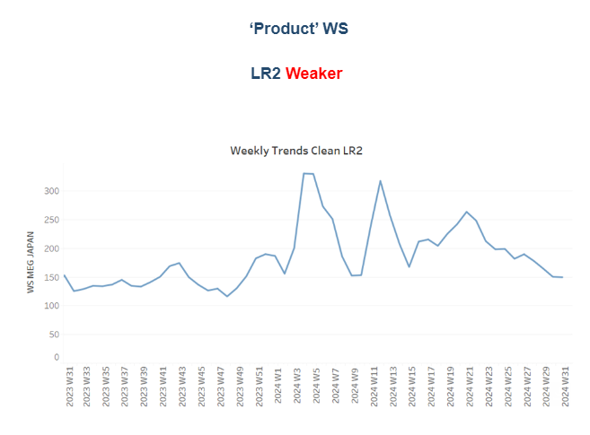
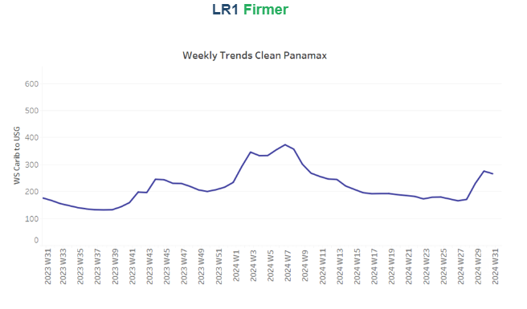
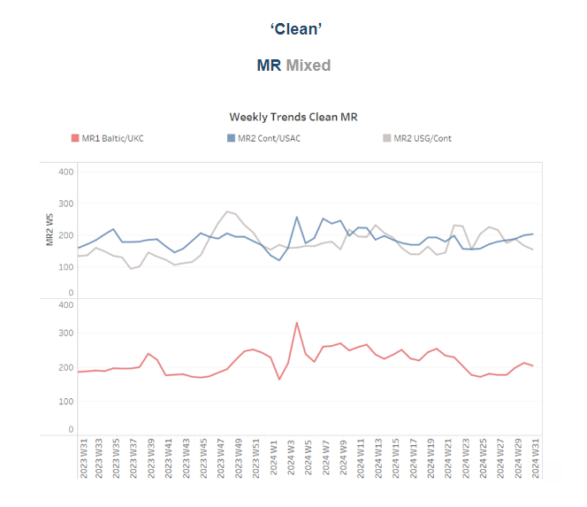
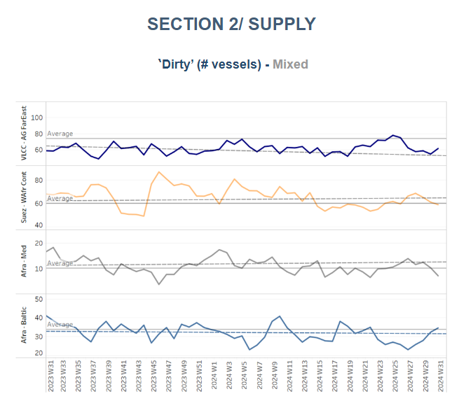
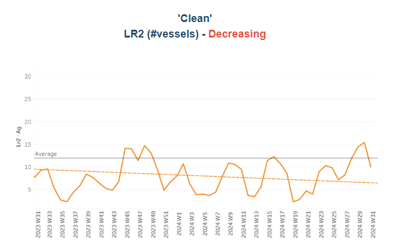
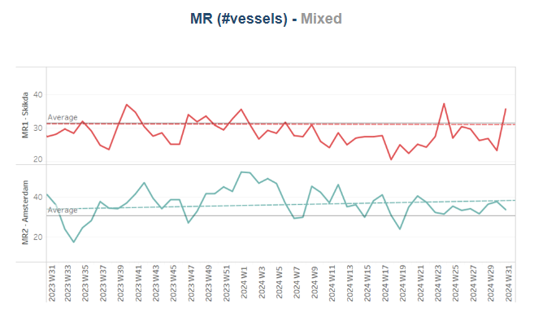
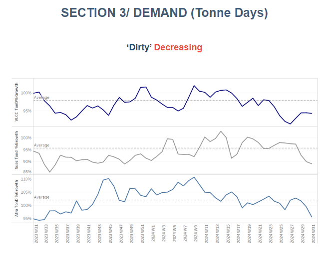
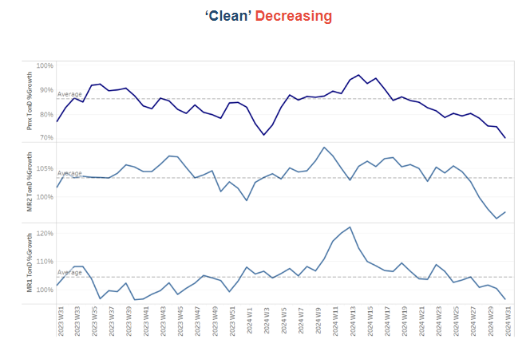

# Russian crude oil shipments

**Date:** August 05, 2024  
**Publisher:** Breakwave Advisors | **Category:** Market Insights  
**Original URL:** [https://www.breakwaveadvisors.com/insights/2024/8/5/russian-crude-oil-shipments](https://www.breakwaveadvisors.com/insights/2024/8/5/russian-crude-oil-shipments)  

---

### Tanker - Weekly Market Monitor

Snapshot of Crude and Product Freight Rates, Supply-Demand

Week 31, August 02, 2024

*This week's chart underscores the upward trend in the monthly quantity of Russian crude oil shipments to the Central Mediterranean and the Sea of Marmara. Italy has emerged as the leading destination country, reflecting a significant shift in trade routes. The Suezmax vessel size category has taken a substantial share, accounting for 46% of the shipment volume, while the Aframax size category leads with 54%. In contrast, there has been a notable decrease in the volumes of Russian crude oil being shipped to Asia, particularly to China and India. After a surge in Russian crude oil shipments to India last year, both China and India are no longer purchasing record volumes. It seems that the Central Mediterranean and the Sea of Marmara are becoming key regions for Russian oil, indicating potential strategic realignments by exporters to navigate sanctions and explore new market opportunities.*

> **Figure 1: Στιγμιότυπο Οθόνης 2024 08 05 133525**  
> **Interactive Data & Source:** [Signal Ocean Platform](https://go.signalocean.com/e/983831/-Loss-Despite-War-Premium-html/2qfnkb/428015709/h/cO3ZhlGtJcm3ZgdilJUOZ1QpWCIvCOV-UVUJpclHWE8) | [Local Asset](file:///C:/Users/Dell/Github/Shipping/corpus/03-breakwave/insights/2024/assets/2024-08-05_russian-crude-oil-shipments_img_cea3cf84ceb9ceb3cebcceb9cf8ccf84cf85_6ebb212e128a.png)

In early August, the weakening momentum in the VLCC AG-China route persists, with the dirty demand tonne days growth remaining insufficient to support firmness during the summer season. While there are signs of a decreasing trend in the vessel count at Ras Tanura, indicating a tighter supply market, demand growth has not yet positively impacted market sentiment.

Simultaneously, oil prices continue to be influenced by geopolitical tensions. Energy experts predict further escalations, but they believe these are likely to be managed in a coordinated manner that will prevent significant disruptions to oil markets. Despite a surge in oil prices earlier this week due to expectations of a major escalation in the Middle East, benchmarks are set for their fourth consecutive weekly loss. This reflects ongoing concerns about demand, which have overshadowed the war premium.

Both[Brent crude](https://go.signalocean.com/e/983831/-Loss-Despite-War-Premium-html/2qfnkb/428015709/h/cO3ZhlGtJcm3ZgdilJUOZ1QpWCIvCOV-UVUJpclHWE8)and West Texas Intermediate saw gains earlier in the day, but overall prices have declined compared to last week. Reuters cited a survey showing a slowdown in manufacturing activity across most of the world and the third consecutive annual decline in road traffic in China.

PMI readings for July highlighted a slowdown in economic activity in Asia, Europe, and the United States. Notably, the U.S. PMI dropped sharply, reaching its lowest level in eight months, with a decline in new orders resulting in a reading of 46.8. This global economic slowdown is contributing to the subdued demand for oil, further affecting market dynamics.

> **Figure 2: Στιγμιότυπο Οθόνης 2024 08 05 133803**  
> **Interactive Data & Source:** [Signal Ocean Platform](https://www.thesignalgroup.com/signal-ocean-platform) | [Local Asset](file:///C:/Users/Dell/Github/Shipping/corpus/03-breakwave/insights/2024/assets/2024-08-05_russian-crude-oil-shipments_img_cea3cf84ceb9ceb3cebcceb9cf8ccf84cf85_93ad6d867c9b.png)

​​​​​The dirty freight market sentiment is under downward pressure, despite some soft indications of an upward trend in the Aframax Med route.

- The**VLCC**MEG-China freight rates dropped below 50 WS, reflecting an 18% weekly decrease and a 3% decline compared to the same week in August last year.
- Suezmax freight rates for shipments from**West Africa**to**continental Europe**have fallen below 80 WS, representing a 18% decrease over the past week. Similarly, rates on the**Suez Baltic Med**route have declined, with WS rates now below 100 WS, marking a 18% monthly drop.
- Aframax**Mediterranean**freight rates are hovering around WS140, marking a 50% increase compared to the same week last year.

> **Figure 3: Στιγμιότυπο Οθόνης 2024 08 05 133935**  
> **Interactive Data & Source:** [Signal Ocean Platform](https://www.thesignalgroup.com/signal-ocean-platform) | [Local Asset](file:///C:/Users/Dell/Github/Shipping/corpus/03-breakwave/insights/2024/assets/2024-08-05_russian-crude-oil-shipments_img_cea3cf84ceb9ceb3cebcceb9cf8ccf84cf85_cb7b2724b067.png)

- **LR2**AG freight rates have consistently declined since the beginning of July, now hovering around WS150. This represents an 18% monthly drop, with recent levels reflecting the sentiment of the same week in August last year.

> **Figure 4: Στιγμιότυπο Οθόνης 2024 08 05 133949**  
> **Interactive Data & Source:** [Signal Ocean Platform](https://www.thesignalgroup.com/signal-ocean-platform) | [Local Asset](file:///C:/Users/Dell/Github/Shipping/corpus/03-breakwave/insights/2024/assets/2024-08-05_russian-crude-oil-shipments_img_cea3cf84ceb9ceb3cebcceb9cf8ccf84cf85_dd66bc106e12.png)

- **Panamax**Carib-to-USG rates have increased to WS 260, marking a 56% improvement compared to the same week a month ago.

> **Figure 5: Στιγμιότυπο Οθόνης 2024 08 05 134001**  
> **Interactive Data & Source:** [Signal Ocean Platform](https://www.thesignalgroup.com/signal-ocean-platform) | [Local Asset](file:///C:/Users/Dell/Github/Shipping/corpus/03-breakwave/insights/2024/assets/2024-08-05_russian-crude-oil-shipments_img_cea3cf84ceb9ceb3cebcceb9cf8ccf84cf85_a7d21aa4a4c6.png)

- **MR1**rates for shipments from the**Baltic to the continent**have risen to nearly 200 WS, showing a 11% increase compared to levels a month ago. Meanwhile,**MR2**rates for shipments from the Continent to the USAC have risen above WS200, marking a 12% increase compared to the same week last year. Conversely, on the**USG-Cont**route, MR2 rates have fallen to WS 150, reflecting a 30% decrease over the past month.

> **Figure 6: Στιγμιότυπο Οθόνης 2024 08 05 134221**  
> **Interactive Data & Source:** [Signal Ocean Platform](https://www.thesignalgroup.com/signal-ocean-platform) | [Local Asset](file:///C:/Users/Dell/Github/Shipping/corpus/03-breakwave/insights/2024/assets/2024-08-05_russian-crude-oil-shipments_img_cea3cf84ceb9ceb3cebcceb9cf8ccf84cf85_e36ec521d253.png)

​​​​​​The supply trend for crude tankers presents a mixed picture: Suezmax WAFR showed signs of a decline from the previous week, VLCC Ras Tanura remained below the annual trend, while the number of Aframax vessels in the Baltic experienced upward pressure from the end of week 27.

- **VLCC Ras Tanura**: The number of ships is now 62, nearly 12 vessels fewer than the annual average.
- **Suezmax Wafr**: The current ship count is now below 65, with no indications of an imminent upward trend over the last three weeks.
- **Aframax Med**: The number of ships dropped to six, nearly 50% below the annual trend, indicating a downward movement for early August.
- **Aframax Baltic**: Since the end of week 26, there has been a noticeable upward trend, with current levels around 35, 5 more than the previous weekly indications.

> **Figure 7: Στιγμιότυπο Οθόνης 2024 08 05 134347**  
> **Interactive Data & Source:** [Signal Ocean Platform](https://www.thesignalgroup.com/signal-ocean-platform) | [Local Asset](file:///C:/Users/Dell/Github/Shipping/corpus/03-breakwave/insights/2024/assets/2024-08-05_russian-crude-oil-shipments_img_cea3cf84ceb9ceb3cebcceb9cf8ccf84cf85_4f580657cd40.png)

> **Figure 8: Στιγμιότυπο Οθόνης 2024 08 05 134404**  
> **Interactive Data & Source:** [Signal Ocean Platform](https://www.thesignalgroup.com/signal-ocean-platform) | [Local Asset](file:///C:/Users/Dell/Github/Shipping/corpus/03-breakwave/insights/2024/assets/2024-08-05_russian-crude-oil-shipments_img_cea3cf84ceb9ceb3cebcceb9cf8ccf84cf85_7980553a1613.png)

- **Clean LR2 AG Jubail**: The upward trend in the number of vessels observed over the previous two weeks reversed in early August, with the count dropping to 10—five fewer than the peak reached the previous week. It remains to be seen how this trend will develop over the coming days.
- **Clean MR**: Vessel activity for MR1 at Algeria's Skikda port rose to 36, nearly 5 above the annual average, and almost 12 above the bottom observed at the end of week 29. In contrast, MR2 activity in Amsterdam has shown a decrease over the past two weeks, recently reaching 33, nearly 3 more than the annual average.

> **Figure 9: Στιγμιότυπο Οθόνης 2024 08 05 134528**  
> **Interactive Data & Source:** [Signal Ocean Platform](https://www.thesignalgroup.com/signal-ocean-platform) | [Local Asset](file:///C:/Users/Dell/Github/Shipping/corpus/03-breakwave/insights/2024/assets/2024-08-05_russian-crude-oil-shipments_img_cea3cf84ceb9ceb3cebcceb9cf8ccf84cf85_5a43ef264357.png)

- **Dirty**tonne days: The decrease in the growth of VLCC tonne days persisted into early August, although the rate of decline appears to have stabilised. This indicates that while growth is still sluggish, it has levelled off rather than continuing to drop sharply. In contrast, the Suezmax and Aframax segments are experiencing a more pronounced decline during the summer months. The ongoing downturn in these segments reflects broader seasonal patterns and market dynamics affecting tanker demand and freight rates.

> **Figure 10: Στιγμιότυπο Οθόνης 2024 08 05 134616**  
> **Interactive Data & Source:** [Signal Ocean Platform](https://www.thesignalgroup.com/signal-ocean-platform) | [Local Asset](file:///C:/Users/Dell/Github/Shipping/corpus/03-breakwave/insights/2024/assets/2024-08-05_russian-crude-oil-shipments_img_cea3cf84ceb9ceb3cebcceb9cf8ccf84cf85_3ff7a0dee678.png)

- **Panamax**tonne days: In early August, the growth pace continued to exhibit an overall downward trend, maintaining the slow growth observed in May and June. For**Clean MR**tonne days, MR1 vessels continued to show a slight uptick from the end of the previous week. However, a weakening trend is still evident across both vessel sizes during the summer months.

Data Source:[Signal Ocean Platform](https://www.thesignalgroup.com/signal-ocean-platform)

---

**Tags:** Shipping, Tankers, Crude  
