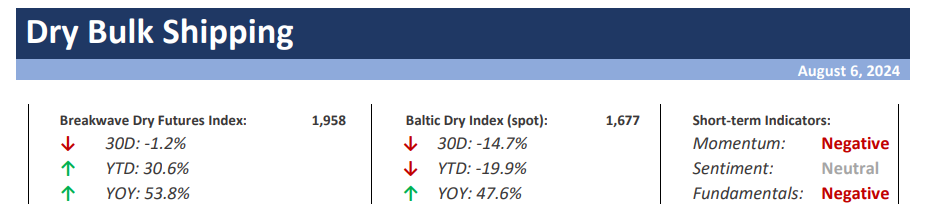
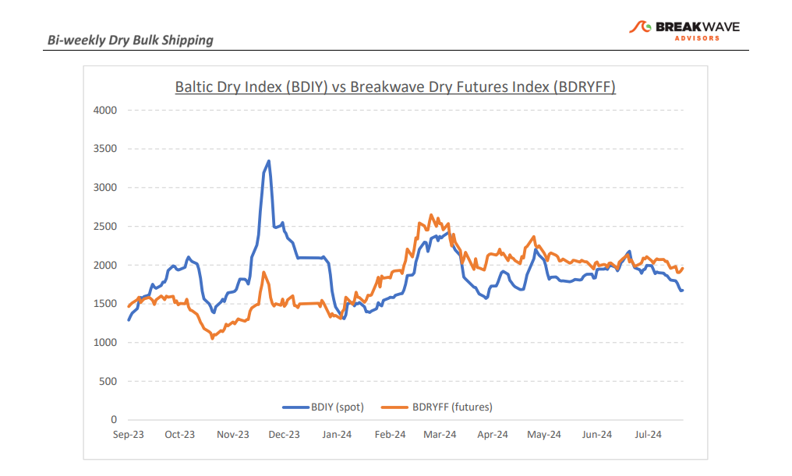
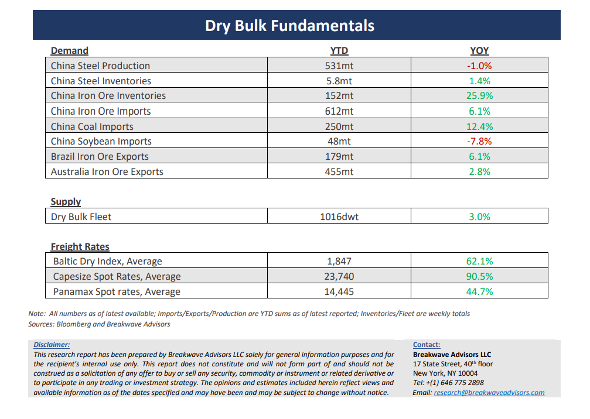

# Breakwave Bi-Weekly Dry Bulk Report - August 6, 2024

**Date:** August 06, 2024  
**Publisher:** Breakwave Advisors | **Category:** Market Insights  
**Original URL:** [https://www.breakwaveadvisors.com/insights/202486dry-87w885](https://www.breakwaveadvisors.com/insights/202486dry-87w885)  

---

> **Figure 1: Cea3cf84ceb9ceb3cebcceb9cf8ccf84cf85**  
> [Local Asset](file:///C:/Users/Dell/Github/Shipping/corpus/03-breakwave/insights/2024/assets/2024-08-06_202486dry-87w885_img_cea3cf84ceb9ceb3cebcceb9cf8ccf84cf85_855c7f211b72.png)

**· Its Always Darkest Before the Dawn: Capesize Rates Should Find a Bottom in the Next Two Weeks –**Although we are still in the midst of a summer slowdown for dry bulk shipping, we**anticipate**a gradual**bottoming**and**turnaround**in spot rates prior to the end of August. Such a forecast is supported by several factors, although the**recent global turmoil**in the financial markets has suddenly introduced**another risk**factor to our forecast that presently seems hard to ignore.**Seasonality supports a recovery**in dry bulk rates as we approach September, especially when we look to the pre-Covid era. Firstly, the**rainy season**in West Africa is**about to peak**and soon charterers will begin to book vessels for mid/end of September bauxite loadings, when the weather will be significantly drier than it currently is. Furthermore, the**fourth quarter rump up**in**Brazilian iron ore**exports is ahead of us and given Vale’s recent updated production guidance, we anticipate increased volumes to be shipped during the final stretch of the year. Finally,**coal should also begin to move**in higher quantities as utilities begin to build some inventories ahead of the**high-demand winter season.**Of course, all the above is currently facing a**major headwind**coming from multi-year high iron ore**inventories**in China, a continuing**slump**in Chinese**real estate construction**, and the newly introduced**global financial market**instability. The**uncorrelated nature**of shipping makes dry bulk investments particularly attractive during such periods and we believe another such trading opportunity is about to present itself in the next few weeks.

**· Iron Ore Prices Stabilize, but Fundamentals Remain Uncooperative**– The**iron ore**market continues to be**under pressure**as supply of the steelmaking material is ample while demand is subdued due to the ongoing slump in the Chinese real estate sector. Some recent**positive signs**of fiscal support from the Chinese policymakers have resurfaced, but the size and impact of such measures are still debatable. With Chinese**portside inventories**remaining above 150m tons, a historically high level, we see little urgency by steelmills to chase iron ore cargoes, despite the fact that iron ore production so far this year has been robust. The recent**financial turmoil**that has rapidly spread around the globe, has also introduced another volatile element, with FX prices swinging wildly, impacting the**price**of all major**commodities**and adding another risk element to commodity traders’ purchasing decisions. After all, any indication of tighter credit conditions for the developed world might reduce the incremental ex-China demand for bulk commodities, even if China remains steady in terms of bulk imports. Overall, we anticipate iron ore prices to**soon**drop into**double digit**territory and remain rangebound for the remainder of the year, defenseless against the significant overstocking activity that has taken place over the last 10 months

**· Our Long-term View –**The last few years have been characterized by increased geopolitical uncertainty. Going forward, we expect such events to continue to affect global trade and have a meaningful impact on effective vessel supply. Combined with the potential for a multi-year cyclical rebound in China’s economic activity following the recent economic turmoil, dry bulk shipping should experience higher volatility on top of a secular tightness driven by increasing bulk commodity demand and a slower fleet growth as a result of a relatively low orderbook.

> **Figure 2: Cea3cf84ceb9ceb3cebcceb9cf8ccf84cf85**  
> [Local Asset](file:///C:/Users/Dell/Github/Shipping/corpus/03-breakwave/insights/2024/assets/2024-08-06_202486dry-87w885_img_cea3cf84ceb9ceb3cebcceb9cf8ccf84cf85_b82d3e605d2c.png)

> **Figure 3: Cea3cf84ceb9ceb3cebcceb9cf8ccf84cf85**  
> [Local Asset](file:///C:/Users/Dell/Github/Shipping/corpus/03-breakwave/insights/2024/assets/2024-08-06_202486dry-87w885_img_cea3cf84ceb9ceb3cebcceb9cf8ccf84cf85_79f795575a97.png)

### Subscribe:
