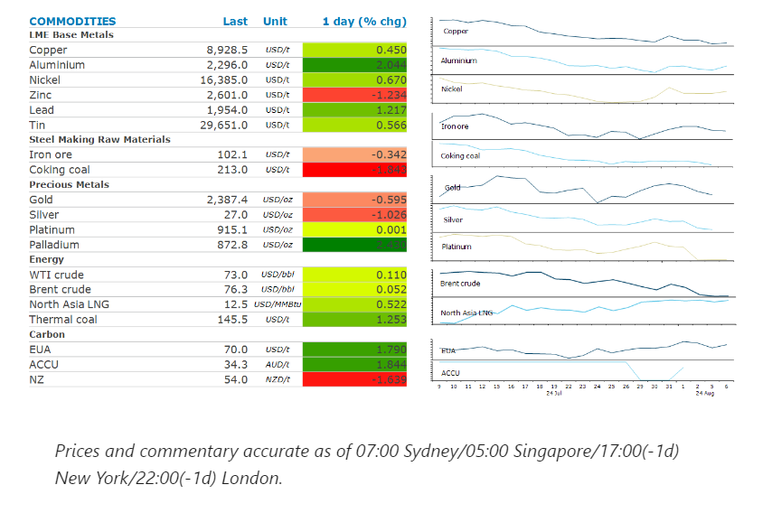
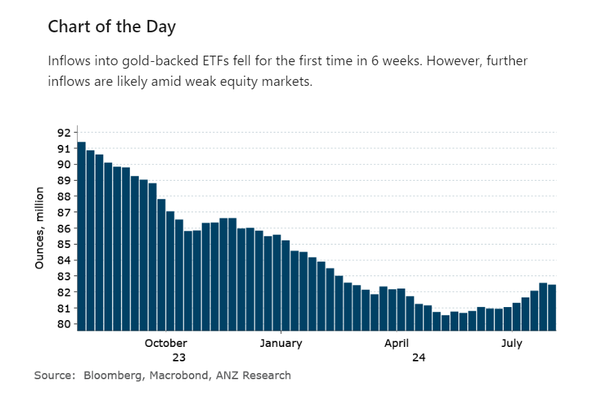

# Oil rebounds as focus returns to tightening supplies

**Date:** August 07, 2024  
**Publisher:** Breakwave Advisors | **Category:** Market Insights  
**Original URL:** [https://www.breakwaveadvisors.com/insights/2024/8/7/c73c9mmewcibd80efwdxbszoqy4bbt](https://www.breakwaveadvisors.com/insights/2024/8/7/c73c9mmewcibd80efwdxbszoqy4bbt)  

---

Calm returned to financial markets, with commodities finding some support amid renewed interest in risk assets.

*By*[*Daniel Hynes*](https://www.linkedin.com/in/dahynes/)

> **Figure 1: Στιγμιότυπο Οθόνης 2024 08 07 112817**  
> **Interactive Data & Source:** [Linkedin](https://www.linkedin.com/newsletters/commodities-wrap-6692196755876012032/?fbclid=IwAR3kiXJqZdxmp9ZcRwBNI7FsBySI-XSC0pfPur1qzjt7OZp7PTE59Tsl1QI) | [Local Asset](file:///C:/Users/Dell/Github/Shipping/corpus/03-breakwave/insights/2024/assets/2024-08-07_c73c9mmewcibd80efwdxbszoqy4bbt_img_cea3cf84ceb9ceb3cebcceb9cf8ccf84cf85_1f96401c0362.png)

### Market Commentary

**Crude oil**prices recovered following Monday’s selloff amid a rebound in risk appetite across broader financial markets. With technicals suggesting the market was in oversold territory, WTI and Brent crude managed to rise more than 1%. Signs of potential tightness in the physical market also provided some support. These included renewed supply side issues, with Libya’s biggest oil field halting production after the operator gradually cut output. Output at El Sharara field has dropped by at least 50kb/d, to 210kb/d, since workers were ordered to trim production. Rising geopolitical risks are also a concern. Traders are bracing for a retaliatory attack by Iran or regional militias on Israel. Any escalation of the conflict in the Middle East could see a greater risk of disruptions to supplies from the region. The market was reminded of the uncertain economic backdrop, with the Energy Information Association revising down its estimate of global demand due to concerns that China’s economy is still slowing. The agency now expects global crude consumption will be about 104.5mb/d in 2025, down 200kb/d from its previous forecast. The EIA also cut its forecasts for US oil production growth amid a wave of consolidation in the industry.

The risk tone across markets helped lift**global gas**markets, allowing the focus to shift back to supply risks. Hezbollah and Israel forces exchanged fire on Tuesday as the market awaits a response from Iran to the assassination of military leaders. The Karish field in Israel is operating as usual, while Chevron said its Tamar and Leviathan fields continue to supply gas to Israel and the region. Elsewhere, LNG plants have been operating at reduced capacity. This includes Bintulu in Malaysia and Ichthys in Australia, according to ship tracking data from Bloomberg. However, hotter than usual weather is persisting across Europe and Asia, keeping demand strong.

**Copper**steadied and**aluminium**gained in a mixed session for base metals. Nevertheless, prices for copper are only slightly above a four-month high amid concerns that Monday’s selloff points to deeper troubles ahead. A hard landing in the US would weigh on global demand for base metals at a time when growth in China isn’t strong. Even so, the supply response will be a dominating factor to rebalance metal markets. Challenges in copper mine supply are likely to keep the concentrate market tight and subsequently reduce the output of refined copper, particularly in China.

**Iron ore**futures managed to escape the contagion from Monday’s rout across financial markets. Nevertheless, futures in Singapore fell as the market weighs up mixed signals abouts China’s economy. Traders are also concerned that China’s flood of steel exports could ease in coming months, putting a break on strong demand for the steel-making raw material.

**Gold**remained under pressure as global equity markets steadied. A rebounding USD and a pullback in expectations of an emergency rate cut by the Fed weighed on investor appetite. Nevertheless, rising geopolitical tensions should provide some support in coming months.

> **Figure 2: Στιγμιότυπο Οθόνης 2024 08 07 112934**  
> **Interactive Data & Source:** [Linkedin](https://www.linkedin.com/newsletters/commodities-wrap-6692196755876012032/?fbclid=IwAR3kiXJqZdxmp9ZcRwBNI7FsBySI-XSC0pfPur1qzjt7OZp7PTE59Tsl1QI) | [Local Asset](file:///C:/Users/Dell/Github/Shipping/corpus/03-breakwave/insights/2024/assets/2024-08-07_c73c9mmewcibd80efwdxbszoqy4bbt_img_cea3cf84ceb9ceb3cebcceb9cf8ccf84cf85_f30e01964c82.png)

Data source:[Commodities Wrap](https://www.linkedin.com/newsletters/commodities-wrap-6692196755876012032/?fbclid=IwAR3kiXJqZdxmp9ZcRwBNI7FsBySI-XSC0pfPur1qzjt7OZp7PTE59Tsl1QI)

---

**Tags:** Commodities, Economy, Shipping  
