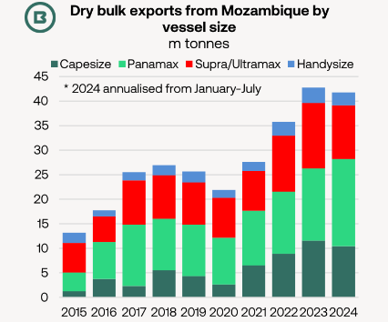
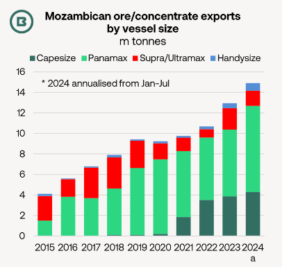

# Mozambique’s dry bulk export emergence

**Date:** August 07, 2024  
**Publisher:** Breakwave Advisors | **Category:** Market Insights  
**Original URL:** [https://www.breakwaveadvisors.com/insights/2024/8/7/mozambiques-dry-bulk-export-emergence](https://www.breakwaveadvisors.com/insights/2024/8/7/mozambiques-dry-bulk-export-emergence)  

---

- *Mozambique’s dry bulk export emergence in the last decade owes much to the expansion of coal trade from Nacala port, but is being supplemented by trend growth in ore and concentrate exports from other terminals.*

- *How are the resulting benefits for dry bulk carrier demand distributed across the bulker fleets?*

- *Is there further growth potential?*

**Coal, both thermal and coking, has provided most of the impetus**for Mozambique’s dry bulk export growth over the past decade, which has lifted demand for Capesize, Panamax and Supra/Ultramax vessels in the past five years.

> **Figure 1: Στιγμιότυπο Οθόνης 2024 08 07 120123**  
> [Local Asset](file:///C:/Users/Dell/Github/Shipping/corpus/03-breakwave/insights/2024/assets/2024-08-07_mozambiques-dry-bulk-export-emergence_img_cea3cf84ceb9ceb3cebcceb9cf8ccf84cf85_b87ba4de2566.png)

Missing image: https://images.squarespace-cdn.com/content/v1/5a4d1d26e5dd5b537a6647c5/1723022774425-JEU75RKOIJ1KG3HQZRGP/%CE%A3%CF%84%CE%B9%CE%B3%CE%BC%CE%B9%CF%8C%CF%84%CF%85%CF%80%CE%BF+%CE%BF%CE%B8%CF%8C%CE%BD%CE%B7%CF%82+2024-08-07+120217.png

Using official data from importing countries as a basis,**last year at least 17.4m tonnes of Mozambican coal**were shipped to destinations ranging from Europe to North East Asia, with South Asia the leading export market. This compared with 4.6m tonnes in 2014. During 2023 more than 13m tonnes of (both coking and thermal) coal were railed from the**Moatize**coal mine, owned by Vulcan Resources, part of India’s Jindal Group, (incidentally, through Malawi) to the Capesize load port of Nacala.

Less well known is the**impressive parallel increase in the exports of chrome, iron and manganese ore and concentrates**, mainly shipped from the terminals at Maputo and Matola to destinations in North China.

> **Figure 2: Στιγμιότυπο Οθόνης 2024 08 07 120203**  
> [Local Asset](file:///C:/Users/Dell/Github/Shipping/corpus/03-breakwave/insights/2024/assets/2024-08-07_mozambiques-dry-bulk-export-emergence_img_cea3cf84ceb9ceb3cebcceb9cf8ccf84cf85_dfa4b23b6dc3.png)

Missing image: https://images.squarespace-cdn.com/content/v1/5a4d1d26e5dd5b537a6647c5/1723022854854-CITWHAHAXY13CGGYQD73/%CE%A3%CF%84%CE%B9%CE%B3%CE%BC%CE%B9%CF%8C%CF%84%CF%85%CF%80%CE%BF+%CE%BF%CE%B8%CF%8C%CE%BD%CE%B7%CF%82+2024-08-07+120217.png

There is more**potential for coking coal export growth**from Nacala in the future in the light of (1)**Indian import appetite**and (2) increases in**production and export capacity in Mozambique**.

**India’s steel industry**has been expanding at a rapid pace (+7.4% in the 1H 2024, worldsteel reported). With imports making up the majority of India’s coking coal requirements, new integrated steelmaking projects can lift import demand further. As an example, JSW’s plant at Vijayanagar, which is currently ramping up to 5m tonnes/year.

**Annual volumes between coal mines and Nacala**are expected to rise to the maximum transport capacity of 18m tonnes/year. Moreover, JSW Steel reported in June that acquisition of Minas de Revuboè (MdR), a pre-development coking coal asset in Mozambique had been approved.

---

**Tags:** Drybulk, Coal, Shipping  
