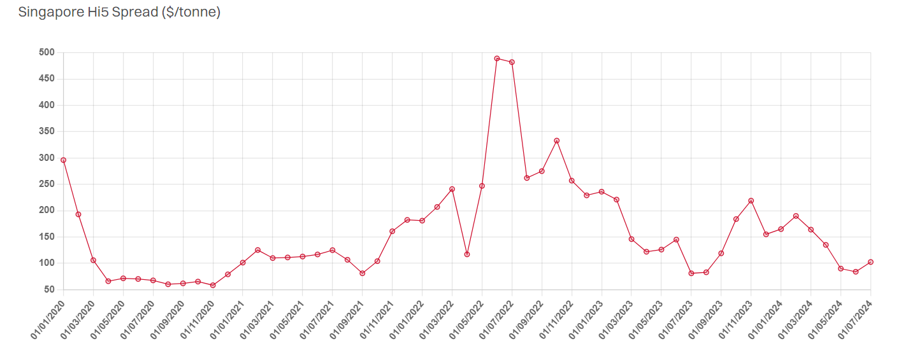

# VLCCs Say Yes to Scrubbers

**Date:** August 07, 2024  
**Publisher:** Breakwave Advisors | **Category:** Market Insights  
**Original URL:** [https://www.breakwaveadvisors.com/insights/2024/8/7/vlccs-say-yes-to-scrubbers](https://www.breakwaveadvisors.com/insights/2024/8/7/vlccs-say-yes-to-scrubbers)  

---

> **Figure 1: Tankers 4 Square**  
> **Interactive Data & Source:** [Gibsons Co](https://www.gibsons.co.uk/market-reports) | [Local Asset](file:///C:/Users/Dell/Github/Shipping/corpus/03-breakwave/insights/2024/assets/2024-08-07_vlccs-say-yes-to-scrubbers_img_tankers-4-square_a310bd6dfbdb.jpg)

It has been over four years since the IMO’s global sulphur rules were introduced. Prior to implementation, there had been much speculation about potential lack of compliant 0.5% sulphur bunker fuel, the economics of installing exhaust gas cleaning technology and the future direction of Hi5 spread – the difference between high sulphur bunker fuel (HSFO) and compliant very low sulphur fuel oil (VLSFO).

Indeed, the Hi5 spread has proved to be volatile, fluctuating between a high of $485/tonne and a low of $60/tonne over the past four and a half years, being pulled in different directions not only by regional supply/demand factors and the fallout of the pandemic, but also by fundamental changes in oil prices and changes in global HSFO flows following the introduction of sanctions against Russia.

In terms of scrubber uptake, the technology as expected became most popular with VLCCs, where 51% of the existing fleet have gone through installations. For this size group, it makes most practical sense, considering typically long distances involved and high bunker consumption. On an Eco basis, the scrubber premium on the TD3C voyage has averaged $6,750/day since Jan-20, although currently is around $5,000/day due to a recent slide in the Hi5 spread.

Scrubbers are also predominantly installed on more modern vessels, with 74% of VLCCs under 10 years of age being scrubber-fitted. The uptake is lower for older ships: 47% of VLCC built between 2005 and 2014 have the technology onboard. Even less are installed on vessels over 20 years of age but these units are largely missing from the conventional tanker market anyway and are instead engaged in shipping sanctioned Venezuelan and/or Iranian crude or are in permanent storage.

Scrubber uptake on Suezmaxes and Aframaxes/LR2s is smaller but still significant. Approximately 29% of the existing Suezmax fleet and 23% of the Aframax/LR2 fleet have scrubbers on board. The average delta in TCEs vs non-scrubber tonnage is understandably smaller, considering typically relatively shorter distances and lower bunker consumption. Since the start of 2020, the eco scrubber premium on TD20 voyage has averaged $5,000/day and $4,250/day on TD19 route.

On smaller sizes, scrubber uptake is even lower – 8% of the LR1/Panamax fleet, 17% of MRs and just 2% of Handies have the technology installed. The delta in Eco TCEs vs non-scrubber tonnage is also smaller, ranging between $4,000/day and $2,750/day on benchmark trades.

Without doubt, larger tankers that have installed the technology, particularly those that have gone through retrofits back in 2020/2021 have had their investment paid off. For smaller tankers, it is less clear cut, and much depends on installation dates, the number of operating days within a year and trading patterns.

> **Figure 2: Στιγμιότυπο Οθόνης 2024 08 07 130601**  
> **Interactive Data & Source:** [Gibsons Co](https://www.gibsons.co.uk/market-reports) | [Local Asset](file:///C:/Users/Dell/Github/Shipping/corpus/03-breakwave/insights/2024/assets/2024-08-07_vlccs-say-yes-to-scrubbers_img_cea3cf84ceb9ceb3cebcceb9cf8ccf84cf85_f6829abaced4.png)

Data source:[Gibson Shipbrokers](https://www.gibsons.co.uk/market-reports)

---

**Tags:** Crude, Tankers, Shipping  
