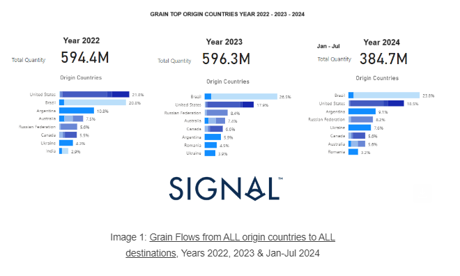
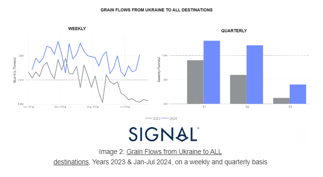
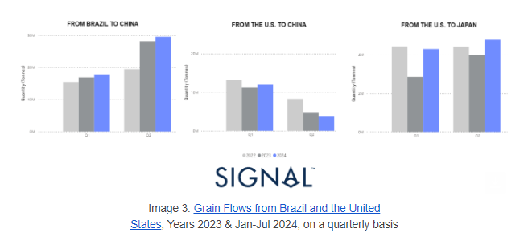
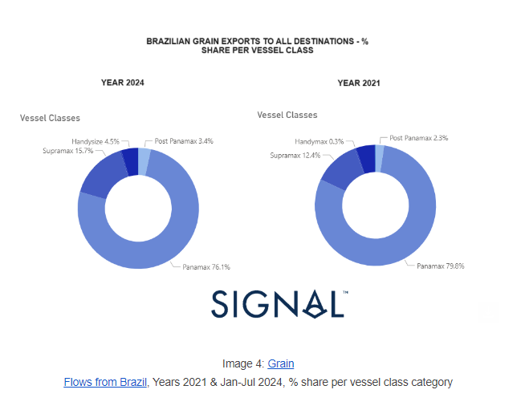
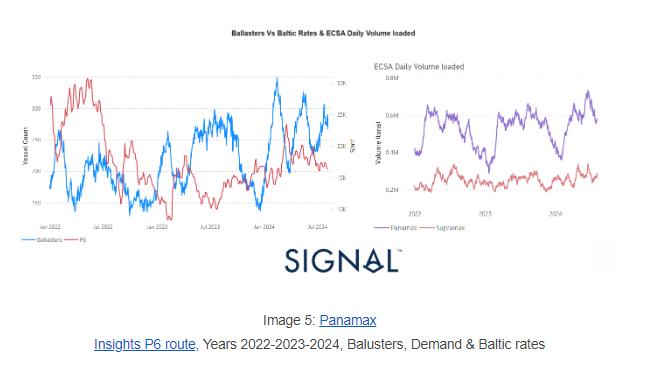

# Grain Seaborne Trade Impact on the Dry Bulk Freight Market

**Date:** August 08, 2024  
**Publisher:** Breakwave Advisors | **Category:** Market Insights  
**Original URL:** [https://www.breakwaveadvisors.com/insights/2024/8/8/grain-seaborne-trade-impact-on-the-dry-bulk-freight-market](https://www.breakwaveadvisors.com/insights/2024/8/8/grain-seaborne-trade-impact-on-the-dry-bulk-freight-market)  

---

***Shifts in Global Grain Trade and Freight Market Dynamics***
August, 2024

> **Figure 1: Στιγμιότυπο Οθόνης 2024 08 08 134445**  
> **Interactive Data & Source:** [Signal Ocean Platform](https://go.signalocean.com/e/983831/06d4bcf996af81cea306c7c-c-html/2qfzlh/428839520/h/3Xbfds6oetk6ddsrwzQsw-_GpY87fnnKmD9Z6_yprEE) | [Local Asset](file:///C:/Users/Dell/Github/Shipping/corpus/03-breakwave/insights/2024/assets/2024-08-08_grain-seaborne-trade-impact-on-the-dry-bulk-freight-market_img_cea3cf84ceb9ceb3cebcceb9cf8ccf84cf85_5ec3264cc509.png)

In our latest monthly review, we explore the ever-evolving landscape of seaborne grain trade from 2023 to 2024, leveraging insights from the Signal Ocean Platform. By tracking these shifts, we aim to uncover their effects on dry bulk freight market trends, especially within the Supramax and Panamax vessel categories.

The non-renewal of the Black Sea Grain Initiative last summer has raised significant concerns regarding the volume of seaborne grain exports. This initiative previously facilitated the safe passage of grain shipments from the Black Sea region, a critical area for global grain supply. Its termination has disrupted established trade routes and raised uncertainties about future export volumes from this key region.

Concurrently, the competitive dynamics between Brazilian and U.S. grain exports are at the forefront of industry discussions. Brazil's growing role as a major grain exporter has intensified competition with the U.S., reshaping trade patterns and influencing freight market trends. The rivalry between these two agricultural powerhouses is closely monitored by industry players, as it affects global grain supply chains and freight rates.

As we look toward the second half of the year, the freight industry in the East Coast of South America (ECSA) and the Black Sea region faces a crucial turning point. The balance between vessel supply and cargo demand will be pivotal in determining market outcomes. Asian countries, along with Black Sea and Mediterranean European nations, are significant consumers of grain and will play a major role in influencing freight market dynamics. Their import needs, combined with the availability of suitable vessels, will shape freight rates and trading volumes.

In the ECSA region, an abundant supply of grain cargoes and a limited availability of vessels could drive up freight rates, benefiting shipowners. Conversely, an oversupply of vessels in the market, without a corresponding increase in cargo demand, could lead to lower rates and tighter margins for operators. In the Black Sea, geopolitical factors and regional stability will also play a crucial role in shaping trade flows and market conditions.

In the below sections, we will examine the evolution of seaborne grain trade flows, the dynamics of the Brazilian, Ukrainian and U.S. grain markets, the vessel supply - demand dynamics and the freight market rate trends.

### Section I : Grain Flows the Global View

​​​​

The year 2024 confirms the previous trend recorded in 2023, where Brazil appeared at the top ranking of origin countries, surpassing the percentage share of the United States with 27% instead of 18%. (Image 1) A year ago, the United States competed closely with Brazil, each having a similar percentage share of about 21%. In the current year, the trend continues to highlight the strength of the Brazilian market, which holds a 24% share for the first seven months of the year, compared to 19% for the U.S. This solidifies Brazil's position as a leading origin for grain shipments.

The total quantity of grain shipments to all destinations remains robust, maintaining the track record of the previous two years. So far in 2024, shipments have reached approximately 385 million metric tons, which is about 60% of the total quantity sent in the entire previous year. This suggests that, barring any unforeseen disruptions, the total quantity for the year could surpass last year's figures.

Moreover, the Brazilian market is expected to strengthen further in the coming months, potentially increasing its contribution to the total quantity sent. This sustained growth can be attributed to Brazil's competitive advantages in agriculture, favorable weather conditions, and strategic investments in infrastructure and technology. However, there were some fears about climate issues that could impact Brazilian grain harvest. In June,[the state-run Brazilian Institute of Geography and Statistics](https://go.signalocean.com/e/983831/06d4bcf996af81cea306c7c-c-html/2qfzlh/428839520/h/3Xbfds6oetk6ddsrwzQsw-_GpY87fnnKmD9Z6_yprEE)(IBGE) reported that Brazil's grain harvest for 2024 is projected to be 5.9 percent smaller than in 2023. This decline is attributed to adverse weather conditions affecting several regions across the country.

Regarding the U.S. market, while still significant, it continues to lose ground to Brazil. The data for 2024 underscores Brazil's ascendant role in global grain shipments, setting a new benchmark in the competition between these two agricultural giants. As the year progresses, close attention will be paid to how these trends evolve and their implications for global food supply chains.

> **Figure 2: Στιγμιότυπο Οθόνης 2024 08 08 134643**  
> **Interactive Data & Source:** [Signal Ocean Platform](https://go.signalocean.com/e/983831/20Department20of20Agriculture-/2qfzlp/428839520/h/3Xbfds6oetk6ddsrwzQsw-_GpY87fnnKmD9Z6_yprEE) | [Local Asset](file:///C:/Users/Dell/Github/Shipping/corpus/03-breakwave/insights/2024/assets/2024-08-08_grain-seaborne-trade-impact-on-the-dry-bulk-freight-market_img_cea3cf84ceb9ceb3cebcceb9cf8ccf84cf85_9a17c481a15b.png)

### An Eye on the Ukrain Situation

From Ukraine, it is interesting to see the increase in the quantity of tonnes sent this year compared to the same period a year ago. (Image 2) The improvement recorded in the flow of shipments on a quarterly basis has been significant. Looking at the weekly level of flows sent to all destinations, it almost seems certain that the third quarter of the year will also end with a higher total volume of shipments than the previous year. As the summer unfolds, the weekly levels appear to be moving significantly higher than the previous year.

> **Figure 3: Στιγμιότυπο Οθόνης 2024 08 08 134742**  
> **Interactive Data & Source:** [Signal Ocean Platform](https://go.signalocean.com/e/983831/20Department20of20Agriculture-/2qfzlp/428839520/h/3Xbfds6oetk6ddsrwzQsw-_GpY87fnnKmD9Z6_yprEE) | [Local Asset](file:///C:/Users/Dell/Github/Shipping/corpus/03-breakwave/insights/2024/assets/2024-08-08_grain-seaborne-trade-impact-on-the-dry-bulk-freight-market_img_cea3cf84ceb9ceb3cebcceb9cf8ccf84cf85_285936c897dd.png)

Several factors contribute to this positive trend. First, improved logistical strategies and increased efficiency in port operations have enabled a smoother and faster flow of goods. This is crucial given the geopolitical challenges and the ongoing conflict in the region. According to a[June report](https://go.signalocean.com/e/983831/20Department20of20Agriculture-/2qfzlp/428839520/h/3Xbfds6oetk6ddsrwzQsw-_GpY87fnnKmD9Z6_yprEE)from the Foreign Agricultural Service (FAS) of the US Department of Agriculture, Ukraine is forecasted to increase grain exports for the remainder of the 2023-24 marketing year, having independently resumed operations of its major maritime ports on the Black Sea. In response to Russia's invasion in February 2022, Ukraine developed a new export corridor on the Black Sea, following neighboring countries' territorial waters to reach the Bosphorus Strait. Ukrainian ships then navigate from Romanian waters near the mouth of the Danube River into Ukrainian territorial waters.

This strategic development, combined with favorable agricultural conditions, suggests a strong potential for increased shipments. The[Seed Association of Ukraine](https://go.signalocean.com/e/983831/raine-could-exceed-65m-tonnes-/2qfzls/428839520/h/3Xbfds6oetk6ddsrwzQsw-_GpY87fnnKmD9Z6_yprEE), which promotes international standards in the seed industry, estimates that Ukraine can harvest between 65-69 million tonnes of grains and oilseeds this year. According to the Ministry of Agrarian Policy and Food of Ukraine, the country has already harvested more than 22 million tonnes of grains and oilseeds so far. This includes 3,502,000 hectares of wheat yielding over 14.7 million tonnes, 1,020,200 hectares of barley yielding over 3.8 million tonnes, 189,800 hectares of peas yielding 416,300 tonnes, and 1,086,300 hectares of rapeseed yielding over three million tonnes. These figures highlight the robust agricultural output of Ukraine, supporting the forecast of increased grain exports. The reopening of Black Sea ports and the establishment of the new export corridor are pivotal steps in ensuring that Ukraine can efficiently transport its agricultural products to global markets, further solidifying its position as a major grain exporter.

As we move into the latter half of the year, continued monitoring of the Ukrainian situation will be essential. The trends observed so far suggest that Ukraine is on a strong trajectory, but geopolitical uncertainties and potential disruptions still pose risks. Nevertheless, the current indicators point towards a successful year for Ukrainian exports, contributing positively to the global supply chain and economic stability in the region.

### The Impact of Brazil and the U.s. on the Growth of Chinese Imports

The first two quarters of this year revealed the strength of Brazilian grain exports to the Chinese economy, with both quarters showing an increase compared to the previous two years. The rise was particularly pronounced at the end of the second quarter, where there was a 66% increase in the quantity of Brazilian grain exports to China compared to the end of the first quarter. This surge highlights Brazil's growing role as a major supplier to China's vast agricultural market.

> **Figure 4: Στιγμιότυπο Οθόνης 2024 08 08 134853**  
> **Interactive Data & Source:** [Signal Ocean Platform](https://www.thesignalgroup.com/signal-ocean-platform) | [Local Asset](file:///C:/Users/Dell/Github/Shipping/corpus/03-breakwave/insights/2024/assets/2024-08-08_grain-seaborne-trade-impact-on-the-dry-bulk-freight-market_img_cea3cf84ceb9ceb3cebcceb9cf8ccf84cf85_9ffa61993aed.png)

In contrast, the U.S. market exhibited an opposite trend. The quarterly quantity of grain exports from the U.S. to China declined by 70% compared to the levels at the end of the first quarter. Despite this decline in the Chinese market, the U.S. gained market share in the volume of Japanese grain imports for both the first two quarters of this year. In the second quarter, U.S. grain exports to Japan grew by 20% compared to the levels of the second quarter of the previous year. Additionally, the end of the first quarter saw a 50% rise compared to the first quarter of 2022.

These trends underscore the shifting dynamics in global grain trade. While Brazil strengthens its position as a key supplier to China, the U.S. compensates for its reduced share in the Chinese market by increasing its exports to Japan. The contrasting performances in these markets reflect broader strategic adjustments by both countries in response to global trade demands and geopolitical factors. As the year progresses, it will be crucial to monitor how these trends evolve and their implications for global grain supply chains.

### Section Ii : Freight Market Insights

This year's strength in Brazilian grain exports to all destinations appears to have a minor impact on the percentage share of shipments by vessel class category, with Panamax vessels still dominating the market. At the end of 2021, when the U.S. was the leading origin country instead of Brazil, the Panamax vessel size accounted for 80% of the business, compared to 12% for the Supramax vessel size.

Interestingly, even though the Panamax vessel size category has retained its top position in Brazilian grain shipments this year, its share has decreased slightly to 76%, losing almost 4 percentage points. In contrast, the Supramax vessel size has gained 4 percentage points, with its share rising to 16% from its 2021 level. This shift, albeit modest, indicates a trend towards more diverse utilization of vessel sizes in the Brazilian grain export market.

Several factors contribute to this trend. The flexibility and efficiency of Supramax vessels make them a preferred choice for certain routes and cargoes, especially where port infrastructure may limit the use of larger Panamax vessels. Additionally, market dynamics such as freight rates, port congestion, and changes in trade policies can influence the choice of vessel size.

This slight shift in vessel usage also reflects broader strategic adaptations within the shipping industry, aiming to optimize logistics and reduce costs. As the global grain trade continues to evolve, the balance between different vessel classes will likely continue to adjust, responding to economic, environmental, and operational factors.

> **Figure 5: Στιγμιότυπο Οθόνης 2024 08 08 135000**  
> **Interactive Data & Source:** [Signal Ocean Platform](https://www.thesignalgroup.com/signal-ocean-platform) | [Local Asset](file:///C:/Users/Dell/Github/Shipping/corpus/03-breakwave/insights/2024/assets/2024-08-08_grain-seaborne-trade-impact-on-the-dry-bulk-freight-market_img_cea3cf84ceb9ceb3cebcceb9cf8ccf84cf85_9e3f9de337e5.png)

Given the above results, we examined recent freight market trends, focusing on the supply and demand dynamics on the Panamax P6 route for the East Coast South America (ECSA) market. From mid-June onwards, there has been downward pressure on freight market rates despite higher daily loaded volumes on the ECSA. The number of vessels ballasting to the region reached a peak before the end of July, leading to increased competition and subsequently driving down freight rates.

> **Figure 6: Στιγμιότυπο Οθόνης 2024 08 08 135044**  
> **Interactive Data & Source:** [Signal Ocean Platform](https://www.thesignalgroup.com/signal-ocean-platform) | [Local Asset](file:///C:/Users/Dell/Github/Shipping/corpus/03-breakwave/insights/2024/assets/2024-08-08_grain-seaborne-trade-impact-on-the-dry-bulk-freight-market_img_cea3cf84ceb9ceb3cebcceb9cf8ccf84cf85_1d9ec9d597b3.png)

As we move into early August, there has been a gradual deceleration in the number of ballasters, but the recovery of the freight market is still not evident. The daily volume loaded in the ECSA appears to be slowing down from the peak of over 700,000 tonnes observed in mid-June. This slowdown in loaded volumes further compounds the pressure on freight rates, as the market struggles to balance the oversupply of vessels with the actual demand for grain transportation.

Several factors can contribute to this scenario. Seasonal variations in grain harvest and export schedules, changes in global trade patterns, and shifts in demand from major importing countries all play a role. Despite the current downturn, the long-term outlook for the Panamax P6 route in the ECSA market remains cautiously optimistic. As global economic conditions stabilize and demand for agricultural commodities potentially rebounds, there could be a corresponding recovery in freight rates.

It will be intriguing to monitor the market in the coming months of the year to see if the Brazilian grain market maintains its top ranking among grain exporters to China. This year is marked by significant shifts in trading trends, alongside noticeable improvements in Ukrainian grain shipments amid ongoing geopolitical tensions. The evolving dynamics of these key players will provide valuable insights into global grain trade patterns and highlight the resilience and adaptability of the agricultural export sector.

Data Source:[Signal Ocean Platform](https://www.thesignalgroup.com/signal-ocean-platform)

---

**Tags:** Drybulk, Shipping  
