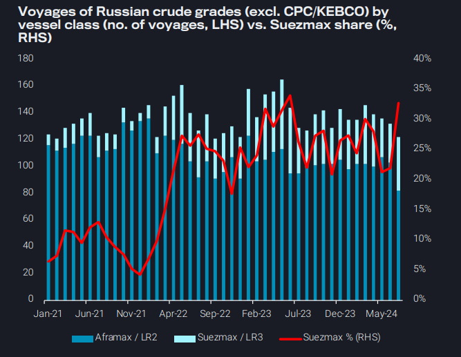
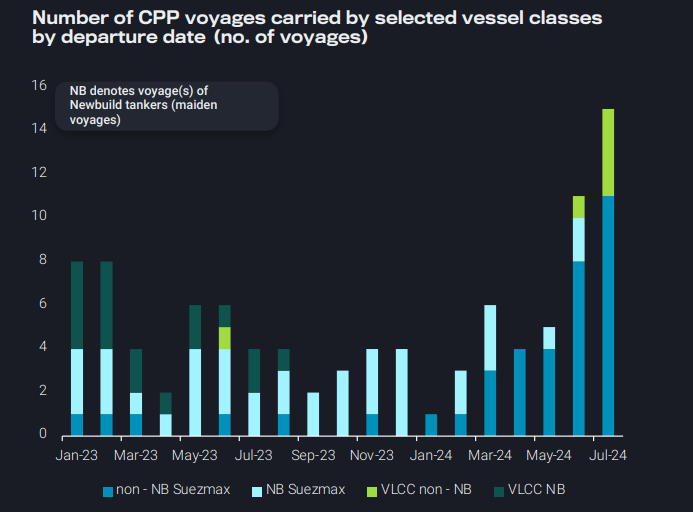
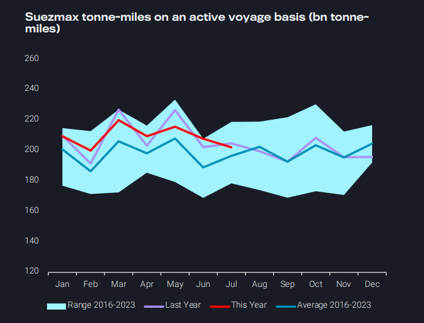

# Supertanker clean-up peaks, whilst Suezmax crude demand falls

**Date:** August 08, 2024  
**Publisher:** Breakwave Advisors | **Category:** Market Insights  
**Original URL:** [https://www.breakwaveadvisors.com/insights/2024/8/8/supertanker-clean-up-peaks-whilst-suezmax-crude-demand-falls](https://www.breakwaveadvisors.com/insights/2024/8/8/supertanker-clean-up-peaks-whilst-suezmax-crude-demand-falls)  

---

*By*[*Ioannis Papadimitriou*](https://www.linkedin.com/in/ipapadimitriou/)

### Key Takeaway

*Dirty – East of Suez:*

- *Suezmax share in Russia trades increases over Aframaxes as mainstream market weakens*

*Clean – East of Suez:*

- *Supertankers cleaning up reach a record-high in July, trend will likely subside*

*Dirty – West of Suez:*

- *Global Global Suezmax tonne-mile demand falling, but voyage counts remain high from intra-regional and USG trade*

*Clean – West of Suez:*

- *Will a drop in MR availability provide a floor to TC-18 freight rates?*

### Dirty – East of Suez: Suezmax Share in Russia Trades Increases Over Aframaxes As Mainstream Market Weakens

Aframax - Suezmax spread for the Russian trade has dropped to its lowest levels since the Russian invasion in Ukraine (Argus) Despite a 4th consecutive m-o-m drop in overall Russian crude voyages for July, Suezmax tankers managed to increase their share at the expense of Aframaxes

- Share of Suezmaxes has increased by 12% in the span of two months (May to July)

There are two factors at play for this development:

- The continuous shrinking of the fleet carrying Russian crude, which is predominantly consisted of Aframaxes which leads to optimising the available fleet to satisfy current trade requirements
- A weakening of the current mainstream Suezmax market (rates currently at 2024-lows) likely has attracted vessels to the Russian trades
- These vessels predominantly operate

> **Figure 1: Στιγμιότυπο Οθόνης 2024 08 08 125815**  
> **Interactive Data & Source:** [Vortexa](https://www.vortexa.com//oil-gas-data-traders-analysts-data-scientists?gclid=Cj0KCQjw8_qRBhCXARIsAE2AtRZKOvMnbilZ_6_91d7huSFFy71pWLrnPwGwOHVzXsmsG-1a1mZnQw8aAt89EALw_wcB&hsa_acc=1782073842&hsa_ad=548425387665&hsa_cam=14746637662&hsa_grp=125038601902&hsa_kw=&hsa_mt=&hsa_net=adwords&hsa_src=g&hsa_tgt=dsa-1431852288425&hsa_ver=3&utm_campaign=%5BCD%5D%20-%20DSA%20-%20EMEA&utm_medium=cpc&utm_medium=ppc&utm_source=google&utm_source=adwords&utm_term=) | [Local Asset](file:///C:/Users/Dell/Github/Shipping/corpus/03-breakwave/insights/2024/assets/2024-08-08_supertanker-clean-up-peaks-whilst-suezmax-crude-demand-falls_img_cea3cf84ceb9ceb3cebcceb9cf8ccf84cf85_4066efdfe41f.png)

### Clean – East of Suez: Supertankers Cleaning Up Reach a Recordhigh in July, Trend Will Likely Subside

July noted 11 Suezmaxes and 4 VLCCs clean up (not on their maiden voyage). This has been a more profitable solution for traders due to the volatile LR2 rates for East-to-West flows due to the Red Sea attacks

- This brings the total number of Suezmax and VLCC tanker that have carried a CPP cargo in 2024 to 26

The entrance of these supertankers for East-to-West flows has in turn displaced LR2s which are forced to look eastwards for employment

- Share of LR voyages commencing in East of Suez and heading to the Pacific has increased from 72% to 84% in the span of three months, pressuring MR rates in the Pacific, but reducing competition for MRs in the Atlantic

The trend, however, will likely subside going forward:

- No additional VLCCs – Suezmaxes have loaded in the first week of August
- There are no indications of new vessels cleaning up via fixture data
- LR2 East-to-West freight rates have almost halved since May, making the segment more financially attractive to traders

> **Figure 2: Στιγμιότυπο Οθόνης 2024 08 08 125829**  
> **Interactive Data & Source:** [Vortexa](https://www.vortexa.com//oil-gas-data-traders-analysts-data-scientists?gclid=Cj0KCQjw8_qRBhCXARIsAE2AtRZKOvMnbilZ_6_91d7huSFFy71pWLrnPwGwOHVzXsmsG-1a1mZnQw8aAt89EALw_wcB&hsa_acc=1782073842&hsa_ad=548425387665&hsa_cam=14746637662&hsa_grp=125038601902&hsa_kw=&hsa_mt=&hsa_net=adwords&hsa_src=g&hsa_tgt=dsa-1431852288425&hsa_ver=3&utm_campaign=%5BCD%5D%20-%20DSA%20-%20EMEA&utm_medium=cpc&utm_medium=ppc&utm_source=google&utm_source=adwords&utm_term=) | [Local Asset](file:///C:/Users/Dell/Github/Shipping/corpus/03-breakwave/insights/2024/assets/2024-08-08_supertanker-clean-up-peaks-whilst-suezmax-crude-demand-falls_img_cea3cf84ceb9ceb3cebcceb9cf8ccf84cf85_8f069b7a3f73.png)

### Dirty – West of Suez: Global Suezmax Tonne-Mile Demand Falling, But Voyage Counts Remain High From Intra-Regional and USG Trade

Suezmax tonne-mile demand has been falling steadily since May, though it is still remains above seasonal levels

- Declines have come from a reduction in voyages originating from South Americas East Coast, Middle East as well as the West Africa, as more crude is consumed within WAf due to the start-up of the Dangote refinery and India’s imports of Middle East crudes are subdued

However, Suezmax voyage counts are well above seasonal highs, coming from an increase in Suezmax employment in the Russian trade as well as a surge in voyages out of the US Gulf

- Some momentum may be gathering in the Atlantic Basin, which could support demand moving forwards July saw a large increase in tonne-miles from US Gulf-to-Europe, as crude exports to Europe remain high amid flagging Asian demand for US crude
- Recent fixing of VLCCs Brazil-to-Europe will likely be capped by falling Suezmax rates, which could entice charterers to fix on Suezmaxes instead

> **Figure 3: Στιγμιότυπο Οθόνης 2024 08 08 125846**  
> **Interactive Data & Source:** [Vortexa](https://www.vortexa.com//oil-gas-data-traders-analysts-data-scientists?gclid=Cj0KCQjw8_qRBhCXARIsAE2AtRZKOvMnbilZ_6_91d7huSFFy71pWLrnPwGwOHVzXsmsG-1a1mZnQw8aAt89EALw_wcB&hsa_acc=1782073842&hsa_ad=548425387665&hsa_cam=14746637662&hsa_grp=125038601902&hsa_kw=&hsa_mt=&hsa_net=adwords&hsa_src=g&hsa_tgt=dsa-1431852288425&hsa_ver=3&utm_campaign=%5BCD%5D%20-%20DSA%20-%20EMEA&utm_medium=cpc&utm_medium=ppc&utm_source=google&utm_source=adwords&utm_term=) | [Local Asset](file:///C:/Users/Dell/Github/Shipping/corpus/03-breakwave/insights/2024/assets/2024-08-08_supertanker-clean-up-peaks-whilst-suezmax-crude-demand-falls_img_cea3cf84ceb9ceb3cebcceb9cf8ccf84cf85_875d6c0889a0.png)

### Clean – West of Suez: Will a Drop in MR Availability Provide a Floor to Tc18 Freight Rates?

Freight rates have dropped dramatically from their recent spike on July 16 on the TC18 route (USGC to Brazil)

- In July, Brazil had increased its buying of USGC diesel due to price fluctuations for Russian cargoes (Argus)
- The increase share from the USGC in July caused freight rates to jump to 66.2$/tonne mid-July
- The drop in rates has led to a decline in availability in PADD 3

Brazil’s diesel demand has been especially high in June and July, largely due to an increased usage of heavy vehicles (Argus)

- Petrobras announced in July that refineries operate at 13-month low at 84.5% capacity (Bloomberg)

Looking forward, we can see that PADD 3 clean product loadings pointed toward Brazil look to be on the rise for the first week of August. However, Russian diesel exports are on the rise which could also point to fewer opportunities for USGC refiners in the near-medium future.

Data Source:[Vortexa](https://www.vortexa.com//oil-gas-data-traders-analysts-data-scientists?gclid=Cj0KCQjw8_qRBhCXARIsAE2AtRZKOvMnbilZ_6_91d7huSFFy71pWLrnPwGwOHVzXsmsG-1a1mZnQw8aAt89EALw_wcB&hsa_acc=1782073842&hsa_ad=548425387665&hsa_cam=14746637662&hsa_grp=125038601902&hsa_kw=&hsa_mt=&hsa_net=adwords&hsa_src=g&hsa_tgt=dsa-1431852288425&hsa_ver=3&utm_campaign=%5BCD%5D%20-%20DSA%20-%20EMEA&utm_medium=cpc&utm_medium=ppc&utm_source=google&utm_source=adwords&utm_term=)

---

**Tags:** Shipping, Crude Oil, Tankers  
