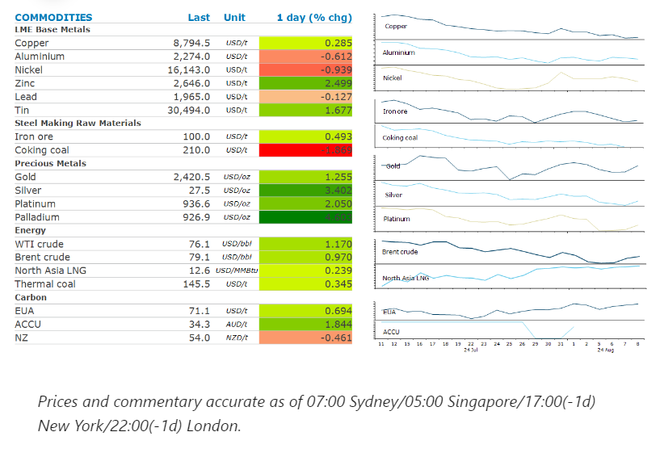
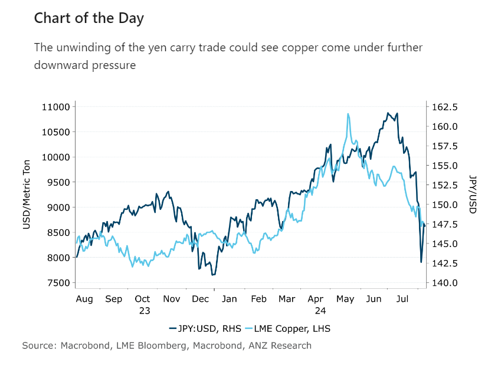

# Crude oil gains amid a broader rally across risk asset classes

**Date:** August 09, 2024  
**Publisher:** Breakwave Advisors | **Category:** Market Insights  
**Original URL:** [https://www.breakwaveadvisors.com/insights/2024/8/9/crude-oil-gains-amid-a-broader-rally-across-risk-asset-classes](https://www.breakwaveadvisors.com/insights/2024/8/9/crude-oil-gains-amid-a-broader-rally-across-risk-asset-classes)  

---

A risk-on tone across broader financial markets helped push commodity markets higher. Supply side issues also remained in focus.

*By*[*Daniel Hynes*](https://www.linkedin.com/in/dahynes/)

> **Figure 1: Crude Oilcontinued It Recovery From Its Recent Plunge As**  
> *Crude oilcontinued it recovery from its recent plunge as elevated geopolitical risks came into focus. Israel remains on edge as it prepares for a retaliatory attack from Iran following the assassination of Hamas and Hezbollah leaders. However, a call between Iran’s President Masoud Pezeshkian and French counterpart Emmanual Macron potentially opened a diplomatic path to de-escalation. There is also no end in sight to the political situation that has closed Libya’s Sharara oil field. The National Oil Company has declaredforce majeureat the field, which was producing about 270kb/d before the closure. One bright spot in the oil market is jet fuel demand in China. Total air traffic grew by 14% in June compared with the same period 2019. Domestic flights are up nearly 10%, according to government data. This is leading the country’s refiners to lift output of the aviation fuel to take advantage of improved margins.*  
> **Interactive Data & Source:** [Linkedin](https://www.linkedin.com/newsletters/commodities-wrap-6692196755876012032/?fbclid=IwAR3kiXJqZdxmp9ZcRwBNI7FsBySI-XSC0pfPur1qzjt7OZp7PTE59Tsl1QI) | [Local Asset](file:///C:/Users/Dell/Github/Shipping/corpus/03-breakwave/insights/2024/assets/2024-08-09_crude-oil-gains-amid-a-broader-rally-across-risk-asset-classes_img_cea3cf84ceb9ceb3cebcceb9cf8ccf84cf85_1f0cce6ef112.png)

### Market Commentary

**European gas**benchmark futures rallied for a third consecutive day amid fears of disruption to Russian gas crossing Ukraine. This follows reports of Ukrainian troops seizing a key gas transit point near Sudzha, Russia. The station is part of the last remaining pipeline link bringing Russian gas to Europe via Ukraine. For the moment, gas flows via Ukraine remain normal, according to nominations published by the Ukrainian grid.**North Asian LNG**prices were also lifted by the supply side issues.

**Copper**steadied near its four-month low as a worsening economic outlook keep sentiment depressed. Fear of a US recession added to concerns over soft industrial activity in China. Prices for copper and the broader base metal market were hit hard earlier this week by a selloff across risk assets. The unwinding of the JPY carry trade could have unexpected implications for**copper**. The use of cheap funding in Japan appears to have fuelled a rally across risk assets over the past couple of years. Copper hit a record high earlier this year; but this month’s sharp moves lower in the JPY combined with concerns of a hard economic landing in the US could lead to further downside for copper in the short term.

**Iron ore**futures fell sharply as sentiment continues to be battered by strong supply and weak demand. Futures on the Singapore Exchange fell below USD100/t, a level the market has tested, but ultimately pushed back above several times this year. Shipments from Australia reached 16.5mt in the week to 26 July, according to Bloomberg data. This is up from 15.6mt in the previous week. Exporters have largely overcome the operational issues that impacted output earlier in the year. This comes as the outlook for demand in China remains bleak. Steel prices continue to fall as construction activity remains soft. Chinese steel mill losses are worsening, with profitability likely below 10%.

**Gold**snapped a five-day losing streak amid a broader rally across risk assets. Despite its haven status, the precious metal was caught up in Monday’s plunge across broader markets. A subsequent relief rally allowed gold to tag along.

> **Figure 2: Στιγμιότυπο Οθόνης 2024 08 09 103900**  
> **Interactive Data & Source:** [Linkedin](https://www.linkedin.com/newsletters/commodities-wrap-6692196755876012032/?fbclid=IwAR3kiXJqZdxmp9ZcRwBNI7FsBySI-XSC0pfPur1qzjt7OZp7PTE59Tsl1QI) | [Local Asset](file:///C:/Users/Dell/Github/Shipping/corpus/03-breakwave/insights/2024/assets/2024-08-09_crude-oil-gains-amid-a-broader-rally-across-risk-asset-classes_img_cea3cf84ceb9ceb3cebcceb9cf8ccf84cf85_3c02f5e7751b.png)

Data source:[Commodities Wrap](https://www.linkedin.com/newsletters/commodities-wrap-6692196755876012032/?fbclid=IwAR3kiXJqZdxmp9ZcRwBNI7FsBySI-XSC0pfPur1qzjt7OZp7PTE59Tsl1QI)

---

**Tags:** Commodities, Economy, Shipping  
