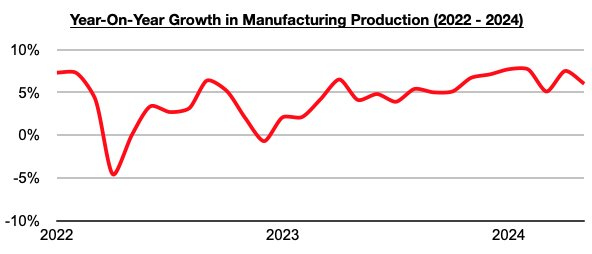
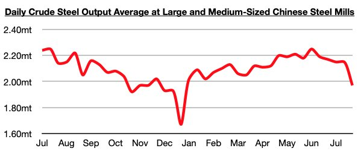

# Manufacturing Production in China Remains Strong

**Date:** August 09, 2024  
**Publisher:** Breakwave Advisors | **Category:** Market Insights  
**Original URL:** [https://www.breakwaveadvisors.com/insights/2024/8/9/nfui07v66kakacfy5u328biyk5g4t3](https://www.breakwaveadvisors.com/insights/2024/8/9/nfui07v66kakacfy5u328biyk5g4t3)  

---

*By*[*Jeffrey Landsberg*](https://www.linkedin.com/in/jeffrey-landsberg-70ab957/)

As we discussed in Commodore Research's most recent Weekly China Report, China’s manufacturing production increased on a year-on-year basis again in June, this time by 5.5% (manufacturing is defined as the creation or production of goods with the help of equipment, labor, machines, tools, chemical or biological processing, formulation, etc). This is less than the impressive 7.7% peak seen in January/February, which marked the largest growth seen since February 2022, but it still marks strong growth. Through the first half of the year, manufacturing production has grown year-on-year by 6.6%.

> **Figure 1: Chart 1**  
> [Local Asset](file:///C:/Users/Dell/Github/Shipping/corpus/03-breakwave/insights/2024/assets/2024-08-09_nfui07v66kakacfy5u328biyk5g4t3_img_chart1_b0ad73492214.jpg)

Remaining significant to us is that strong manufacturing production has continued to vitally contribute to significant steel consumption in China and has continued to help offset weakness in demand/construction for new homes. Steel output remains in a newly restarted year-on-year contraction and would be a great deal weaker if manufacturing production was not remaining so strong. An ongoing surge in the production of vehicles, particularly electric vehicles, has remained particularly supportive for China’s overall manufacturing production.

The latest data released this week has shown that daily crude steel production at large and medium-sized mills averaged 1.97 million tons during July 21 - July 31. This is down by 8% from July 11- July 20, is down year-on-year by 8%, and marks the lowest level seen all year. Overall, China’s steel production remains in its return to contraction and has continued to weaken. Prior to June 11, year-on-year growth had been enjoyed from May 20 through June 10.

> **Figure 2: Chart 2**  
> [Local Asset](file:///C:/Users/Dell/Github/Shipping/corpus/03-breakwave/insights/2024/assets/2024-08-09_nfui07v66kakacfy5u328biyk5g4t3_img_chart2_99cf53217d2a.jpg)

---

**Tags:** China, Shipping, Iron Ore  
