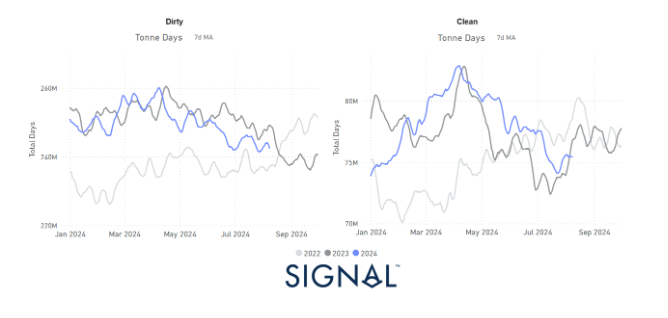
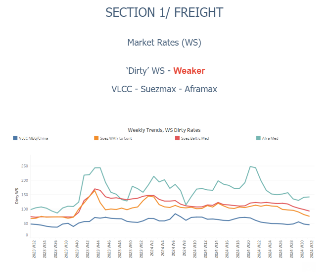
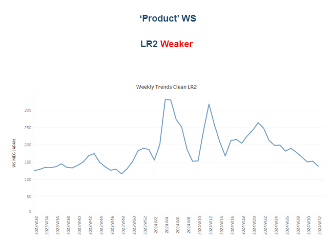
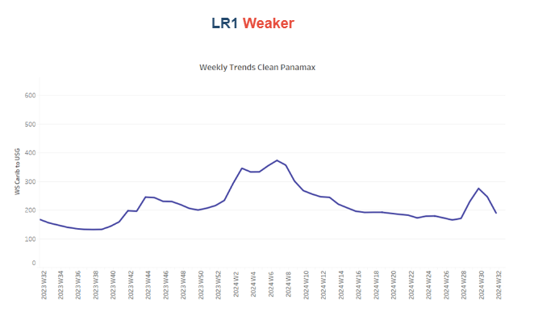
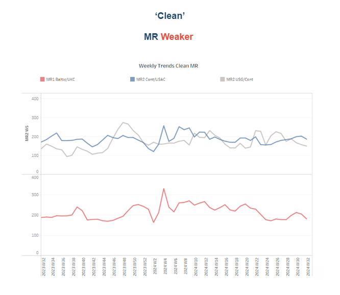
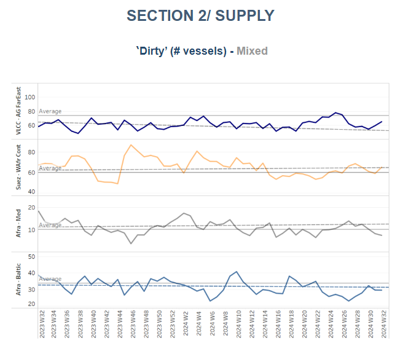
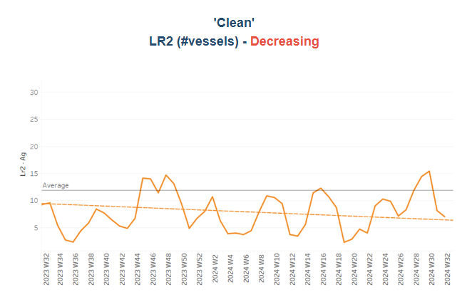
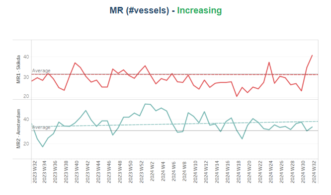
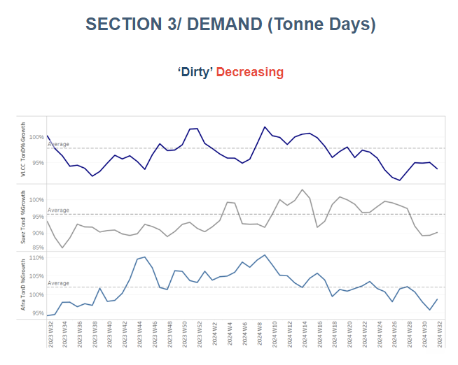
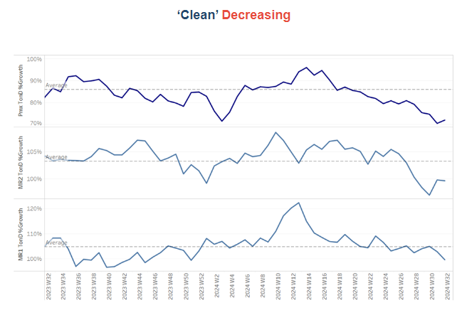

# Tanker Demand Growth

**Date:** August 09, 2024  
**Publisher:** Breakwave Advisors | **Category:** Market Insights  
**Original URL:** [https://www.breakwaveadvisors.com/insights/2024/8/9/tanker-demand-growth](https://www.breakwaveadvisors.com/insights/2024/8/9/tanker-demand-growth)  

---

### Tanker - Weekly Market Monitor

Snapshot of Crude and Product Freight Rates, Supply-Demand

Week 32, August 08, 2024

### Chart of the Week: Tanker Demand Growth - Tonne Days

*This week's chart shows that the growth in tonne days for dirty tankers has slowed since May compared to last year, with a continued decline into August. This suggests that dirty tanker demand is weakening as the summer season ends, confirming the downward trend we noted in early July in our*[*Week 28*](https://go.signalocean.com/e/983831/er-market-monitor-week-28-2024/2qg3kh/429500051/h/mR9K2yWszdbZvRIr_cSY5MiIB3jonLiNzRRC4x1S3EA)*Tanker Weekly Monitor. In the clean segment (right chart), it's noteworthy that despite the sharp downward trend following the peak at the end of the first quarter, recent growth estimates are still outpacing last year's monthly growth.*

> **Figure 1: Στιγμιότυπο Οθόνης 2024 08 09 101233**  
> **Interactive Data & Source:** [Signal Ocean Platform](https://go.signalocean.com/e/983831/08-crude-oil-prices-today-html/2qg3kp/429500051/h/mR9K2yWszdbZvRIr_cSY5MiIB3jonLiNzRRC4x1S3EA) | [Local Asset](file:///C:/Users/Dell/Github/Shipping/corpus/03-breakwave/insights/2024/assets/2024-08-09_tanker-demand-growth_img_cea3cf84ceb9ceb3cebcceb9cf8ccf84cf85_488edc0eca56.png)

This week's chart analysis revisits the growth in tonne days for dirty tankers across various vessel size categories. The left chart reveals that since May, the growth in tonne days for dirty cargoes has been progressing at a noticeably slower pace compared to the same period last year. This trend has become more pronounced as we move into August, where we observe a persistent decline in tonne days.

The data suggests that the seasonal peak in dirty tanker demand may have already passed, leading to a weakening growth trajectory as we approach the end of the summer. This aligns with the early warning signs we identified in early July in our Tanker Weekly Market Monitor (Week 28). At that time, we highlighted a potential slowdown, and the recent figures reinforce that forecast.

In the oil market,[prices](https://go.signalocean.com/e/983831/08-crude-oil-prices-today-html/2qg3kp/429500051/h/mR9K2yWszdbZvRIr_cSY5MiIB3jonLiNzRRC4x1S3EA)are at risk of rising again due to the escalating crisis in the Middle East. U.S. crude oil futures increased on Thursday for the third consecutive day, trading above $75 per barrel. West Texas Intermediate (WTI) rebounded as crude inventories declined for the sixth straight week. This strong demand signal has outweighed recession fears, which had pushed the U.S. benchmark to six-month lows earlier in the week.

> **Figure 2: Στιγμιότυπο Οθόνης 2024 08 09 101633**  
> **Interactive Data & Source:** [Signal Ocean Platform](https://www.thesignalgroup.com/signal-ocean-platform) | [Local Asset](file:///C:/Users/Dell/Github/Shipping/corpus/03-breakwave/insights/2024/assets/2024-08-09_tanker-demand-growth_img_cea3cf84ceb9ceb3cebcceb9cf8ccf84cf85_d7b562dcf8af.png)

​​​​​The dirty freight market sentiment remains bearish, with downward pressure persisting across most routes. However, an upward trend has begun to emerge on the Aframax Mediterranean route over the past two weeks.

- The**VLCC**MEG-China freight rates dropped to 45 WS, marking a 5% decline from the previous week and an 8% decrease compared to the same period in August last year.
- Suezmax freight rates for shipments from**West Africa**to**continental Europe**still hover below 80 WS, representing a 20% monthly decrease. Similarly, rates on the**Suez Baltic Med**route have declined, with WS rates now below 95 WS, marking a 20% monthly drop.
- Aframax**Mediterranean**freight rates are hovering around WS132, marking a 40% increase compared to the same week last year.

> **Figure 3: Στιγμιότυπο Οθόνης 2024 08 09 101749**  
> **Interactive Data & Source:** [Signal Ocean Platform](https://www.thesignalgroup.com/signal-ocean-platform) | [Local Asset](file:///C:/Users/Dell/Github/Shipping/corpus/03-breakwave/insights/2024/assets/2024-08-09_tanker-demand-growth_img_cea3cf84ceb9ceb3cebcceb9cf8ccf84cf85_1d23a9bfb74d.png)

- **LR2**AG freight rates have steadily declined since the beginning of July, now stabilising around WS125. This marks a 29% drop from the previous month and a 5% decrease compared to the same week last year.

> **Figure 4: Στιγμιότυπο Οθόνης 2024 08 09 101801**  
> **Interactive Data & Source:** [Signal Ocean Platform](https://www.thesignalgroup.com/signal-ocean-platform) | [Local Asset](file:///C:/Users/Dell/Github/Shipping/corpus/03-breakwave/insights/2024/assets/2024-08-09_tanker-demand-growth_img_cea3cf84ceb9ceb3cebcceb9cf8ccf84cf85_7fa97829c2d6.png)

- **Panamax**Carib-to-USG rates dropped to WS 190, reflecting a 29% decline from the previous week. However, this represents a 14% improvement compared to the same week a month ago.

> **Figure 5: Στιγμιότυπο Οθόνης 2024 08 09 101817**  
> **Interactive Data & Source:** [Signal Ocean Platform](https://www.thesignalgroup.com/signal-ocean-platform) | [Local Asset](file:///C:/Users/Dell/Github/Shipping/corpus/03-breakwave/insights/2024/assets/2024-08-09_tanker-demand-growth_img_cea3cf84ceb9ceb3cebcceb9cf8ccf84cf85_b21ccd2324ea.png)

- **MR1**rates for shipments from the**Baltic to the continent**dropped below 180 WS, showing a 14% weekly decrease. Meanwhile,**MR2 rates**for shipments from the Continent to the USAC dropped to WS160, representing a 22% decline from the previous week. Conversely, on the**USG-Cont**route, MR2 rates held levels around WS 150, reflecting similar levels of a month ago.

> **Figure 6: Στιγμιότυπο Οθόνης 2024 08 09 102232**  
> **Interactive Data & Source:** [Signal Ocean Platform](https://www.thesignalgroup.com/signal-ocean-platform) | [Local Asset](file:///C:/Users/Dell/Github/Shipping/corpus/03-breakwave/insights/2024/assets/2024-08-09_tanker-demand-growth_img_cea3cf84ceb9ceb3cebcceb9cf8ccf84cf85_c5cb386cfed4.png)

​​​​​​Amid signs of an increase in VLCC tanker numbers at Ras Tanura, it’s notable that levels have remained below the annual trend since the last peak recorded at the end of week 24.

- **VLCC Ras Tanura**: The number of ships is now 65, nearly 9 vessels fewer than the annual average.
- **Suezmax Wafr**: The current ship count is around 65 for a second week, with no indications of an imminent upward trend over the last four weeks.
- **Aframax Med**: The number of ships dropped to seven, nearly 30% below the annual trend, indicating a downward movement for the first half of August.
- **Aframax Baltic**: There seems to be a steady trend, with current levels around 30, 3 lower than the annual average.

> **Figure 7: Στιγμιότυπο Οθόνης 2024 08 09 102346**  
> **Interactive Data & Source:** [Signal Ocean Platform](https://www.thesignalgroup.com/signal-ocean-platform) | [Local Asset](file:///C:/Users/Dell/Github/Shipping/corpus/03-breakwave/insights/2024/assets/2024-08-09_tanker-demand-growth_img_cea3cf84ceb9ceb3cebcceb9cf8ccf84cf85_b3905d866cad.png)

> **Figure 8: Στιγμιότυπο Οθόνης 2024 08 09 102401**  
> **Interactive Data & Source:** [Signal Ocean Platform](https://www.thesignalgroup.com/signal-ocean-platform) | [Local Asset](file:///C:/Users/Dell/Github/Shipping/corpus/03-breakwave/insights/2024/assets/2024-08-09_tanker-demand-growth_img_cea3cf84ceb9ceb3cebcceb9cf8ccf84cf85_4c7d47ab67ac.png)

- **Clean LR2 AG Jubail**: After peaking at around 15 vessels in week 30, the upward trend has reversed, with the count recently dropping to 7—five below the annual average.
- **Clean MR**: Vessel activity for MR1 tankers at Algeria's Skikda port surged to a record high of 40 this year, nearly 9 above the annual average and 17 more than the low observed at the end of week 29. In contrast, MR2 activity in Amsterdam has continued to decline, falling below 35 over the past three weeks, though still about 3 above the annual average.

> **Figure 9: Στιγμιότυπο Οθόνης 2024 08 09 102543**  
> **Interactive Data & Source:** [Signal Ocean Platform](https://www.thesignalgroup.com/signal-ocean-platform) | [Local Asset](file:///C:/Users/Dell/Github/Shipping/corpus/03-breakwave/insights/2024/assets/2024-08-09_tanker-demand-growth_img_cea3cf84ceb9ceb3cebcceb9cf8ccf84cf85_4c004aab2d5c.png)

- **Dirty**tonne days: The decline in VLCC tonne day growth continued into the second week of August, maintaining a trend similar to that observed previously, though at a higher rate than the low point at the end of week 26. In contrast, the Suezmax and Aframax segments are experiencing a more significant downturn during the summer months, with no signs of an early recovery yet.

> **Figure 10: Στιγμιότυπο Οθόνης 2024 08 09 102701**  
> **Interactive Data & Source:** [Signal Ocean Platform](https://www.thesignalgroup.com/signal-ocean-platform) | [Local Asset](file:///C:/Users/Dell/Github/Shipping/corpus/03-breakwave/insights/2024/assets/2024-08-09_tanker-demand-growth_img_cea3cf84ceb9ceb3cebcceb9cf8ccf84cf85_6f387c4ff316.png)

- **Panamax**tonne days: In the second week of August, the growth pace continued its overall downward trend, mirroring the slow growth seen in May and June. For Clean MR tonne days, both MR1 and MR2 vessels have been experiencing a weakening trend, remaining below the annual average since the end of week 30.

Data Source:[Signal Ocean Platform](https://www.thesignalgroup.com/signal-ocean-platform)

---

**Tags:** Shipping, Tankers, Crude  
