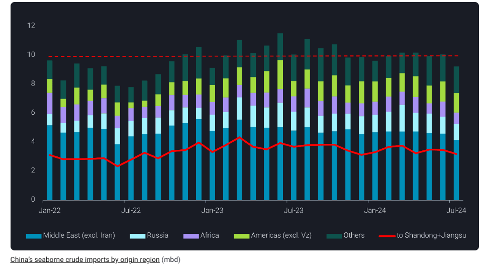
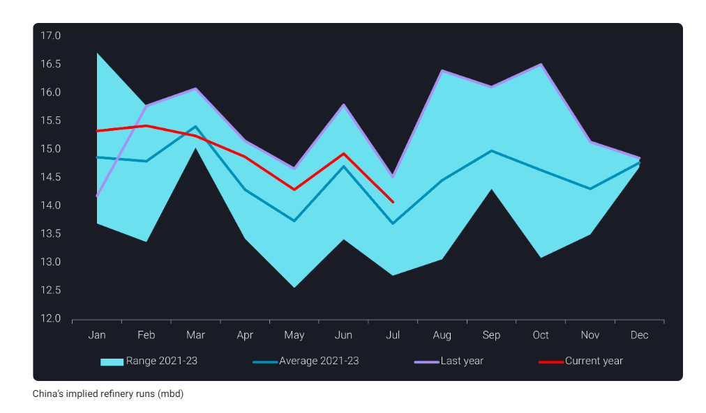
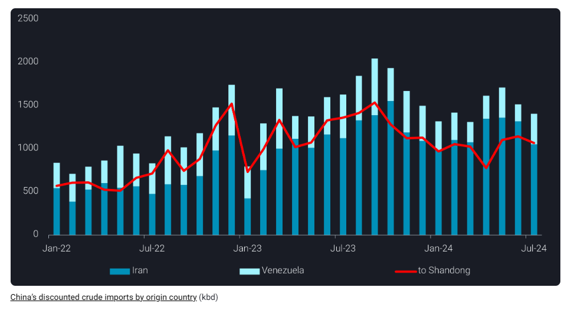

# Steep fall in China’s crude imports reinforces gloomy demand outlook

**Date:** August 12, 2024  
**Publisher:** Breakwave Advisors | **Category:** Market Insights  
**Original URL:** [https://www.breakwaveadvisors.com/insights/2024/8/12/steep-fall-in-chinas-crude-imports-reinforces-gloomy-demand-outlook](https://www.breakwaveadvisors.com/insights/2024/8/12/steep-fall-in-chinas-crude-imports-reinforces-gloomy-demand-outlook)  

---

China’s crude imports slumped to near 2-year lows in July, with no immediate recovery in sight amidst bearish domestic demand.

*By*[*Emma Li*](https://www.linkedin.com/in/emma-li-73003443/)

China’s seaborne crude imports experienced an 8% year-on-year decline, reaching near 2-year lows at 9.2 mbd in July, as refiners struggled to pick up run rates post spring maintenance season.

While arrivals into the Shandong and Jiangsu provinces, the hub of teapot refiners, slid to year-to-date lows amidst multi-year low utilization rates, China’s overall imports from the Middle East (excluding Iran) and Russia – mostly into other provinces – dropped to their lowest levels of the year. This reflects that oil majors must also cut their baseloads to manage weak post-turnaround run rates.

> **Figure 1: Στιγμιότυπο Οθόνης 2024 08 12 111658**  
> **Interactive Data & Source:** [Vortexa](https://www.vortexa.com//oil-gas-data-traders-analysts-data-scientists?gclid=Cj0KCQjw8_qRBhCXARIsAE2AtRZKOvMnbilZ_6_91d7huSFFy71pWLrnPwGwOHVzXsmsG-1a1mZnQw8aAt89EALw_wcB&hsa_acc=1782073842&hsa_ad=548425387665&hsa_cam=14746637662&hsa_grp=125038601902&hsa_kw=&hsa_mt=&hsa_net=adwords&hsa_src=g&hsa_tgt=dsa-1431852288425&hsa_ver=3&utm_campaign=%5BCD%5D%20-%20DSA%20-%20EMEA&utm_medium=cpc&utm_medium=ppc&utm_source=google&utm_source=adwords&utm_term=) | [Local Asset](file:///C:/Users/Dell/Github/Shipping/corpus/03-breakwave/insights/2024/assets/2024-08-12_steep-fall-in-chinas-crude-imports-reinforces-gloomy-demand-outlook_img_cea3cf84ceb9ceb3cebcceb9cf8ccf84cf85_0811801fae9f.png)

Meanwhile, China’s onshore crude inventories continued to build at an average rate of 340kbd throughout July, resulting in China’s implied refinery runs falling to 14mbd, nearly 500kbd lower year-on-year. The steep falls in refinery runs since February suggests persistent weakness in the near term, and even the new SPR stockpile target announced in early July is not enough to boost China’s crude imports. The 8mt additional stock build mandate by March 2025 translates to less than 250kbd of additional crude imports if refiners start to build stock from August.

> **Figure 2: Στιγμιότυπο Οθόνης 2024 08 12 111756**  
> **Interactive Data & Source:** [Vortexa](https://www.vortexa.com//oil-gas-data-traders-analysts-data-scientists?gclid=Cj0KCQjw8_qRBhCXARIsAE2AtRZKOvMnbilZ_6_91d7huSFFy71pWLrnPwGwOHVzXsmsG-1a1mZnQw8aAt89EALw_wcB&hsa_acc=1782073842&hsa_ad=548425387665&hsa_cam=14746637662&hsa_grp=125038601902&hsa_kw=&hsa_mt=&hsa_net=adwords&hsa_src=g&hsa_tgt=dsa-1431852288425&hsa_ver=3&utm_campaign=%5BCD%5D%20-%20DSA%20-%20EMEA&utm_medium=cpc&utm_medium=ppc&utm_source=google&utm_source=adwords&utm_term=) | [Local Asset](file:///C:/Users/Dell/Github/Shipping/corpus/03-breakwave/insights/2024/assets/2024-08-12_steep-fall-in-chinas-crude-imports-reinforces-gloomy-demand-outlook_img_cea3cf84ceb9ceb3cebcceb9cf8ccf84cf85_4e4e1f754084.png)

## Oil Majors Need Additional Cpp Export Quotas to Maintain Run Rates

China is eyeing a third batch of product export quotas to support refinery runs among oil majors. The total amount is reported to be around 15mt for the remainder of the year, instead of the market’s earlier anticipation of around 11mt, as domestic demand for diesel is still below seasonal norms.

Compared to the oil majors that benefit from Beijing’s support to keep healthy run rates through exports, teapot refiners continued to experience squeezed refining margins due to weaker-than-expected domestic consumption of gasoline and diesel, with no access to the export market. Many teapots extended shutdowns or ran at low rates after completing maintenance due to bearish margins, leading to multi-year low demand for key feedstocks in the Shandong area.

> **Figure 3: Στιγμιότυπο Οθόνης 2024 08 12 111852**  
> **Interactive Data & Source:** [Vortexa](https://www.vortexa.com//oil-gas-data-traders-analysts-data-scientists?gclid=Cj0KCQjw8_qRBhCXARIsAE2AtRZKOvMnbilZ_6_91d7huSFFy71pWLrnPwGwOHVzXsmsG-1a1mZnQw8aAt89EALw_wcB&hsa_acc=1782073842&hsa_ad=548425387665&hsa_cam=14746637662&hsa_grp=125038601902&hsa_kw=&hsa_mt=&hsa_net=adwords&hsa_src=g&hsa_tgt=dsa-1431852288425&hsa_ver=3&utm_campaign=%5BCD%5D%20-%20DSA%20-%20EMEA&utm_medium=cpc&utm_medium=ppc&utm_source=google&utm_source=adwords&utm_term=) | [Local Asset](file:///C:/Users/Dell/Github/Shipping/corpus/03-breakwave/insights/2024/assets/2024-08-12_steep-fall-in-chinas-crude-imports-reinforces-gloomy-demand-outlook_img_cea3cf84ceb9ceb3cebcceb9cf8ccf84cf85_201505f7037e.png)

## A Cold Winter for Chinese Refining Sector

Although China’s crude demand is expected to rebound in September-October following a seasonal pattern, dampened demand from the construction and manufacturing sectors will continue to cap refinery runs below last year’s levels.

While teapot refiners pin their hopes on demand recovery in 2025, oil majors and chemical producers are eyeing overseas markets. These attempts will also weigh on already bearish regional product cracks and squeeze other Asian refiners’ profits.

Data Source:[Vortexa](https://www.vortexa.com//oil-gas-data-traders-analysts-data-scientists?gclid=Cj0KCQjw8_qRBhCXARIsAE2AtRZKOvMnbilZ_6_91d7huSFFy71pWLrnPwGwOHVzXsmsG-1a1mZnQw8aAt89EALw_wcB&hsa_acc=1782073842&hsa_ad=548425387665&hsa_cam=14746637662&hsa_grp=125038601902&hsa_kw=&hsa_mt=&hsa_net=adwords&hsa_src=g&hsa_tgt=dsa-1431852288425&hsa_ver=3&utm_campaign=%5BCD%5D%20-%20DSA%20-%20EMEA&utm_medium=cpc&utm_medium=ppc&utm_source=google&utm_source=adwords&utm_term=)

---

**Tags:** China, Crude, Tankers  
