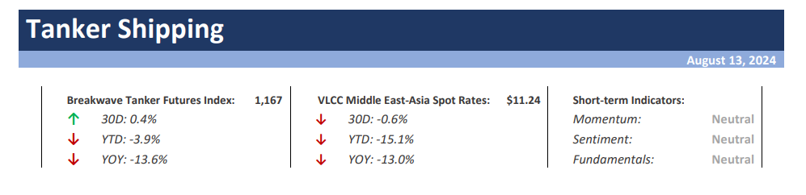
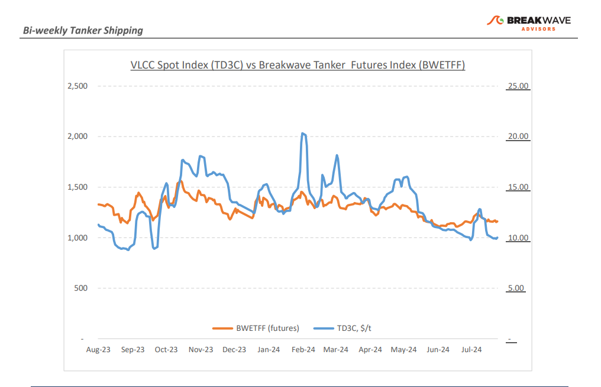
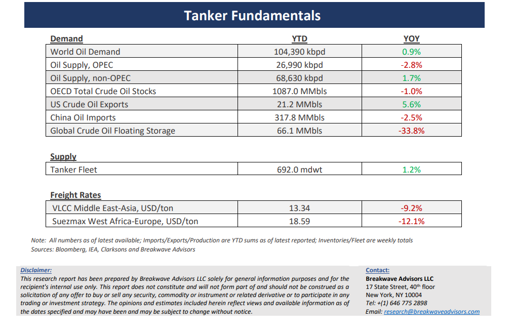

# Breakwave Bi-Weekly Tanker Report - August 13, 2024

**Date:** August 13, 2024  
**Publisher:** Breakwave Advisors | **Category:** Market Insights  
**Original URL:** [https://www.breakwaveadvisors.com/insights/2024730wet-87w332-rgmm3](https://www.breakwaveadvisors.com/insights/2024730wet-87w332-rgmm3)  

---

> **Figure 1: Cea3cf84ceb9ceb3cebcceb9cf8ccf84cf85**  
> [Local Asset](file:///C:/Users/Dell/Github/Shipping/corpus/03-breakwave/insights/2024/assets/2024-08-13_2024730wet-87w332-rgmm3_img_cea3cf84ceb9ceb3cebcceb9cf8ccf84cf85_e4b5e05a7f8e.png)

**· VLCC Market Back to Year-lows as Activity Slows Down**– The**VLCC market**is once again back to**recent lows**although it seems to be bottoming as the first half of August concludes. Freight rates for the benchmark Middle East Gulf to China route have declined back to levels seen just a month ago prior to the recent temporary rally in spot rates. The current**sentiment**in the first two weeks of August**mirrors**the market conditions experienced during the same period last year. However, it is important to note that the summer months typically do not provide a reliable gauge of market trends due to weak seasonality. Additionally, ongoing**geopolitical tensions**are further complicating the outlook for oil prices and future demand in Asia, adding more**uncertainty**. In the Atlantic market, the VLCC sector is also facing challenges, with freight rates for the West Africa to China route remaining subdued. Brokering sources indicate that some fixtures have been arranged off-market, suggesting that official rates may not fully capture the ongoing dynamics. However, the**market remains shaky**, with key indicators still under pressure.**Looking ahead**, there are some**cautiously optimistic**expectations for a potential improvement. A healthier tonnage list seems to be emerging, which could help stabilize the spot and paper markets in the coming days/weeks. If this trend continues, it might provide a much-needed boost to market sentiment, though any recovery will likely be fragile given the broader uncertainties.**Overall**, while the VLCC market in both the Middle East and Atlantic regions is struggling, the interplay of geopolitical tensions, fluctuating oil prices, and evolving Asian demand will be critical in shaping tanker rates with any**potential shift taking****place**no earlier than early**fall**.

**· China’s Oil Demand Continues to Struggle**–**China’s crude oil imports**in July saw a notable**downturn**, reaching their lowest level since September 2022, according to official customs data. The decline in imports highlights the**ongoing struggles**within China's oil refining sector, which is grappling with a combination of weak processing margins and subdued domestic fuel demand. As a result,**OPEC**recently also**reduced**its quite optimistic**oil demand growth**for 2024, although it still sees 2.1mbpd yoy growth, a sharp contrast to the IEA’s 1.0mbpd, even with only five months left to the end of the year. Despite the overall decline in Chinese oil imports, there were reports of additional crude oil purchases in July for storage, likely part of a government initiative to build up state reserves, although indications imply that the volume of these purchases was relatively small and did little to offset the broader decline in imports.**Geopolitical tensions**remain elevated and**support oil prices**despite the relatively bearish fundamentals, but the tanker market is in need of some physical demand indication in order to see stronger spot rates during the coming winter.

**· Our Long-term View –**The tanker market is recovering from a long period of staggered rates as the growth in new vessel supply shrinks while oil demand is recovering in line with the global economy. A historically low orderbook combined with favorable demand fundamentals should continue to support increased spot rate volatility, which combined with the ongoing geopolitical turmoil, should support freight rates in the medium to long term.

> **Figure 2: Cea3cf84ceb9ceb3cebcceb9cf8ccf84cf85**  
> [Local Asset](file:///C:/Users/Dell/Github/Shipping/corpus/03-breakwave/insights/2024/assets/2024-08-13_2024730wet-87w332-rgmm3_img_cea3cf84ceb9ceb3cebcceb9cf8ccf84cf85_d2287510fbfd.png)

> **Figure 3: Cea3cf84ceb9ceb3cebcceb9cf8ccf84cf85**  
> [Local Asset](file:///C:/Users/Dell/Github/Shipping/corpus/03-breakwave/insights/2024/assets/2024-08-13_2024730wet-87w332-rgmm3_img_cea3cf84ceb9ceb3cebcceb9cf8ccf84cf85_f0fc411945ae.png)

### Subscribe:
