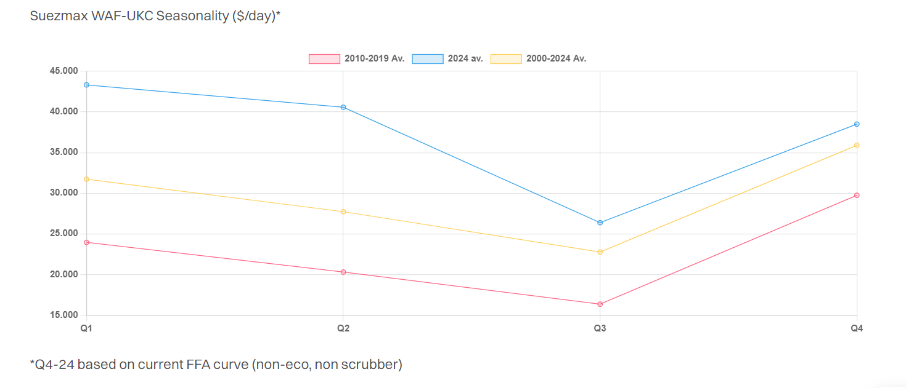

# Seasonal Slowdown

**Date:** August 14, 2024  
**Publisher:** Breakwave Advisors | **Category:** Market Insights  
**Original URL:** [https://www.breakwaveadvisors.com/insights/2024/8/14/seasonal-slowdown](https://www.breakwaveadvisors.com/insights/2024/8/14/seasonal-slowdown)  

---

> **Figure 1: Tankers Secondary**  
> **Interactive Data & Source:** [Gibsons Co](https://www.gibsons.co.uk/market-reports) | [Local Asset](file:///C:/Users/Dell/Github/Shipping/corpus/03-breakwave/insights/2024/assets/2024-08-14_seasonal-slowdown_img_tankers-secondary_0d029e248e3f.jpg)

With most tanker markets currently seeing earnings at their lowest levels this year, the recent stock market chaos, ongoing energy transition and geopolitical risk, many are asking whether this simply represents a seasonal slowdown, or something more systemic.

In the crude market, earnings are typically weakest in Q3, generally in line with current trends as weather factors (among other drivers) tend to reduce volatility. This year, OPEC+ cuts and weak Chinese demand also seem to be constraining the markets, whilst US crude exports have also slowed and are currently flat year on year.

Crude tonne miles have struggled this year despite the Red Sea crisis. VLCC and Suezmax tonne miles are up 1% and for Aframaxes they are down 1% as the markets have adapted remarkably well to the effective closure of a major chokepoint. VLCC earnings are broadly in line with the same period a year ago, whilst Aframax and Suezmax earnings are higher than they were in August 2023 for the month to date. All of these markets rallied strongly from Q3 lows to Q4 highs in 2023, a trend we expect to see repeated this year. Crude exports from the US should see upside as Q4 maintenance comes into play, whilst Asian refiners will start procuring crudes for post turnaround supplies. Total demand levels remain a concern with consumption in China uncertain; however, even with slower growth, the outlook for the sector remains healthy, indicating that the current weakness is likely primarily driven by seasonal trends.

For the clean products market, the puzzle is more complex and the seasonality is more region specific compared to crude. Tonne miles have so far been phenomenal. For LR2s, they are up 24% year on year, whilst for LR1s and MRs tonne miles have grown a healthy 4% and 5% respectively. Yet much of that growth has been front loaded, with tonne miles trending down in recent months. In the Middle East, Q3 is traditionally the strongest quarter as Middle East refineries ramp up throughputs; however, this year the opposite trend has been observed despite robust volumes. In part, freight weakness has been driven by competition from crude carriers switching into the CPP markets, with 25-28% of all CPP heading from the Middle East/WCI into Europe being carried by VLCCs and Suezmaxes in June/July. Weaker Far Eastern exports in recent months are also another factor; however, trading reports suggest that Chinese exports may rally later this year, with larger export quotas potentially being issued. Looking forward, the market will remain volatile, but could face headwinds until later in Q4 when seasonal maintenance has passed. Involvement of VLCCs and Suezmaxes in clean trades during the traditionally strong Q4 period is also less likely, but could be a factor in 2025 as newbuilding deliveries accelerate.

In the Atlantic, MR earnings remain healthy from a historical standpoint, but below the levels many have become accustomed to. Further upside could be seen for European MRs, if the anticipated active Hurricane season damages US infrastructure. In the Mediterranean Handy market, the earnings weakness might seem extreme, but again is consistent with typical seasonal trends. Here, earnings are expected to improve substantially as we move later into Q4. Heading into next year, however, the dynamics could be different. European and US energy demand continues to transition, whilst US and European refiners are threatened by the new Dangote and Olmeca refineries.

Whilst the market fundamentals are changing, with slower oil demand growth, heightened macroeconomic and geopolitical risk the market outlook remains robust, helped by structural changes in tanker flows and the rapid ageing of the tanker fleet, constraining supply for mainstream players. Overall, the current weakness is mostly attributable to seasonality, with all markets expected to improve as the year progresses.

> **Figure 2: Στιγμιότυπο Οθόνης 2024 08 14 152129**  
> **Interactive Data & Source:** [Gibsons Co](https://www.gibsons.co.uk/market-reports) | [Local Asset](file:///C:/Users/Dell/Github/Shipping/corpus/03-breakwave/insights/2024/assets/2024-08-14_seasonal-slowdown_img_cea3cf84ceb9ceb3cebcceb9cf8ccf84cf85_d2bf29121deb.png)

Data source:[Gibson Shipbrokers](https://www.gibsons.co.uk/market-reports)

---

**Tags:** Crude, Tankers, Shipping  
