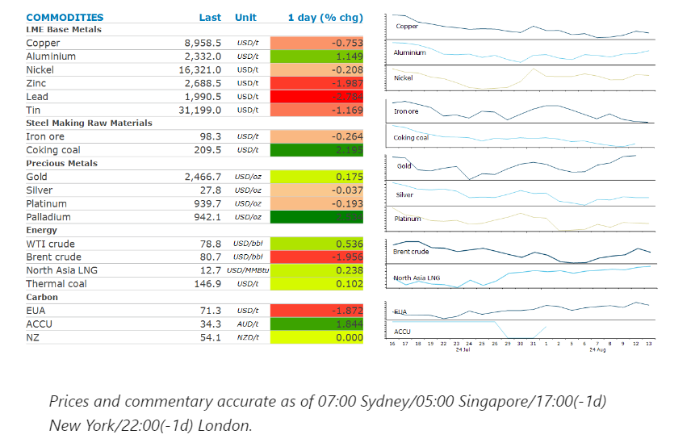
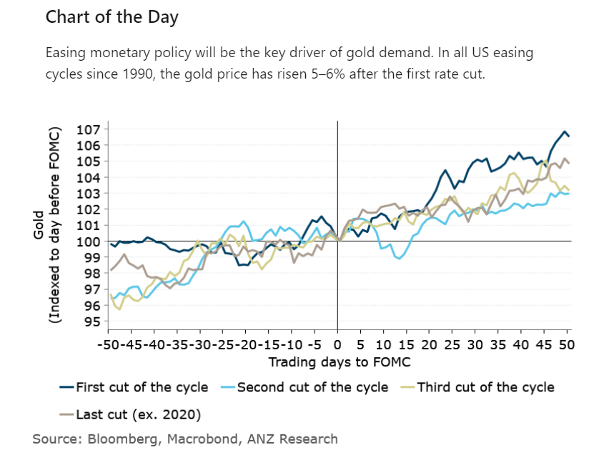

# Iron ore falls amid dark mood in China's steel industry

**Date:** August 14, 2024  
**Publisher:** Breakwave Advisors | **Category:** Market Insights  
**Original URL:** [https://www.breakwaveadvisors.com/insights/2024/8/14/ugylbdxj9sxslfougebmcuzwq64rag](https://www.breakwaveadvisors.com/insights/2024/8/14/ugylbdxj9sxslfougebmcuzwq64rag)  

---

Concerns over demand in China were back in focus. This was despite ongoing supply side issues hovering over energy and metal markets.

*By*[*Daniel Hynes*](https://www.linkedin.com/in/dahynes/)

> **Figure 1: Στιγμιότυπο Οθόνης 2024 08 14 113946**  
> **Interactive Data & Source:** [Linkedin](https://www.linkedin.com/newsletters/commodities-wrap-6692196755876012032/?fbclid=IwAR3kiXJqZdxmp9ZcRwBNI7FsBySI-XSC0pfPur1qzjt7OZp7PTE59Tsl1QI) | [Local Asset](file:///C:/Users/Dell/Github/Shipping/corpus/03-breakwave/insights/2024/assets/2024-08-14_ugylbdxj9sxslfougebmcuzwq64rag_img_cea3cf84ceb9ceb3cebcceb9cf8ccf84cf85_950535af45dc.png)

### Market Commentary

**Crude oil’s**five-day rally ended amid concerns of a potential market surplus forming in coming months. The International Energy Agency (IEA) warned that should OPEC proceed with its plans to boost supplies in the fourth quarter, global oil inventories would start to rise. The IEA said that oil consumption in China, the world’s biggest importer, fell for a third month in June. Growing demand in developed economies, such as the US, has been compensating for slackness in China. Yet that tightness is set to fade. Even if OPEC cancel their scheduled output hikes, the market will move into an 860kb/d surplus in 2025. This weighed on sentiment, despite concerns about an escalation in the Middle East conflict. US officials believe an Iranian attack on Israel has grown more likely and may come as soon as this week. If a broader conflict in the Middle East develops, this would likely threaten not only Iranian supply but also oil moving through key choke points in the Middle East. This could expose over 20mb/d of oil to risks of disruption.

**European gas**futures eased lower as the market pondered the implications of Ukraine’s incursion into Russia. Prices have surged this week on fears of supply shortages after Ukraine confirmed the capture of a large swathe of Russian territory, including near a key gas transit point. However, both Russia and the Ukraine have said they want gas flows to continue for now. That may be a moot point, with damage to key energy infrastructure a risk of ill-directed attacks in the area. Austria sees a risk from a sudden stoppage of pipeline gas from Russia. The country’s Energy Ministry warned it must end its dependency on Russia gas supplies as soon as possible. It has previously pledged to end Russia gas imports by 2027. The market also found some comfort in the large inventories Europe currently has. Flows from Norway are also currently steady.**North Asian LNG**prices edged higher amid increasing activity from buyers from the region. Indian and Thailand were active in the market, looking for LNG cargoes for delivery in the fourth quarter.

**Iron ore**extended its drop below USD100/t as the mood in China’s steel industry weakens. The purchasing managers’ index for the industry fell to 42.5 in July from 47.8 in June. Separately, the China Iron & Steel Association data showed the output from its members fell to a daily average of 1.97mt/d in July, the lowest level this year. Amid signs of ample supplies, port holdings in China have ballooned this year. China Mineral Resources Group said the increase had been driven by distorted and unsustainable speculative purchases, according to an official statement.

**Copper’s**recent recovery also stalled as traders weighed demand concerns in China. Typically, a significant net importer of copper, weak local consumption has seen exports rise in recent months. LME data this week showed Chinese output accounted for the bulk of inflows in exchange warehouses in July. The decline came despite renewed supply-side risks. Workers at BHP’s Escondida copper mine, the largest in the world, downed tools over a pay dispute, setting the stage for a major disruption.

> **Figure 2: Στιγμιότυπο Οθόνης 2024 08 14 113959**  
> **Interactive Data & Source:** [Linkedin](https://www.linkedin.com/newsletters/commodities-wrap-6692196755876012032/?fbclid=IwAR3kiXJqZdxmp9ZcRwBNI7FsBySI-XSC0pfPur1qzjt7OZp7PTE59Tsl1QI) | [Local Asset](file:///C:/Users/Dell/Github/Shipping/corpus/03-breakwave/insights/2024/assets/2024-08-14_ugylbdxj9sxslfougebmcuzwq64rag_img_cea3cf84ceb9ceb3cebcceb9cf8ccf84cf85_4fd66938933f.png)

Data source:[Commodities Wrap](https://www.linkedin.com/newsletters/commodities-wrap-6692196755876012032/?fbclid=IwAR3kiXJqZdxmp9ZcRwBNI7FsBySI-XSC0pfPur1qzjt7OZp7PTE59Tsl1QI)

---

**Tags:** Commodities, Economy, Shipping  
