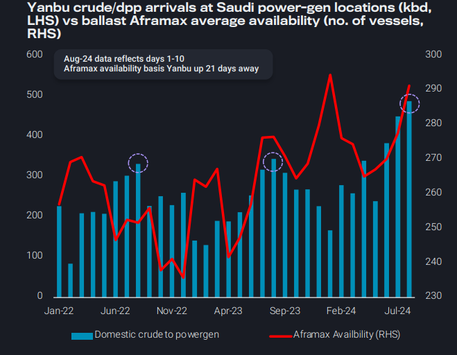
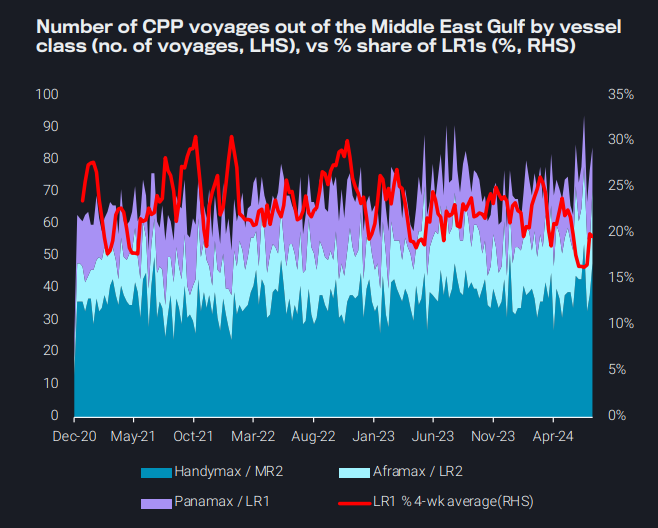
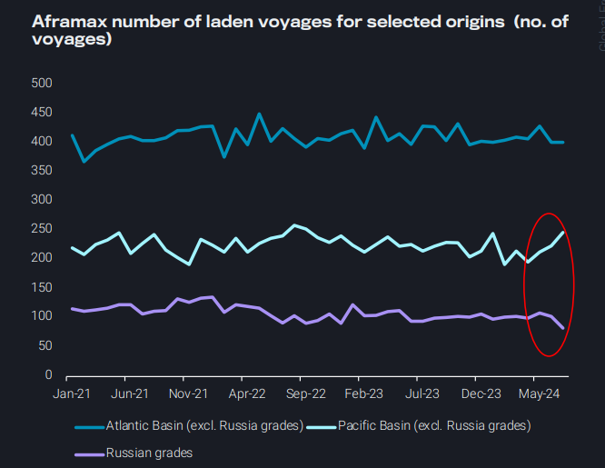
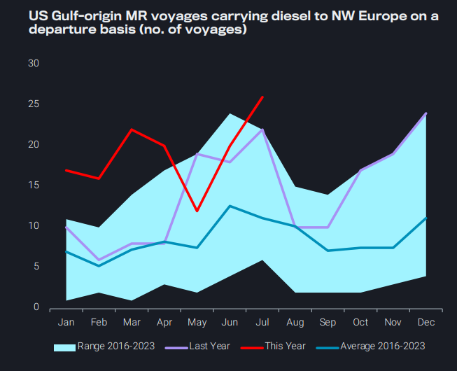

# Aframax look towards the Pacific for better employment opportunities

**Date:** August 15, 2024  
**Publisher:** Breakwave Advisors | **Category:** Market Insights  
**Original URL:** [https://www.breakwaveadvisors.com/insights/2024/8/15/hy75nl22mqxx2yt0sgh4w2e8hfb0vw](https://www.breakwaveadvisors.com/insights/2024/8/15/hy75nl22mqxx2yt0sgh4w2e8hfb0vw)  

---

*Dirty – East of Suez:*

- Red Sea Aframax availability growing as Saudi power gen needs nearing seasonal peak

*Clean – East of Suez:*

- LR1 rates reach 2024-lows as availability continues to add pressure in the Middle East

*Dirty – West of Suez:*

- Aframax increasingly head to the Pacific Basin for better employment opportunities

*Clean – West of Suez:*

- MR supply pressure shifts to NW Europe amid low gasoline loadings and strong arrivals on TC14

*By*[*Ioannis Papadimitriou*](https://www.linkedin.com/in/ipapadimitriou/)

### Dirty – East of Suez: Red Sea Aframax Availability Growing As Saudi Power Gen Needs Nearing Seasonal Peak

Saudi domestic power gen needs typically peak around August, as seen via seaborne crude and residual fuel oil arrivals at key locations.

- Most of this oil is of Saudi origin and in recent months the draw on domestic supply, instead of imports from international markets, has increased (see chart)

However, as was the case in prior years, oil flows are likely to fall from next month, and this could add even more vessel supply into a region which has availability approaching multi-year highs.

Future opportunities for Aframaxes in the Red Sea/MEG region could be restricted further by lower Libyan crude exports as disruptions continue.

- Ongoing force majeure at Zawia Terminal (as reported in Argus Media) will impact cross-med Aframax trade the most

> **Figure 1: Στιγμιότυπο Οθόνης 2024 08 15 105858**  
> **Interactive Data & Source:** [Vortexa](https://www.vortexa.com//oil-gas-data-traders-analysts-data-scientists?gclid=Cj0KCQjw8_qRBhCXARIsAE2AtRZKOvMnbilZ_6_91d7huSFFy71pWLrnPwGwOHVzXsmsG-1a1mZnQw8aAt89EALw_wcB&hsa_acc=1782073842&hsa_ad=548425387665&hsa_cam=14746637662&hsa_grp=125038601902&hsa_kw=&hsa_mt=&hsa_net=adwords&hsa_src=g&hsa_tgt=dsa-1431852288425&hsa_ver=3&utm_campaign=%5BCD%5D%20-%20DSA%20-%20EMEA&utm_medium=cpc&utm_medium=ppc&utm_source=google&utm_source=adwords&utm_term=) | [Local Asset](file:///C:/Users/Dell/Github/Shipping/corpus/03-breakwave/insights/2024/assets/2024-08-15_hy75nl22mqxx2yt0sgh4w2e8hfb0vw_img_cea3cf84ceb9ceb3cebcceb9cf8ccf84cf85_40156abbc684.png)

### Clean – East of Suez: LR1 Rates Reach 2024-Lows As Availability Continues to Add Pressure in the Middle East

After a volatile period where rates reached historical highs, LR1 trademark TC5 (Middle East-to-East Asia) and TC16 (Middle East-to-UK Cont) freight rates have now reached 2024-lows.

- Europe’s middle distillate import demand has softened since April.
- VLCC and Suezmax dirty-to-clean switches have also taken away market share from LR1s, as LR1s sailing on the East-to-West route are thinning.

As a result, the market share of LR1 loadings out of the Middle East has fallen to the lowest level since the start of 2023.

Looking forward, the surging prompt tonnage of LR1s in the Middle East, which is at a 22-month high is poised to exert further downwards pressure on LR1 rates.

- Rates could find support on the naphtha trade as ethylene crackers raise their runs, if the spread versus LPG narrows furthe.

> **Figure 2: Στιγμιότυπο Οθόνης 2024 08 15 105912**  
> **Interactive Data & Source:** [Vortexa](https://www.vortexa.com//oil-gas-data-traders-analysts-data-scientists?gclid=Cj0KCQjw8_qRBhCXARIsAE2AtRZKOvMnbilZ_6_91d7huSFFy71pWLrnPwGwOHVzXsmsG-1a1mZnQw8aAt89EALw_wcB&hsa_acc=1782073842&hsa_ad=548425387665&hsa_cam=14746637662&hsa_grp=125038601902&hsa_kw=&hsa_mt=&hsa_net=adwords&hsa_src=g&hsa_tgt=dsa-1431852288425&hsa_ver=3&utm_campaign=%5BCD%5D%20-%20DSA%20-%20EMEA&utm_medium=cpc&utm_medium=ppc&utm_source=google&utm_source=adwords&utm_term=) | [Local Asset](file:///C:/Users/Dell/Github/Shipping/corpus/03-breakwave/insights/2024/assets/2024-08-15_hy75nl22mqxx2yt0sgh4w2e8hfb0vw_img_cea3cf84ceb9ceb3cebcceb9cf8ccf84cf85_a592bc3e9c20.png)

### Dirty – West of Suez: Aframax Increasingly Head to the Pacific Basin for Better Employment Opportunities

The number of voyages on Aframaxes out of the Pacific Basin has reached a historical high in July, up by 15% y-o-y .

- This is related predominantly to the TMX expansion, which has led to a staggering increase in Aframax voyages out of Canada and US West Coast.
- Seasonal factors have also driven an Aframax voyages rise out of the Middle East and Red Sea for the 3rd consecutive month, at a time when the Aframax-Suezmax spread has narrowed for MEG-to-WC India flows (Argus).

At the same time sanctioning policies and outages of key regions could keep utilisation capped in the Atlantic Basin.

- Sanctioning policies continue to reduce the Aframax fleet participating in Russia trades, as Suezmax gain share (read previous issue for more details).
- Libya’s force majeure caps opportunities out of the Mediterranean, leaving Aframaxes to compete with Suezmax tankers for barrels in the Black Sea, where activity has been limited according to broker reports.

> **Figure 3: Στιγμιότυπο Οθόνης 2024 08 15 105930**  
> **Interactive Data & Source:** [Vortexa](https://www.vortexa.com//oil-gas-data-traders-analysts-data-scientists?gclid=Cj0KCQjw8_qRBhCXARIsAE2AtRZKOvMnbilZ_6_91d7huSFFy71pWLrnPwGwOHVzXsmsG-1a1mZnQw8aAt89EALw_wcB&hsa_acc=1782073842&hsa_ad=548425387665&hsa_cam=14746637662&hsa_grp=125038601902&hsa_kw=&hsa_mt=&hsa_net=adwords&hsa_src=g&hsa_tgt=dsa-1431852288425&hsa_ver=3&utm_campaign=%5BCD%5D%20-%20DSA%20-%20EMEA&utm_medium=cpc&utm_medium=ppc&utm_source=google&utm_source=adwords&utm_term=) | [Local Asset](file:///C:/Users/Dell/Github/Shipping/corpus/03-breakwave/insights/2024/assets/2024-08-15_hy75nl22mqxx2yt0sgh4w2e8hfb0vw_img_cea3cf84ceb9ceb3cebcceb9cf8ccf84cf85_e93738e56797.png)

### Clean – West of Suez: MR Supply Pressure Shifts to Nw Europe Amid Low Gasoline Loadings and Strong Arrivals on Tc14

Europe’s loadings of gasoline/blending components are at multi-year lows and well-below seasonal averages according to preliminary data for August (days 1-8).

- This decline has eaten into tanker demand in NW Europe, and tonne-days have fallen steadily over the past 1.5 months.
- At the same time, supply-side pressure has pushed prompt vessel availability in NW Europe towards three-month highs, plunging freight rates (TC2) to seven-month lows.

A contributing factor to the supply-side pressure is the steady stream of arrivals of diesel coming from the US Gulf, pushing voyage counts to historical highs.

- Upon arrival in Europe, MR operators were likely enticed to stay and trade in that market due to increasing earnings in NW Europe as vessel supply tightened in H2 of July.
- This has alleviated some of the extra tonnage in the US Gulf, helping to flatten out the volatility in prompt vessel supply and freight rates experienced over the last 2.5 months.

> **Figure 4: Στιγμιότυπο Οθόνης 2024 08 15 105948**  
> **Interactive Data & Source:** [Vortexa](https://www.vortexa.com//oil-gas-data-traders-analysts-data-scientists?gclid=Cj0KCQjw8_qRBhCXARIsAE2AtRZKOvMnbilZ_6_91d7huSFFy71pWLrnPwGwOHVzXsmsG-1a1mZnQw8aAt89EALw_wcB&hsa_acc=1782073842&hsa_ad=548425387665&hsa_cam=14746637662&hsa_grp=125038601902&hsa_kw=&hsa_mt=&hsa_net=adwords&hsa_src=g&hsa_tgt=dsa-1431852288425&hsa_ver=3&utm_campaign=%5BCD%5D%20-%20DSA%20-%20EMEA&utm_medium=cpc&utm_medium=ppc&utm_source=google&utm_source=adwords&utm_term=) | [Local Asset](file:///C:/Users/Dell/Github/Shipping/corpus/03-breakwave/insights/2024/assets/2024-08-15_hy75nl22mqxx2yt0sgh4w2e8hfb0vw_img_cea3cf84ceb9ceb3cebcceb9cf8ccf84cf85_3f0472956fdb.png)

Data Source:[Vortexa](https://www.vortexa.com//oil-gas-data-traders-analysts-data-scientists?gclid=Cj0KCQjw8_qRBhCXARIsAE2AtRZKOvMnbilZ_6_91d7huSFFy71pWLrnPwGwOHVzXsmsG-1a1mZnQw8aAt89EALw_wcB&hsa_acc=1782073842&hsa_ad=548425387665&hsa_cam=14746637662&hsa_grp=125038601902&hsa_kw=&hsa_mt=&hsa_net=adwords&hsa_src=g&hsa_tgt=dsa-1431852288425&hsa_ver=3&utm_campaign=%5BCD%5D%20-%20DSA%20-%20EMEA&utm_medium=cpc&utm_medium=ppc&utm_source=google&utm_source=adwords&utm_term=)

---

**Tags:** Shipping, Crude Oil, Tankers  
