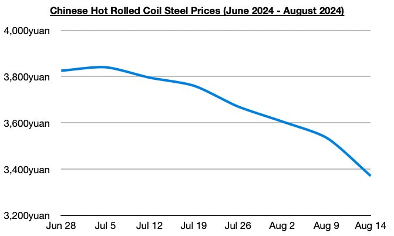
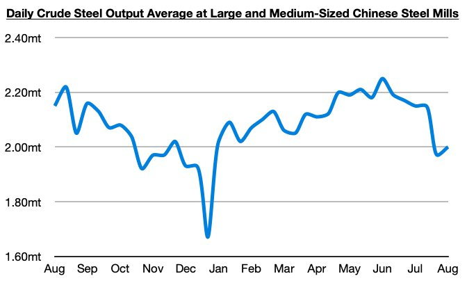

# Steel Price Decline in China is Intensifying

**Date:** August 15, 2024  
**Publisher:** Breakwave Advisors | **Category:** Market Insights  
**Original URL:** [https://www.breakwaveadvisors.com/insights/2024/8/15/steel-price-decline-in-china-is-intensifying](https://www.breakwaveadvisors.com/insights/2024/8/15/steel-price-decline-in-china-is-intensifying)  

---

*By*[*Jeffrey Landsberg*](https://www.linkedin.com/in/jeffrey-landsberg-70ab957/)

The pace of decline in Chinese steel prices has intensified this week, with prices through the first three days of the week down by 4.7%. Only three days have passed, but prices have already fallen by the largest amount in over two years.

> **Figure 1: Chart 1 (2)**  
> [Local Asset](file:///C:/Users/Dell/Github/Shipping/corpus/03-breakwave/insights/2024/assets/2024-08-15_steel-price-decline-in-china-is-intensifying_img_chart128229_37280e0c9928.jpg)

Overall, it remains clear that China's steel production is exceeding demand, but the intensity of the price decline is new. Prices had previously declined during ten of the last eleven weeks, but only by a weekly average of 1.2%.

Also of note is that the latest data shows that daily crude steel production at large and medium-sized mills in China averaged 2 million tons during August 1 - August 10. While up by 2% from July 21 - July 31, this is down year-on-year by 7%.

> **Figure 2: Chart 2 (2)**  
> [Local Asset](file:///C:/Users/Dell/Github/Shipping/corpus/03-breakwave/insights/2024/assets/2024-08-15_steel-price-decline-in-china-is-intensifying_img_chart228229_d898bbe1f138.jpg)

China’s steel production remains in a return to contraction, but it is still too high. Prior to June 11, year-on-year growth in steel production had been enjoyed from May 20 through June 10.

---

**Tags:** China, Ironore, Shipping  
