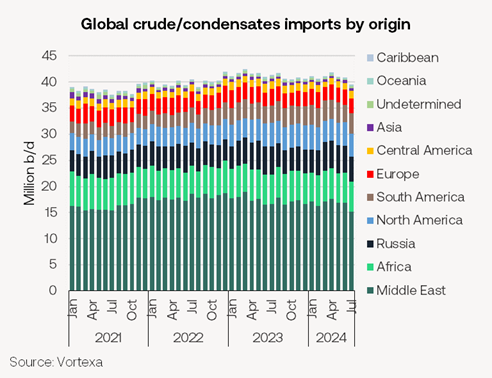
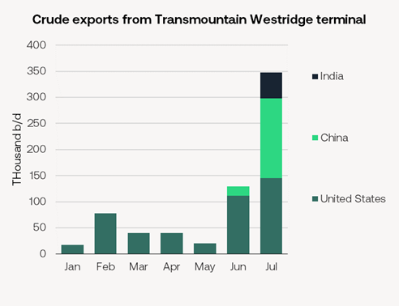
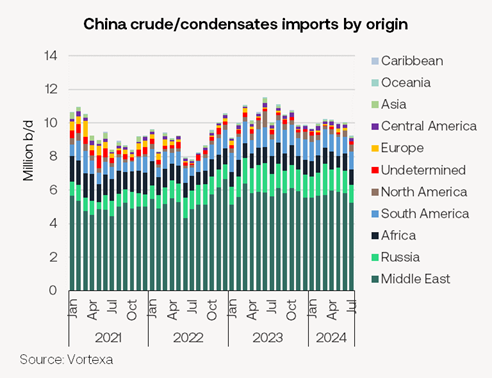

# Global crude imports have been sliding

**Date:** August 16, 2024  
**Publisher:** Breakwave Advisors | **Category:** Market Insights  
**Original URL:** [https://www.breakwaveadvisors.com/insights/2024/8/16/global-crude-imports-have-been-sliding](https://www.breakwaveadvisors.com/insights/2024/8/16/global-crude-imports-have-been-sliding)  

---

Global crude imports slow as Chinese demand weakens

- Despite seasonally strong oil demand, global crude imports have been sliding since April. In July, global seaborne imports of crude oil and condensate dropped to just 39m b/d, down from 40.9m b/d in June. This was the lowest monthly import total since August 2022.

> **Figure 1: Market Chart 1**  
> [Local Asset](file:///C:/Users/Dell/Github/Shipping/corpus/03-breakwave/insights/2024/assets/2024-08-16_global-crude-imports-have-been-sliding_img_image028129_8c2d3234668a.png)

- The decline was driven largely by reduced demand from China. Imports from most major producers, including Saudi Arabia, Iraq, the UAE, and the US, decreased, with Brazil being the only significant producer to see an increase. Additionally, imports became more diversified, with higher volumes from nations outside the top suppliers.
- Exports from Saudi Arabia hit their lowest level since September 2023 due partly to increased domestic power generation.Russia saw a drop in crude exports.
- Asia crude imports from the US fell. Canadian crude exports rose significantly due to the start-up of the TMX pipeline.

> **Figure 2: Market Chart 2**  
> [Local Asset](file:///C:/Users/Dell/Github/Shipping/corpus/03-breakwave/insights/2024/assets/2024-08-16_global-crude-imports-have-been-sliding_img_image1_b70e14c01583.png)

- Weakness in Asia's demand, particularly from China and Southeast Asia, was a key factor in the global import decline. Meanwhile, crude imports in Northwest Europe and the Mediterranean region grew.

China’s refining sector faces fresh challenges

- China's seaborne crude imports dropped by 8% year on year in July to 9.24m b/d, from 10.04m b/d in June. Chinese refiners struggling to ramp up production after the spring maintenance season.

> **Figure 3: Market Chart 3**  
> [Local Asset](file:///C:/Users/Dell/Github/Shipping/corpus/03-breakwave/insights/2024/assets/2024-08-16_global-crude-imports-have-been-sliding_img_image2_c8dfcf9fb670.png)

- Chinese crude imports from the Middle East and Russia also decreased, reflecting that state-owned refiners cut their baseloads to manage weak post-turnaround run rates.
- Lower Chinese demand has helped VLCC TD3c rates to fall to $22k/day from $36k/day in July.
- China's onshore crude inventories increased by an average of 340k b/d in July, suggesting a drop in implied refinery runs to 14m b/d, down nearly 500k b/d year-on-year. We expect that higher imports resulting from China’s new SPR target will be more than offset by lower refinery throughput. As a result, we do not expect to see a near-term jump in Chinese crude imports.
- Even at today’s low refinery run rates, state-owned refiners may require additional CPP export quotas if runs are to avoid further cuts. China is considering a third batch of around 15 million tonnes of CPP export quotas for Chinese state-owned oil companies, according to Vortexa, for the remainder of the year.
- While China’s refining sector faces a challenging outlook, we expect crude demand to rebound as the construction season gets underway in September-October but remain below last year's levels.

OPEC revises global oil demand downwards first time since March

- OPEC has revised its global oil demand forecast downward for both 2024 and 2025. The group has reduced 2024 demand estimate by 140k b/d to 2.11m b/d and lowered the 2025 demand growth forecast by 70k b/d to 1.78m b/d. This is the first adjustment since March.
- This adjustment reflects concerns over economic challenges in China. Slumping Chinese diesel consumption and a troubled property sector have slowed China's economic growth.
- The IEA has a more conservative estimate, projecting a 970k b/d increase in oil demand for 2024 and 953k b/d in 2025.

---

**Tags:** Tankers, China, Shipping  
