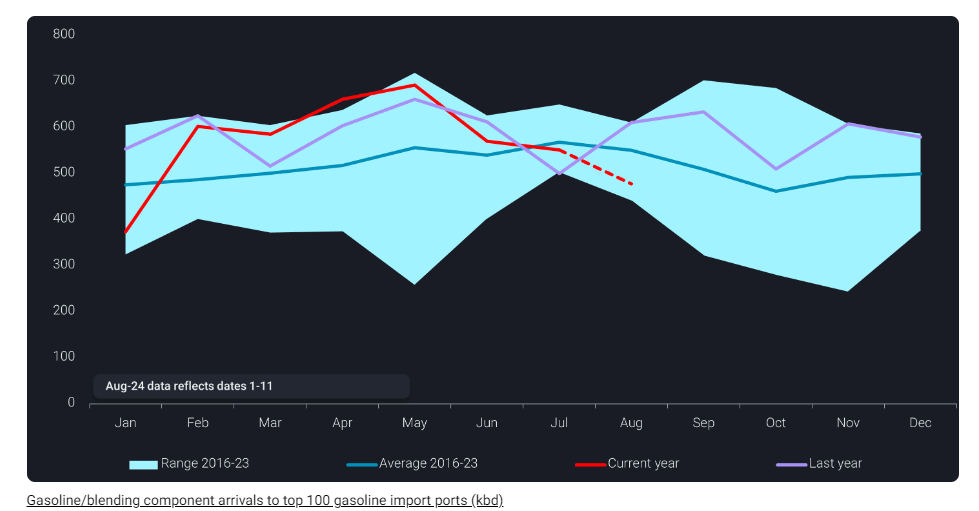
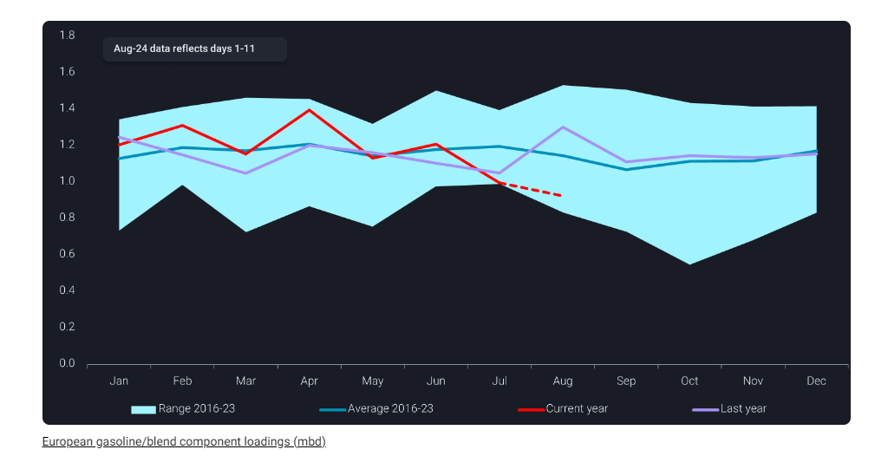
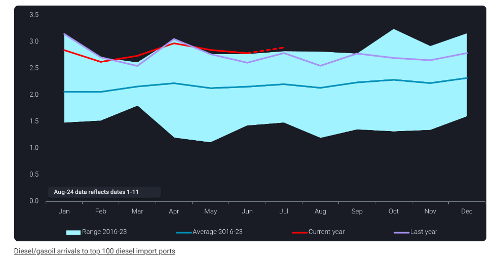
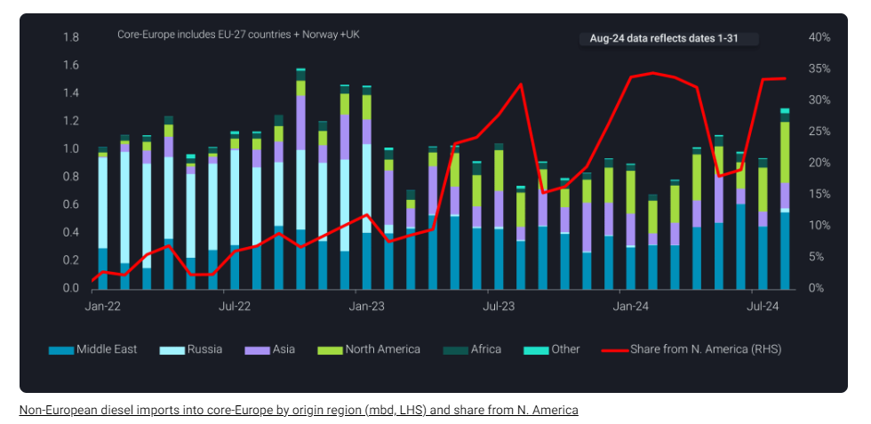
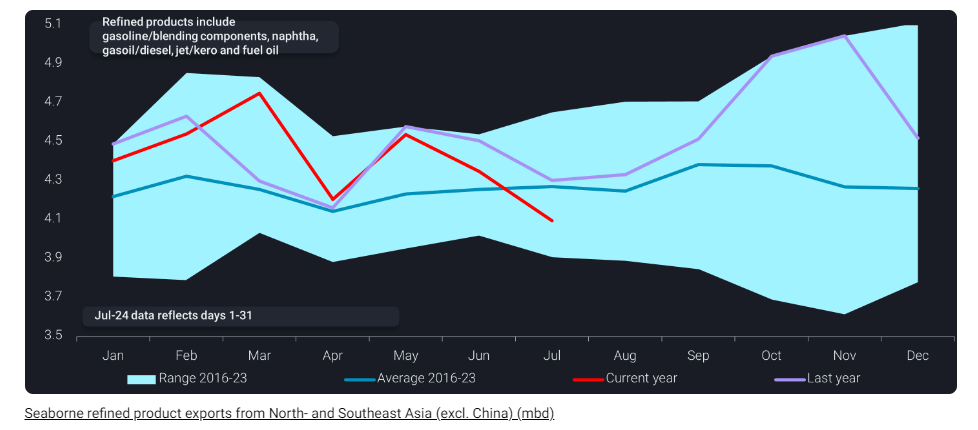

# Have refiners cut enough or is there more to go?

**Date:** August 16, 2024  
**Publisher:** Breakwave Advisors | **Category:** Market Insights  
**Original URL:** [https://www.breakwaveadvisors.com/insights/2024/8/16/have-refiners-cut-enough-or-is-there-more-to-go](https://www.breakwaveadvisors.com/insights/2024/8/16/have-refiners-cut-enough-or-is-there-more-to-go)  

---

In this insight we review the latest global demand indicators for major refined products and what they are telling us.

*By*[*Pamela Munger*](https://www.linkedin.com/in/pamela-munger-a7849a5/)

Clean product margins appear to have found a floor after softening in the last few weeks despite lackluster demand even in expected hot spots. Regardless of the recent and temporary uplift in gasoline margins, predominantly in the US, global gasoline and blending component arrivals into the top 100 gasoline import ports (a figure we have used to indicate where the true demand pockets are located by excluding trading hubs such as ARA and Singapore) could point to a future of further disappointment.

After several months above last year’s levels from March – May, these arrivals look to be heading lower (red line) possibly below the 8 year average. Underpinning this fall in demand has been largely driven by the PADD 1, where seaborne imports from Europe have been observed 16% lower in June 2024 y-o-y, normally peak import month. Low import requirements from PADD 1 have been especially surprising amid a backdrop of suppressed refinery run rates (below 95% for the past five weeks, EIA) in both PADD 1 and PADD 3. Also to note, despite Brazil’s strong diesel demand for its heavy vehicle fleet, South America gasoline arrivals for Jan-July of this year have dropped by 36% when compared to Jan-July 2023.

> **Figure 1: Στιγμιότυπο Οθόνης 2024 08 16 110923**  
> **Interactive Data & Source:** [Twitter Us18 List-manage](https://twitter.us18.list-manage.com/track/click?u=92fd2e3ec7962cda008f0732a&id=8cef5bbffa&e=040e784405) | [Local Asset](file:///C:/Users/Dell/Github/Shipping/corpus/03-breakwave/insights/2024/assets/2024-08-16_have-refiners-cut-enough-or-is-there-more-to-go_img_cea3cf84ceb9ceb3cebcceb9cf8ccf84cf85_0d0dfd21907d.png)

Meanwhile, Europe continues to respond to lower than expected gasoline buying from PADD 1 and to some extent WAf by decreasing gasoline loadings to the lowest levels since September 2020 when much of the Atlantic Basin was reeling under the impact of the pandemic.

> **Figure 2: Στιγμιότυπο Οθόνης 2024 08 16 111804**  
> **Interactive Data & Source:** [Twitter Us18 List-manage](https://twitter.us18.list-manage.com/track/click?u=92fd2e3ec7962cda008f0732a&id=8cef5bbffa&e=040e784405) | [Local Asset](file:///C:/Users/Dell/Github/Shipping/corpus/03-breakwave/insights/2024/assets/2024-08-16_have-refiners-cut-enough-or-is-there-more-to-go_img_cea3cf84ceb9ceb3cebcceb9cf8ccf84cf85_8b5b45741b33.png)

On the other hand, surprisingly, we see that diesel/gasoil arrivals to the top 100 diesel import ports continues above the eight year range. European gasoil demand in 1H 2024 was 50kbd below the same period in 2020 (IEA) and recent PMI indicators show Eurozone manufacturing PMIs coming in around 45.8 while China continues at 49.8.

> **Figure 3: Στιγμιότυπο Οθόνης 2024 08 16 112502**  
> **Interactive Data & Source:** [Twitter Us18 List-manage](https://twitter.us18.list-manage.com/track/click?u=92fd2e3ec7962cda008f0732a&id=8cef5bbffa&e=040e784405) | [Local Asset](file:///C:/Users/Dell/Github/Shipping/corpus/03-breakwave/insights/2024/assets/2024-08-16_have-refiners-cut-enough-or-is-there-more-to-go_img_cea3cf84ceb9ceb3cebcceb9cf8ccf84cf85_9f25c82e90a3.png)

And despite middle distillate stockbuilds (Argus Media) in Europe and slower demand,diesel/gasoil imports into the EU-27 and UK continue.The arbitrage has remained slightly opened from the Middle East, aided by the ability to move diesel cargos on larger vessels. We have also seen USGC continue to push out steady diesel exports making their way to Northwest Europe and likely placing further pressure on distillate cracks.

> **Figure 4: Στιγμιότυπο Οθόνης 2024 08 16 112733**  
> **Interactive Data & Source:** [Twitter Us18 List-manage](https://twitter.us18.list-manage.com/track/click?u=92fd2e3ec7962cda008f0732a&id=8cef5bbffa&e=040e784405) | [Local Asset](file:///C:/Users/Dell/Github/Shipping/corpus/03-breakwave/insights/2024/assets/2024-08-16_have-refiners-cut-enough-or-is-there-more-to-go_img_cea3cf84ceb9ceb3cebcceb9cf8ccf84cf85_5f768264eee7.png)

If we take a look at East of Suez flows, one of the recent questions in the market is whether the Chinese refining system will respond to the extra clean product quotas granted and ramp-up refining runs, exporting more clean products possibly to the Atlantic Basin.

However, we see seaborne exports from the region continuing to take a sharp downturn likely due to months of ongoing refinery run cuts, shutdowns and extended maintenance. Even these low levels of exports have only barely provided a floor for product margins in the region.

Considering the overall poor outlook for the region in terms of dampened industrial activity, possibly mild winter weather and vehicle fleet changes ([China](https://twitter.us18.list-manage.com/track/click?u=92fd2e3ec7962cda008f0732a&id=8cef5bbffa&e=040e784405)’s electric cars pass 50% of new sales according to Xinhua), we expect refiners to operate at continued low levels.[Read more in this insight “Steep fall in China’s crude imports reinforces gloomy demand outlook”](https://www.vortexa.com/insights/crude/steep-fall-in-chinas-crude-imports-reinforce-gloomy-demand-outlook/)

> **Figure 5: Στιγμιότυπο Οθόνης 2024 08 16 112828**  
> **Interactive Data & Source:** [Vortexa](https://www.vortexa.com//oil-gas-data-traders-analysts-data-scientists?gclid=Cj0KCQjw8_qRBhCXARIsAE2AtRZKOvMnbilZ_6_91d7huSFFy71pWLrnPwGwOHVzXsmsG-1a1mZnQw8aAt89EALw_wcB&hsa_acc=1782073842&hsa_ad=548425387665&hsa_cam=14746637662&hsa_grp=125038601902&hsa_kw=&hsa_mt=&hsa_net=adwords&hsa_src=g&hsa_tgt=dsa-1431852288425&hsa_ver=3&utm_campaign=%5BCD%5D%20-%20DSA%20-%20EMEA&utm_medium=cpc&utm_medium=ppc&utm_source=google&utm_source=adwords&utm_term=) | [Local Asset](file:///C:/Users/Dell/Github/Shipping/corpus/03-breakwave/insights/2024/assets/2024-08-16_have-refiners-cut-enough-or-is-there-more-to-go_img_cea3cf84ceb9ceb3cebcceb9cf8ccf84cf85_63cd53c4d824.png)

As we look forward, we can see that all of the major agencies are revising downward their oil demand growth outlook for 2024, raising the question around the need for rising crude supplies from Non-OPEC+ and OPEC+. As we approach the possible unwinding of production cuts from OPEC in October based on a strong product demand outlook for the H2 2024, we could see a swing from deficit to surplus in the near future.

Data Source:[Vortexa](https://www.vortexa.com//oil-gas-data-traders-analysts-data-scientists?gclid=Cj0KCQjw8_qRBhCXARIsAE2AtRZKOvMnbilZ_6_91d7huSFFy71pWLrnPwGwOHVzXsmsG-1a1mZnQw8aAt89EALw_wcB&hsa_acc=1782073842&hsa_ad=548425387665&hsa_cam=14746637662&hsa_grp=125038601902&hsa_kw=&hsa_mt=&hsa_net=adwords&hsa_src=g&hsa_tgt=dsa-1431852288425&hsa_ver=3&utm_campaign=%5BCD%5D%20-%20DSA%20-%20EMEA&utm_medium=cpc&utm_medium=ppc&utm_source=google&utm_source=adwords&utm_term=)

---

**Tags:** Shipping, Crude Oil, Tankers  
