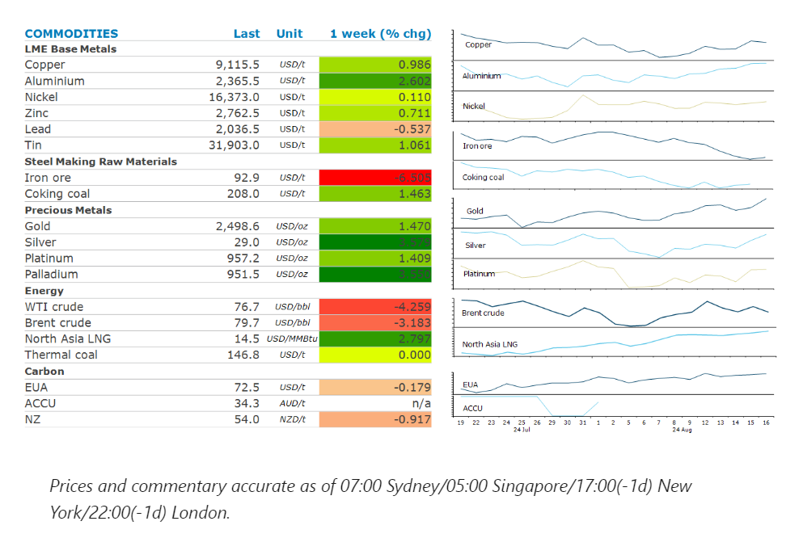
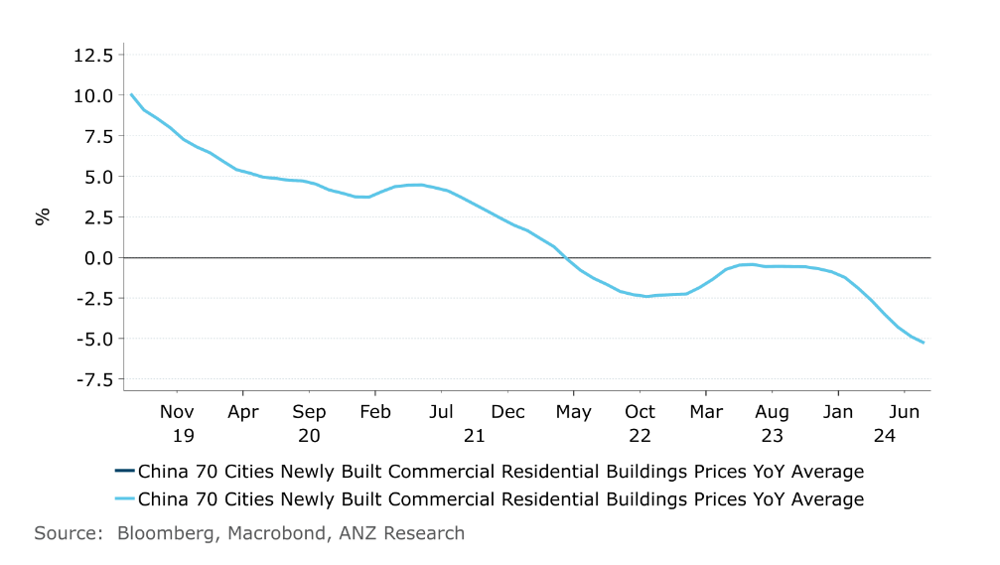

# Expectations of a rate cut boost sentiment

**Date:** August 19, 2024  
**Publisher:** Breakwave Advisors | **Category:** Market Insights  
**Original URL:** [https://www.breakwaveadvisors.com/insights/2024/8/19/qdyjyp77rgbmivrn9win3hdw08q6hz](https://www.breakwaveadvisors.com/insights/2024/8/19/qdyjyp77rgbmivrn9win3hdw08q6hz)  

---

A risk-on tone across markets boosted sentiment across commodities. This was triggered by rising expectations of an imminent rate cut by the Fed.

*By*[*Daniel Hynes*](https://www.linkedin.com/in/dahynes/)

> **Figure 1: Screenshot 2024 08 19 10.57.10**  
> [Local Asset](file:///C:/Users/Dell/Github/Shipping/corpus/03-breakwave/insights/2024/assets/2024-08-19_qdyjyp77rgbmivrn9win3hdw08q6hz_img_screenshot2024-08-19105710_079fe0cc7f7d.png)

### Market Commentary

**Copper**recorded its first weekly gain since early July as fears of a hard economic landing in the US eased. A combination of robust US jobs data and better than expected retail sales triggered a risk-on tone across markets. It also took the focus away from China, where recovery remains elusive. China’s industrial output rose 5.1% in July, down from June’s 5.3%. Retail sales climbed 2.3%, according to official government data. Prices were also supported by renewed supply side issues. A strike at BHP’s Escondida copper mine in Chile threatened to disrupt over 5% of global supply. This was in addition to disruption at Lundin Mining’s copper mine in Chile. These concerns may ease after reports over the weekend that BHP and union leaders reached a preliminary wage agreement. Even so,[**the risk of further disruptions remains high**](../pdfs/2024-08-19_qdyjyp77rgbmivrn9win3hdw08q6hz_commodity-call-copper-strikes-out-1_24b1cb014056.pdf). Several mines in Chile, representing approximately 900kt of copper or 4% of global supply, have yet to finalise wage discussions. Even if just a fraction of the upcoming labour negotiations results in lost supply, our market deficit in copper is likely to increase.

**Iron ore**futures fell more than 9% last week to trade at a two year low amid weak demand from China’s steel industry. China Baowu Steel Group warned that conditions are worse than downturns of 2008 and 2015. It expects the crisis will likely be longer and more difficult to endure than it expected. Steel mills are already pulling back on output, with July volumes down 9% y/y. Total iron ore stockpiles across ports in China fell 0.5% w/w to 149.6mt for the week ending 16 August. Nevertheless, steel mills are likely to pullback on iron ore purchases amid weak margins and subdued demand.

**Gold**pushed above USD2,500/oz for the first time amid hopes that the US Federal Reserve is edging closer to cutting rates. While retail sales beat estimates, a disappointing reading on the US housing market reinforced expectations of fast and deeper cuts by the Fed. This has seen investor positioning bolster their bullish bets, which have reached a four year high, according to CFTC data. Meanwhile, gold holdings in exchange traded funds have risen strongly in recent months following a couple of years of outflows.

**Crude oil**was relatively unchanged last week as the prospect of weak demand in China offset risks to supply. Apparent oil demand in China fell 8% y/y in July according to government data. This comes following disappointing economic data last week which showed industrial activity remains subdued. The White House said that talks about a potential Gaza ceasefire agreement have been serious and constructive. Even so, tensions remain high after Hezbollah on Saturday launched rockets at Israel. A La Nina weather system could also raise the spectre of disruptions to supply in the US Gulf. We talk about this in more detail in today’s edition of[5 in 5 with ANZ podcast](https://aus01.safelinks.protection.outlook.com/?url=https%3A%2F%2Fsubstack.com%2Fapp-link%2Fpost%3Fpublication_id%3D1791807%26post_id%3D147852917%26utm_source%3Dpodcast-email%26play_audio%3Dtrue%26r%3D271n4a%26utm_campaign%3Demail-play-on-substack%26token%3DeyJ1c2VyX2lkIjoxMzI3NjYyODIsInBvc3RfaWQiOjE0Nzg1MjkxNywiaWF0IjoxNzI0MDExMjE3LCJleHAiOjE3MjY2MDMyMTcsImlzcyI6InB1Yi0xNzkxODA3Iiwic3ViIjoicG9zdC1yZWFjdGlvbiJ9.FVxWIq7SFG6-RCmy4Vil6CriuqFQ5cVIcIMzn1WGuu4%26utm_source%3Dsubstack%26utm_medium%3Demail%23play&data=05%7C02%7Cdaniel.hynes%40anz.com%7Ceaa641b5b6dd4415387908dcbfd26aad%7C1f4f7eda6e51425ea0f94c2fcef58a52%7C0%7C0%7C638596157705380366%7CUnknown%7CTWFpbGZsb3d8eyJWIjoiMC4wLjAwMDAiLCJQIjoiV2luMzIiLCJBTiI6Ik1haWwiLCJXVCI6Mn0%3D%7C0%7C%7C%7C&sdata=xO3e8GQ75TbgZpY8XA0v9%2FoSHA0mEzNrFfAq7ZUdnbs%3D&reserved=0).

**North Asian LNG**rose last week as demand continues to be bolstered by high temperatures. Power demand from air conditioning in South Korea and neighbouring importers remains elevated, leading to increased activity from buyers from the region.**European gas**futures rose as Ukraine made further inroads into Russian territory, raising the risk of supply disruptions.

### Chart of the Day

House prices in China's 70 largest cities continue to weaken amid a lack of buying from consumers

> **Figure 2: Screenshot 2024 08 19 11.00.54**  
> **Interactive Data & Source:** [Linkedin](https://www.linkedin.com/newsletters/commodities-wrap-6692196755876012032/?fbclid=IwAR3kiXJqZdxmp9ZcRwBNI7FsBySI-XSC0pfPur1qzjt7OZp7PTE59Tsl1QI) | [Local Asset](file:///C:/Users/Dell/Github/Shipping/corpus/03-breakwave/insights/2024/assets/2024-08-19_qdyjyp77rgbmivrn9win3hdw08q6hz_img_screenshot2024-08-19110054_8c7a825109df.png)

Data source:[Commodities Wrap](https://www.linkedin.com/newsletters/commodities-wrap-6692196755876012032/?fbclid=IwAR3kiXJqZdxmp9ZcRwBNI7FsBySI-XSC0pfPur1qzjt7OZp7PTE59Tsl1QI)

---

**Tags:** Commodities, Economy, Shipping  
