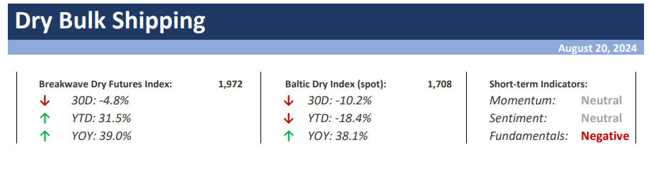
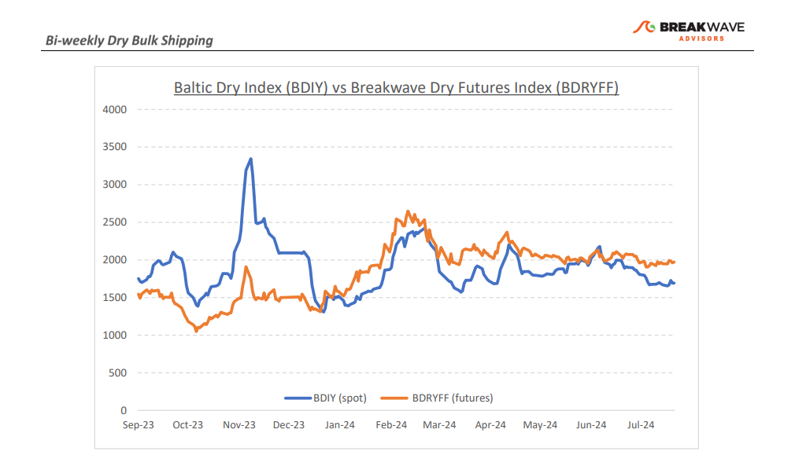
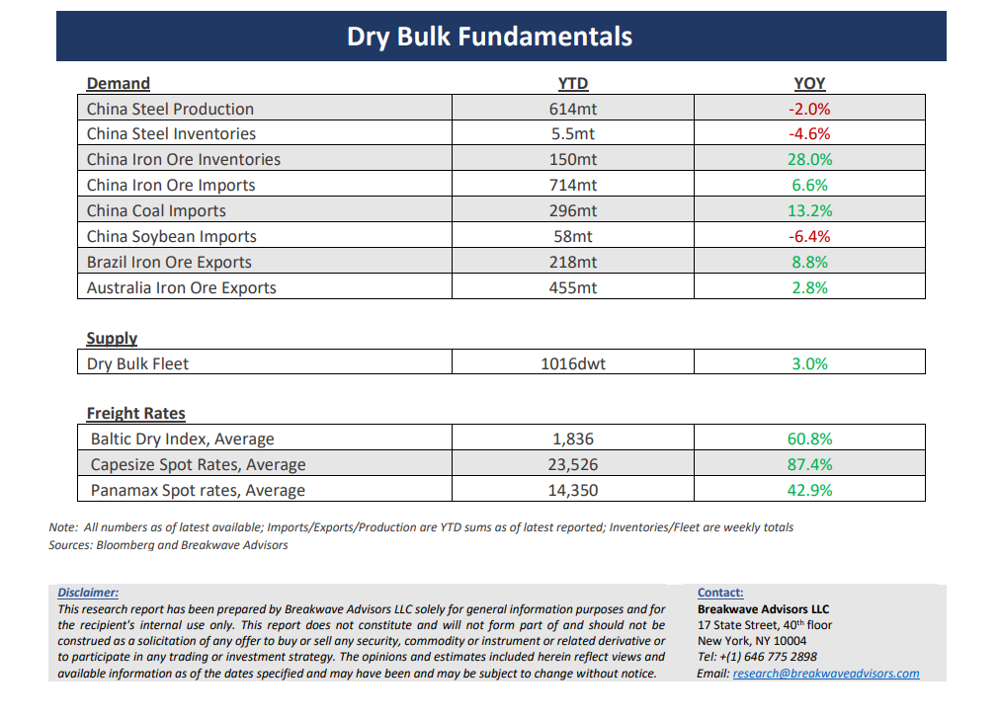

# Breakwave Bi-Weekly Dry Bulk Report - August 20, 2024

**Date:** August 20, 2024  
**Publisher:** Breakwave Advisors | **Category:** Market Insights  
**Original URL:** [https://www.breakwaveadvisors.com/insights/202486dry-87w885-eaght](https://www.breakwaveadvisors.com/insights/202486dry-87w885-eaght)  

---

> **Figure 1: Cea3cf84ceb9ceb3cebcceb9cf8ccf84cf85**  
> [Local Asset](file:///C:/Users/Dell/Github/Shipping/corpus/03-breakwave/insights/2024/assets/2024-08-20_202486dry-87w885-eaght_img_cea3cf84ceb9ceb3cebcceb9cf8ccf84cf85_b6d996220d4f.png)

**· Steady as She Goes for Dry Bulk While Summer Slowdown Takes a Toll on Volatility**– It has been**particularly calm**in the dry bulk market, with**freight futures volatility**hitting**multi-year lows**and physical activity absent of the jumps and falls the shipping market is accustomed to. Although it seems freight prices are slowly drifting lower, in general, dry bulk spot rates have stabilized at particularly strong levels compared to history for this time of the year. Looking forward though, fundamentals are becoming less supportive: China’s**steel industry**remains**weak**, iron ore**inventories**are still**high**, and**coal**demand for power generation in the country is getting**less competitive**versus a very strong year for hydroelectric generation. On the other hand,**September**has historically been a**relatively robust month**for Capesizes, something that is also evident by the contango in the futures market, but once again, it is difficult to see the urgency by traders of securing iron ore cargoes when the state of the core steel industry is going through one of the roughest periods in recent memory. We**remain constructive**for an uptick in rates in the near term,**but**are**very well aware of the bearish fundamentals**, that absent the generally supportive low orderbook would be in much worse shape, but the tight fleet supply could very well be the key to a turnaround if demand improves, something that is mainly subject to strong**fiscal stimulus from China**.

**·****Iron Ore Back Below $100/mt as Oversupply Weighs on Outlook**– As we have been regularly discussing, the iron ore market**is oversupplied**and although prices have tried to remain supportive on the back of a global euphoria around risk assets, the**bearish fundamentals**have now become difficult to**ignore**. Iron ore prices have now decisively fallen into the double-digit territory**but remain above the breakeven levels**of most major miners. Consequently, more is needed for the market to balance, but more importantly, more time is required to work off the excess inventories in China that has accumulated over the last year or so. Whether Chinese steel production is now past its peak or not is up for debate, but we struggle to come up with a positive outlook for steel demand in the near term. As a result, we continue to see**weakness in iron ore prices,**although**now**such a forecast has become**the base case**in the investment community, and thus, further declines might not be as smooth as they have been in the past. Finally, with lower prices come also tighter freight margins as miners fight hard for every single cent, and thus we anticipate some**lower volatility for freight rates**although winter weather will definitely be the primary driver of price development once again.

**· Our Long-term View –**The last few years have been characterized by increased geopolitical uncertainty. Going forward, we expect such events to continue to affect global trade and have a meaningful impact on effective vessel supply. Combined with the potential for a multi-year cyclical rebound in China’s economic activity following the recent economic turmoil, dry bulk shipping should experience higher volatility on top of a secular tightness driven by increasing bulk commodity demand and a slower fleet growth as a result of a relatively low orderbook.

> **Figure 2: Cea3cf84ceb9ceb3cebcceb9cf8ccf84cf85**  
> [Local Asset](file:///C:/Users/Dell/Github/Shipping/corpus/03-breakwave/insights/2024/assets/2024-08-20_202486dry-87w885-eaght_img_cea3cf84ceb9ceb3cebcceb9cf8ccf84cf85_be7660fa711a.png)

> **Figure 3: Cea3cf84ceb9ceb3cebcceb9cf8ccf84cf85**  
> [Local Asset](file:///C:/Users/Dell/Github/Shipping/corpus/03-breakwave/insights/2024/assets/2024-08-20_202486dry-87w885-eaght_img_cea3cf84ceb9ceb3cebcceb9cf8ccf84cf85_1bfa257ad7d9.png)

### Subscribe:
