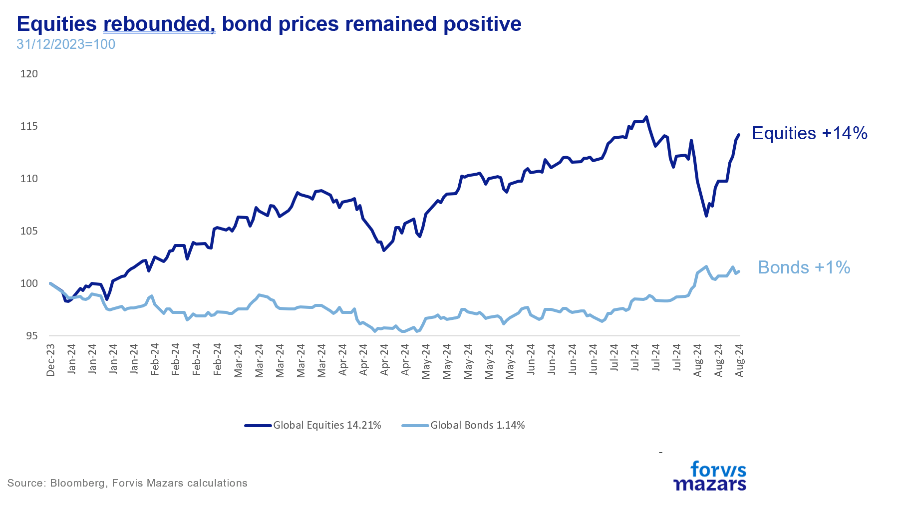
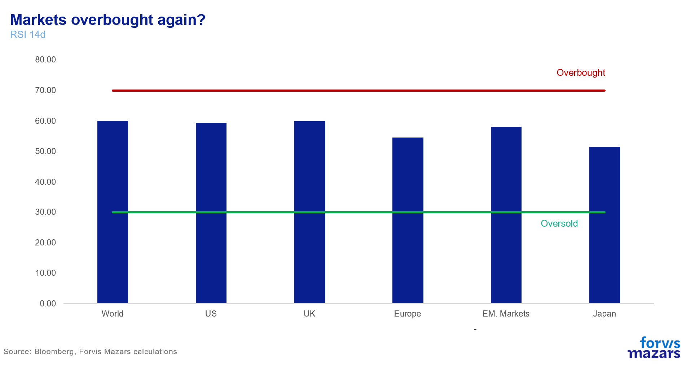
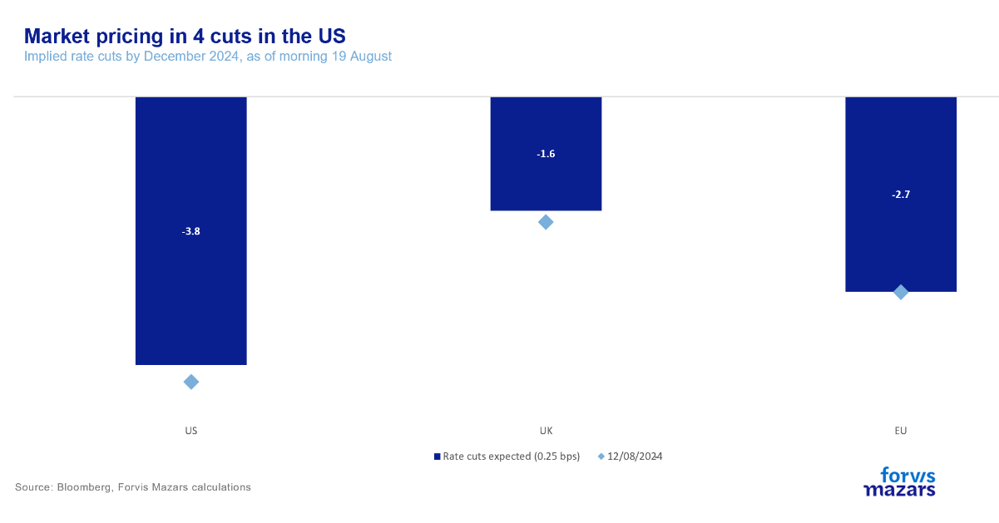
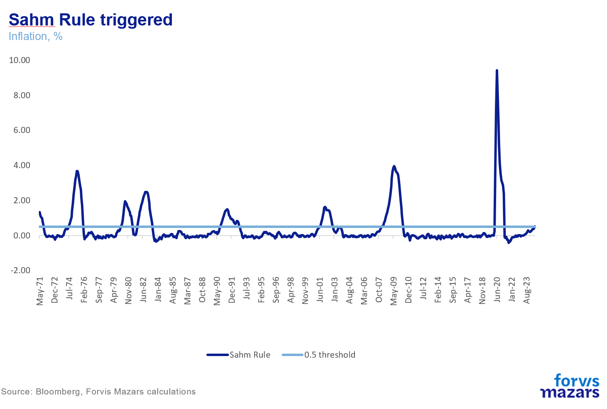
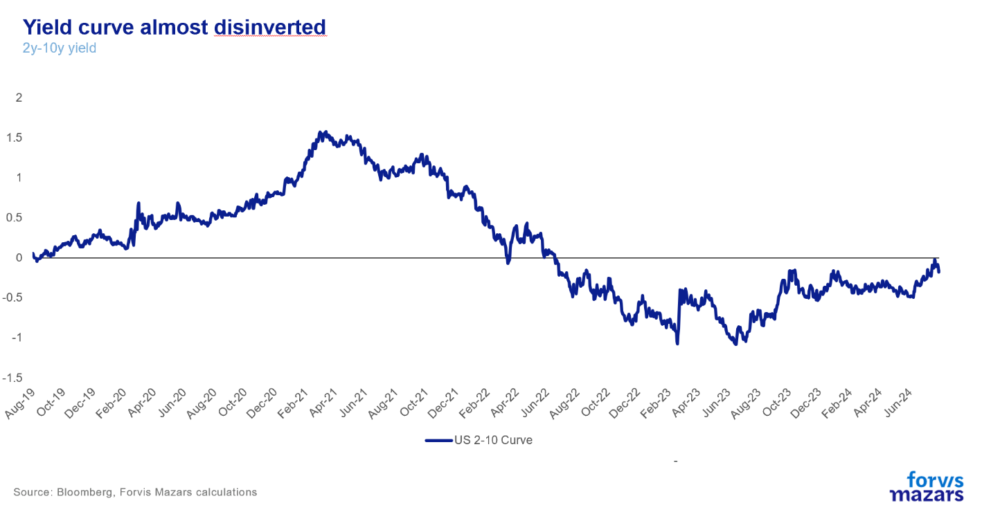
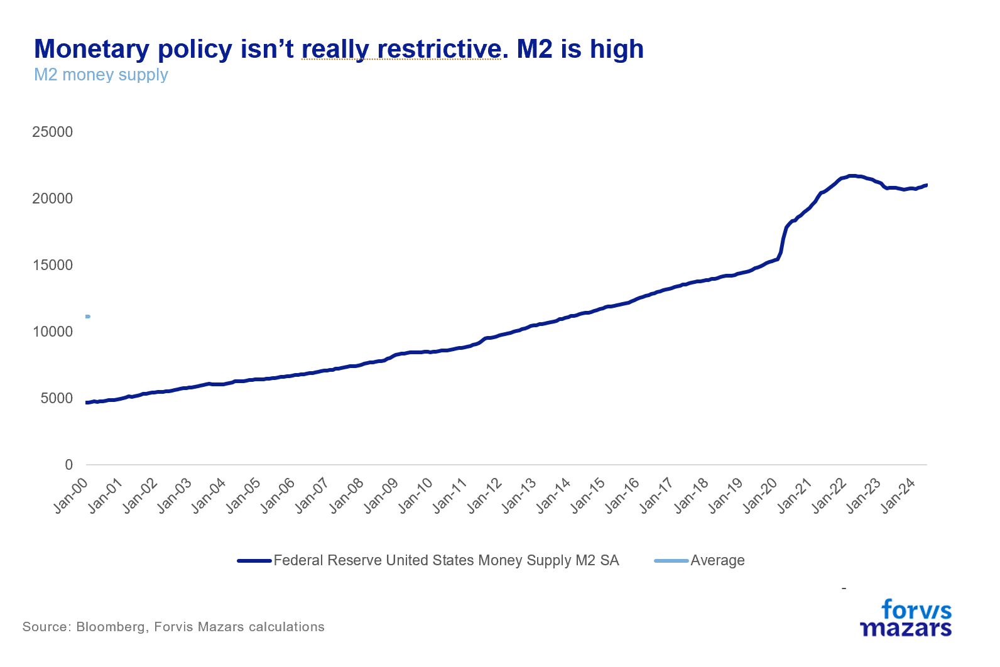
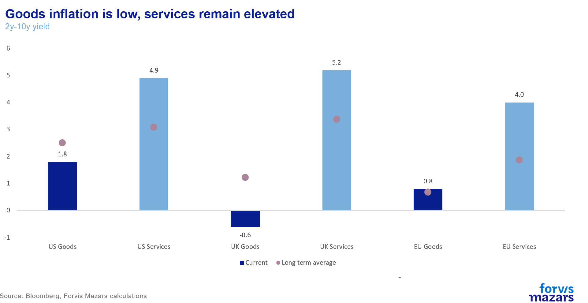
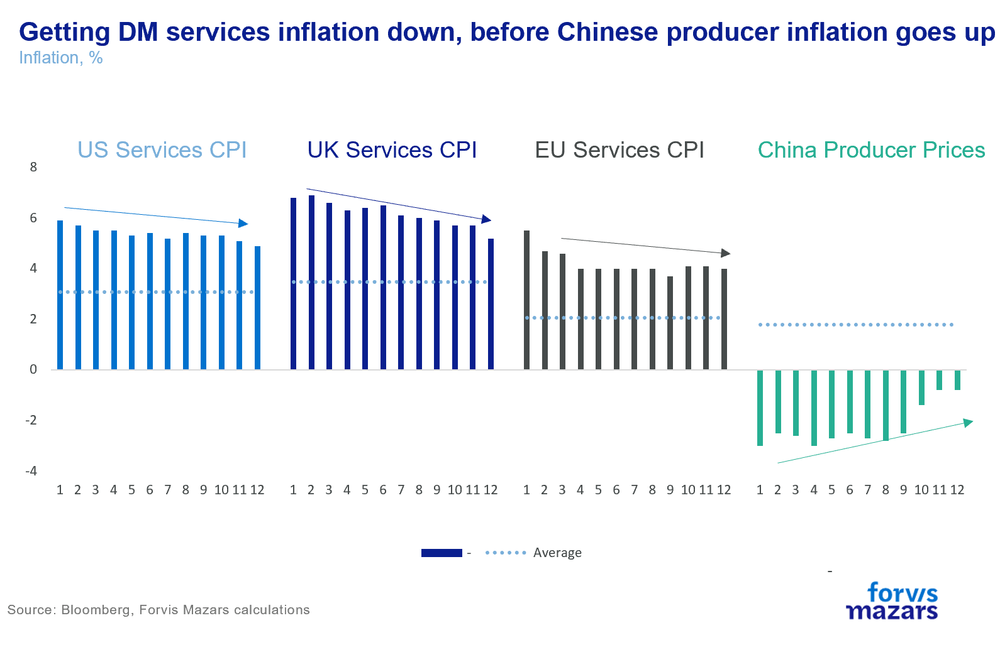

# An American (rate) bottleneck

**Date:** August 20, 2024  
**Publisher:** Breakwave Advisors | **Category:** Market Insights  
**Original URL:** [https://www.breakwaveadvisors.com/insights/2024/8/20/an-american-rate-bottleneck](https://www.breakwaveadvisors.com/insights/2024/8/20/an-american-rate-bottleneck)  

---

*By*[*George Lagarias*](https://www.linkedin.com/in/george-lagarias-mba-3baa769/)

Jackson Hole, Wyoming , is a valley in North America, wholly unremarkable in history for anything other than it was named by someone called Jackson who caught bevers. Yet once a year, when the US Federal Reserve meets there, the eyes of the economic and investment world are fixed on this tiny area in the Rocky Mountains.

But first things first.

The “Cary Trade Scare of 2024” is firmly behind us. Just two weeks ago, the Nikkei experienced its worst crash in 37 years, as the yen/USD carry trade unravelled. The US tech trade rolled back, and words like “Black Monday” floated in the air. Two weeks later, the Nikkei has recovered all its losses, and US large caps are near their all-time highs. Why did the scare happen? One easy explanation is that this was a mix of de-leveraging, low volumes and possibly some algorithmic trading exacerbating what could have been a more shallow move. Another could be that the market sends us warning signs about impending instability.

> **Figure 1: 241**  
> [Local Asset](file:///C:/Users/Dell/Github/Shipping/corpus/03-breakwave/insights/2024/assets/2024-08-20_an-american-rate-bottleneck_img_241_9da7b4433100.png)

There are three significant takeaways for investors:

One, investors happily and hastily bought the dip and returned to their holiday, “August nonsense” might be equally applicable to “Black Monday”. The RSI indicator suggests that the markets are now close to “overbought”.

> **Figure 2: 242**  
> [Local Asset](file:///C:/Users/Dell/Github/Shipping/corpus/03-breakwave/insights/2024/assets/2024-08-20_an-american-rate-bottleneck_img_242_1af14df473d0.png)

Two the Fed did not have to intervene. The move was so swift, and the buybacks were equally fast. One can’t help but wonder if central banks can even catch up to super-fast computers. What happens when buybacks are not swift enough? Will markets dive before policymakers have a chance to respond?

Three, this is a volatile market, even more so than standard volatility measures might suggest.

With the raucous behind us, all eyes now turn on the US Federal Reserve. This week, the US central bank is having its annual meeting in Jackson Hole, where important policy announcements are often (but not always) made. Presently, markets expect the Federal Reserve to cut four times (down from five two weeks ago) by the end of the year. The question is not “whether” the US central bank will cut rates, but by how much.

> **Figure 3: 243**  
> [Local Asset](file:///C:/Users/Dell/Github/Shipping/corpus/03-breakwave/insights/2024/assets/2024-08-20_an-american-rate-bottleneck_img_243_f31f098fa2c0.png)

For 2024, the IMF projects 2.8% growth for the US, and just below 1% for the UK and the EU.

While the Bank of England and the European Central Bank have now both delivered their first rate cut, they can’t embark on a rate cut cycle, even if their growth conditions are more challenging. Why? Because this is still a yield-hungry world and they risk a flight of capital to the Dollar if Fed rates remain very high.

Thus, we would expect Mr Bailey and Ms Lagarde to be the most eager viewers of the Jackson Hole meeting.

Whereas we don’t really expect any big announcements out of Jackson Hole, we see that the arguments for rate cuts, vs “higher for longer” are balanced.

On the one hand, we see rising unemployment. The US central bank has a dual mandate, rates and unemployment (a licence to facilitate economic growth). After the latest unemployment figure (4.3%) the so-called Sahm rule was activated. The rule states that “When the three-month moving average of the national unemployment rate is 0.5 percentage point or more above its low over the prior twelve months, we are in the early months of recession”. The rule has been triggered 11 times since 1953 and yielded a false signal only once, in 1959 when a recession did indeed start five months later.

> **Figure 4: 244**  
> [Local Asset](file:///C:/Users/Dell/Github/Shipping/corpus/03-breakwave/insights/2024/assets/2024-08-20_an-american-rate-bottleneck_img_244_83d6d6ec2fb9.png)

The other key indicator that a recession may be coming is the yield curve turning positive.

> **Figure 5: 245**  
> [Local Asset](file:///C:/Users/Dell/Github/Shipping/corpus/03-breakwave/insights/2024/assets/2024-08-20_an-american-rate-bottleneck_img_245_c3401fa82076.png)

Why we doubt the recession narrative

While the validity of both of these quantitative signals is well established, and while economic data have been pointing towards a slowdown, the evidence for a recession are not compelling. The economy has been growing at a healthy pace, and inflation is falling. PMI indicators do suggest that manufacturing and services activity has been slowing but nowhere near the point of a recession. While the Sahm rule may have a point, unemployment has been significantly below average for a long period. All it takes for the rule to activate is one very low point (3.5%) in the previous twelve months. As for the yield curve, its working isn’t magical. Rate hikes aim to curb aggregate demand. Usually, don’t last more than a year. The time when inversions stop, is usually the time when rate hikes begin to take a serious toll on the economy. This time around, the inversion lasted for two years. Yet we didn’t see the usual recession in year 1. Instead, we see a modicum of economic growth and, more importantly, a very modest growth in the M2 supply of money. This informs us that at 5.5% the rates aren’t overly constrictive and the yield curve normalisation might not be the be-all and end-all signal to a recession.

> **Figure 6: 246**  
> [Local Asset](file:///C:/Users/Dell/Github/Shipping/corpus/03-breakwave/insights/2024/assets/2024-08-20_an-american-rate-bottleneck_img_246_3f9443021363.png)

Instead, we think that central bankers are right not to call victory over inflation. While goods inflation has been trending lower, mostly because of Chinese overproduction and massive output gaps, services inflation is still too high for comfort.

> **Figure 7: 247**  
> [Local Asset](file:///C:/Users/Dell/Github/Shipping/corpus/03-breakwave/insights/2024/assets/2024-08-20_an-american-rate-bottleneck_img_247_a345195eaed0.png)

For central bankers to be at ease with rate cuts, they would need to see services inflation coming down towards its average, before Chinese producer inflation begins to climb towards its own average. If anything, markets should be focusing on the chart below.

> **Figure 8: 248**  
> [Local Asset](file:///C:/Users/Dell/Github/Shipping/corpus/03-breakwave/insights/2024/assets/2024-08-20_an-american-rate-bottleneck_img_248_d7761169e0cf.png)

It’s really simple: the longer the Fed waits to cut rates, the better the chance that services inflation will come down before China stops disinflating the world at the current pace.

Ultimately, we don’t expect Jackson Hole to yield a clear guide to rate cuts. Markets will probably be satisfied with most outcomes (which means risk assets can continue their rebound), except a very hawkish outlook on rates, which the data would not support at this point. Our house view remains that we could see 1-2 rate cuts this year from the Fed, and that we would not expect a firm rate cut cycle to initiate before 2025.

---

**Tags:** Markets, Economy, Macro  
