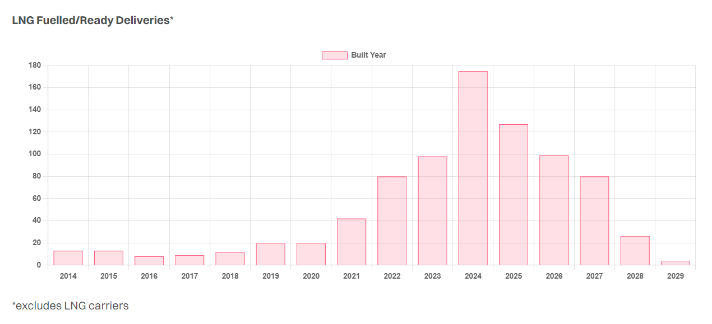

# The Cool Choice

**Date:** August 21, 2024  
**Publisher:** Breakwave Advisors | **Category:** Market Insights  
**Original URL:** [https://www.breakwaveadvisors.com/insights/2024/8/21/the-cool-choice](https://www.breakwaveadvisors.com/insights/2024/8/21/the-cool-choice)  

---

> **Figure 1: Unsplash Image Zryoqguerti**  
> **Interactive Data & Source:** [Gibsons Co](https://www.gibsons.co.uk/market-reports) | [Local Asset](file:///C:/Users/Dell/Github/Shipping/corpus/03-breakwave/insights/2024/assets/2024-08-21_the-cool-choice_img_unsplash-image-zryoqguerti_d362acbfef2f.jpg)

LNG as a marine fuel appears to be coming back in vogue. Having lost ground to methanol, ammonia and conventional fuels in recent years, several Owners have placed or announced plans to place large orders of LNG dual fuel ships, most notably Maersk Line who have previously been advocating for methanol as their primary decarbonisation pathway.

LNG therefore has the potential to expand its prominence as the dominant alternative marine fuel, with the fleet having expanded significantly in recent years along with the associated bunkering infrastructure. According to data released by the MPA of Singapore, the LNG bunker sales were 212,000 tonnes in the first half of this year, more than four times higher than in the same period 2023 as an increasing number of dual fuel ships hit the water, coupled with improved stability in LNG prices. While the price of LNG, and consequently LNG bunkers, surged significantly following the onset of the Russia-Ukraine war, prices have largely stabilized to currently price close to parity with MGO.

Unlike other alternative bunker fuels, LNG has far greater certainty of supply and whilst the price of any commodity is likely to remain volatile, shipowners have far greater price visibility compared to that of green/blue ammonia or methanol. Further, LNG not only benefits from growing availability but also offers various emissions advantages. Compared to fuel oil, LNG emits 20-30% less CO2, 15-25% fewer total GHGs, 90% less NOx, and 99% less SOx, with virtually no particulate matter. LNG still has problems when it comes to lifecycle GHGs, notably when methane slip is accounted for. As such, depending on the engine technology and methods used to extract the natural gas, some studies suggest that LNG offers no climate benefit compared to MGO. However, those opting for LNG also have the option to increase their use of bio methane and e-LNG over time, subject to price and availability, whilst better control of methane slip can help move the dial in LNGs favour.

However, whilst the current regulatory framework supports the uptake of LNG, methane will be counted under the EU emissions trading scheme (ETS) from 2026 and as such, despite having lower CO2 emissions, LNG fuelled ships will see their ETS savings eroded somewhat. Yet, from a FuelEU perspective, a LNG fuelled ship will be compliant until the late 2030’s depending on engine technology, potentially giving a newbuild ordered today compliant with FuelEU for more than half its trading life, whilst also generating a compliance surplus which can be used to offset other non-compliant vessels within an Owners fleet.

Nonetheless, despite improvements in the fuelling economics and potential regulatory compliance, LNG still requires significantly higher CAPEX. The difference between a conventional and dual-fuel LNG VLCC is around $19 million, requiring higher TCE earnings to justify the additional CAPEX. Whether this makes sense or not will depend on the relationship between LNG and conventional fuel prices and any additional savings LNG can offer an Owner when it comes to emission regulations such as the ETS and FuelEU initiatives.

> **Figure 2: Screenshot 2024 08 21 08.59.38**  
> **Interactive Data & Source:** [Gibsons Co](https://www.gibsons.co.uk/market-reports) | [Local Asset](file:///C:/Users/Dell/Github/Shipping/corpus/03-breakwave/insights/2024/assets/2024-08-21_the-cool-choice_img_screenshot2024-08-21085938_1cd0cdfe85d4.png)

Data source:[Gibson Shipbrokers](https://www.gibsons.co.uk/market-reports)

---

**Tags:** LNG, Tankers, Shipping  
