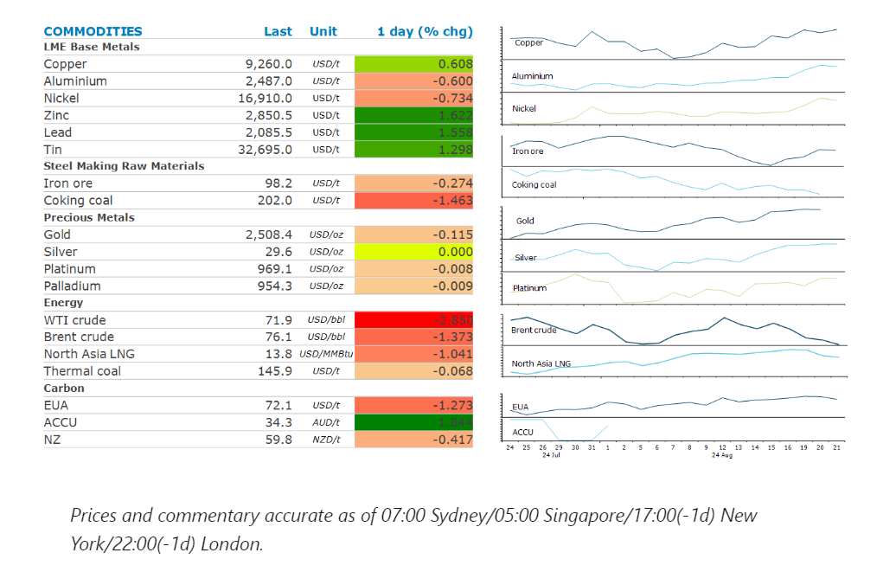
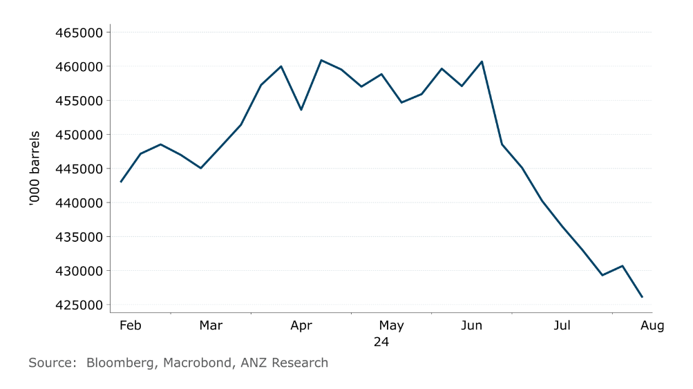

# Falling inventories fails to support the oil market

**Date:** August 22, 2024  
**Publisher:** Breakwave Advisors | **Category:** Market Insights  
**Original URL:** [https://www.breakwaveadvisors.com/insights/2024/8/22/falling-inventories-fails-to-support-the-oil-market](https://www.breakwaveadvisors.com/insights/2024/8/22/falling-inventories-fails-to-support-the-oil-market)  

---

The prospect of easing monetary policy boosted sentiment across the metals complex. Falling inventories failed to stop selling in the oil market.

*By*[*Daniel Hynes*](https://www.linkedin.com/in/dahynes/)

> **Figure 1: Screenshot 2024 08 22 10.00.15**  
> [Local Asset](file:///C:/Users/Dell/Github/Shipping/corpus/03-breakwave/insights/2024/assets/2024-08-22_falling-inventories-fails-to-support-the-oil-market_img_screenshot2024-08-22100015_21f0df03ea9d.png)

### Market Commentary

**Gold**traded near a record high after the Fed minutes reinforced expectations of an imminent rate cut. Several Fed officials acknowledge that there was a plausible case for cutting interest rates at their July meeting. This was supported by data which showed US job growth was far less than expected. The market is now fully pricing in a 25bps cut next month. Gains in the precious metal were muted by weak physical demand in China. Imports in July fell 24% to 44.6t, the lowest level in more than two years. That follows an even sharper decline in June, when shipments plunged 58% from the previous month.

**Base metals**gained amid improved optimism for global growth. Concerns about the economic outlook have started to subside as the US Federal Reserve moves closer to cutting interest rates. Zinc led the sector higher amid reports of smelter cuts. China’s major zinc producers met to discuss possible output cuts as tight supplies of zinc concentrate pushed spot smelter processing fees into negative territory. Chinese smelters, which supply over half the world’s refined zinc, have too much capacity compared with their raw material supply. Compounding this is some softness in demand among customers in the steel industry. Aluminium bucked the trend to end the session lower, ending an eight-day rally. The lightweight metal has gained the interest of investors following a sharp correction earlier this year. Also supporting prices are China's surprising growth in import despite robust domestic production.

**Iron ore**futures rose for a third day following recent efforts by Chinese authorities to support the beleaguered property sector. Beijing is considering a new funding option for local governments to buy unsold homes. This would involve the issue of so-called special bonds, which are currently restructured to uses including infrastructure and environmental projects.

**Crude oil**fell to a six-month low as traders looked past a bullish US stockpile report. Weak technicals have seen investors dump the commodity, compounded by signs of[**weakness in China**](../pdfs/2024-08-22_falling-inventories-fails-to-support-the-oil-market_commodity-tracker-mixed-signals-3_5388ce865e78.pdf). China’s apparent oil demand fell 8% y/y to 13.55mb/d in July, based on government data. This follows reports that the nation may have sent as much as 800kb/d into storage, according to Eurasia Group. Easing geopolitical tensions have also played their part. Earlier in the session, crude oil rallied after US government data showed a strong drawdown in inventories. Commercial stockpiles fell by a larger than expected 4,649kbbl last week. Refined product inventories also fell, with gasoline down 1,606kbbl and distillate down 3,312kbbl. However, flight data showed a week-on-week and month-on-month decline in trips for the week starting 19 August. The US driving season is also coming to a close, which will see demand for gasoline weaken.

**European gas**fell as high inventories ease concerns about supply disruptions. The continents storage levels have reached 90% of their capacity, according to industry group Gas Infrastructure Europe. That’s more than two months ahead of the EU’s goal.**North Asian LNG**prices were also lower as Indian and Chinese importers pause buying amid high prices.

### Chart of the Day

US crude oil inventories fell further last week, suggesting demand remains strong

> **Figure 2: Screenshot 2024 08 22 10.05.34**  
> **Interactive Data & Source:** [Linkedin](https://www.linkedin.com/newsletters/commodities-wrap-6692196755876012032/?fbclid=IwAR3kiXJqZdxmp9ZcRwBNI7FsBySI-XSC0pfPur1qzjt7OZp7PTE59Tsl1QI) | [Local Asset](file:///C:/Users/Dell/Github/Shipping/corpus/03-breakwave/insights/2024/assets/2024-08-22_falling-inventories-fails-to-support-the-oil-market_img_screenshot2024-08-22100534_3dcbc1229007.png)

Data source:[Commodities Wrap](https://www.linkedin.com/newsletters/commodities-wrap-6692196755876012032/?fbclid=IwAR3kiXJqZdxmp9ZcRwBNI7FsBySI-XSC0pfPur1qzjt7OZp7PTE59Tsl1QI)

---

**Tags:** Commodities, Economy, Shipping  
