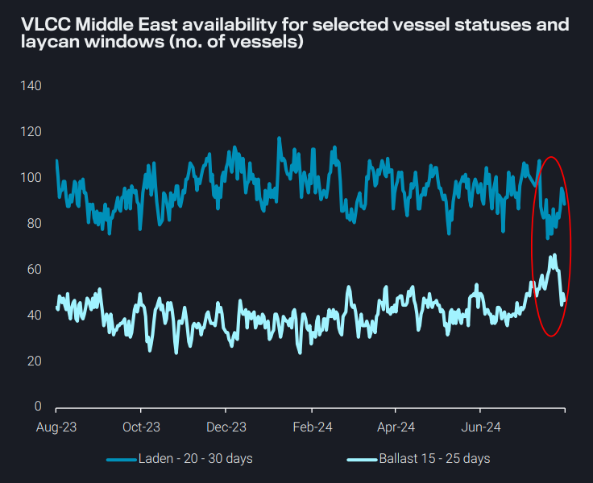
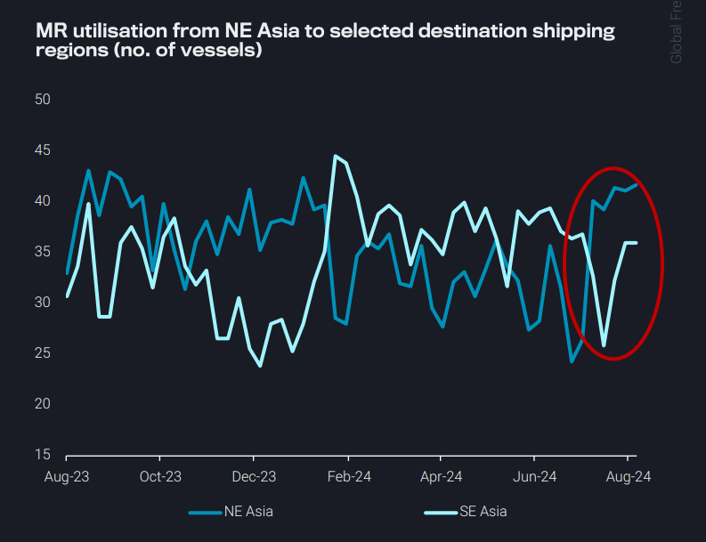
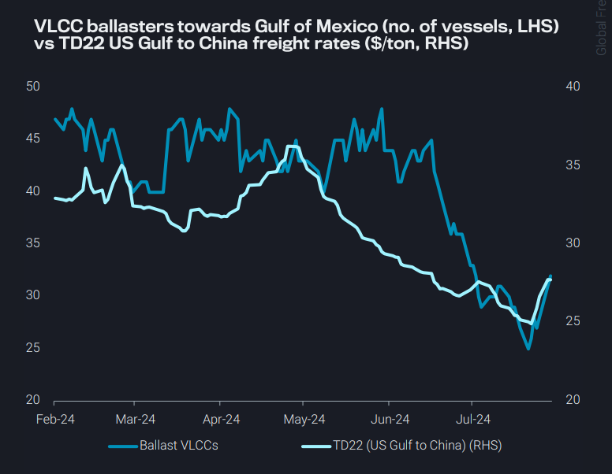
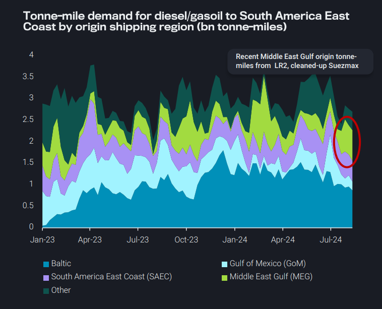

# TD3C recent spike: A short-term blip or a sustainable rally?

**Date:** August 22, 2024  
**Publisher:** Breakwave Advisors | **Category:** Market Insights  
**Original URL:** [https://www.breakwaveadvisors.com/insights/2024/8/22/mwudaousz3lpygc9utnplffbfnrd60](https://www.breakwaveadvisors.com/insights/2024/8/22/mwudaousz3lpygc9utnplffbfnrd60)  

---

Dirty – East of Suez:

➔ TD3C recent spike: A short-term blip or a sustainable rally?

Clean – East of Suez:

➔ Increased utilisation intra-NE Asia for MRs, but market awaits possibility of Chinese CPP export quotas

Dirty – West of Suez:

➔ US Gulf VLCC rates recover from 6-month lows, prompting an increase in VLCC ballasters towards GoM

Clean – West of Suez:

➔ Brazil utilises larger vessel classes in the Middle East as an alternative to Russian diesel

*By*[*Mary Melton*](https://www.linkedin.com/search/results/all/?fetchDeterministicClustersOnly=true&heroEntityKey=urn%3Ali%3Afsd_profile%3AACoAABXVyecBtg-pRnIrZe0BoWk0ygPiUfbvhsw&keywords=mary%20melton&origin=RICH_QUERY_SUGGESTION&position=0&searchId=40e8d7d2-c4d0-4022-81e7-176f6eba418b&sid=H_Y&spellCorrectionEnabled=false)

### Dirty – East of Suez: Td3c Recent Spike: A Short-Term Blip or a Sustainable Rally?

As we are moving to loading dates away from the summer months, VLCC Middle East-to-East Asia (TD3C) freight rates have picked up from 2024 lows by 30% on a w-o-w basis

This increase comes on the back of renewed charterer interest in the market to fulfil requirements for early September loading dates

➔ TD3C followed a similar trajectory at the midpoint of last month

However, current availability figures suggest that this time freight rates might not cool off as quickly as a month ago

➔ Fixing windows for both ballasters heading to the Middle East Gulf and for laden vessels expected to discharge and return to the Gulf are lower than July levels

There is likely to be a mixed tanker demand picture in the medium-term

➔ Decreasing seasonal domestic demand in the MEG plus the unwinding of OPEC+ voluntary cuts will support more exports

➔ China’s crude demand is seasonally stronger Sep-Dec, but this year’s peak will likely fall below historical norms

➔ Plus, Saudi OSP cuts offered in August were not continued

> **Figure 1: Screenshot 2024 08 22 08.49.40**  
> **Interactive Data & Source:** [Vortexa](https://www.vortexa.com//oil-gas-data-traders-analysts-data-scientists?gclid=Cj0KCQjw8_qRBhCXARIsAE2AtRZKOvMnbilZ_6_91d7huSFFy71pWLrnPwGwOHVzXsmsG-1a1mZnQw8aAt89EALw_wcB&hsa_acc=1782073842&hsa_ad=548425387665&hsa_cam=14746637662&hsa_grp=125038601902&hsa_kw=&hsa_mt=&hsa_net=adwords&hsa_src=g&hsa_tgt=dsa-1431852288425&hsa_ver=3&utm_campaign=%5BCD%5D%20-%20DSA%20-%20EMEA&utm_medium=cpc&utm_medium=ppc&utm_source=google&utm_source=adwords&utm_term=) | [Local Asset](file:///C:/Users/Dell/Github/Shipping/corpus/03-breakwave/insights/2024/assets/2024-08-22_mwudaousz3lpygc9utnplffbfnrd60_img_screenshot2024-08-22084940_b1dcd1e2376d.png)

### Clean – East of Suez: Increased Utilisation Intra-Ne Asia for Mrs, But Market Awaits Possibility of Chinese Cpp Export Quotas

MR freight rates in APAC have increased due to high utilisation for voyages within NE Asia and to a lesser extent NE Asia-to-SE Asia

While CPP exports from China remain muted, MR demand side-strength in NE Asia comes from heavy maintenance (planned and unplanned) at Japan’s refineries

➔ As a result, Japan’s CPP imports from South Korea have risen this month (Aug days 1-19)

The market anticipates the granting of Chinese CPP export quotas in September, but this is unconfirmed

➔ If granted, poor refining margins in China necessitate that the quota volumes will need to be higher than last year, and we expect that most of the quota volume granted will be for jet fuel that is likely to stay within the region

➔ Otherwise smaller additional volumes of diesel are expected

➔ Even if supplies mostly stay in the region, this will stimulate the currently lacklustre MR demand out of China

> **Figure 2: Screenshot 2024 08 22 08.49.53**  
> **Interactive Data & Source:** [Vortexa](https://www.vortexa.com//oil-gas-data-traders-analysts-data-scientists?gclid=Cj0KCQjw8_qRBhCXARIsAE2AtRZKOvMnbilZ_6_91d7huSFFy71pWLrnPwGwOHVzXsmsG-1a1mZnQw8aAt89EALw_wcB&hsa_acc=1782073842&hsa_ad=548425387665&hsa_cam=14746637662&hsa_grp=125038601902&hsa_kw=&hsa_mt=&hsa_net=adwords&hsa_src=g&hsa_tgt=dsa-1431852288425&hsa_ver=3&utm_campaign=%5BCD%5D%20-%20DSA%20-%20EMEA&utm_medium=cpc&utm_medium=ppc&utm_source=google&utm_source=adwords&utm_term=) | [Local Asset](file:///C:/Users/Dell/Github/Shipping/corpus/03-breakwave/insights/2024/assets/2024-08-22_mwudaousz3lpygc9utnplffbfnrd60_img_screenshot2024-08-22084953_c64662e754e1.png)

### Dirty – West of Suez: Us Gulf VLCC Rates Recover From 6-Month Lows, Prompting an Increase in VLCC Ballasters Towards Gom

VLCC freight rates on the US Gulf to China route (TD22) have recovered slightly after reaching 15-month lows last week

➔ Likely some of the increase in TD22 freight rates is the global effect from strength on TD3C (see above slide)

This slight increase in TD22 appears to have prompted an increase in VLCCs ballasting towards the Gulf of Mexico

➔ Ballast VLCCs were down to their lowest numbers in six months as demand for US crude remained scarce in waterborne markets

High VLCC fixture counts in the US Gulf for August loadings and current fixing for September loading dates point to increased loadings

➔ However, US Gulf Coast crude exports are declining so far this month (Aug days 1-20), and it remains to be seen how many of these fixtures materialise

Until then, factors supporting this rally in VLCC freight remain sparse and not very promising

> **Figure 3: Screenshot 2024 08 22 08.50.07**  
> **Interactive Data & Source:** [Vortexa](https://www.vortexa.com//oil-gas-data-traders-analysts-data-scientists?gclid=Cj0KCQjw8_qRBhCXARIsAE2AtRZKOvMnbilZ_6_91d7huSFFy71pWLrnPwGwOHVzXsmsG-1a1mZnQw8aAt89EALw_wcB&hsa_acc=1782073842&hsa_ad=548425387665&hsa_cam=14746637662&hsa_grp=125038601902&hsa_kw=&hsa_mt=&hsa_net=adwords&hsa_src=g&hsa_tgt=dsa-1431852288425&hsa_ver=3&utm_campaign=%5BCD%5D%20-%20DSA%20-%20EMEA&utm_medium=cpc&utm_medium=ppc&utm_source=google&utm_source=adwords&utm_term=) | [Local Asset](file:///C:/Users/Dell/Github/Shipping/corpus/03-breakwave/insights/2024/assets/2024-08-22_mwudaousz3lpygc9utnplffbfnrd60_img_screenshot2024-08-22085007_27c2fe5d7e28.png)

### Clean – West of Suez: Brazil Utilises Larger Vessel Classes in the Middle East As an Alternative to Russian Diesel

Russian diesel exports have declined over 25% m-o-m (Aug days 1-19), and exports are likely to be tighter as more diesel is directed to the domestic market after an outage at the Mozyr refinery (Argus)

➔ Voyage counts for diesel on MRs are already declining, falling over the past 5 weeks

➔ This could cause MRs to compete in a European market where tanker demand is muted

As a key source of imports, reduced diesel from Russia has already seen Brazil seek alternatives, notably from the Middle East

➔ Brazil’s Russian diesel imports have declined around 25% m-o-m (Aug days 1-19), while MEG-origin diesel accounts for almost 25% of arrivals

➔ The MEG diesel arrived on the cleaned-up Suezmax ANDRE REBOUCAS and originated from the Duqm refinery, plus there is another LR2 on route from the Middle East

As LR rates out of the Middle East reach 8-month lows (pre Red Sea crisis levels) on the back of low Pacific Basin-to-Europe middle distillate flows, Brazilian buyers are likely to be enticed by Middle East supplies

> **Figure 4: Screenshot 2024 08 22 08.50.17**  
> **Interactive Data & Source:** [Vortexa](https://www.vortexa.com//oil-gas-data-traders-analysts-data-scientists?gclid=Cj0KCQjw8_qRBhCXARIsAE2AtRZKOvMnbilZ_6_91d7huSFFy71pWLrnPwGwOHVzXsmsG-1a1mZnQw8aAt89EALw_wcB&hsa_acc=1782073842&hsa_ad=548425387665&hsa_cam=14746637662&hsa_grp=125038601902&hsa_kw=&hsa_mt=&hsa_net=adwords&hsa_src=g&hsa_tgt=dsa-1431852288425&hsa_ver=3&utm_campaign=%5BCD%5D%20-%20DSA%20-%20EMEA&utm_medium=cpc&utm_medium=ppc&utm_source=google&utm_source=adwords&utm_term=) | [Local Asset](file:///C:/Users/Dell/Github/Shipping/corpus/03-breakwave/insights/2024/assets/2024-08-22_mwudaousz3lpygc9utnplffbfnrd60_img_screenshot2024-08-22085017_8ba96fc891d0.png)

Data Source:[Vortexa](https://www.vortexa.com//oil-gas-data-traders-analysts-data-scientists?gclid=Cj0KCQjw8_qRBhCXARIsAE2AtRZKOvMnbilZ_6_91d7huSFFy71pWLrnPwGwOHVzXsmsG-1a1mZnQw8aAt89EALw_wcB&hsa_acc=1782073842&hsa_ad=548425387665&hsa_cam=14746637662&hsa_grp=125038601902&hsa_kw=&hsa_mt=&hsa_net=adwords&hsa_src=g&hsa_tgt=dsa-1431852288425&hsa_ver=3&utm_campaign=%5BCD%5D%20-%20DSA%20-%20EMEA&utm_medium=cpc&utm_medium=ppc&utm_source=google&utm_source=adwords&utm_term=)

---

**Tags:** Crudeoil, Tankers, Shipping  
