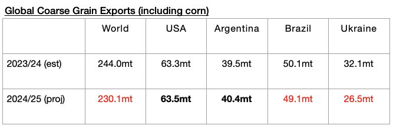

# Large Global Grain Trade Contraction Still Expected

**Date:** August 26, 2024  
**Publisher:** Breakwave Advisors | **Category:** Market Insights  
**Original URL:** [https://www.breakwaveadvisors.com/insights/2024/8/26/zch6prt90fh46de6g0815l02aredoe](https://www.breakwaveadvisors.com/insights/2024/8/26/zch6prt90fh46de6g0815l02aredoe)  

---

*By*[*Jeffrey Landsberg*](https://www.linkedin.com/in/jeffrey-landsberg-70ab957/)

As we discussed in Commodore Research's most recent Weekly Dry Bulk Report, the United States Department of Agriculture (USDA) has released a new grain export forecast for the 2024/25 season and is now predicting that global coarse grain, wheat, soybean, and soymeal exports will total 700.8 million tons. This is 1.4 million tons more than was predicted a month ago but marks a year-on-year decline of 14 million tons (-2%) from the 714.8 million tons that is now expected for 2023/24. Global grain trade being expected to contract on a year-on-year basis during the 2024/25 season remains a new headwind. As we have stressed often, there was growth in 2023/24. The USDA now estimates 2023/24's export growth at 33.9 million tons (5%).

The USDA is now forecasting that global coarse grain exports in 2024/25 will total 230.1 million tons, which is 1.7 million tons (-1%) less than predicted a month ago and would mark a year-on-year decline of 13.9 million tons (-6%). Coarse grain will continue to serve as the dry bulk shipping market’s largest grain export type by volume. Small declines in coarse grain exports are expected from the United States and Argentina, while larger increases in coarse grain exports are expected from Brazil and Ukraine.

> **Figure 1: Chart 1 (1)**  
> [Local Asset](file:///C:/Users/Dell/Github/Shipping/corpus/03-breakwave/insights/2024/assets/2024-08-26_zch6prt90fh46de6g0815l02aredoe_img_chart128129_f3bb1b859905.jpg)

---

**Tags:** Drybulk, Economy, Shipping  
