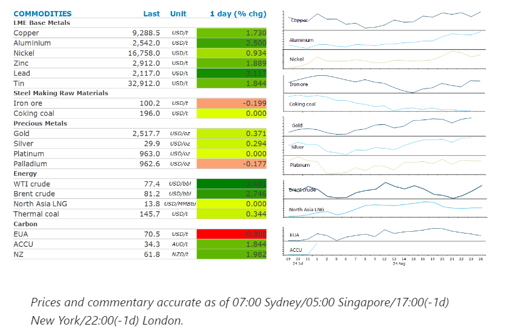
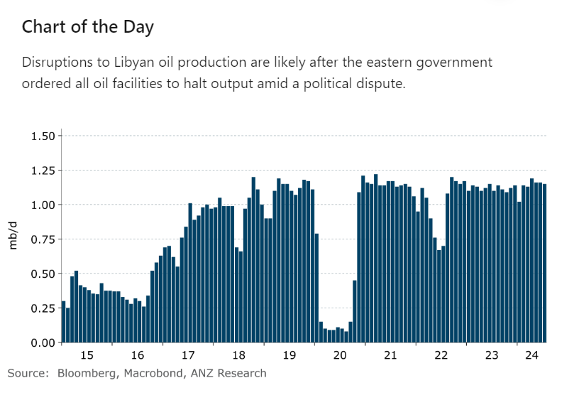

# Energy gains amid rising geopolitical tensions

**Date:** August 27, 2024  
**Publisher:** Breakwave Advisors | **Category:** Market Insights  
**Original URL:** [https://www.breakwaveadvisors.com/insights/2024/8/27/unikxvvbk25dj358x8be26u01j7obh](https://www.breakwaveadvisors.com/insights/2024/8/27/unikxvvbk25dj358x8be26u01j7obh)  

---

Rising geopolitical tensions pushed energy prices higher. A risk-on tone across markets helped boost sentiment across the rest of the complex.

*By*[*Daniel Hynes*](https://www.linkedin.com/in/dahynes/)

> **Figure 1: Crude Oilprices Rallied Amid Rising Tensions in the Middle East**  
> *Crude oilprices rallied amid rising tensions in the Middle East. Markets remain on edge as skirmishes between Israel and Hezbollah intensify. Israel sent more than 100 warplanes to take out Hezbollah missile launchers. This saw the militant group fire thousands of missiles at northern Israel. There have also been reports that fires were burning around the oil tanks of a ship attacked by Houthi rebels in the Red Sea. The risk of disruption to actual barrels of oil became real after Libya’s eastern government said it will halt all oil production and exports as a political tussle deepened over control of the country’s central bank, which controls billions of dollars of oil revenue. This saw aforce majeurecalled on all oilfields, terminals and oil facilities. Libya’s oil production has been inconsistent in recent weeks after outages at some major oil fields. It produced about 1.15mb/d in July. Since then, the biggest oil field, Sharara, has halted production. This comes amid signs of robust demand in the US. Inventories have fallen sharply in recent weeks, with gasoline and distillate remaining strong.*  
> [Local Asset](file:///C:/Users/Dell/Github/Shipping/corpus/03-breakwave/insights/2024/assets/2024-08-27_unikxvvbk25dj358x8be26u01j7obh_img_cea3cf84ceb9ceb3cebcceb9cf8ccf84cf85_7fadb3f92589.png)

### Market Commentary

**Global gas**markets were also on edge as the fighting between Russia and Ukraine threatens to disrupt supply. Ukraine’s incursion into Russia occurred near a transit point for pipeline gas into Europe. Russia has responded with attacks on energy infrastructure, firing more than 100 missiles and nearly as many drones at cities across Ukraine. A gas compressor station is said to have been damaged. At the moment, Russian gas flows to Europe via Ukraine appear to be within their normal range, but the risk of disruption is rising by the day. Europe’s storage facilities are more than 91% full, but they are unlikely to provide much cover if the gas flow through the Ukraine halts. The rising geopolitical tensions also raised**North Asian LNG**prices. This was supported by signs of strong demand. Searing temperatures in southwestern China have prompted restrictions on power use during peak times at public facilities and EV charging stations. Strong power demand is likely to lead to increased gas consumption.

The rest of the commodity complex rallied on a risk-on tone across markets following Powell’s dovish comments at Jackson Hole.**Gold**inched toward a fresh record on the prospect of an imminent rate cut.**Copper**rallied to a one month high, despite supply risks easing. Chile appears to be emerging from an intense period of wage negotiations relatively unscathed. Over the weekend, about 300 workers at a Lundin Mining Corp copper mine returned to work. This follows the main union at BHP’s Escondida mine ratifying a new labour agreement following strike action. The[**risks have not evaporated**](../pdfs/2024-08-27_unikxvvbk25dj358x8be26u01j7obh_commodity-call-copper-strikes-out-1_f54c5a8ad633.pdf), however, with several mines in Chile, representing approximately 900kt of copper or 4% of global supply, yet to finalise wage discussions.

**Iron ore**futures rebounded after data showed China’s inventories of the steel making raw material continue to drop. Stockpiles held at Chinese ports have fallen for the last four weeks, after ballooning to more than 150mt in late July.

> **Figure 2: Στιγμιότυπο Οθόνης 2024 08 27 141715**  
> **Interactive Data & Source:** [Linkedin](https://www.linkedin.com/newsletters/commodities-wrap-6692196755876012032/?fbclid=IwAR3kiXJqZdxmp9ZcRwBNI7FsBySI-XSC0pfPur1qzjt7OZp7PTE59Tsl1QI) | [Local Asset](file:///C:/Users/Dell/Github/Shipping/corpus/03-breakwave/insights/2024/assets/2024-08-27_unikxvvbk25dj358x8be26u01j7obh_img_cea3cf84ceb9ceb3cebcceb9cf8ccf84cf85_04546ffa3874.png)

Data source:[Commodities Wrap](https://www.linkedin.com/newsletters/commodities-wrap-6692196755876012032/?fbclid=IwAR3kiXJqZdxmp9ZcRwBNI7FsBySI-XSC0pfPur1qzjt7OZp7PTE59Tsl1QI)

---

**Tags:** Commodities, Economy, Shipping  
