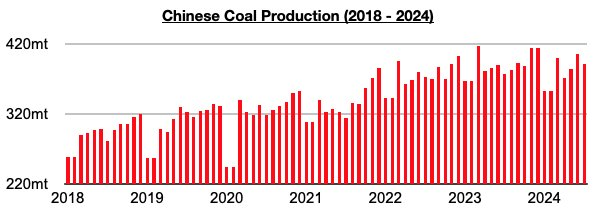
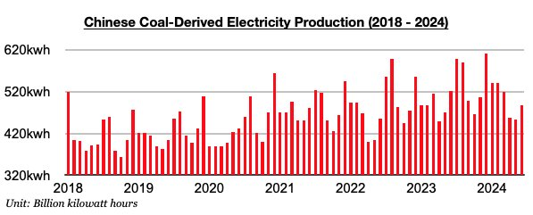

# Divergence in China's Coal Output and Coal-Derived Electricity Generation Continues

**Date:** August 28, 2024  
**Publisher:** Breakwave Advisors | **Category:** Market Insights  
**Original URL:** [https://www.breakwaveadvisors.com/insights/2024/8/28/divergence-in-chinas-coal-output-and-coal-derived-electricity-generation-continues](https://www.breakwaveadvisors.com/insights/2024/8/28/divergence-in-chinas-coal-output-and-coal-derived-electricity-generation-continues)  

---

*By*[*Jeffrey Landsberg*](https://www.linkedin.com/in/jeffrey-landsberg-70ab957/)

As we discussed in Commodore Research's most recent Weekly China Report, China’s coal output totaled 390.4 million tons in July. This is down month-on-month by 15 million tons (-4%) but up year-on-year by 12.9 million tons (3%). This is a strong level of production (the strongest ever for the month of July) and has marked a second straight month where China’s coal production has grown on a year-on-year basis. Prior to June, China’s coal output had contracted on a year-on-year basis for five straight months.

> **Figure 1: Chart 1**  
> [Local Asset](file:///C:/Users/Dell/Github/Shipping/corpus/03-breakwave/insights/2024/assets/2024-08-28_divergence-in-chinas-coal-output-and-coal-derived-electricity-generation-continu_img_chart1_899356ef0fe5.jpg)

Coal-derived electricity generation totaled 574.9 billion kilowatt hours last month. While this has marked a month-on-month increase of 87.9 billion kilowatt hours (18%), it is down year-on-year by 24.8 billion kilowatt hours (-4%). Coal-derived electricity generation has now contracted for three straight months.

> **Figure 2: Chart 2**  
> [Local Asset](file:///C:/Users/Dell/Github/Shipping/corpus/03-breakwave/insights/2024/assets/2024-08-28_divergence-in-chinas-coal-output-and-coal-derived-electricity-generation-continu_img_chart2_497f9fc03cdd.jpg)

Hydropower production totaled 166.4 billion kilowatt hours. This is up month-on-month by 22.6 billion kilowatt hours (16%) and is up year-on-year by 45.3 billion kilowatt hours (37%). Hydropower production has increased on a year-on-year basis for twelve straight months. The strength in hydropower production has continued to put pressure on thermal coal-derived electricity generation.

---

**Tags:** Drybulk, Shipping, Coal  
