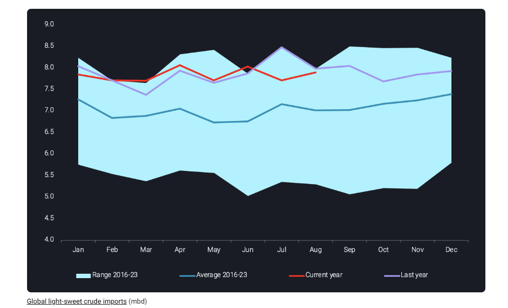
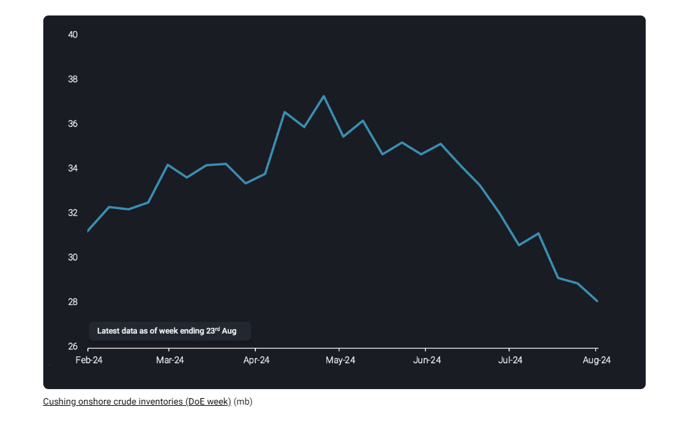
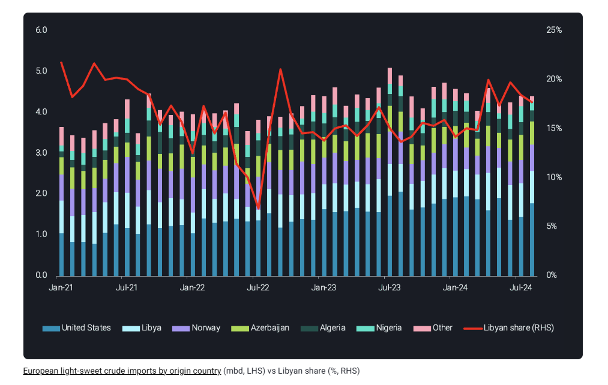

# Light-Sweet crudes showing signs of recovery

**Date:** August 28, 2024  
**Publisher:** Breakwave Advisors | **Category:** Market Insights  
**Original URL:** [https://www.breakwaveadvisors.com/insights/2024/8/28/light-sweet-crudes-showing-signs-of-recovery](https://www.breakwaveadvisors.com/insights/2024/8/28/light-sweet-crudes-showing-signs-of-recovery)  

---

Global imports of light-sweet crudes have seen a recovery driven by recent supply disruptions in Libya

*By*[*Rohit Rathod*](https://www.linkedin.com/in/rathodrohit/)

Recent supply disruptions in North Africa along with three consecutive weeks of stock draws at Cushing have worked in favor of light sweet grades and helped strengthen crude prices. Global imports have also recovered vs July which have further fueled hopes of recovery in the light-sweet complex.

## Global Imports of Light-Sweet Grades Recover

> **Figure 1: Στιγμιότυπο Οθόνης 2024 08 28 124759**  
> **Interactive Data & Source:** [Vortexa](https://www.vortexa.com//oil-gas-data-traders-analysts-data-scientists?gclid=Cj0KCQjw8_qRBhCXARIsAE2AtRZKOvMnbilZ_6_91d7huSFFy71pWLrnPwGwOHVzXsmsG-1a1mZnQw8aAt89EALw_wcB&hsa_acc=1782073842&hsa_ad=548425387665&hsa_cam=14746637662&hsa_grp=125038601902&hsa_kw=&hsa_mt=&hsa_net=adwords&hsa_src=g&hsa_tgt=dsa-1431852288425&hsa_ver=3&utm_campaign=%5BCD%5D%20-%20DSA%20-%20EMEA&utm_medium=cpc&utm_medium=ppc&utm_source=google&utm_source=adwords&utm_term=) | [Local Asset](file:///C:/Users/Dell/Github/Shipping/corpus/03-breakwave/insights/2024/assets/2024-08-28_light-sweet-crudes-showing-signs-of-recovery_img_cea3cf84ceb9ceb3cebcceb9cf8ccf84cf85_dbb3b59f35f1.png)

Global light-sweet crude imports rose 2% m-o-m in August to 8mbd, recovering from July levels but around similar levels as of Aug-23. Majority of these barrels, around 66% arrived in the Atlantic Basin where most of these barrels also originated. Slowing shale production in the US along with shut-down of Libyan production should lead to a rush for buying WTI barrels translating to a drawdown in inventories which we shall explore in the next section.

## Cushing Drawdowns Provide Pricing Support

> **Figure 2: Στιγμιότυπο Οθόνης 2024 08 28 124931**  
> **Interactive Data & Source:** [Vortexa](https://www.vortexa.com//oil-gas-data-traders-analysts-data-scientists?gclid=Cj0KCQjw8_qRBhCXARIsAE2AtRZKOvMnbilZ_6_91d7huSFFy71pWLrnPwGwOHVzXsmsG-1a1mZnQw8aAt89EALw_wcB&hsa_acc=1782073842&hsa_ad=548425387665&hsa_cam=14746637662&hsa_grp=125038601902&hsa_kw=&hsa_mt=&hsa_net=adwords&hsa_src=g&hsa_tgt=dsa-1431852288425&hsa_ver=3&utm_campaign=%5BCD%5D%20-%20DSA%20-%20EMEA&utm_medium=cpc&utm_medium=ppc&utm_source=google&utm_source=adwords&utm_term=) | [Local Asset](file:///C:/Users/Dell/Github/Shipping/corpus/03-breakwave/insights/2024/assets/2024-08-28_light-sweet-crudes-showing-signs-of-recovery_img_cea3cf84ceb9ceb3cebcceb9cf8ccf84cf85_bf2b0f9790c2.png)

Cushing onshore crude inventories have now been drawing for three consecutive weeks, a continuation of a larger trend which started in June. This drawdown has provided support for crude prices and a strengthening of WTI futures. Further drawdowns will only put further pressure on stock levels which are already near seasonal lows and as seen in 2023, could soon be flirting close to tank bottoms. What these stock draws have managed to sustain are the prompt loadings of US light-sweet crude towards Northwest Europe which are expected to remain strong in light of Libyan supply disruptions.

## Prompt European Buying Provides Further Upside

> **Figure 3: Στιγμιότυπο Οθόνης 2024 08 28 125022**  
> **Interactive Data & Source:** [Vortexa](https://www.vortexa.com//oil-gas-data-traders-analysts-data-scientists?gclid=Cj0KCQjw8_qRBhCXARIsAE2AtRZKOvMnbilZ_6_91d7huSFFy71pWLrnPwGwOHVzXsmsG-1a1mZnQw8aAt89EALw_wcB&hsa_acc=1782073842&hsa_ad=548425387665&hsa_cam=14746637662&hsa_grp=125038601902&hsa_kw=&hsa_mt=&hsa_net=adwords&hsa_src=g&hsa_tgt=dsa-1431852288425&hsa_ver=3&utm_campaign=%5BCD%5D%20-%20DSA%20-%20EMEA&utm_medium=cpc&utm_medium=ppc&utm_source=google&utm_source=adwords&utm_term=) | [Local Asset](file:///C:/Users/Dell/Github/Shipping/corpus/03-breakwave/insights/2024/assets/2024-08-28_light-sweet-crudes-showing-signs-of-recovery_img_cea3cf84ceb9ceb3cebcceb9cf8ccf84cf85_66363989ba35.png)

Supply disruptions in Libya have forced European buyers to look for replacement barrels elsewhere in the US Gulf Coast and Africa. Share of Libyan crude in European imports currently stands at 18%, which should fall further given the issues mentioned before. This provides an excellent opportunity for US Gulf Coast barrels to increase their already dominant share.

As the autumn refinery maintenance season in Europe approaches, these light sweet flows should experience some headwinds, but given the strength of Brent/WTI spread currently, it seems less likely. Going forward, expect more US light-sweet barrels on the water in September and early October as refinery runs experience slowdown driven by weaker margins. Also, US crude stock-draws shall continue to fuel exports as production growth remains sluggish, at least until fall refinery maintenance kicks-in.

Data Source:[Vortexa](https://www.vortexa.com//oil-gas-data-traders-analysts-data-scientists?gclid=Cj0KCQjw8_qRBhCXARIsAE2AtRZKOvMnbilZ_6_91d7huSFFy71pWLrnPwGwOHVzXsmsG-1a1mZnQw8aAt89EALw_wcB&hsa_acc=1782073842&hsa_ad=548425387665&hsa_cam=14746637662&hsa_grp=125038601902&hsa_kw=&hsa_mt=&hsa_net=adwords&hsa_src=g&hsa_tgt=dsa-1431852288425&hsa_ver=3&utm_campaign=%5BCD%5D%20-%20DSA%20-%20EMEA&utm_medium=cpc&utm_medium=ppc&utm_source=google&utm_source=adwords&utm_term=)

---

**Tags:** Tankers, Markets, Crude  
