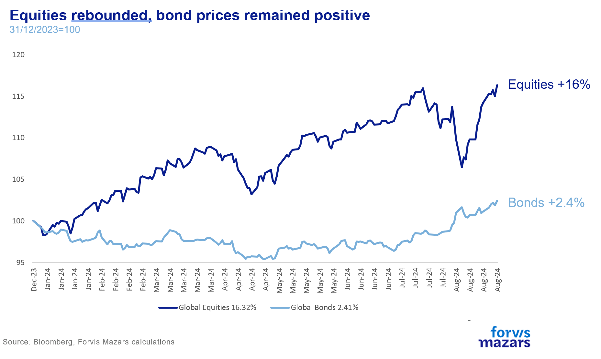
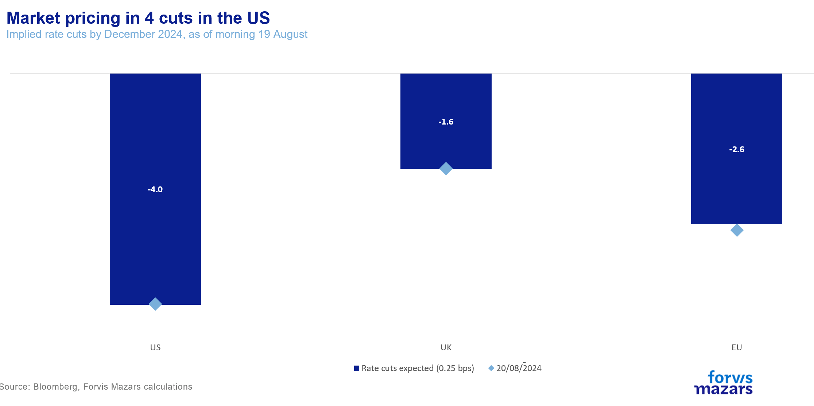
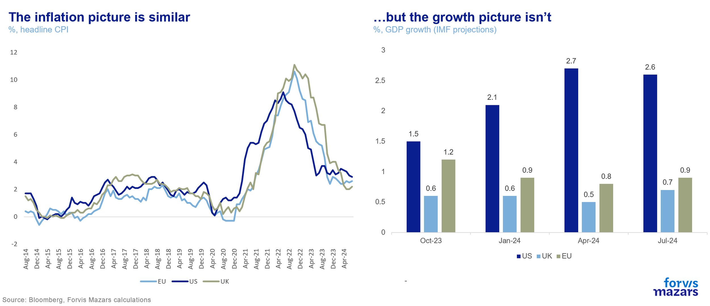
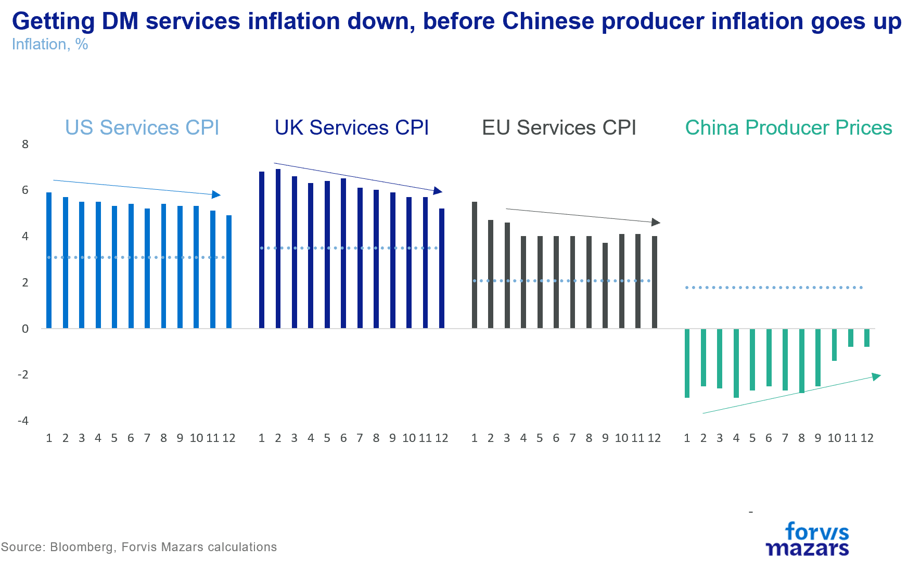
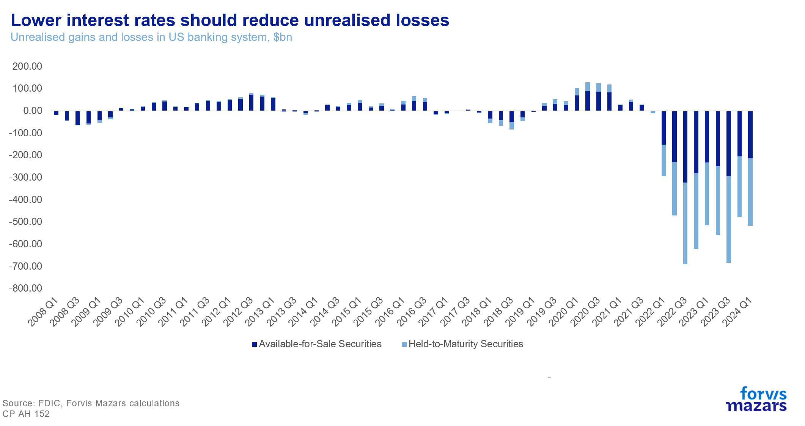
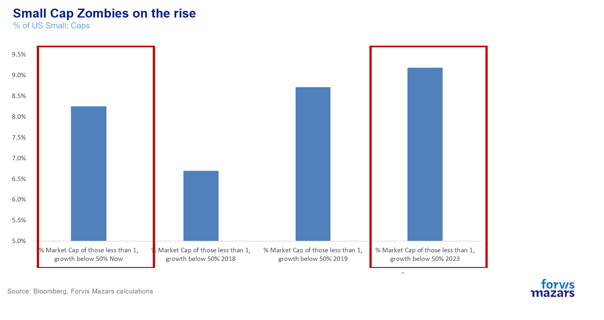

# Who benefits the most from the Fed’s Pivot? It’s not Risk Assets

**Date:** August 28, 2024  
**Publisher:** Breakwave Advisors | **Category:** Market Insights  
**Original URL:** [https://www.breakwaveadvisors.com/insights/2024/8/28/qlfqeso3o94yx8gthwvlu4sor04h5m](https://www.breakwaveadvisors.com/insights/2024/8/28/qlfqeso3o94yx8gthwvlu4sor04h5m)  

---

*By*[*George Lagarias*](https://www.linkedin.com/in/george-lagarias-mba-3baa769/)

Last week saw the Fed officially greenlighting rate cuts, pivoting towards its growth mandate (which comes in the form of maintaining healthy employment) and stopping just short of declaring victory over inflation.

The Fed’s course has been more or less priced-in for risk markets. Equities continued their post-carry trade rebound, while bonds jumped at the news with fixed income markets pricing in more than four rate cuts this year.

> **Figure 1: Market Chart 1**  
> **Interactive Data & Source:** [Bloomberg News](https://www.bloomberg.com/news/articles/2024-06-11/most-private-equity-investors-fear-cash-is-stuck-in-zombie-funds?sref=EiJDOcNb) | [Local Asset](file:///C:/Users/Dell/Github/Shipping/corpus/03-breakwave/insights/2024/assets/2024-08-28_qlfqeso3o94yx8gthwvlu4sor04h5m_img_image001_bd823c6d2826.png)

But immediate financial market reactions are possibly of less concern right now. Risk assets have been positioning for this outcome for some time now. Traders often “buy the rumour and sell the fact”. Instead, lower rates in the world’s reserve currency will allow a long list of entities to breathe a sigh of relief after the official kick-off.

**European central banks:**Despite delivering early rate cuts, the Bank of England and the European Central Bank (ECB) have been eagerly awaiting for the Fed to kick off, so they can follow without fear of capital flight from the lower-yielding currency to the higher.

Presently markets are waiting for the ECB to cut two or three more times (0.5% to 0.75%) and the Bank of England two more times (0.5%).

> **Figure 2: Market Chart 2**  
> **Interactive Data & Source:** [Bloomberg News](https://www.bloomberg.com/news/articles/2024-06-11/most-private-equity-investors-fear-cash-is-stuck-in-zombie-funds?sref=EiJDOcNb) | [Local Asset](file:///C:/Users/Dell/Github/Shipping/corpus/03-breakwave/insights/2024/assets/2024-08-28_qlfqeso3o94yx8gthwvlu4sor04h5m_img_image002_43ebf200b9bd.png)

However, the Fed’s greenlight does not spell the end of their problems, nor does it allow them to declare victory on inflation. At this point, most Western economies face similar inflation conditions, with headline inflation hovering in the 2-3% territory.

However, European economies face stiffer growth conditions.

> **Figure 3: Market Chart 3**  
> **Interactive Data & Source:** [Bloomberg News](https://www.bloomberg.com/news/articles/2024-06-11/most-private-equity-investors-fear-cash-is-stuck-in-zombie-funds?sref=EiJDOcNb) | [Local Asset](file:///C:/Users/Dell/Github/Shipping/corpus/03-breakwave/insights/2024/assets/2024-08-28_qlfqeso3o94yx8gthwvlu4sor04h5m_img_image003_200eb1b8a9aa.png)

Goods inflation remains tame, mostly thanks to China deflating the world, but services inflation remains elevated.

> **Figure 4: Market Chart 4**  
> **Interactive Data & Source:** [Bloomberg News](https://www.bloomberg.com/news/articles/2024-06-11/most-private-equity-investors-fear-cash-is-stuck-in-zombie-funds?sref=EiJDOcNb) | [Local Asset](file:///C:/Users/Dell/Github/Shipping/corpus/03-breakwave/insights/2024/assets/2024-08-28_qlfqeso3o94yx8gthwvlu4sor04h5m_img_image004_e0c0382a1e7b.png)

The key for Western central banks is to get services inflation down before China stops deflating goods.

**Commercial Banks and risk management departments.**Lower interest rates should also benefit commercial banks. Despite losing some profitability due to lower rates on the long end, overall profitability should rise, due to demand for new loans and a steeper yield curve (banks borrow short and lend long). More importantly, however, bonds rallying should reduce unrealised losses from fixed income holdings, which have piled up significantly since the Federal Reserve started hiking, threatening the US peripheral banking system. The quicker that pile is reduced, the less vulnerable the US (and the global) banking system will be to crises.

> **Figure 5: Market Chart 5**  
> **Interactive Data & Source:** [Bloomberg News](https://www.bloomberg.com/news/articles/2024-06-11/most-private-equity-investors-fear-cash-is-stuck-in-zombie-funds?sref=EiJDOcNb) | [Local Asset](file:///C:/Users/Dell/Github/Shipping/corpus/03-breakwave/insights/2024/assets/2024-08-28_qlfqeso3o94yx8gthwvlu4sor04h5m_img_image005_0d769a5b5ddc.png)

**Corporate Treasuries and pension funds:**A decade and a half of low yields have prompted corporate treasuries to shift some of their capital structure towards debt, in order to lower their cost of capital. While corporate borrowing for listed companies has soared in the past few years, earnings have also risen, especially for larger cap firms, so that was money well-spent. But going down the pecking order, to smaller cap and unlisted, there are problems festering.

In the US, smaller caps have seen a rise in the number of zombie companies (companies whose earnings don’t or just barely cover interest expense).

> **Figure 6: Market Chart 6**  
> **Interactive Data & Source:** [Bloomberg News](https://www.bloomberg.com/news/articles/2024-06-11/most-private-equity-investors-fear-cash-is-stuck-in-zombie-funds?sref=EiJDOcNb) | [Local Asset](file:///C:/Users/Dell/Github/Shipping/corpus/03-breakwave/insights/2024/assets/2024-08-28_qlfqeso3o94yx8gthwvlu4sor04h5m_img_image006_69c5d3eaf33e.png)

Meanwhile, a recent[survey](https://www.bloomberg.com/news/articles/2024-06-11/most-private-equity-investors-fear-cash-is-stuck-in-zombie-funds?sref=EiJDOcNb)suggested that almost half of investors, especially pension funds, have money in funds that have little hope of making any returns to their shareholders. Lower cost of capital could allow some of these smaller companies to devote some of their earnings to business development and thus improving the profitability, removing themselves from zombie lists and allowing them to make some returns for their equity and bond holders.

### Consumers and Governments

The largest beneficiary of lower interest rates will be consumers and over-indebted governments. Corporate balance sheets have become more sensible in the past decades. But government spending profligacy is on the rise. Lower interest rates will mean lower interest payments for indebted consumers and governments. Overall less pressure on the economy should further empower consumers through lower unemployment figures and higher real economic growth.

### What Should Investors Know About Impending Us Rate Cuts?

At any rate, falling interest rates provide a safety net against some market volatility going forward. But we also believe that there’s little room for risk markets to rally on the news, which has mostly been priced in. If anything, shorter-term investors again seem too optimistic about the pace of rate cuts, at least in 2024. Bond markets especially, which have grown used to very low yields, are mostly driven by “fear of missing out”, pricing in a significant number of rate cuts. Our House View is that two rate cuts are the most probable course of action for the Fed this year. We expect the Fed to pace itself and feel that investors are better off doing the same.

Having said that, lower rates remove various risks from the economy. Some visible (in the short list above) and, more importantly, some invisible. This should eventually allow more reticent investors, those who have often preferred to park their money in safer assets, to test the risk bands of their portfolios.

---

**Tags:** Markets, Economy, Macro  
