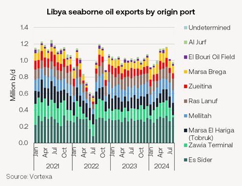
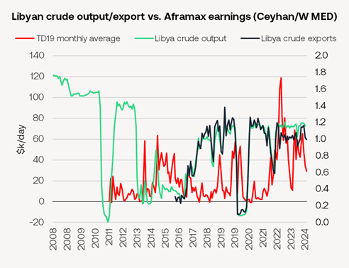

# Cargo cancellations for Aframaxes

**Date:** August 29, 2024  
**Publisher:** Breakwave Advisors | **Category:** Market Insights  
**Original URL:** [https://www.breakwaveadvisors.com/insights/2024/8/29/cargo-cancellations-for-aframaxes](https://www.breakwaveadvisors.com/insights/2024/8/29/cargo-cancellations-for-aframaxes)  

---

Aframaxes face cargo cancellations as Libyan crude production halts once again

- As of close yesterday, it was still uncertain if crude will be available for Aframaxes due to load in Libyan over the next few days.
- While crude production has halted on August 26th, there remains some crude in storage that can be exported.Libya's eastern government announced the shutdown of oil production and exports on August 26th, citing "force majeure" due to rising tensions with the rival Tripoli-based government.
- Libya’s largest export terminal, Es Sider, started cutting oil shipments on Tuesday. Waha Oil Co., which supplies Es Sider, was expected to gradually reduce exports. Sirte Oil Co. also announced plans to reduce output. Other ports, for instance Mellitah, remained active with vessels fixed ‘on subs’ yesterday.
- Libyan crude exports move predominantly on Aframaxes, making up roughly a quarter of all Mediterranean Aframax liftings (roughly 45/month). The loss of Libyan cargoes is already negatively impacting Aframax freight rates, off another $1,200/day yesterday for cross Med voyages.

> **Figure 1: Market Chart 1**  
> [Local Asset](file:///C:/Users/Dell/Github/Shipping/corpus/03-breakwave/insights/2024/assets/2024-08-29_cargo-cancellations-for-aframaxes_img_image0_f2c897676f0c.png)

> **Figure 2: Market Chart 2**  
> [Local Asset](file:///C:/Users/Dell/Github/Shipping/corpus/03-breakwave/insights/2024/assets/2024-08-29_cargo-cancellations-for-aframaxes_img_image1_b8a661fd8911.png)

- It is unclear how long the Libyan crude outage will last, but previous (recent) production restrictions have lasted anything from a few months (1st half 2022) to 5 years (2013-2017). Two recent cessations (Jan 2011 – April 2012 and/lasted around a Dec 2019-Jan 2021) lasted a little over a year.
- Libya's seaborne exports amounted to 1.02m b/d in July, with most of the exports flowing to the Mediterranean and Northwest Europe, primarily on Aframaxes and some Suezmaxes. As of August 27th, Aframax rates out of the Mediterranean have softened, with the MED/Singapore route trading at $3.6 million, down from $4.1 million. Aframaxes that were originally loading Libyan crude will likely find alternative employment in other Mediterranean ports or the Black Sea.
- Earlier this month, Libya’s largest oil field, Sharara, which was producing nearly 270k b/d, was halted due to protests. This forced buyers to turn to West Texas Intermediate (WTI) crude in the first week of Sharara’s shutdown, as it was one of the few crudes available on such short notice.
- The ongoing conflict, driven by a power struggle over Libya's Central Bank and control of the nation’s oil wealth, has led to a 3.2% rise in Brent crude prices, pushing them above $81 per barrel on Monday.
- Europe would need to replace lost Libyan barrels. The Libyan outage might make it easier for OPEC+ to go ahead with gradual production unwind.
- The division between Libya's east and west, despite a 2020 UN-brokered ceasefire, continues to result in recurring conflicts over oil revenues. The latest conflict centres around the leadership of the Central Bank. The internationally recognized government in the west seeks to replace Governor Sadiq Al-Kabir, who is supported by the eastern legislature and has refused to step down. This power struggle has deepened political divisions and threatens the fragile UN-backed peace deal.
- Over the past two months, tensions have escalated, with the situation in Libya rapidly deteriorating according to UN reports. Since the 2011 overthrow of Moammar Al Qaddafi, Libya has been plagued by unrest, with competing governments undermining economic recovery efforts.

Will latest Houthi attack – this time a Delta Suezmax in Red Sea – spell the end of Suez Transits for tankers?

- Sounion, a Suezmax tanker owned by Delta Tankers, was severely damaged and abandoned following multiple attacks by the Houthis in the Red Sea on 21st August.
- The Houthi’s even threatened to attack the tugs tasked with removing the wreckage.
- The vessel, carrying 150,000 tons of Basrah heavy crude oil from Iraq, threatens an environmental disaster. Leaks have already been reported. A cargo spill that could be up to four times larger than the Exxon Valdez spill, according to the US Department of State. The European Union's naval task force in the Middle East has issued warnings about the significant environmental and navigational hazards posed by the ship.
- The latest Houthi attacks come amid rising due to escalating tensions in the Middle East. Israel's airstrikes on Hezbollah targets in southern Lebanon on August 25th, followed by Hezbollah's retaliatory missile launches and yesterday’s push by Israeli forces into the West bank have pushed Brent crude to $81.50/bbl before easing to $79/bbl by yesterday’s close. TD23 (MEG/MED) Suezmaxes traded at 92.33 WS on Wednesday, down from 87.11 WS the previous Tuesday.
- European insurers have increased additional war risk insurance premiums (AWRPs) for Red Sea voyages to 0.6-0.75% of a vessel's value, while Russian insurers, including Ingosstrakh, have raised premiums to 0.7%.
- This Sounion incident is the third attack on a Delta Tankers vessel in the Red Sea. The ongoing Houthi campaign against merchant shipping has targeted over 100 ships

---

**Tags:** Crude, Tankers, Markets  
