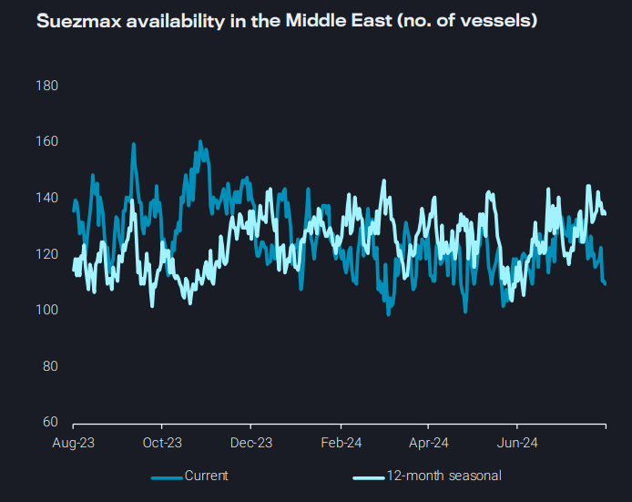
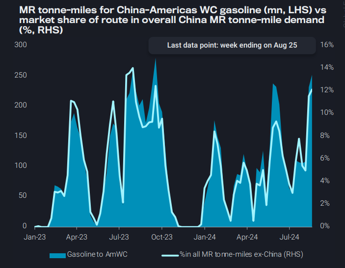
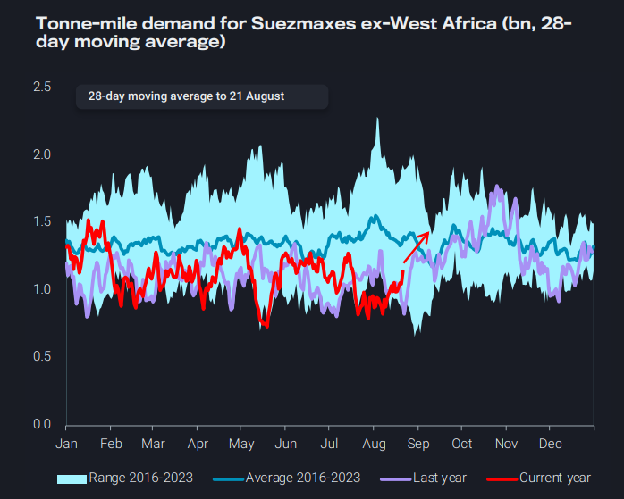
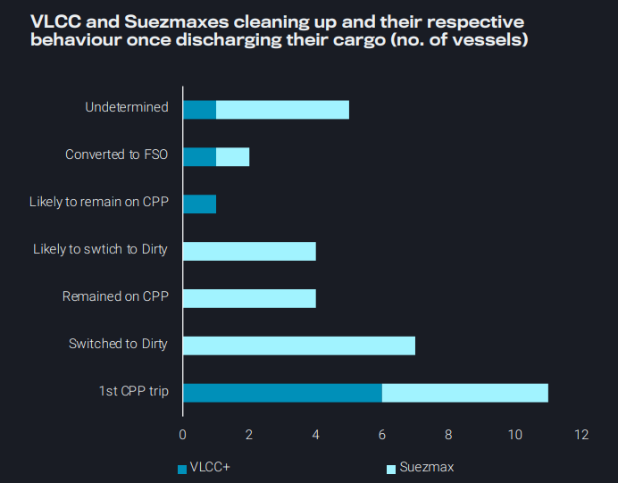

# Altering fates for Suezmaxes originating from the Atlantic v Pacific

**Date:** August 29, 2024  
**Publisher:** Breakwave Advisors | **Category:** Market Insights  
**Original URL:** [https://www.breakwaveadvisors.com/insights/2024/8/29/xlcrwniy551kx4o3t97rf1as1nf6i7](https://www.breakwaveadvisors.com/insights/2024/8/29/xlcrwniy551kx4o3t97rf1as1nf6i7)  

---

In this week's report we focus on the drivers behind the dynamics and expectations for the Suezmax market on both basins. We also give an update on MRs operating in China as well as the recent developments on supertanker clean-ups.

*By*[*Ioannis Papadimitriou*](https://www.linkedin.com/in/ipapadimitriou/)

### Key Takeaways From This Report:

- **Dirty – East of Suez:**MEG Suezmax demand in the doldrums but rates supported from limited tonnage and demand from the East
- **Clean – East of Suez:**China-Americas WC gasoline arb supports MR tonne-miles, but ex-China utilisation remain subdued
- **Dirty – West of Suez:**Seasonal uptick in WAf Suezmax demand imminent, but it could be capped by Dangote consumption
- **Clean – West of Suez:**Supertankers clean up update; mixed bag of behaviours from operators once CPP is discharged

### Dirty – East of Suez: MEG Suezmax Demand in the Doldrums But Rates Supported From Limited Tonnage and Demand From the East

Suezmax tonne-day demand out of the Middle East Gulf remains at multi-year lows predominantly influenced by Red Sea attacks which has limited East-to-West crude flows.

- A slight pick-up on Suezmax employment towards the Pacific Basin has provided a floor on the the segment’s demand out the MEG
- Tonne-day share of MEG Suezmax loadings towards the Pacific Basin has rebounded to 57%, the highest recorded since the start of June

Despite softer demand fundamentals, Suezmax availability in the Middle East continues to drop since the end of July, providing a support in rates in August, following a drop to yearly-lows

- MEG-to-India and MEG-to-SE Asia Suezmax rates have risen around 15% over the past two weeks (Argus)
- However, as the Indian monsoon season is underway, demand for crude imports might soften, capping the potential of any considerable freight rate increase

> **Figure 1: Στιγμιότυπο Οθόνης 2024 08 29 120856**  
> **Interactive Data & Source:** [Vortexa](https://www.vortexa.com//oil-gas-data-traders-analysts-data-scientists?gclid=Cj0KCQjw8_qRBhCXARIsAE2AtRZKOvMnbilZ_6_91d7huSFFy71pWLrnPwGwOHVzXsmsG-1a1mZnQw8aAt89EALw_wcB&hsa_acc=1782073842&hsa_ad=548425387665&hsa_cam=14746637662&hsa_grp=125038601902&hsa_kw=&hsa_mt=&hsa_net=adwords&hsa_src=g&hsa_tgt=dsa-1431852288425&hsa_ver=3&utm_campaign=%5BCD%5D%20-%20DSA%20-%20EMEA&utm_medium=cpc&utm_medium=ppc&utm_source=google&utm_source=adwords&utm_term=) | [Local Asset](file:///C:/Users/Dell/Github/Shipping/corpus/03-breakwave/insights/2024/assets/2024-08-29_xlcrwniy551kx4o3t97rf1as1nf6i7_img_cea3cf84ceb9ceb3cebcceb9cf8ccf84cf85_a811c0893603.png)

### Clean – East of Suez: China-Americas Wc Gasoline Arb Supports MR Tonne-Miles, But Ex-China Utilisation Remain Subdued

China-Americas West Coast MR tonne-mile demand surged in August due to favourable gasoline arbitrage

- Four MR2-size gasoline cargoes departed China for Mexico and Chile between August 1-20, boosting China’s gasoline exports to the Americas West Coast to nearly 60kbd for the month, the highest level since July 2019
- In contrast, China’s gasoline exports to Asia remained flat month-on-month during the same period, as Asian cracks softened in recent weeks

While MR tonne-miles found support from long-haul routes, overall exChina MR tonne-miles held steady to lower in August due to capped Chinese CPP exports

- Looking ahead, China’s CPP exports are likely to pick up in the coming months, driven by seasonally stronger production and additional export quotas
- However, these additional exports will likely remain within Asia due to narrowing arbitrage opportunities, limiting MR tonne-mile growth

> **Figure 2: Στιγμιότυπο Οθόνης 2024 08 29 121512**  
> **Interactive Data & Source:** [Vortexa](https://www.vortexa.com//oil-gas-data-traders-analysts-data-scientists?gclid=Cj0KCQjw8_qRBhCXARIsAE2AtRZKOvMnbilZ_6_91d7huSFFy71pWLrnPwGwOHVzXsmsG-1a1mZnQw8aAt89EALw_wcB&hsa_acc=1782073842&hsa_ad=548425387665&hsa_cam=14746637662&hsa_grp=125038601902&hsa_kw=&hsa_mt=&hsa_net=adwords&hsa_src=g&hsa_tgt=dsa-1431852288425&hsa_ver=3&utm_campaign=%5BCD%5D%20-%20DSA%20-%20EMEA&utm_medium=cpc&utm_medium=ppc&utm_source=google&utm_source=adwords&utm_term=) | [Local Asset](file:///C:/Users/Dell/Github/Shipping/corpus/03-breakwave/insights/2024/assets/2024-08-29_xlcrwniy551kx4o3t97rf1as1nf6i7_img_cea3cf84ceb9ceb3cebcceb9cf8ccf84cf85_2937929cd118.png)

### Dirty – West of Suez: Seasonal Uptick in Waf Suezmax Demand Imminent, But It Could Be Capped by Dangote Consumption

Suezmax utilisation out of the Gulf of Mexico was high early in August, but then tumbled as the number of crude loadings to Europe on Suezmaxes declined, as the month progressed

- Additionally, Suezmax utilisation in South America East Coast and the Med remains below H1-levels, which could change as no VLCCs can load from Guyana currently due to seasonal restrictions

The Atlantic Basin region poised for increased Suezmax demand is West Africa

- This increase in demand presages the seasonal uptick in demand out of WAf expected in early Sep as European crude demand increases in Q4
- Especially with the ongoing issues of light-sweet Libyan crude surrounding the field outage, Europe may increasingly look to WAf as a source of light-sweet crude in addition to WTI

However, higher crude demand from the Dangote refinery as it continues to increase production could provide a ceiling to the usual seasonal uptick in Suezmax demand expected at this time of year

> **Figure 3: Στιγμιότυπο Οθόνης 2024 08 29 121714**  
> **Interactive Data & Source:** [Vortexa](https://www.vortexa.com//oil-gas-data-traders-analysts-data-scientists?gclid=Cj0KCQjw8_qRBhCXARIsAE2AtRZKOvMnbilZ_6_91d7huSFFy71pWLrnPwGwOHVzXsmsG-1a1mZnQw8aAt89EALw_wcB&hsa_acc=1782073842&hsa_ad=548425387665&hsa_cam=14746637662&hsa_grp=125038601902&hsa_kw=&hsa_mt=&hsa_net=adwords&hsa_src=g&hsa_tgt=dsa-1431852288425&hsa_ver=3&utm_campaign=%5BCD%5D%20-%20DSA%20-%20EMEA&utm_medium=cpc&utm_medium=ppc&utm_source=google&utm_source=adwords&utm_term=) | [Local Asset](file:///C:/Users/Dell/Github/Shipping/corpus/03-breakwave/insights/2024/assets/2024-08-29_xlcrwniy551kx4o3t97rf1as1nf6i7_img_cea3cf84ceb9ceb3cebcceb9cf8ccf84cf85_94f5ba5e6075.png)

### Clean – West of Suez: Supertankers Clean Up Update; Mixed Bag of Behaviours From Operators Once Cpp Is Discharged

We have recorded six additional tankers that have followed the supertanker clean up trend for August: 4 VLCCs and 2 Suezmax tankers

- This is considerably down from the 15 vessels recorded cleaning up in July
- This brings the total of VLCC and Suezmax tankers cleaning up to 34

There is a mixed bag of behaviour after these vessels discharge the clean cargoes:

- 4 tankers continued with loading a consecutive CPP cargo, whilst 7 tankers have switched back to dirty after one load
- In order to raise profitability a portion of operators carried condensate from Algeria after discharging in Europe to reduce the ballast leg mileage
- 2 of the oldest tankers have converted to an FSO behaviour, potentially could be used to store, compile and blend off-spec diesel

> **Figure 4: Στιγμιότυπο Οθόνης 2024 08 29 121940**  
> **Interactive Data & Source:** [Vortexa](https://www.vortexa.com//oil-gas-data-traders-analysts-data-scientists?gclid=Cj0KCQjw8_qRBhCXARIsAE2AtRZKOvMnbilZ_6_91d7huSFFy71pWLrnPwGwOHVzXsmsG-1a1mZnQw8aAt89EALw_wcB&hsa_acc=1782073842&hsa_ad=548425387665&hsa_cam=14746637662&hsa_grp=125038601902&hsa_kw=&hsa_mt=&hsa_net=adwords&hsa_src=g&hsa_tgt=dsa-1431852288425&hsa_ver=3&utm_campaign=%5BCD%5D%20-%20DSA%20-%20EMEA&utm_medium=cpc&utm_medium=ppc&utm_source=google&utm_source=adwords&utm_term=) | [Local Asset](file:///C:/Users/Dell/Github/Shipping/corpus/03-breakwave/insights/2024/assets/2024-08-29_xlcrwniy551kx4o3t97rf1as1nf6i7_img_cea3cf84ceb9ceb3cebcceb9cf8ccf84cf85_915294265d69.png)

Data Source:[Vortexa](https://www.vortexa.com//oil-gas-data-traders-analysts-data-scientists?gclid=Cj0KCQjw8_qRBhCXARIsAE2AtRZKOvMnbilZ_6_91d7huSFFy71pWLrnPwGwOHVzXsmsG-1a1mZnQw8aAt89EALw_wcB&hsa_acc=1782073842&hsa_ad=548425387665&hsa_cam=14746637662&hsa_grp=125038601902&hsa_kw=&hsa_mt=&hsa_net=adwords&hsa_src=g&hsa_tgt=dsa-1431852288425&hsa_ver=3&utm_campaign=%5BCD%5D%20-%20DSA%20-%20EMEA&utm_medium=cpc&utm_medium=ppc&utm_source=google&utm_source=adwords&utm_term=)

---

**Tags:** Shipping, Crude Oil, Tankers  
