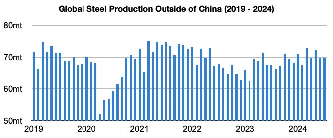
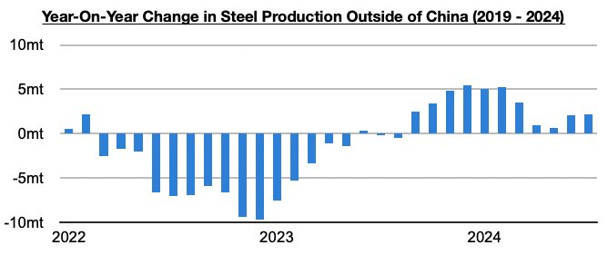
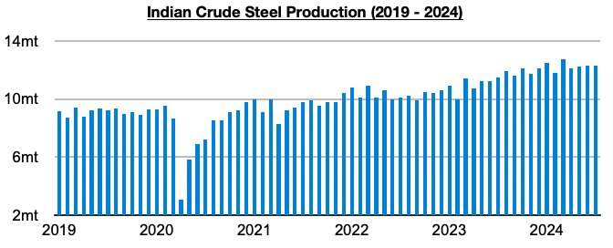
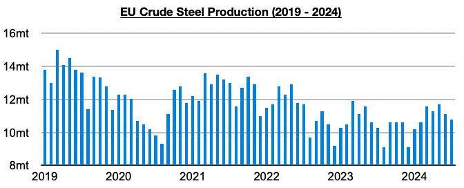
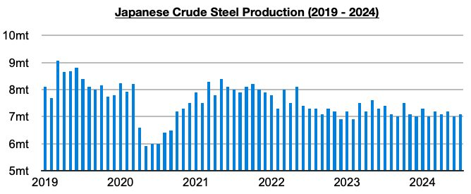
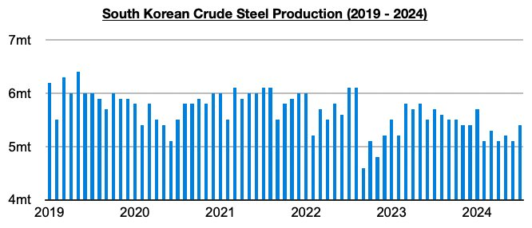

# Ongoing Steel Production Growth Outside of China

**Date:** August 30, 2024  
**Publisher:** Breakwave Advisors | **Category:** Market Insights  
**Original URL:** [https://www.breakwaveadvisors.com/insights/2024/8/30/ongoing-steel-production-growth-outside-of-china](https://www.breakwaveadvisors.com/insights/2024/8/30/ongoing-steel-production-growth-outside-of-china)  

---

*By*[*Jeffrey Landsberg*](https://www.linkedin.com/in/jeffrey-landsberg-70ab957/)

As we discussed in Commodore Research's most recent Weekly Dry Bulk Report, global steel production totaled approximately 152.8 million tons in July. This is down month-on-month by 8.6 million tons (-5%) and is 5.7 million tons (-4%) less than was reported last year for July 2023’s production. Steel production outside of China totaled approximately 69.9 million tons last month. This is up month-on-month by 100,000 tons and is 2.2 million tons (3%) more than was reported last year for July 2023’s production.

> **Figure 1: Chart 1 (1)**  
> [Local Asset](file:///C:/Users/Dell/Github/Shipping/corpus/03-breakwave/insights/2024/assets/2024-08-30_ongoing-steel-production-growth-outside-of-china_img_chart128129_c2177c6f91a8.jpg)

Steel production outside of China has now grown on a year-on-year basis for eleven straight months. Very positive is that while it appeared that production would enter contraction soon, growth has in fact continued. Year-on-year growth had been falling since March and came in at only 700,000 tons in May, but June enjoyed a 3% jump and in July 3% growth was sustained. A shift has remained particularly noticeable in the European Union and growth has remained strongest in India. Significant contractions remain ongoing in Japan and South Korea however.

> **Figure 2: Chart 2 (1)**  
> [Local Asset](file:///C:/Users/Dell/Github/Shipping/corpus/03-breakwave/insights/2024/assets/2024-08-30_ongoing-steel-production-growth-outside-of-china_img_chart228129_1f4837c8eb04.jpg)

Indian steel production totaled 12.3 million tons last month. This is unchanged from June and is 800,000 tons (7%) more than was reported last year for June 2023’s production. India’s production has now increased on a year-on-year basis for seventeen straight months.

> **Figure 3: Chart 3 (1)**  
> [Local Asset](file:///C:/Users/Dell/Github/Shipping/corpus/03-breakwave/insights/2024/assets/2024-08-30_ongoing-steel-production-growth-outside-of-china_img_chart328129_0c1f37be6bdf.jpg)

EU production totaled 10.8 million tons last month. This is 300,000 tons (-3%) less than was produced in June but is 500,000 tons (5%) more than was reported last year for July 2023’s production. Production has now grown on a year-on-year basis for four straight months. Before the last four months, EU production had fallen on a year-on-year basis during twenty-six of the previous twenty-eight months.

> **Figure 4: Chart 4**  
> [Local Asset](file:///C:/Users/Dell/Github/Shipping/corpus/03-breakwave/insights/2024/assets/2024-08-30_ongoing-steel-production-growth-outside-of-china_img_chart4_490f86dbef5f.jpg)

Japanese steel production totaled 7.1 million tons. This is 100,000 tons (1%) more than was produced in June but is 300,000 tons (-4%) less than was reported last year for July 2023’s production. Japanese steel production has now contracted on a year-on-year basis during twenty-six of the last thirty-one months.

> **Figure 5: Chart 5**  
> [Local Asset](file:///C:/Users/Dell/Github/Shipping/corpus/03-breakwave/insights/2024/assets/2024-08-30_ongoing-steel-production-growth-outside-of-china_img_chart5_937b0b27e4d1.jpg)

South Korea is another nation where production remains mired in a year-on-year contraction. South Korean steel production totaled 5.5 million tons last month. This is 400,000 tons (8%) more than was produced in June but is 200,000 tons (-4%) less than was reported last year for July 2023’s production. South Korean steel production has now contracted on a year-on-year basis for six straight months. Overall, steel production still remains in contraction in several major steel-producing nations including South Korea and Japan, but collectively steel production outside of China continues to maintain growth. This remains helpful for the dry bulk market especially considering that in China steel production has recently returned to its own contraction.

> **Figure 6: Chart 6**  
> [Local Asset](file:///C:/Users/Dell/Github/Shipping/corpus/03-breakwave/insights/2024/assets/2024-08-30_ongoing-steel-production-growth-outside-of-china_img_chart6_1cedd6b05128.jpg)

---

**Tags:** Drybulk, Economy, Shipping  
