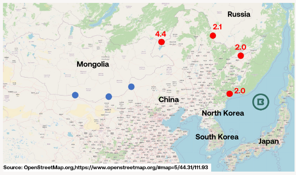
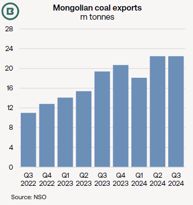
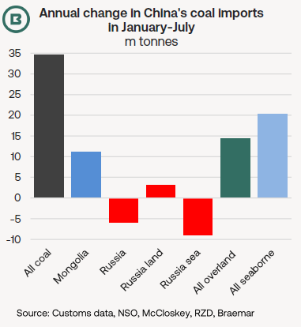

# The Big Picture: China’s coal imports: overland gain but seaborne drop from Russia

**Date:** August 30, 2024  
**Publisher:** Breakwave Advisors | **Category:** Market Insights  
**Original URL:** [https://www.breakwaveadvisors.com/insights/2024/8/30/the-big-picture-chinas-coal-imports-overland-gain-but-seaborne-drop-from-russia](https://www.breakwaveadvisors.com/insights/2024/8/30/the-big-picture-chinas-coal-imports-overland-gain-but-seaborne-drop-from-russia)  

---

- *It may seem odd for a shipping report to write about overland trade, but today’s Big Picture addresses an overland trade that affects seaborne volumes—that is China’s imports of Russian and Mongolian coal.*
- *Braemar’s reports have tracked Mongolia’s rapid coal export expansion in 2023-24, which has been spurred by new rail links, whereas railed coal into China from Russia have had a lower profile.*
- *What then has been the impact on seaborne coal imports into China?*

### Russia

Having expanded rapidly from 32m tonnes in 2019 to more than 100m tonnes in 2023,**Chinese imports of Russian coal have contracted this year**.

Chinese customs data recorded a yearly drop of nearly 6m tonnes in January-July to 54.4m tonnes overall. Thermal and lignite grades fell 8.7m tonnes to 36.6m tonnes, however, coking coal still managed to grow +2.8m tonnes to 17.8m tonnes.

**Seaborne volumes face an additional squeeze from increased railings of Russian coal into China at four border crossings**outlined on our map in red. January-July volumes in million tonnes have been added at each.

Data from Russian rail operator RZD, quoted by coal media, show a year-on-year gain of 3.4m tonnes to 10.5m tonnes in the same seven months of 2023.

Of course, Chinese imports and Russian exports do not offer a like-for-like data comparison, but these figures do suggest**seaborne volumes from Russia to China will have contracted by around 9-10m tonnes YoY in January-July this year**.

For the most part, Russia’s seaborne routes to China have originated from the Pacific Coast this year (90%), the rest divided between the Baltic Sea, Black Sea and Murmansk.

### Mongolia

Russian overland coal movements into China have added to**resurgent Mongolian coal exports, which leapt from 16m tonnes in 2021 to very close to 70m tonnes last year**, according to the National Statistical Office (NSO) of Mongolia.

Annual growth from Mongolia has been maintained into 2024, NSO data show, with January-July up 12.1m tonnes, at 47.5m tonnes (see first chart).

The blue dots on our map highlight new and existing Mongolian/Chinese border crossings involving railings (which are reloaded on to different trains due to the countries’ different gauges).

> **Figure 1: Market Chart 1**  
> [Local Asset](file:///C:/Users/Dell/Github/Shipping/corpus/03-breakwave/insights/2024/assets/2024-08-30_the-big-picture-chinas-coal-imports-overland-gain-but-seaborne-drop-from-russia_img_image028129_d8a647100966.png)

> **Figure 2: Market Chart 2**  
> [Local Asset](file:///C:/Users/Dell/Github/Shipping/corpus/03-breakwave/insights/2024/assets/2024-08-30_the-big-picture-chinas-coal-imports-overland-gain-but-seaborne-drop-from-russia_img_image128129_91a5e0cc32ee.png)

The main border crossing for railed Mongolian coal into China at**Erenhot**has been supplemented since late 2022 by the**completion of the Tavan Tolgoi-Gashuun Sukhait Railway (Tavan T-GS Railway)**.

The railway replaced a 150-mile/240-km road, which was prone to lengthy queues of trucks. The resulting reduction in transport costs has boosted the viability of mining coking coal from the Tavan Tolgoi coalfield in the South Gobi.

In addition, the Tex Report comments that Mongolia has plans to lift volumes further with**new rail connections entering service, such as the Shivee Khuren-Ceke Railway (SK-Ceke Railway)**.

With Mongolian coal exports confirmed at 6.9m tonnes in July, Braemar has included its estimate for the Q3 2024 in the chart below.

> **Figure 3: Market Chart 3**  
> [Local Asset](file:///C:/Users/Dell/Github/Shipping/corpus/03-breakwave/insights/2024/assets/2024-08-30_the-big-picture-chinas-coal-imports-overland-gain-but-seaborne-drop-from-russia_img_image2_522746cf7568.png)

### How Then Do These Developments Relate to Seaborne Volumes?

Our comparisons are charted below.

**Overland imports of coal into China from Mongolia and Russia have advanced**in January-July, compared with the same period last year.

Despite the apparent retreat in Russian coal carried on ships to China, it seems from customs and rail operator data that, overall,**seaborne coal volumes into China have enjoyed a larger rise than overland**this year.

---

**Tags:** Drybulk, Coal, Shipping  
