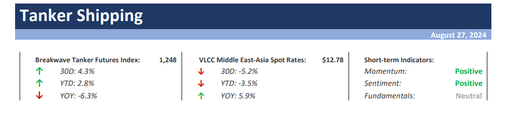
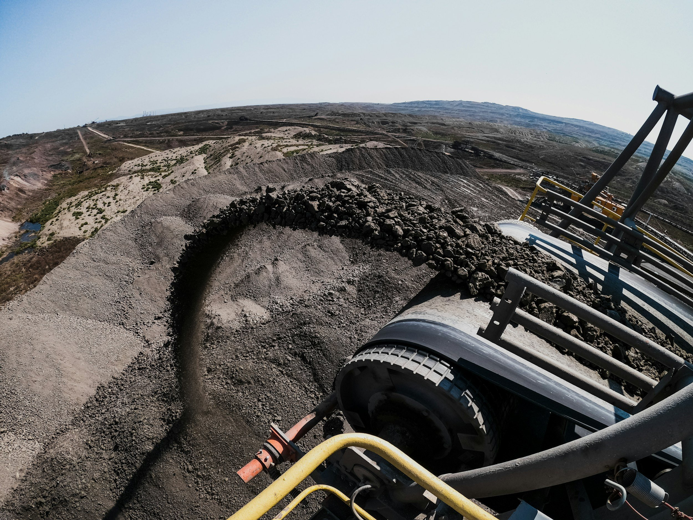

# Weekly Insights Review

**Date:** August 30, 2024  
**Publisher:** Breakwave Advisors | **Category:** Market Insights  
**Original URL:** [https://www.breakwaveadvisors.com/insights/2024/8/30/weekly-insights-review](https://www.breakwaveadvisors.com/insights/2024/8/30/weekly-insights-review)  

---

## Welcome to Our Weekly Insights Review

## Read Here Everything You Need to Know

## Breakwave Tanker Report

**Uncertainty Looms for VLCCs as Activity Slows Down**– Another rally in spot VLCC rates ended up being just a**short-term spike,**as spot rates are back to**mid-August lows after hitting multi-month highs**.

[Read More](https://www.breakwaveadvisors.com/insights/2024730wet-87w332-rgmm3-nbyem)

> **Figure 1: Στιγμιότυπο Οθόνης 2024 08 27 142358**  
> **Interactive Data & Source:** [Breakwave Advisors Market Insights](https://www.breakwaveadvisors.com/insights/2024/8/26/the-capesize-segment-has-oddly-managed-to-remain-resilient) | [Local Asset](file:///C:/Users/Dell/Github/Shipping/corpus/03-breakwave/insights/2024/assets/2024-08-30_weekly-insights-review_img_cea3cf84ceb9ceb3cebcceb9cf8ccf84cf85_2c72b3557d23.png)

> **Figure 2: Unsplash Image Ebesfbw8q4i**  
> **Interactive Data & Source:** [Breakwave Advisors Market Insights](https://www.breakwaveadvisors.com/insights/2024/8/26/the-capesize-segment-has-oddly-managed-to-remain-resilient) | [Local Asset](file:///C:/Users/Dell/Github/Shipping/corpus/03-breakwave/insights/2024/assets/2024-08-30_weekly-insights-review_img_unsplash-image-ebesfbw8q4i_8e14766beb18.jpg)

## The Capesize Segment Has Oddly Managed to Remain Resilient

Doric Weekly Market Insight

China’s Baowu Steel Group, the world’s largest steel producer, cautioned that the current downturn in China's steel industry would likely be longer and more severe than previously anticipated.

> **Figure 3: Unsplash Image 35mlllkpdny**  
> **Interactive Data & Source:** [Breakwave Advisors Market Insights](https://www.breakwaveadvisors.com/insights/2024/8/26/zch6prt90fh46de6g0815l02aredoe) | [Local Asset](file:///C:/Users/Dell/Github/Shipping/corpus/03-breakwave/insights/2024/assets/2024-08-30_weekly-insights-review_img_unsplash-image-35mlllkpdny_386666ba8e2e.jpg)

## Large Global Grain Trade Contraction Still Expected

From Commodore's Weekly Dry Bulk Reports

As we discussed in Commodore Research's most recent Weekly Dry Bulk Report, the United States Department of Agriculture (USDA) has released a new grain export forecast for the 2024/25 season and is now predicting that global coarse grain, wheat, soybean, and soymeal exports will total 700.8 million tons.

[Read More](https://www.breakwaveadvisors.com/insights/2024/8/26/zch6prt90fh46de6g0815l02aredoe)

> **Figure 4: Unsplash Image Zaitdjyv09w**  
> **Interactive Data & Source:** [Breakwave Advisors Market Insights](https://www.breakwaveadvisors.com/insights/2024/8/27/unikxvvbk25dj358x8be26u01j7obh) | [Local Asset](file:///C:/Users/Dell/Github/Shipping/corpus/03-breakwave/insights/2024/assets/2024-08-30_weekly-insights-review_img_unsplash-image-zaitdjyv09w_41819e8e352e.jpg)

## Energy Gains Amid Rising Geopolitical Tensions

Commodities Wrap

Rising geopolitical tensions pushed energy prices higher. A risk-on tone across markets helped boost sentiment across the rest of the complex.

[Read More](https://www.breakwaveadvisors.com/insights/2024/8/27/unikxvvbk25dj358x8be26u01j7obh)

> **Figure 5: Oil Drilling (1)**  
> **Interactive Data & Source:** [Breakwave Advisors Market Insights](https://www.breakwaveadvisors.com/insights/2024/8/27/supply-swell) | [Local Asset](file:///C:/Users/Dell/Github/Shipping/corpus/03-breakwave/insights/2024/assets/2024-08-30_weekly-insights-review_img_oil-drilling28129_1f62af173c53.jpg)

## Supply Swell

Gibson Tanker Market Report

News around the crude market has recently been dominated by headlines about weak Chinese oil demand on one side and conflict in the Middle East threatening supply on the other.

[Read More](https://www.breakwaveadvisors.com/insights/2024/8/27/supply-swell)

> **Figure 6: Unsplash Image 3wpjxh Pirw**  
> **Interactive Data & Source:** [Breakwave Advisors Market Insights](https://www.breakwaveadvisors.com/insights/2024/8/28/qlfqeso3o94yx8gthwvlu4sor04h5m) | [Local Asset](file:///C:/Users/Dell/Github/Shipping/corpus/03-breakwave/insights/2024/assets/2024-08-30_weekly-insights-review_img_unsplash-image-3wpjxh-pirw_e4f5c185505d.jpg)

## Who Benefits the Most From the Fed’s Pivot? It’s Not Risk Assets

Forvis Mazars Weekly Note

Last week saw the Fed officially greenlighting rate cuts, pivoting towards its growth mandate (which comes in the form of maintaining healthy employment) and stopping just short of declaring victory over inflation.

[Read More](https://www.breakwaveadvisors.com/insights/2024/8/28/qlfqeso3o94yx8gthwvlu4sor04h5m)

> **Figure 7: Unsplash Image Iqaf4a0to1g**  
> **Interactive Data & Source:** [Breakwave Advisors Market Insights](https://www.breakwaveadvisors.com/insights/2024/8/28/divergence-in-chinas-coal-output-and-coal-derived-electricity-generation-continues) | [Local Asset](file:///C:/Users/Dell/Github/Shipping/corpus/03-breakwave/insights/2024/assets/2024-08-30_weekly-insights-review_img_unsplash-image-iqaf4a0to1g_79d13a9e206a.jpg)

## Divergence in China's Coal Output and Coal-Derived Electricity Generation Continues

From Commodore's Weekly Dry Bulk Reports

As we discussed in Commodore Research's most recent Weekly China Report, China’s coal output totaled 390.4 million tons in July.

> **Figure 8: Στιγμιότυπο+οθόνης+2024 08 28+125220**  
> **Interactive Data & Source:** [Breakwave Advisors Market Insights](https://www.breakwaveadvisors.com/insights/2024/8/28/light-sweet-crudes-showing-signs-of-recovery) | [Local Asset](file:///C:/Users/Dell/Github/Shipping/corpus/03-breakwave/insights/2024/assets/2024-08-30_weekly-insights-review_img_cea3cf84ceb9ceb3cebcceb9cf8ccf84cf85_4d7a4df1507b.png)

## Light-Sweet Crudes Showing Signs of Recovery

Vortexa Freight Weekly

Global imports of light-sweet crudes have seen a recovery driven by recent supply disruptions in Libya

> **Figure 9: Unsplash Image Ivvzibs8jrc**  
> **Interactive Data & Source:** [Breakwave Advisors Market Insights](https://www.breakwaveadvisors.com/insights/2024/8/29/cargo-cancellations-for-aframaxes) | [Local Asset](file:///C:/Users/Dell/Github/Shipping/corpus/03-breakwave/insights/2024/assets/2024-08-30_weekly-insights-review_img_unsplash-image-ivvzibs8jrc_2c9b697334aa.jpg)

## Cargo Cancellations for Aframaxes

TANKERS / BRAEMAR Research Update

Aframaxes face cargo cancellations as Libyan crude production halts once again

[Read More](https://www.breakwaveadvisors.com/insights/2024/8/29/cargo-cancellations-for-aframaxes)

> **Figure 10: Unsplash Image S9xdwlj Lye**  
> **Interactive Data & Source:** [Breakwave Advisors Market Insights](https://www.breakwaveadvisors.com/insights/2024/8/30/ongoing-steel-production-growth-outside-of-china) | [Local Asset](file:///C:/Users/Dell/Github/Shipping/corpus/03-breakwave/insights/2024/assets/2024-08-30_weekly-insights-review_img_unsplash-image-s9xdwlj-lye_141f1d7ea854.jpg)

## Ongoing Steel Production Growth Outside of China

From Commodore's Weekly Dry Bulk Reports

As we discussed in Commodore Research's most recent Weekly Dry Bulk Report, global steel production totaled approximately 152.8 million tons in July.

[Read More](https://www.breakwaveadvisors.com/insights/2024/8/30/ongoing-steel-production-growth-outside-of-china)

> **Figure 11: Market Chart 11**  
> **Interactive Data & Source:** [Breakwave Advisors Market Insights](https://www.breakwaveadvisors.com/insights/2024/8/29/xlcrwniy551kx4o3t97rf1as1nf6i7) | [Local Asset](file:///C:/Users/Dell/Github/Shipping/corpus/03-breakwave/insights/2024/assets/2024-08-30_weekly-insights-review_img_image-asset_2063123f4d7a.jpeg)

## Altering Fates for Suezmaxes Originating From the Atlantic V Pacific

Vortexa Freight Weekly

In this week's report we focus on the drivers behind the dynamics and expectations for the Suezmax market on both basins. We also give an update on MRs operating in China as well as the recent developments on supertanker clean-ups.

[Read More](https://www.breakwaveadvisors.com/insights/2024/8/29/xlcrwniy551kx4o3t97rf1as1nf6i7)

> **Figure 12: Knightship**  
> **Interactive Data & Source:** [Breakwave Advisors Market Insights](https://www.breakwaveadvisors.com/insights/2024/8/30/the-big-picture-chinas-coal-imports-overland-gain-but-seaborne-drop-from-russia) | [Local Asset](file:///C:/Users/Dell/Github/Shipping/corpus/03-breakwave/insights/2024/assets/2024-08-30_weekly-insights-review_img_knightship_851b8c7180a8.jpg)

## The Big Picture: China’s Coal Imports: Overland Gain But Seaborne Drop From Russia

Braemar Dry Bulk 360 Degrees

It may seem odd for a shipping report to write about overland trade, but today’s Big Picture addresses an overland trade that affects seaborne volumes—that is China’s imports of Russian and Mongolian coal.

[Read More](https://www.breakwaveadvisors.com/insights/2024/8/30/the-big-picture-chinas-coal-imports-overland-gain-but-seaborne-drop-from-russia)

> **Figure 13: Market Chart 13**  
> **Interactive Data & Source:** [Breakwave Advisors Market Insights](https://www.breakwaveadvisors.com/insights/2024/8/30/oil-gains-as-supply-disruptions-mount) | [Local Asset](file:///C:/Users/Dell/Github/Shipping/corpus/03-breakwave/insights/2024/assets/2024-08-30_weekly-insights-review_img_image-asset28129_ba955edcfb9c.jpeg)

## Oil Gains As Supply Disruptions Mount

Commodities Wrap

Robust economic data in the US boosted sentiment. Supply side issues across energy markets remained supportive.

[Read More](https://www.breakwaveadvisors.com/insights/2024/8/30/oil-gains-as-supply-disruptions-mount)

---

**Tags:** Drybulk, Tankers, Markets  
