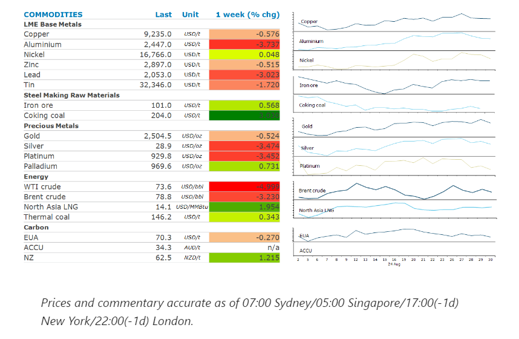
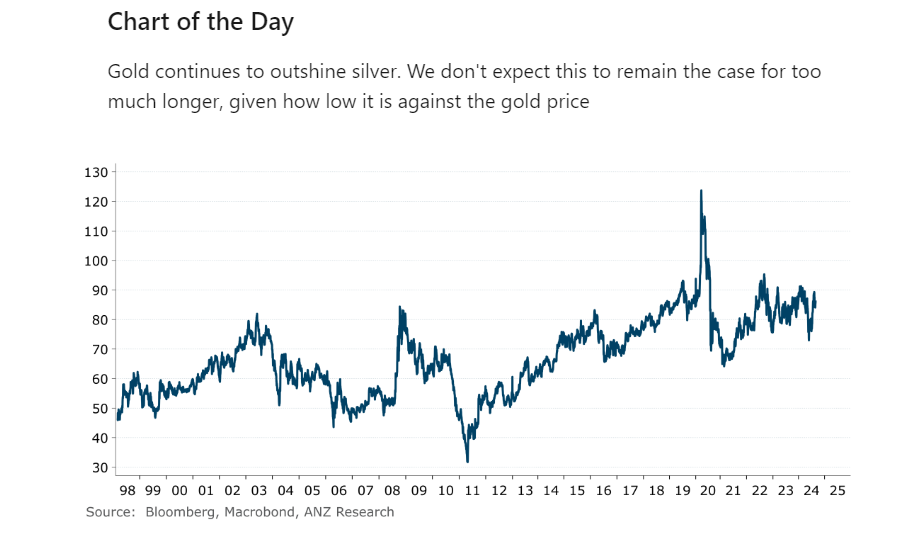

# Oil falls as OPEC reiterates commitment to production hikes

**Date:** September 02, 2024  
**Publisher:** Breakwave Advisors | **Category:** Market Insights  
**Original URL:** [https://www.breakwaveadvisors.com/insights/2024/9/2/oil-falls-as-opec-reiterates-commitment-to-production-hikes](https://www.breakwaveadvisors.com/insights/2024/9/2/oil-falls-as-opec-reiterates-commitment-to-production-hikes)  

---

Energy markets remains on edge on supply shortages. Sentiment was also supported by the prospect of easing monetary policy in the US.

*By*[*Daniel Hynes*](https://www.linkedin.com/in/dahynes/)

> **Figure 1: Στιγμιότυπο Οθόνης 2024 09 02 143650**  
> [Local Asset](file:///C:/Users/Dell/Github/Shipping/corpus/03-breakwave/insights/2024/assets/2024-09-02_oil-falls-as-opec-reiterates-commitment-to-production-hikes_img_cea3cf84ceb9ceb3cebcceb9cf8ccf84cf85_5c22d885422a.png)

### Market Commentary

**Crude oil**fell last week as the market ponders OPEC’s plan to raise output in the next quarter. Several delegates with the OPEC+ alliance said last week that they expect to proceed with the production hikes. We see downside in growth in 2025, driven by economic headwinds in China and the US. OPEC surprised the market when a small sub-group, led by Saudi Arabia, announced it will gradually phase out 2.2mb/d of cuts from the start of Q4 2024. However, the group must now face a new environment of deepening macro concerns and loosening fundamentals ahead. We believe OPEC will have no choice but to delay the phase out of voluntary production cuts if it wants higher prices. That outweighed reports of steep supply losses in Libya. The country’s National Oil Corp said that production had been cut by 63% due to recent unrest. However, it has said it is working to reduce the disruption and expects an end to the crisis soon.

Supply shortages are supporting**global gas**prices. European gas benchmark futures posted their biggest monthly gain since May on fears they may linger into the injection season. These concerns centre on Ukraine, where fighting has intensified and threatens to disrupt Russian gas transiting the country on its way to Europe. This has been compounded by changes to a period of heavy maintenance at top supplier Norway.**North Asian LNG**prices pushed above USD14/mmBtu on speculation of production issues in Malaysia. At least 11 vessels are waiting outside of the Bintulu export facility, according to ship tracking data, but Petronas, the operator of the LNG facility, has yet to report any issues. The market has been on edge following other disruptions in the region. Demand remains robust as high temperatures boost air conditioner use.

**Iron ore**futures gained last week as traders viewed the recent selloff as overdone. Despite the recent rebound in prices,[**risks remained skewed to the downside**](../pdfs/2024-09-02_oil-falls-as-opec-reiterates-commitment-to-production-hikes_commodity-update-downside-risks-to-i_b87c570f403f.pdf)in the short term. We expect a rise in supply in the second half of the year while headwinds from the Chinese steel industry remain strong. Moreover, China’s steel exports may come under threat as tensions rise with trade partners. China is also rationalising its approval process for new steel capacity, which could see steel output ultimately fall, weighing on steel demand. Nevertheless, China is likely to continue to rely on the international market for its steel making raw material. This should be a positive for exporters such as Australia. There are reasons not to be so pessimistic over the medium term. Demand outside of property remains robust, while longer term supply growth remains constrained. The market should remain relatively balanced.

**Copper**managed to eke out a small gain last week on signs of resilient US growth and a weaker USD. The stronger than expected US data suggests the Fed can engineer a soft landing for the economy, thus protect the base metals sector from recessionary impacts on demand. Zinc was also higher after Chinese smelters vowed to lower output due to a tight concentrate market.**Gold**held steady above US2,500/oz despite a key inflation gauge reinforcing expectations that the Fed’s pace of rate cuts will be measured.

> **Figure 2: Στιγμιότυπο Οθόνης 2024 09 02 143700**  
> **Interactive Data & Source:** [Linkedin](https://www.linkedin.com/newsletters/commodities-wrap-6692196755876012032/?fbclid=IwAR3kiXJqZdxmp9ZcRwBNI7FsBySI-XSC0pfPur1qzjt7OZp7PTE59Tsl1QI) | [Local Asset](file:///C:/Users/Dell/Github/Shipping/corpus/03-breakwave/insights/2024/assets/2024-09-02_oil-falls-as-opec-reiterates-commitment-to-production-hikes_img_cea3cf84ceb9ceb3cebcceb9cf8ccf84cf85_299d567df7b2.png)

Data source:[Commodities Wrap](https://www.linkedin.com/newsletters/commodities-wrap-6692196755876012032/?fbclid=IwAR3kiXJqZdxmp9ZcRwBNI7FsBySI-XSC0pfPur1qzjt7OZp7PTE59Tsl1QI)

---

**Tags:** Commodities, Markets, Shipping  
